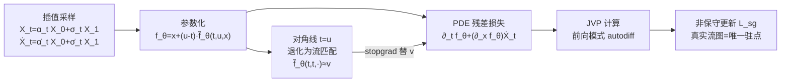

# Flow Map Learning via Non-Gradient Vector Flow

**会议**: ICLR 2026  
**OpenReview**: [https://openreview.net/forum?id=C1bkDPqvDW](https://openreview.net/forum?id=C1bkDPqvDW)  
**代码**: 待确认  
**领域**: 图像生成 / 扩散与流模型加速  
**关键词**: flow map, consistency model, few-step sampling, stop-gradient, non-conservative dynamics, JVP  

## 一句话总结
SGFlow 利用一条只含 Jacobian-向量积、不含模型逆的偏微分方程恒等式，把流图（flow map）学习写成一个带 stopgrad 的非保守动力学目标，从零训练即可让真实流图成为唯一驻点，在 CIFAR-10 上以更省显存、更优 FID 实现少步采样。

## 研究背景与动机
**领域现状**：扩散与流模型靠简单的回归损失训练，但采样要数值积分概率流 ODE（PF-ODE），每步都要前向一次网络，导致推理慢、成本高。一致性模型（consistency model）和流图匹配（flow map matching）想直接学一个把噪声映射到轨迹上任意点的映射 $f(t,u,x)$，从而绕开积分、实现 1 步到多步可调的采样。

**现有痛点**：现有流图方法各有硬伤。流图匹配（如 L-FMM）依赖"可逆映射 ↔ ODE"的关系，训练时要同时算前向映射和它的逆，还要在前向过程中显式物化一个巨大的导数矩阵，既复杂又费显存；一致性模型要么强行 1 步映射，要么在多步采样时引入"重新加噪"，让轨迹离开 PF-ODE，结果出现 Kim et al. 指出的"NFE 越大样本质量反而下降"的反常；MeanFlow 虽然用 stopgrad detach 掉所有模型导数省了显存，却没能证明它的损失在真实流图处取最小或驻点。

**核心矛盾**：要同时满足以下几条，现有方法无一全占：

- 不约束网络结构（不强制可逆函数）；
- 不需要对嵌套的模型调用做反向传播；
- 不需要预训练扩散/流模型来做仿真生成目标；
- 还能从理论上证明真实流图确实是优化目标的（唯一）驻点。

**本文目标**：提出一种从零训练的流图学习方法，让真实流图成为损失的唯一驻点，且全程只用前向模式自动微分的 JVP、不碰模型逆、不嵌套反传。

**核心 idea**：**[StopGrad 流]** 把流图满足的物质导数 PDE $\partial_t f + (\partial_x f)v = 0$ 平方成损失，再用模型自身在 $t=u$ 处退化出的速度 $\tilde f(t,t,\cdot)$ 加 stopgrad 去替换未知速度 $v$，由此得到一个不是任何标量势能梯度的"非保守"更新规则——但作者证明它和理想损失共享同一组驻点。

## 方法详解

### 整体框架
SGFlow 学一个双时刻映射 $f(t,u,x)$，把 $t$ 时刻的插值样本 $X_t$ 沿 PF-ODE 推到 $u$ 时刻。它从一条"只含 JVP、不含逆"的恒等式出发把目标写成回归损失，再用模型在对角线 $t=u$ 上自然涌现的速度估计替换损失里未知的真实速度 $v$，并对这个替换项加 stopgrad；整套更新是非保守动力学，其唯一驻点恰是真实流图。

### 关键设计

**1. 只含 JVP 的流图 PDE 恒等式：把"逆映射"换成"前向方向导数"。** 流图 $f$ 在 $t\le u$ 上整合速度场满足递归式 $f(t,u,x)=x+\int_t^u v(s,f(t,s,x))\,ds$。对它关于 $t$ 求物质（全）导数，得到刻画流图的一阶 PDE $\partial_t f+(\partial_x f)\,v(t,x)=0$，边界条件 $f(u,u,x)=x$，这个 PDE 的唯一解就是真实流图。关键在于：它只出现 $\partial_t f$ 和"$\partial_x f$ 乘一个向量"这种结构，全都能用前向模式自动微分的 Jacobian-向量积（JVP）算出来，完全不需要模型的逆映射，也不用显式物化雅可比矩阵——这正是绕开流图匹配那套"前向映射 + 逆映射 + 大导数矩阵"开销的根。由于 ODE 的解天然是可逆映射，最小化这个目标会隐式鼓励可逆性，而不必显式约束网络只能用可逆结构。

**2. 残差平方损失 + 对角线退化成流匹配：把未知速度"吊"出来。** 把 PDE 左端对参数化模型 $f_\theta$ 平方并对 $X_t$ 取期望，得 $L=\mathbb{E}_{X_t}[\|\partial_t f_\theta+(\partial_x f_\theta)\mathbb{E}[\dot X_t\mid X_t]\|^2]$，真实流图是其唯一最小值点。采用参数化 $f_\theta=x+(u-t)\tilde f_\theta(t,u,x)$ 后，有两个好性质：$\partial_t f_\theta(t,t,x)=-\tilde f_\theta(t,t,x)$ 和 $\partial_x f_\theta(t,t,x)=I$。把损失在 $t=u$ 处求值，它立刻退化成普通流匹配 $L|_{t=u}=\mathbb{E}_{X_t}[\|\tilde f_\theta(t,t,x)-\dot X_t\|^2]$，从而暴露出关键关系 $-\partial_t f(t,t,\cdot)=\tilde f(t,t,\cdot)=v(t,x)=\mathbb{E}[\dot X_t\mid X_t]$。也就是说，模型在对角线上的输出本身就是速度的估计，这给"用什么替换未知 $v$"提供了现成答案。

**3. stopgrad 替换 + 非保守动力学：让更新规则有正确驻点却不是任何梯度。** 把损失里未知的 $v$ 替换成 $\mathrm{sg}[\tilde f_\theta(t,t,\cdot)]$，理由是"原本的 $v$ 不该给 $f$ 提供梯度，那么近似它的项也不该"。最终 SGFlow 沿 $L_{sg}=\mathbb{E}[\|(\partial_t f_\theta)+(\partial_x f_\theta)\dot X_t\|^2-\|(\partial_x f_\theta)(\dot X_t-\mathrm{sg}[\tilde f_\theta(t,t,X_t)])\|^2]$ 的负梯度更新。Theorem 1 证明：在 $t\le u$ 且 $t=u$ 有正概率的时间分布下，$\tilde f^*$ 是 $L_{sg}$ 的驻点当且仅当它是理想损失 $L$ 的驻点——即便 $L_{sg}$ 根本不访问 $v$。直觉是：对角线项 $\tilde f(t,t,\cdot)$ 同时出现在 stopgrad 之外的其他项里，当速度估计不准时优化不在驻点、会继续移动，不会卡在"蒸馏了错误速度"的解上。代价是这套更新不是任何单一标量势能 $J$ 的梯度（stopgrad 打破了对称性），本质是一个平凡的两玩家博弈 / 非保守向量流——这正是标题"non-gradient vector flow"的来由。

**4. JVP 高效实现：两项损失都是前向自动微分的方向导数。** 两项损失都写成 JVP 的期望平方范数：$\mathrm{JVP}[f,(t,u,x),(a,b,c)]=(\partial_t f)a+(\partial_u f)b+(\partial_x f)c$。第一项取 $(a,b,c)=(1,0,\dot X_t)$，第二项取 $(0,0,\dot X_t-\mathrm{sg}[\tilde f(t,t,X_t)])$，因此用前向模式自动微分即可，无需物化雅可比，省显存。实现上可把一个 batch 随机拆开，给每个元素分配两组 $(a,c)$ 之一，避免对同一样本算两次 JVP。

## 实验关键数据

### 主实验：CIFAR-10 上 FID vs 采样步数
50000 张 EMA 样本、训练 200k 步、共用同一 U-Net 架构。"theory" 列表示是否已证明驻点当且仅当函数是整合 ODE 的真实流图。

| 方法 | 10 步 | 50 步 | 100 步 | 理论保证 |
|------|------:|------:|------:|:---:|
| Flow Matching | 24.87 | 3.53 | 3.05 | 是 |
| Lagrange (L-FMM) | 248.76 | 230.43 | 221.22 | 是 |
| Euler | 77.19 | 66.99 | 38.95 | 是 |
| Progressive | 337.36 | 235.20 | 206.18 | 是 |
| MeanFlow | 37.32 | 4.54 | 4.23 | 否 |
| **SGFlow** | **12.26** | **2.88** | **2.81** | **是** |

SGFlow 在每个步数档位都优于 MeanFlow，且在少步（10 步）时领先尤其明显（12.26 vs 37.32），同时是少数兼具理论保证的方法。

### 显存对比：反向传播峰值 GPU 占用
固定 U-Net 架构和 batch，测量训练单步反向时的峰值显存。

| 方法 | Flow Matching | MeanFlow | SGFlow | Lagrange | Euler | Progressive |
|------|:---:|:---:|:---:|:---:|:---:|:---:|
| 峰值显存 | 16.8 GB | 14.2 GB | 43.2 GB | 69.8 GB | 69.8 GB | 54.3 GB |

Lagrange/Euler/Progressive 因要反传嵌套模型调用或乘积法则项而最费显存；MeanFlow detach 整个 JVP 故最省；SGFlow 居中——在保留真实流图为最优、且不 detach 地优化所有模型导数的前提下取得显存平衡。

### 关键发现
- **少步采样收益最大**：10 步时 SGFlow 把 FID 从 MeanFlow 的 37.32 压到 12.26，正是流图方法最该发力的场景。
- **理论与效果兼得**：SGFlow 是唯一既有"驻点 ⟺ 真实流图"证明、又在所有步数档位拿到最佳 FID 的方法。
- **显存 vs 优化质量的折中**：相比 MeanFlow 用 detach 换显存却放弃优化模型导数，SGFlow 选择多花显存换"导数全程参与优化 + 正确驻点"。

## 亮点与洞察
- **用 JVP 恒等式根除"模型逆"**：抓住"ODE 解天然可逆"这一点，把可逆性从显式约束变成隐式涌现，既不限制网络结构，又省掉了显式物化逆映射和大雅可比的开销。
- **stopgrad 的"可继续移动"理论**：本文不只用 stopgrad，还正面回答了"为什么这个 stopgrad 不会让优化卡在错误速度上"——因为对角线项同时出现在 stopgrad 之外，给了优化方向。这把常被当作工程技巧的 stopgrad 上升成了有驻点等价性证明的设计。
- **把训练显式定义成非保守博弈**：坦诚承认更新不是任何标量损失的梯度，并据此命名方法，理论自洽且诚实。

## 局限与展望
- **实验规模偏小**：只在 CIFAR-10 上做无条件生成、单一 U-Net 架构，缺少 ImageNet / 高分辨率 / 文生图等大规模验证，泛化性待考。
- **显存非最省**：43.2 GB 高于 MeanFlow 的 14.2 GB，在大模型 / 大 batch 下可能成为瓶颈，需要进一步优化 JVP 计算。
- **未与蒸馏路线正面比拼**：本文聚焦从零训练，未充分对比"从预训练扩散蒸馏少步求解器"这条主流加速路线的最优结果。
- **非保守动力学的收敛性**：博弈式更新虽有驻点等价证明，但全局收敛速度与稳定性缺乏理论刻画，实践中是否需要额外调度仍待研究。

## 相关工作与启发
- **一致性模型与流图匹配**：Consistency Models（Song et al. 2023）、CTM（Kim et al. 2023）、L-FMM（Boffi et al. 2024）、LSD/ESD/PSD（Boffi et al. 2025）、MeanFlow（Geng et al. 2025）构成本文 Table 1 的对照系。SGFlow 的定位是"同时满足多步可调、跟随 PF-ODE、仿真自由、回归损失、不需逆、有最优性证明、不嵌套反传"这一行全打勾的方法。
- **加速采样两条路线**：蒸馏预训练模型成少步求解器，与直接学少步求解器。SGFlow 属于后者且可从零训练，也能用于蒸馏。
- **启发**：当一个目标里含有"未知期望量（如条件速度）"时，可以寻找模型自身在某退化条件下涌现出该量的结构，用 stopgrad 自引用替换，并辅以驻点等价性证明——这种"自蒸馏 + 理论保证"范式可推广到其他需要回归未知场的学习问题。

## 评分
- **新颖性**: ⭐⭐⭐⭐ JVP 恒等式绕开模型逆、stopgrad 驻点等价定理、非保守动力学定位都很有原创性，把一致性/流图学习的若干痛点一次性化解。
- **实验充分度**: ⭐⭐⭐ 主实验和显存对比清晰、对照方法齐全，但仅限 CIFAR-10 无条件生成，规模和任务多样性不足。
- **写作质量**: ⭐⭐⭐⭐ 推导链条（PDE→对角线退化→stopgrad 替换→定理）讲得干净，Table 1 的多维对比一目了然。
- **价值**: ⭐⭐⭐⭐ 为少步生成提供了一个理论扎实、结构友好的训练范式，少步档位的 FID 优势对实际加速有吸引力。

<!-- RELATED:START -->

## 相关论文

- [\[ICLR 2026\] CMT: Mid-Training for Efficient Learning of Consistency, Mean Flow, and Flow Map Models](cmt_mid-training_for_efficient_learning_of_consistency_mean_flow_and_flow_map_mo.md)
- [\[ICLR 2026\] Purrception: Variational Flow Matching for Vector-Quantized Image Generation](purrception_variational_flow_matching_for_vector-quantized_image_generation.md)
- [\[ICLR 2026\] Value Matching: Scalable and Gradient-Free Reward-Guided Flow Adaptation](value_matching_scalable_and_gradient-free_reward-guided_flow_adaptation.md)
- [\[CVPR 2026\] Flow Map Distillation Without Data](../../CVPR2026/image_generation/flow_map_distillation_without_data.md)
- [\[ICLR 2026\] Flow Matching with Injected Noise for Offline-to-Online Reinforcement Learning](flow_matching_with_injected_noise_for_offline-to-online_reinforcement_learning.md)

<!-- RELATED:END -->
