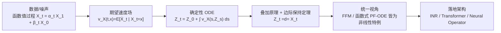

# Flow Straight and Fast in Hilbert Space: Functional Rectified Flow

**会议**: ICLR 2026  
**OpenReview**: [https://openreview.net/forum?id=GWK8fm1r9y](https://openreview.net/forum?id=GWK8fm1r9y)  
**代码**: 基于 Franzese et al. (2023) 与 Kerrigan et al. (2024) 的开源代码库 (JAX) 改写  
**领域**: 生成模型 / 函数空间生成 / Rectified Flow  
**关键词**: Rectified Flow, Hilbert 空间, 函数生成模型, Flow Matching, 叠加原理, 神经算子  

## 一句话总结
本文把 rectified flow 严格推广到无限维可分 Hilbert 空间，证明其"边际保持"性质在函数空间依然成立，并将函数式 flow matching、函数式概率流 ODE 统一为该框架下的非线性特例，同时去掉了已有理论中难以验证的测度论假设。

## 研究背景与动机
- **领域现状**：扩散模型、flow matching、rectified flow 等生成方法已在欧氏空间取得 SOTA，并陆续被推广到无限维函数空间（functional diffusion、functional GAN、functional flow matching），以支持变分辨率生成、模态无关架构和更高的内存效率。
- **现有痛点**：rectified flow 因其确定性直线传输路径、少步采样、与最优传输的联系而极具吸引力，但它的函数式（无限维）推广一直是空白；而最接近的函数式 flow matching（Kerrigan et al., 2024）依赖一个强测度论假设——条件测度 $\mu_t^x$ 必须关于边际 $\mu_t$ 绝对连续，这个假设连在有限维欧氏空间里都常常失效且难以验证。
- **核心矛盾**：要把基于"期望速度 / 连续性方程"的 rectified flow 搬到无限维，关键障碍在于有限维证明所依赖的**叠加原理（superposition principle）**在一般可分 Hilbert 空间中并不现成成立，需要从头建立。
- **本文目标**：在一般可分 Hilbert 空间中给出 rectified flow 的严格数学构造，证明边际保持定理，并把它作为统一视角去解释现有的函数式 ODE 生成模型。
- **核心 idea**：**用 Hilbert 空间叠加原理替代绝对连续假设**——把"任何解连续性方程的分布都能被分解为解 ODE 的路径分布"这一原理在无限维严格化，从而绕开 Kerrigan 等人的限制性条件，得到更可验证、更通用的函数生成基础。

## 方法详解

### 整体框架
论文以"定义—假设—定理"的方式在可分 Hilbert 空间 $H$ 上重建 rectified flow：先把数据/噪声看成函数值随机过程 $X:[0,1]\times\Omega\to H$，定义其期望速度场 $v_X$；再用两条温和假设（IVP 适定 + 漂移有限）保证流动良态；核心是证明由 $v_X$ 驱动的确定性 ODE 所诱导的 rectified flow $\{Z_t\}$ 与原过程 $\{X_t\}$ 逐时刻同分布；最后把这套框架推广到非线性插值路径，统一 FFM 与函数式 PF-ODE，并讨论三种可落地的网络实现。

### 关键设计

**1. Hilbert 空间中的期望速度与可整流过程：把"直线插值"搬进无限维**　给定可分 Hilbert 空间 $H$ 上一条逐路径连续可微的随机过程 $X=\{X_t\}$，定义其期望速度场为条件期望 $v_X(t,x)=\mathbb{E}[\dot X_t\mid X_t=x]$（在 $X_t$ 支撑外取零）。当采用线性插值 $X_t=tX_1+(1-t)X_0$（$X_0$ 噪声、$X_1$ 数据，独立采样）时有 $\dot X_t=X_1-X_0$，于是用神经网络 $v_\theta$ 拟合速度场的训练目标就是
$$\min_\theta \int_0^1 \mathbb{E}_{x\sim X}\,\lVert (x_1-x_0)-v_\theta(x_t,t)\rVert^2\,dt,$$
形式上与有限维 rectified flow 完全一致。论文为此引入两条假设保证良态：其一是初值问题 $z(t)=u+\int_0^t v(s,z(s))ds$ 存在唯一 $C^1$ 解且解映射连续（在标准 Lipschitz 条件下成立，作为充分条件而非核心假设）；其二是期望速度时间积分有限、$\mathbb{E}[\sup_t\lVert\dot X_t\rVert]<\infty$，排除"无限总漂移"等病态行为。满足这两条的过程称为**可整流（rectifiable）**，其诱导的确定性流 $Z_t=Z_0+\int_0^t v_X(s,Z_s)ds,\ Z_0\sim X_0$ 即无限维 rectified flow，全部随机性只来自初值 $Z_0$。

**2. 基于叠加原理的边际保持定理：无限维证明的真正难点**　核心结论是定理 5：若 $H$-值过程 $\{X_t\}$ 可整流、$\{Z_t\}$ 是其诱导 rectified flow，则对所有 $t$ 都有 $Z_t\overset{d}{=}X_t$。这意味着虽然 $Z_t$ 给定 $Z_0$ 后按 ODE 确定性演化，却逐时刻保持与 $X_t$ 相同的边际分布——因此学好速度场 $v_\theta$ 后，从噪声初值出发数值积分 ODE 即可采样数据分布。证明的真正难点在于把**叠加原理**（任何解 $v_X$ 驱动的连续性方程的分布都可"分解"为一族解 ODE (2) 的路径分布）在一般可分 Hilbert 空间中严格建立，再把得到的测度论分解与 IVP 的解严格对接，需要若干非平凡技术引理。基于该定理，有限维 rectified flow 的传输成本下降与"直线化（straightening）"效应也都顺势推广到无限维。

**3. 非线性广义路径：把 FFM 与函数式 PF-ODE 收编为同一框架的特例**　论文把插值路径推广为 $X_t=\alpha_t X_1+\beta_t X_0$，其中 $\alpha_t,\beta_t$ 是任意 $C^1$ 时间函数，取 $\alpha_t=t,\beta_t=1-t$ 即退回线性 rectified flow，称其为函数 rectified flow 的非线性扩展。在此参数化下，Kerrigan et al. (2024) 的函数式 flow matching 的 "OT 路径" $(\alpha_t=t,\ \beta_t=1-(1-\sigma_{\min})t)$ 与 "VP 路径" $(\beta_t=\sqrt{1-\alpha_t^2})$ 都成为 $(\alpha_t,\beta_t)$ 的具体取值；Na et al. (2025) 的函数式概率流 ODE（一个方差保持 SDE 的逆向 PF-ODE）也被命题 7 证明是某个非线性 rectified flow $Y'_t=\eta(t)Y'_0+\sqrt{\kappa(t)}\,U$ 的时间反演，其中 $\eta(t)=\exp(-\tfrac12\int_0^t\sigma_s ds)$、$\kappa(t)=\int_0^t\exp(-\int_s^t\sigma_\tau d\tau)\sigma_s ds$。这给出"一个统一公式生成多种已有函数模型"的洞见。**关键优势**：该框架只需逐路径连续可微（一个设计选择而非数据假设），从而彻底去掉 FFM 所需的"$\mu_t^x\ll\mu_t$ 绝对连续 / $X_1$ 落在初始高斯测度的 Cameron–Martin 空间"这类难验证假设——论文还在附录指出该假设即便在 $X_0,X_1$ 同为高斯且同分布的平凡情形也会失效。

**4. 三种可落地架构：把无限维速度场约化到逐点离散表示**　期望速度场 $v_X(x_t,t):H\times[0,T]\to H$ 定义在无限维域上，直接学习不可行；论文借助 $H=L^2(M)$ 时函数可由其逐点取值 $\{(x[p_i],p_i)\}$ 完全刻画的结论，给出三种实现：(a) **隐式神经表示（INR）**，用一个共享基参数 $\theta$ 加每样本调制向量 $\psi$ 的网络 $n(\psi,t,\theta)$，对每个 $x_t$ 在线做几步梯度下降求 $\psi^*=\arg\min_\psi\sum_{p_i}(n(\psi,t,\theta)[p_i]-x_t[p_i])^2$，全局 $\theta$ 由式 (4) 更新；(b) **Transformer**，把离散取值 $\{x_t[p_i]\}$ 作为序列、坐标 $\{p_i\}$ 作为位置编码，输出 $\{v_\theta(x_t,t)[p_i]\}$；(c) **神经算子（Neural Operator）**，直接以神经算子参数化速度场，特别适合规则网格上的 PDE 数据。三者分别对应实验中的轻量、高保真图像与 PDE 三类场景。

## 实验关键数据
> 关键设定：MNIST 用 INR、CelebA 用 Transformer、Navier–Stokes 用 Neural Operator，且**与对手 FDP/FFM 使用完全相同的网络架构**，确保增益仅来自所提目标而非模型容量。

### 主实验表格

MNIST (32×32, INR)：

| 方法 | FID (↓) | 参数量 |
|---|---|---|
| **FRF (INR, ours)** | **0.41** | ≈0.1M |
| FDP (INR) | 0.43 | ≈0.1M |

CelebA (64×64, Transformer)：

| 方法 | FID (↓) | FID-CLIP (↓) | 参数量 |
|---|---|---|---|
| **FRF (ViT, ours)** | **6.63** | **3.70** | ≈20M |
| FDP (INR) | 35.00 | 12.44 | ≈1M |
| FDP (ViT) | 11.00 | 6.55 | ≈20M |
| FD2F | 40.40 | – | ≈10M |
| ∞-DIFF | – | 4.57 | ≈100M |

Navier–Stokes (Neural Operator, Density MSE)：

| 方法 | Density MSE (Mean ± Std) |
|---|---|
| **FRF** | **2.39×10⁻⁵ ± 4.45×10⁻⁶** |
| FFM | 4.50×10⁻⁵ ± 1.52×10⁻⁵ |
| DDPM | 1.02×10⁻⁴ ± 8.20×10⁻⁶ |
| GANO | 4.16×10⁻³ ± 1.82×10⁻³ |
| DDO | 9.61×10⁻³ ± 1.26×10⁻² |

### 消融实验表格
本文未设置传统意义的逐组件消融，而是用"同架构对照"作为公平性控制——在三类骨干（INR/ViT/Neural Operator）上分别与对应 SOTA 共用网络，从而把性能差异归因于 rectified flow 目标本身：

| 控制维度 | 设置 | 结论 |
|---|---|---|
| INR 同容量 | FRF vs FDP，均 ≈0.1M | FRF 更低 FID（0.41 vs 0.43） |
| ViT 同容量 | FRF vs FDP-ViT，均 ≈20M | FRF FID 6.63 远优于 11.00 |
| 参数效率 | FRF vs ∞-DIFF | FRF 用 ≈20M 即超 ≈100M 的对手 |

### 关键发现
- **同架构下目标更优**：三类骨干上 FRF 全面优于或追平对应 SOTA，证明增益来自函数式 rectified flow 目标而非容量。
- **架构灵活性**：同一框架可直接套用三种为竞品设计的不同架构，无需专门定制网络。
- **连续表示带来超分辨**：MNIST 上训练于低分辨率却能生成 64×64、128×128 的平滑超分样本，轮廓比朴素上采样更连贯。
- **参数效率显著**：CelebA 上以 ≈20M 参数超过 ≈100M 的 ∞-DIFF。

## 亮点与洞察
- **理论补白 + 假设松绑双重贡献**：既首次把 rectified flow 严格搬进无限维 Hilbert 空间，又去掉了 FFM 难以验证的绝对连续假设，把"逐路径可微"这一设计选择作为替代条件。
- **统一视角**：一个非线性插值公式 $X_t=\alpha_t X_1+\beta_t X_0$ 把 FFM、函数式 PF-ODE、函数 rectified flow 收编为特例，为函数生成模型提供了统一透镜。
- **叠加原理无限维化**是真正的硬核技术贡献，连接了连续性方程的测度分解与 ODE 解的存在唯一性。
- **工程上"不挑架构"**：用对手自己的网络打赢对手，说服力强。

## 局限与展望
- **高复杂任务仍需归纳偏置**：作者承认对高复杂度任务，领域特定架构与 inductive bias 可能仍不可或缺。
- **实验规模有限**：仅在 MNIST、CelebA 64×64、Navier–Stokes 三个数据集验证，缺乏大规模/高分辨率自然图像或文本-语音等更复杂模态的检验。
- **INR 在线优化成本**：每个样本都要做若干步梯度下降求调制向量 $\psi$，推理/训练有额外开销。
- **未深入采样步数优势**：rectified flow 在有限维以少步采样著称，但文中未系统报告无限维下的少步采样质量与"直线化"重整流（reflow）效果。

## 相关工作与启发
- **Rectified Flow (Liu et al., 2022)** 是本文有限维起点，其边际保持、传输成本下降、直线化效应被逐一推广。
- **Functional Flow Matching (Kerrigan et al., 2024)** 是最直接对手，本文证明其为特例并去掉其测度论假设。
- **Functional PF-ODE (Na et al., 2025)** 被命题 7 收编为非线性 rectified flow 的时间反演。
- **Functional Diffusion (Franzese et al., 2023)、∞-DIFF** 提供了 INR/算子架构与图像基线。
- **启发**：把"连续性方程 ⇄ ODE 路径分布"的叠加原理作为统一工具，可能进一步用于函数式 SDE、最优传输、变分辨率生成等方向；"用同架构对照隔离目标贡献"也是值得借鉴的公平性评测范式。

## 评分
- 新颖性: ⭐⭐⭐⭐⭐ 首次严格建立无限维 Hilbert 空间 rectified flow，并以叠加原理松绑已有理论假设，理论贡献扎实且原创。
- 实验充分度: ⭐⭐⭐ 同架构公平对照很有说服力，但数据集规模偏小、缺少少步采样与大规模高分辨验证。
- 写作质量: ⭐⭐⭐⭐ 结构清晰、定义-假设-定理层次分明，统一视角表述到位；部分测度论细节较重，对非理论读者门槛偏高。
- 价值: ⭐⭐⭐⭐ 为函数式生成模型提供了统一且更可验证的理论基础，对后续无限维生成研究有奠基意义。

<!-- RELATED:START -->

## 相关论文

- [\[CVPR 2026\] Functional Mean Flow in Hilbert Space](../../CVPR2026/image_generation/functional_mean_flow_in_hilbert_space.md)
- [\[ICLR 2026\] Free Lunch for Stabilizing Rectified Flow Inversion](free_lunch_for_stabilizing_rectified_flow_inversion.md)
- [\[ICLR 2026\] SafeFlowMatcher: Safe and Fast Planning using Flow Matching with Control Barrier Functions](safeflowmatcher_safe_and_fast_planning_using_flow_matching_with_control_barrier_.md)
- [\[ICLR 2026\] Delay Flow Matching](delay_flow_matching.md)
- [\[ICLR 2026\] Flow Matching with Semidiscrete Couplings](flow_matching_with_semidiscrete_couplings.md)

<!-- RELATED:END -->
