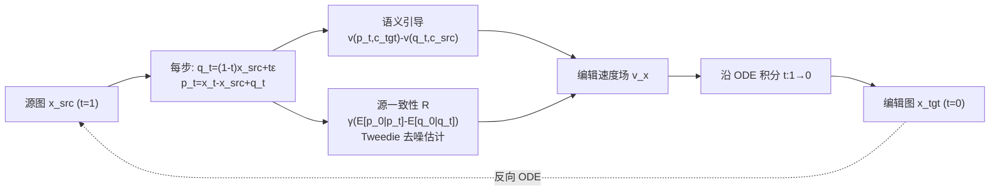

# FlowAlign: Trajectory-Regularized, Inversion-Free Flow-based Image Editing

**会议**: ICLR 2026  
**OpenReview**: [https://openreview.net/forum?id=nyttIJfwW7](https://openreview.net/forum?id=nyttIJfwW7)  
**代码**: 待确认  
**领域**: 图像生成 / 图像编辑  
**关键词**: 图像编辑, 流匹配, Rectified Flow, 免反演, 最优控制, 轨迹正则, Stable Diffusion 3  

## 一句话总结
针对免反演流编辑（FlowEdit）轨迹不平滑、源一致性差的问题，FlowAlign 用最优控制框架在终端点加一个源相似性正则，把编辑速度场解耦成"语义引导 + 源一致性"两项，仅多 1 次 NFE 就显著提升源结构保持，并天然支持反向 ODE 重建。

## 研究背景与动机
- **领域现状**：文本驱动图像编辑可看作把源分布推送到目标分布的连续归一化流（CNF）。借助预训练的"噪声→图像"流模型（如 Stable Diffusion 3），无需重新训练即可做编辑。早期 SDEdit 需小心选初始噪声水平，DDIB 依赖 ODE 反演但易受离散化误差影响；RF-Inversion 用最优控制做反演但 ODE 反演开销大。
- **现有痛点**：FlowEdit 首次实现"两图之间直接模拟 ODE、无需反演"，但实证发现它**对超参极其敏感、常丢失源一致性**：它在每个时间步用随机采样的噪声 $\epsilon$ 构造 $q_t$，导致 $q_t$ 轨迹不平滑（见论文 Fig.2b）；还启发式地对源/目标速度场分别施加不同尺度的 CFG、并跳过早期时间步，引入大量待调超参，且破坏了 ODE 的确定性。同时 FlowEdit 因双侧 CFG 需要 4 倍 NFE。
- **核心矛盾**：免反演（无显式反演潜变量）是这类方法的核心优势，但也正是它带来轨迹不稳定的根源——缺少反演锚点，轨迹会偏离源图。如何在**不做反演**的前提下，让编辑轨迹既听从编辑提示（语义对齐）又贴住源图（结构一致）？
- **本文目标**：用最优控制视角给免反演编辑加一个显式的轨迹正则，把语义对齐与结构保持的平衡变成速度场里可解释、可调的两项，并让变换可逆。
- **核心 idea**：**终端点相似性正则**。在最优控制问题中，把"终端解 $x_0$ 应接近源图 $x_{src}$"作为终端损失 $m(x_0)=\frac{\eta}{2}\|x_0-x_{src}\|^2$（用有限的 $\eta$ 而非 RF-Inversion 的 $\eta\to\infty$），由此推导出的最优速度场天然分解成"语义引导"和"源一致性"两项。

## 方法详解

### 整体框架
FlowAlign 复用预训练"噪声→图像"流模型 $v_\theta$，不做任何额外训练，也不做 ODE 反演。它把"从源图 $x_{src}$（$t=1$）演化到目标图 $x_{tgt}$（$t=0$）"建模成一个**时间反演的最优控制问题**：在源→目标速度场之外，额外约束"终端点要像源图"。求解该问题得到一个新的编辑速度场，把它逐步沿 ODE 积分即可，每步只比 FlowEdit 多算一次去噪估计（+1 NFE）。

### 关键设计

**1. 免反演 ODE 模拟：用两条共享噪声的流拼出编辑流。** 编辑被写成两图分布间的线性条件流 $\psi_t(x_{src}|x_{tgt})=x_t=(1-t)x_{tgt}+tx_{src}$，若直接训练代价高。FlowAlign 借助预训练模型构造两条把同一噪声 $\epsilon$ 分别映到源/目标图的流：$q_t=(1-t)x_{src}+t\epsilon$、$p_t=(1-t)x_{tgt}+t\epsilon$。三者联立给出关键等式 $x_t=p_t-q_t+x_{src}$，于是编辑 ODE 化为 $dx_t=[v_\theta(p_t,c_{tgt})-v_\theta(q_t,c_{src})]dt$，其中 $p_t:=q_t+x_t-x_{src}$。这就在**不训练、不反演**的前提下模拟了两图间的流——这一步与 FlowEdit 同源，但 FlowEdit 每步随机采 $\epsilon$ 使 $q_t$ 轨迹抖动，正是不稳定的根因。

**2. 终端点正则：把"像源图"作为最优控制的终端损失。** 这是全文最核心的贡献。作者把编辑写成时间反演最优控制 $\dot x_t=u(x_t),\,x_1=x_{src}$，代价泛函 $V(u_t)=\int_0^1 \ell(x_t,u_t,t)dt+m(x_0)$。其中运行损失 $\ell=\frac12\|u_t-(v_\theta(p_t,c_{tgt})-v_\theta(q_t,c_{src}))\|^2$ 让控制贴近原始编辑速度场；仅有它不足以约束轨迹偏移，于是引入终端损失 $m(x_0)=\frac{\eta}{2}\|x_0-x_{src}\|^2$，要求 ODE 终点接近源图。用**有限的 $\eta$**（而非 RF-Inversion 的 $\eta\to\infty$）避免坍缩到 $x_t\equiv x_{src}$ 的平凡解，反而在终端约束与编辑信号之间取得平衡。

**3. 解耦的编辑速度场：语义引导 + 源一致性梯度。** 求解上述最优控制（Proposition 1）得到 $v_t^x \simeq \underbrace{v_t(p_t,c_{tgt})-v_t(q_t,c_{src})}_{\text{语义引导}}+\gamma\underbrace{(\mathbb{E}[p_0|p_t]-\mathbb{E}[q_0|q_t])}_{\text{源一致性 }R}$，其中 $\gamma=\frac{\eta}{\eta t-1}$，$\mathbb{E}[q_0|q_t]=q_t-tv_t(q_t,c_{src})$ 与 $\mathbb{E}[p_0|p_t]=p_t-tv_t(p_t,c_{tgt})$ 是 Tweedie 公式给出的干净估计。第一项给出源→目标的语义方向；第二项基于 $p_t,q_t$ 干净估计之差，是一个把轨迹拉回源一致方向的梯度，虽然只在终端点显式约束，却沿整条轨迹隐式抑制对源图的不必要偏离——这正是轨迹变平滑、可反向重建的来源。

**4. 单侧 CFG 与极简超参。** 不同于 FlowEdit 对源/目标双侧速度都用不同尺度 CFG（导致 4 倍 NFE、确定性被破坏），FlowAlign 只对目标轨迹 $p_t$ 施加 CFG：$v_\theta(p_t,c_{src},c_{tgt})=v_\theta(p_t,c_{src})+\omega(v_\theta(p_t,c_{tgt})-v_\theta(p_t,c_{src}))$，常用 $\omega=7.5$ 即有效。最终更新式 $dx_t=[v_t(p_t,c_{tgt},c_{src})-v_t(q_t,c_{src})]dt-\gamma dt(\mathbb{E}[q_0|q_t]-\mathbb{E}[p_0|p_t])$ 只剩两个超参：CFG 尺度 $\omega$ 与源一致性尺度 $\zeta=-\gamma dt>0$，取常数即稳定。每步相对 FlowEdit 仅增加 1 次函数评估。

## 实验关键数据

**设置**：基座为 Stable Diffusion 3.0 (medium)；数据集 PIE-Bench（700 张合成+自然图，配对原始/编辑提示）；统一 33 NFE（含反演的方法用 17+17）；硬件 RTX 4090 (24GB)。指标用 CLIP 相似度（语义对齐）+ 背景 PSNR（结构一致），在 CFG ∈ {5.0, 7.5, 10.0, 13.5} 上扫描。

### 主实验（语义对齐 vs 结构一致权衡）
- 在 CLIP-vs-背景PSNR 的权衡曲线上，FlowAlign **在所有方法中结构保持最高**；语义对齐上优于 SDEdit/DDIB，与 FlowEdit/RF-Inversion 相当或略低。
- 但 FlowEdit/RF-Inversion 的高 CLIP 往往以**牺牲源结构**换取（过度表达目标对象、扭曲原图）。
- **人类偏好研究**（100 张随机样本，与各 baseline 成对比较）：在所有对比中，用户更偏好 FlowAlign（兼顾编辑准确性与源结构保持）。

### 反向编辑（重建源图，越好说明轨迹越接近确定性 ODE）

| Metric | PSNR ↑ | DINO Dist ↓ | LPIPS ↓ | MSE ↓ |
|---|---|---|---|---|
| SDEdit | 13.83 | 0.078 | 0.419 | 0.043 |
| DDIB | 18.18 | 0.041 | 0.190 | 0.019 |
| RF-Inv | 12.14 | 0.113 | 0.502 | 0.065 |
| FlowEdit | 19.88 | 0.037 | 0.147 | 0.012 |
| **Ours** | **27.42** | **0.025** | **0.085** | **0.006** |

从编辑图反向解 ODE 重建源图，FlowAlign 在四项指标上全面领先（PSNR 27.42 vs FlowEdit 19.88），近乎完美重建，验证轨迹的平滑与确定性。

### 消融实验（$\omega$ 与 $\zeta$）

| 设置 | 现象 |
|---|---|
| $\zeta=0.01$ | 语义对齐与结构保持取得最佳平衡 |
| $\omega=\zeta=0$ | 编辑不足（落在左下角，几乎不改图）→ 印证 CFG 的必要性 |
| 调大 $\omega$ | 语义更强但结构保持下降（权衡可控） |

### 关键发现
- 终端点正则不仅约束终点，还沿整条轨迹隐式保持源一致性；重建能力源于轨迹平滑，而非"少改动"。
- 框架可零成本扩展到 **3D 编辑**（替代 SDS 编辑 Gaussian Splatting 参数）与**视频编辑**（逐帧处理，凭强源一致性即得到视觉连贯背景，尽管未显式约束时序）。

## 亮点与洞察
- **理论优雅**：把免反演编辑的不稳定问题归因为"缺少反演锚点导致轨迹偏移"，并用一个终端损失 + 最优控制推导，干净地把编辑速度场分解为"语义引导 + 源一致性"两项，物理意义清晰。
- **有限 $\eta$ 的洞察**：与 RF-Inversion 的 $\eta\to\infty$ 对比，指出"有限正则强度"恰好避免坍缩到平凡解，是平衡的关键。
- **极简且高效**：相比 FlowEdit 的 4× NFE 和一堆启发式超参，FlowAlign 只多 1 NFE、只剩 $\omega,\zeta$ 两个常数超参，且保持 ODE 确定性（可反向重建）。

## 局限与展望
- 仍存在语义对齐与结构一致的根本权衡，CLIP 上不一定全面超越 FlowEdit/RF-Inversion（作者论证其高 CLIP 来自源结构破坏，但单指标层面仍非全胜）。
- 视频编辑是逐帧独立处理，**未显式建模时序一致性**，强源一致性只是"副产品"式地带来连贯背景，复杂运动场景或仍闪烁。
- 主实验主要在 SD3-medium 上验证；超参 $\zeta=0.01$、$\omega=7.5$ 的普适性、对其他流模型/分辨率的迁移性有待更广验证。
- 终端正则基于 $\ell_2$ 像素/潜空间距离，对大幅几何/布局编辑（需要明显偏离源图结构）可能过度约束。

## 相关工作与启发
- **免反演流编辑**：FlowEdit（直接接 Author 提出的免反演路线，本文是其稳定化升级）。
- **基于反演/最优控制**：RF-Inversion（最优控制做反演，$\eta\to\infty$）、DDIB（依赖反演）、SDEdit（加噪后去噪）。
- **流匹配理论基础**：Flow Matching / Conditional Flow Matching（Lipman et al.）、Rectified Flow（Liu et al.）、Stable Diffusion 3 / DiT。
- **启发**：把"训练-free 编辑"重述为最优控制 + 终端正则，是给免反演方法补"锚点"的通用思路；Tweedie 干净估计之差作为源一致性梯度，可迁移到其他需要"贴住参考"的生成/编辑任务（如可控生成、风格保持、3D/视频编辑）。

## 评分
- **新颖性**: ⭐⭐⭐⭐ 用最优控制终端正则统一解释并解决免反演编辑的轨迹不稳定，速度场的"语义+源一致"解耦干净，有限 $\eta$ 的洞察有价值。
- **实验充分度**: ⭐⭐⭐⭐ PIE-Bench 全面对比 + 人类偏好 + 反向重建（4 指标全胜）+ 消融 + 3D/视频扩展；但主实验偏 SD3 单基座、主表多放在附录。
- **写作质量**: ⭐⭐⭐⭐ 推导清晰、动机与公式衔接好，Proposition + 算法伪代码完整，图示直观。
- **价值**: ⭐⭐⭐⭐ 训练-free、低成本、可逆，且能直接扩展到 3D/视频，实用性强，是 FlowEdit 路线的扎实改进。

<!-- RELATED:START -->

## 相关论文

- [\[ICLR 2026\] Free Lunch for Stabilizing Rectified Flow Inversion](free_lunch_for_stabilizing_rectified_flow_inversion.md)
- [\[ICLR 2026\] UniEdit-Flow: Unleashing Inversion and Editing in the Era of Flow Models](uniedit-flow_unleashing_inversion_and_editing_in_the_era_of_flow_models.md)
- [\[ICLR 2026\] Training-Free Reward-Guided Image Editing via Trajectory Optimal Control](training-free_reward-guided_image_editing_via_trajectory_optimal_control.md)
- [\[ICCV 2025\] FlowEdit: Inversion-Free Text-Based Editing Using Pre-Trained Flow Models](../../ICCV2025/image_generation/flowedit_inversion-free_text-based_editing_using_pre-trained_flow_models.md)
- [\[ICML 2025\] Taming Rectified Flow for Inversion and Editing](../../ICML2025/image_generation/taming_rectified_flow_for_inversion_and_editing.md)

<!-- RELATED:END -->
