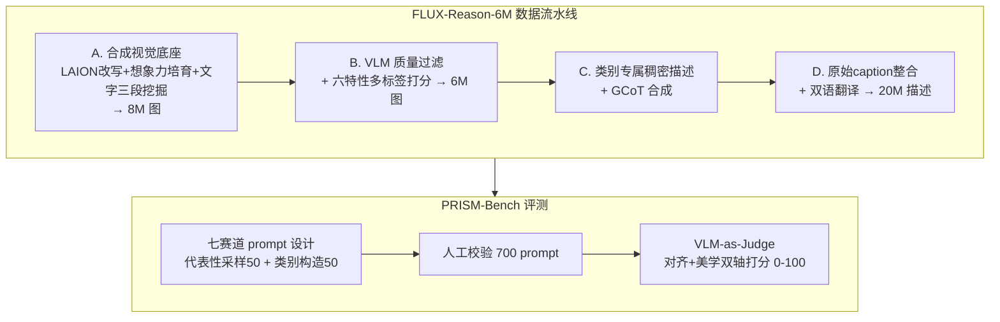

# FLUX-Reason-6M & PRISM-Bench: A Million-Scale Text-to-Image Reasoning Dataset and Comprehensive Benchmark

**会议**: ICLR 2026  
**OpenReview**: [https://openreview.net/forum?id=cPzgZnpVbN](https://openreview.net/forum?id=cPzgZnpVbN)  
**代码**: [https://github.com/rongyaofang/prism-bench](https://github.com/rongyaofang/prism-bench)  
**领域**: 图像生成 / 文生图数据集与评测  
**关键词**: 文生图、推理数据集、生成思维链 (GCoT)、评测基准、双语、VLM-as-Judge  

## 一句话总结
本文构建了 600 万张 FLUX 生成图 + 2000 万双语描述的推理导向文生图数据集 FLUX-Reason-6M（核心是"生成思维链 GCoT"标注），并配套提出七赛道、用先进 VLM 当裁判的细粒度评测基准 PRISM-Bench，揭示开源与闭源文生图模型在文字渲染、长文本指令跟随等维度上的真实差距。

## 研究背景与动机
- **领域现状**：闭源文生图模型（Gemini2.5-Flash-Image、GPT-Image-1）在复杂指令跟随与可控合成上遥遥领先，而开源模型在处理复杂细致 prompt 时明显吃力，二者差距还在扩大。
- **现有痛点一（数据）**：现有开源数据多是 web 爬取的扁平 image-caption 对（LAION、CC 等），只描述"画了什么"却不教"为什么这样构图"，无法赋予模型推理能力；少数推理数据集（如 GoT）又局限在 bounding-box 布局规划，覆盖维度太窄。
- **现有痛点二（评测）**：主流 benchmark 只评有限维度，忽视想象力、情感表达等关键能力，且依赖目标检测器和粗糙的 CLIP 分数，指标极易饱和、无法区分模型真实水平。
- **核心矛盾**：要训练"会推理"的文生图模型，既缺大规模结构化推理监督信号，又缺与人类判断对齐的判别性评测——两端同时卡脖子。
- **本文目标**：同时补上"训练数据"和"评测基准"两块短板，降低复现门槛，推动开源社区训练具备推理能力的下一代文生图模型。
- **核心 idea**：**用 FLUX 合成高质量图像 + VLM 反向标注"生成思维链 (GCoT)"**，把图像分解成六大特性（想象、实体、文字渲染、风格、情感、构图）的多维稠密描述与逐步生成逻辑，作为可学习的推理监督；再基于同一套六特性 + GCoT 设计七赛道、VLM-as-Judge 的评测基准 PRISM-Bench。

## 方法详解

### 整体框架
工作分两条主线：**FLUX-Reason-6M 数据集构建**（A→D 四阶段流水线）与 **PRISM-Bench 评测基准**（prompt 设计 + 双轴评测协议）。数据侧用 128 张 A100 跑 4 个月（约 1.5 万 A100-天）：先合成高质量视觉底座，再用 VLM 过滤打分、稠密标注、合成 GCoT、整合原始 caption 并双语翻译；评测侧用 700 条人工校验 prompt 分七赛道，用 GPT-4.1 / Qwen2.5-VL-72B 对"对齐度"和"美学"双轴打分。

### 关键设计

**1. 六大特性 + 生成思维链 (GCoT)：把"怎么画"写成可学习的推理监督。** 这是全文的概念基石。作者先界定六个对现代文生图至关重要且故意相互重叠的特性——文字渲染（排版与可读性）、构图（布局与空间关系）这两类沿用已有研究，外加想象（创意概念融合）、情感（情绪表达）、实体（知识落地的精确刻画）、风格（艺术/摄影风格）来覆盖更细腻的创意维度。在此之上，GCoT 不再像普通 caption 只罗列内容，而是把语义意图和构图逻辑拆解成多步骤的详细计划：场景元素、它们的交互、布局选择、配色与风格决策、排版质量、情绪基调，逐一交代"先放什么、为什么这样摆"。这样模型学到的不只是"词→像素"的对应，而是构图、排版、情感、风格背后的规则，从而获得合成复杂场景所需的推理能力。

**2. 想象力渐进培育 + 文字"挖掘-生成-合成"三段流水线：补齐合成底座的弱项。** 直接改写 LAION-Aesthetics caption 能拿到高质量起点，但会系统性低估"想象"和"文字渲染"两类，于是作者做定向增强。想象力侧用 Gemini-2.5-Pro 先生成 200 条想象种子 prompt，再随机抽 10 条作为 in-context 示例喂给 Qwen3-32B 扩写、并调高采样温度以提升新颖度与多样性，形成"渐进式"概念扩张。文字渲染侧设计三段流水线：先用 Qwen2.5-VL-32B 从 LAION-2B 里挖出文字清晰可辨的图，为命中图生成精确描述文字内容/视觉呈现/上下文的 caption，再用 FLUX.1-dev 合成让渲染文字与 caption 一致。基线改写 + 两路增强共得 8M 图进入后续过滤。

**3. VLM 驱动的多维过滤、稠密标注与原始 caption 回流：从 8M 提纯到 6M / 20M。** 用 VLM 充当"质检员+标注员"贯穿后半程。先用 Qwen-VL 做基础质量筛（去模糊、伪影、结构错误），再对每张图就六个特性分别打 1–10 分、按每个特性单独标定的阈值赋予多标签（满足多个阈值就给多个标签），文字渲染额外加一道专门 pass 剔除不清晰/低对比/错字的图，8M 中约 6M 通过。随后做类别专属稠密描述（实体重身份与属性、风格重技法与美学、文字重排版……多标签图并行获得多视角 caption），把图 + 所有类别 caption 喂回 VLM 合成 GCoT。最后把 LAION 原始 caption 用 VLM 当对齐裁判打分、超阈值者回流以丰富语言多样性，三类描述合并约 2000 万条，再整体翻译成中文（文字渲染里需出现在图中的英文串保留不译），得到双语资源。

**4. PRISM-Bench：七赛道 prompt 构造 + VLM 双轴评测。** 评测基准与数据集共享六特性，外加一条用 GCoT 长描述构成的 Long Text 赛道考验密集指令跟随，共七赛道、每赛道 100 条 prompt，分两半构造：前 50 条做"代表性采样"——取该赛道得分最高的 1 万条 prompt，用 k-means（k=50）语义聚类后选最靠近各质心者，覆盖主题又减少高频偏置；后 50 条做"类别专属构造"——以文字渲染为例，从内容长度、排版字体、放置场景三类池子里采样组合，让 Gemini2.5-Pro 写成自然 prompt 并校验可读性与字符串准确性。再加上中文版 PRISM-Bench-ZH（文字渲染按中文语境改编而非直译，如把英文酒标改成"茅台/珍品酱香型白酒"）和五位专家逐条人工校验，最终留 700 条。评测用 GPT-4.1 与 Qwen2.5-VL-72B 当裁判，做赛道专属的"细粒度对齐评分"（1–10 分 + 一句话理由）和统一标准的"美学评分"，两者各赛道平均后映射到 0–100，七赛道再平均得最终分。

## 实验关键数据

### 主实验表格（PRISM-Bench，GPT-4.1 裁判，部分代表模型 Overall Avg.）

| 模型 | Imag. | Entity | Text | Style | Affect. | Comp. | LongText | Overall |
|------|-------|--------|------|-------|---------|-------|----------|---------|
| SD1.5 | 36.4 | 47.5 | 20.6 | 55.3 | 61.0 | 56.1 | 32.9 | 44.2 |
| SDXL | 58.2 | 70.0 | 25.4 | 73.9 | 78.0 | 75.4 | 41.9 | 60.4 |
| FLUX.1-dev | 71.1 | 71.0 | 56.3 | 76.4 | 89.7 | 86.8 | 64.6 | 73.7 |
| Qwen-Image | 79.6 | 76.3 | 61.6 | 86.6 | 90.4 | 90.3 | 74.5 | 79.9 |
| Gemini2.5-Flash-Image | 88.6 | 84.2 | 69.7 | 90.7 | 92.1 | 90.5 | 81.1 | 85.3 |
| **GPT-Image-1 [High]** | 86.4 | **88.2** | **74.5** | **93.1** | 90.8 | **92.8** | 78.3 | **86.3** |

### PRISM-Bench-ZH（中文，GPT-4.1 裁判，Overall Avg.）

| 模型 | Overall |
|------|---------|
| HiDream-I1-Dev | 51.7 |
| Bagel | 65.4 |
| Qwen-Image | 81.1 |
| SEEDream 3.0 | 82.0 |
| **GPT-Image-1 [High]** | **87.5** |

### 关键发现
- **闭源仍领先且差距在拉大**：GPT-Image-1（86.3）、Gemini2.5-Flash-Image（85.3）几乎在所有赛道领先；开源以 Qwen-Image（79.9）为首形成竞争梯队，但仍有可见差距。
- **难点集中在文字渲染与长文本**：Style、Composition 已相对成熟，而 Text rendering 和 Long Text 是所有模型（含最强闭源）最薄弱、提升空间最大的赛道。
- **中英文字渲染反差**：SEEDream 3.0、Qwen-Image 在英文文字渲染偏弱，但在中文文字渲染上表现突出，验证了 ZH 基准"文化适配 prompt"设计的价值。
- **指标判别力强**：模型系列内部演进清晰可见（SD1.5→SDXL→SD3.5-Large 逐步逼近顶尖），说明该基准不像旧 CLIP 分那样容易饱和。
- **人类对齐验证**：作者另在 7 赛道各抽 20 prompt、4 个模型做人工评测，与自动指标排名一致。

## 亮点与洞察
- **把"推理"落到数据监督上**：GCoT 不是又一种 caption，而是把生成的"决策过程"显式写出来，给文生图提供了类似 LLM CoT 的可学习推理信号，是目前少见的百万级、多维生成思维链标注。
- **数据×评测一体化设计**：六特性既是数据标注维度，又直接长成评测七赛道，训练信号与评估口径天然对齐，避免"训练目标和评测目标脱节"。
- **双语 + 文化适配**：中文文字渲染按语境改编而非直译，暴露出"英文弱、中文强"这类只有双语基准才能发现的现象。
- **工程规模可观**：6M 图 / 20M caption / 1.5 万 A100-天，并承诺开源数据、基准与评测代码，实质降低社区门槛。

## 局限与展望
- **数据由 FLUX.1-dev 合成**：视觉底座的风格/缺陷会被继承，"高质量"由 FLUX + VLM 定义，可能引入合成偏置，与真实图像分布存在 gap。
- **标注与评测均依赖 VLM**：阈值标定、稠密 caption、GCoT、对齐/美学打分全靠 Qwen-VL / GPT-4.1，VLM 自身的偏好与错误会被放大到整套数据和排行榜上。
- **本文只给数据与基准，未训练新模型**：GCoT 监督到底能给文生图模型带来多大推理增益，需后续训练实验验证（论文留作开放方向）。
- **VLM-as-Judge 的稳定性**：闭源裁判（GPT-4.1）不可复现、可能随版本漂移，长期可比性存疑。

## 相关工作与启发
- **数据侧**：相比 LAION/CC 等扁平 image-text 对，以及 GoT 这类只做 layout 规划的窄推理数据，本文把推理监督扩展到六个维度并显式化生成步骤。
- **评测侧**：相比依赖目标检测器和 CLIP 分的 GenEval、T2I-CompBench 等，PRISM-Bench 用 VLM 细粒度打分缓解指标饱和，并新增想象、情感、长文本等被忽视的维度。
- **启发**：GCoT 这种"显式生成计划"思路可迁移到可控生成、图像编辑、视频生成等任务；数据与评测共享维度的设计范式，值得其它生成子领域借鉴以保证训练/评测一致性。

## 评分
- **新颖性**: ⭐⭐⭐⭐ —— GCoT 多维生成思维链 + 数据/评测一体化是较新的组织方式，但单点技术（VLM 标注、VLM-as-Judge、合成数据）多为已有手段的规模化组合。
- **实验充分度**: ⭐⭐⭐⭐ —— 19 个模型 × 七赛道 × 两套裁判 + 中英双基准 + 人工对齐验证，覆盖全面；但缺少"用 GCoT 真正训练模型"的增益实验。
- **写作质量**: ⭐⭐⭐⭐ —— 动机清晰、流水线与基准结构条理分明，图表充分。
- **价值**: ⭐⭐⭐⭐⭐ —— 600 万图 / 2000 万双语描述 + 七赛道判别性基准且全开源，对开源文生图社区是高价值的基础设施。

<!-- RELATED:START -->

## 相关论文

- [\[CVPR 2026\] UnicEdit-10M: A Dataset and Benchmark Breaking the Scale-Quality Barrier via Unified Verification for Reasoning-Enriched Edits](../../CVPR2026/image_generation/unicedit-10m_a_dataset_and_benchmark_breaking_the_scale-quality_barrier_via_unif.md)
- [\[ICLR 2026\] ImageDoctor: Diagnosing Text-to-Image Generation via Grounded Image Reasoning](imagedoctor_diagnosing_text-to-image_generation_via_grounded_image_reasoning.md)
- [\[ICLR 2026\] NextStep-1: Toward Autoregressive Image Generation with Continuous Tokens at Scale](nextstep-1_toward_autoregressive_image_generation_with_continuous_tokens_at_scal.md)
- [\[CVPR 2026\] ViStoryBench: Comprehensive Benchmark Suite for Story Visualization](../../CVPR2026/image_generation/vistorybench_comprehensive_benchmark_suite_for_story_visualization.md)
- [\[CVPR 2026\] MICo-150K: A Comprehensive Dataset Advancing Multi-Image Composition](../../CVPR2026/image_generation/mico-150k_a_comprehensive_dataset_advancing_multi-image_composition.md)

<!-- RELATED:END -->
