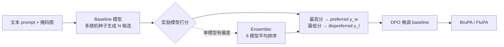

# Follow-Your-Preference: Towards Preference-Aligned Image Inpainting

**会议**: ICLR 2026  
**OpenReview**: [https://openreview.net/forum?id=n6XbPGStit](https://openreview.net/forum?id=n6XbPGStit)  
**代码**: [https://github.com/shenytzzz/Follow-Your-Preference](https://github.com/shenytzzz/Follow-Your-Preference)  
**领域**: 图像生成 / 图像修复 / 偏好对齐  
**关键词**: image inpainting, preference alignment, DPO, reward model, reward hacking, reward ensemble  

## 一句话总结
本文不提新方法，而是回到基础系统性地回答「用 DPO + 公开奖励模型做图像修复偏好对齐」的几个根本问题——奖励模型是否可靠、偏好数据如何 scaling、reward hacking 从何而来——并发现**简单地把 9 个奖励模型做集成排序**就能消除各自偏差、显著超越 SOTA，给这个新方向立了一个简单而扎实的 baseline。

## 研究背景与动机
- **领域现状**：扩散模型与 flow-based 模型让图像修复（image inpainting）质量大幅提升，BrushNet、FLUX.1 Fill 等已能填出视觉连贯的内容；同时「让视觉生成对齐人类偏好」（Diffusion-DPO、各类 RLHF）成为热点。
- **现有痛点**：但偏好对齐主要做在文生图上，**专门面向 image inpainting 的偏好对齐工作极少**；而做对齐又依赖奖励模型，已有工作往往**直接拿现成奖励模型来用、不做充分评估**，对「这些奖励模型到底靠不靠谱、偏好数据能不能 scale、reward hacking 怎么发生」缺乏系统认识。
- **核心矛盾**：人工标注偏好数据昂贵且不可扩展 → 必须用公开奖励模型自动构造偏好对；但奖励模型本身**带有未经检验的偏差**，盲目使用会把偏差注入对齐模型，导致 reward hacking（指标涨了、人看着反而更糟）。
- **本文目标**：不追求新方法，而是把这个新方向的**基础问题问清楚**，并在此基础上给出一个简单、可复现、能打的 baseline。
- **核心 idea**：**【回归基础的系统性研究】**用最成熟的 DPO 做对齐训练，跨 9 个奖励模型、2 个基准、2 个结构迥异的 baseline 做大规模对照实验；**【奖励集成】**发现单个奖励模型各有偏差，但把它们的排序做平均集成即可互相抵消偏差，得到鲁棒且泛化的偏好数据。

## 方法详解

### 整体框架
方法本身刻意保持「无新结构、无新数据集」：对每个文本 prompt + 掩码图，用 baseline 修复模型以不同随机种子生成多个候选；用奖励模型给候选打分，取**最高分作 preferred、最低分作 dispreferred** 组成偏好对；再用 DPO 在该偏好数据上微调 baseline。研究的全部变量只有「用哪个奖励模型来打分构造数据」，从而把奖励模型的影响干净地隔离出来。

### 关键设计

**1. DPO + 公开奖励模型自动构造偏好数据：把人工标注换成可扩展的打分管线。** 作者选 DPO 而非 PPO/GRPO，因为它把对齐变成直接的监督学习、效率与稳定性更高。视觉版 DPO 损失写成 $L_{DPO}=-\mathbb{E}[\log\sigma(-\beta((L^w_\theta-L^w_{ref})-(L^l_\theta-L^l_{ref})))]$，其中 $L^w,L^l$ 是 policy / 参考模型在 preferred / dispreferred 样本上的去噪损失（DDPM 或 Flow Matching loss）。偏好对不靠人标，而是对每个 prompt 用 baseline 生成 16 个候选、由奖励模型排序后取两端，使整套数据构造可无限扩展。

**2. 跨 9 奖励模型 × 2 baseline × 2 基准的对照诊断：先验证奖励模型本身可不可信。** 作者用 oracle 设定（同一奖励模型既构造数据又评测）来检验可靠性，发现 **CLIPScore、VQAScore、Perception 即便在自己构造的数据上训练，评测分都可能低于 baseline / random**——说明它们作为评测器不可靠，源于过于粗粒度的对比预训练或过于简单的 VQA 式打分。但多数奖励模型仍能提供有效的训练信号（GPT-4 评测下普遍优于 baseline 与随机选择），即「能当好的数据构造器」未必「是好的评测器」，两者要分开看。

**3. 偏好数据的两维 scaling：候选 scaling 与样本 scaling 都呈稳健趋势。** 作者沿两个维度扩展：**candidate scaling**（增大每个 prompt 的候选数，扩大多样性、让 preferred 与 dispreferred 的差距更明显）和 **sample scaling**（增大数据集规模，让模型更充分学到偏好模式）。结果显示在 BrushNet 与 FLUX.1 Fill、BrushBench 与 EditBench 上趋势一致、可泛化；但用 HPSv2 时 GPT-4 分会在 scaling 后期显著恶化，暴露出 reward hacking。

**4. 奖励模型偏差与 reward hacking 的归因：偏差在亮度/构图/配色上具体可见。** 通过可视化样例定位到 **HPSv2 偏好明亮光照、复杂构图、鲜艳配色；PickScore 则相反（偏暗、简洁、低饱和）**。偏差对不同 baseline 影响还不同：BrushNet 本就生成鲜艳图像，配 PickScore 更合适；FLUX.1 Fill 生成偏平淡，配 HPSv2 更合适——单一奖励模型与 baseline「性格」错配就会放大偏差、触发 hacking。

**5. Ensemble 奖励模型：用平均排序抵消偏差，得到通用且抗 hacking 的数据。** 作者提出新「奖励模型」**Ensemble**——按所有奖励模型的**平均排名**来挑 preferred / dispreferred。它在公开模型评测中于 BrushNet 上 11/12、FLUX.1 Fill 上 7/12 排进前二，在两个 baseline 的 GPT-4 评测中 3/4 排进前二；因为对各模型偏好取平均，单个模型的偏差被削弱，从而对 reward hacking 更鲁棒、跨结构跨基准都最好。最终命名 **BruPA**（BrushNet + Ensemble 对齐）与 **FluPA**（FLUX.1 Fill + Ensemble 对齐）。

## 实验关键数据

### 主实验（与 SOTA 对比，BrushBench / EditBench 节选）

| 模型 | ImageR (Brush./Edit.) | HPSv2 (Brush./Edit.) | HPSv3 (Brush./Edit.) | GPT-4 (Brush./Edit.) |
|------|------|------|------|------|
| BrushNet (baseline) | 12.717 / -1.296 | 27.509 / 23.076 | 5.749 / 0.403 | 79.391 / 57.046 |
| **BruPA (ours)** | **13.315 / 10.463** | **28.037 / 23.933** | **6.276 / 1.398** | **83.054 / 61.186** |
| FLUX.1 Fill (baseline) | 12.760 / 4.910 | 27.476 / 24.076 | 6.055 / 2.470 | 83.935 / 66.979 |
| **FluPA (ours)** | **13.859 / 7.707** | **28.735 / 25.972** | **7.000 / 4.230** | **87.609 / 72.307** |

两个 baseline 经 Ensemble 偏好对齐后，在标准指标、GPT-4 评测、人评上全面提升，且 ImageReward 等指标提升幅度明显（如 BruPA 的 EditBench ImageR 从 -1.296 升到 10.463）。

### 消融 / 对照

| 对照项 | 关键发现 |
|------|------|
| oracle 检验奖励模型 | CLIPScore / VQAScore / Perception 分数可低于 baseline/random，**评测不可靠** |
| HPSv2 vs Ensemble scaling | HPSv2 在 scaling 后期 GPT-4 分**显著下滑**（reward hacking）；Ensemble 全程稳健 |
| 单模型 vs Ensemble | Ensemble 跨基准、跨结构、跨评测器、跨 scaling 维度均取得最佳，抗 hacking 最强 |
| 新数据集 I Dream My Painting | 在额外基准上验证结论可迁移 |

### 关键发现
- **多数奖励模型能构造有效偏好数据，但「好构造器 ≠ 好评测器」**——要分开评估两种角色。
- **偏好数据的 candidate / sample scaling 趋势稳健且可泛化**，但带偏差的奖励模型（HPSv2）会因 reward hacking 破坏 scaling 收益。
- **奖励模型偏差集中在亮度、构图、配色三处**，且与 baseline「性格」错配时危害最大。
- **简单的奖励集成（平均排序）即可抵消偏差**，无需改结构或加数据就超越 SOTA。

## 亮点与洞察
- **方法论价值高于「新模型」价值**：把一个尚未被认真审视的方向（inpainting 偏好对齐）的基础问题逐条做实验回答，立了可复现的强 baseline，对后续研究的指导意义大。
- **「奖励集成抵消偏差」的洞见简单而通用**：不止适用于 inpainting，文生图、视频生成等任何依赖现成奖励模型做偏好对齐的任务都可借鉴。
- **把 reward hacking 落到可视化的具体偏差（亮度/构图/配色）**，并指出奖励模型与 baseline 的「性格匹配」问题，比泛泛而谈「奖励被 hack」更有操作性。
- **跨 2 种范式（U-Net+DDPM 的 BrushNet 与 Transformer+Flow 的 FLUX.1 Fill）验证**，结论的普适性更可信。

## 局限与展望
- **依赖 GPT-4 作为「公平评测器」**这一假设本身未被严格证明，作者也坦承这是「未经检验的假设」，结论的部分可信度系于此。
- **Ensemble 是均匀平均排序**，未探索按 baseline 性格或任务加权的更优集成策略，仍有提升空间。
- **奖励模型偏差的刻画偏定性**（靠样例观察亮度/构图/配色），缺乏定量、可自动检测偏差的工具。
- **只验证了 inpainting**，「奖励集成抵消偏差」在其他生成任务上的有效性有待进一步系统验证。

## 相关工作与启发
- **偏好对齐**：RLHF（PPO/GRPO）→ DPO（Rafailov 2023）→ 视觉版 Diffusion-DPO（Wallace 2024）；PrefPaint 用人标奖励模型 refine inpainting，本文则换成公开奖励模型集成、避开人工标注。
- **奖励模型生态**：CLIPScore、Aesthetic、ImageReward、PickScore、HPSv2/v3、VQAScore、UnifiedReward、Perception Encoder——本文把它们当作「数据构造器」逐个体检，给「该用哪个、怎么组合」提供了实证依据。
- **图像修复 baseline**：BrushNet（双分支 U-Net）、FLUX.1 Fill（rectified flow transformer）——本文证明对齐增益与具体结构/生成范式无关。
- **启发**：在任何「用现成奖励模型做对齐」的场景，先**审视奖励模型的可靠性与偏差**、再用**简单集成**抵消偏差，往往比追求更复杂的对齐算法更有性价比。

## 评分
- **新颖性**: ⭐⭐⭐ —— 不提新方法、用成熟 DPO + 集成，方法层面新意有限；但「系统回答基础问题 + 奖励集成抵消偏差」的研究视角与结论是新的。
- **实验充分度**: ⭐⭐⭐⭐⭐ —— 9 奖励模型 × 2 baseline × 2 基准 + scaling 双维度 + bias 归因 + SOTA 对比 + 人评/GPT-4，跨范式覆盖非常扎实。
- **写作质量**: ⭐⭐⭐⭐ —— 以「问题—发现—结论」组织，findings 清晰、可视化到位；缺点是大量奖励模型表格密集、可读性偏低。
- **价值**: ⭐⭐⭐⭐ —— 为 inpainting 偏好对齐立了简单强 baseline，奖励集成与 reward hacking 归因对整个视觉对齐社区有借鉴价值。

<!-- RELATED:START -->

## 相关论文

- [\[ICLR 2026\] Follow-Your-Shape: Shape-Aware Image Editing via Trajectory-Guided Region Control](follow-your-shape_shape-aware_image_editing_via_trajectory-guided_region_control.md)
- [\[ICLR 2026\] ViPO: Visual Preference Optimization at Scale](vipo_visual_preference_optimization_at_scale.md)
- [\[CVPR 2025\] Boost Your Human Image Generation Model via Direct Preference Optimization](../../CVPR2025/image_generation/boost_your_human_image_generation_model_via_direct_preference_optimization.md)
- [\[ICML 2026\] Anomaly-Preference Image Generation (APO)](../../ICML2026/image_generation/anomaly-preference_image_generation.md)
- [\[ICLR 2026\] Towards Better Optimization for Listwise Preference in Diffusion Models](towards_better_optimization_for_listwise_preference_in_diffusion_models.md)

<!-- RELATED:END -->
