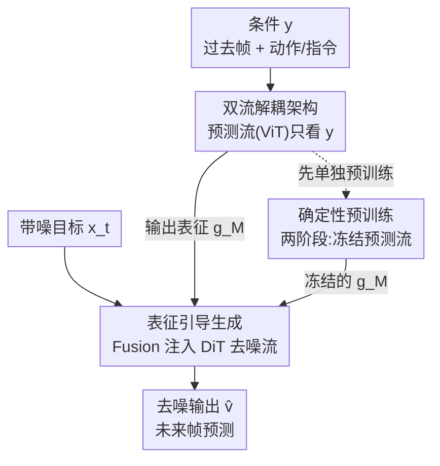

# Foresight Diffusion: Improving Sampling Consistency in Predictive Diffusion Models

**会议**: ICLR 2026  
**OpenReview**: [https://openreview.net/forum?id=9WJoD0iDig](https://openreview.net/forum?id=9WJoD0iDig)  
**领域**: 扩散模型  
**关键词**: 预测式扩散、采样一致性、条件解耦、确定性预测器、视频预测

## 一句话总结
针对扩散模型用于预测学习时"样本之间方差太大、不够贴合真值轨迹"的问题，ForeDiff 把"理解条件"和"对目标去噪"两件事拆成两条独立的流，并用一个预训练好的确定性预测器提取表征来引导生成，从而在机器人视频预测和科学时空预报上同时提升了预测精度与采样一致性。

## 研究背景与动机

**领域现状**：扩散模型和 flow-based 模型擅长建模复杂的多模态分布，近年来被广泛搬到预测学习（predictive learning）上——把"根据过去观测预测未来轨迹"建模成条件生成问题 $p(x|y)$，其中 $x$ 是未来帧的 latent，$y$ 是过去帧加上动作/指令等条件。

**现有痛点**：生成任务（如文生图）追求**多样性**，样本各异是优点；但预测学习本质不同，它的随机性主要来自"观测不完整"，因此需要的是**采样一致性**（sampling consistency）——在同一条件下反复采样，结果应当集中、低方差，且都贴近真值轨迹。作者实测发现：vanilla 扩散模型在 best-case 和 average LPIPS 上很强、参数还少（图 3a/3b），但 **worst-case LPIPS 明显劣于自回归的 iVideoGPT**，样本方差大、长尾重。换句话说，它"偶尔能预测得很好，但不稳定"，这对预测任务是致命的。

**核心矛盾**：作者把一致性差归因到**预测能力不足**（suboptimal predictive ability），而预测能力不足又源于**条件理解与目标去噪在共享架构和联合训练里相互纠缠**。从架构看，同一批参数既要理解条件 $y$、又要对带噪目标 $x_t$ 去噪，双重角色限制了对条件的充分利用；从训练看，带信息的 $x_t$ 给模型提供了一条"捷径"，让它更倾向于依赖 $x_t$ 的生成先验，而不是从 $y$ 里学到精确的任务动力学。

**本文目标**：在保留扩散模型生成能力的前提下，把"看懂条件"这件事独立出来做强，从而既提精度又压一致性的方差。

**切入角度**：作者用一个巧妙的极限分析切入——在 $t=1$（纯噪声、$x_1$ 不含任何信号）时，扩散模型只能靠 $y$ 来预测，此时它退化成一个确定性预测器。于是"$t=1$ 处的表现"就成了衡量扩散模型预测能力上界的代理；实验表明 vanilla 扩散在这个点上**打不过**同构的确定性 ViT 预测器（图 3c），证明它的预测潜力没被榨干。

**核心 idea**：用"解耦条件理解 + 确定性预训练"代替"共享架构联合训练"，让一条独立的确定性流专门吃透条件，再把它的内部表征喂给去噪流去引导生成。

## 方法详解

### 整体框架
ForeDiff 的核心是把一个 vanilla 条件扩散模型从"一条流"拆成**两条流**：一条**预测流**（predictive stream，由 $M$ 个确定性 ViT block 组成）只处理条件 $y$，完全不接触带噪目标 $x_t$；一条**生成流**（generative stream，由 $N$ 个 DiT block 组成）走标准的去噪流程。预测流吐出的信息表征 $g_M$ 取代原始条件 $y$，通过一个 Fusion 模块注入生成流来引导去噪。

只做架构解耦的版本叫 **ForeDiff-zero**（端到端联合训练）；在它之上再加一个**两阶段训练**就是完整的 **ForeDiff**：第一阶段把预测流当成独立的确定性预测器单独预训练，第二阶段冻结它、把表征 $g_M$ 作为条件去训练生成流。前向过程可写成：

$$g_0 = \text{PatchEmbed}(y),\quad g_i = \text{ViT}_i(g_{i-1}),\ i=1,\dots,M$$
$$h_0 = \text{PatchEmbed}(x_t),\quad h_1 = \text{Fusion}(h_0, g_M, t),\quad h_{i+1} = \text{DiT}_i(h_i, t),\ i=1,\dots,N$$

当 $M=0$ 时，ForeDiff-zero 退化为 vanilla 条件扩散（Fusion 直接作用在原始条件上）。

### 关键设计

**1. 双流解耦架构：把"看懂条件"和"去噪"拆开做**

这一设计直接针对"共享架构里参数双重角色、捷径依赖 $x_t$"的痛点。vanilla 扩散在网络入口就把 $y$ 和 $x_t$ 一起塞进共享主干，导致条件理解被去噪任务挤压。ForeDiff-zero 改成两条物理隔离的流：预测流由 $M$ 个 ViT block 组成、输入只有条件 $y$，**完全不接触 $x_t$**，因此它的参数可以全部投入到理解条件上；生成流则保持标准 DiT 去噪不变，只是把输入从原始 $y$ 换成预测流加工后的表征 $g_M$。由于预测流对 $x_t$ 完全无感知，它不再有"抄 $x_t$ 生成先验"的捷径，从架构层面缓解了纠缠。不过实验显示，单凭解耦（ForeDiff-zero）只能小幅提精度，**对一致性方差几乎没改善**——这引出第二个设计。

**2. 确定性预训练 + 冻结表征引导：把预测能力榨到上界**

光把流拆开还不够，端到端训练里 ViT 流可能只学到"静态表征"而非真正的预测能力。受 $t=1$ 极限分析的启发（扩散模型在该点等价于一个确定性预测器，且实测打不过同构的确定性模型），ForeDiff 用两阶段训练强行把预测流的能力拉满。第一阶段给预测流接一个 PredHead，组成完整的确定性预测器 $f_\xi(y)=\text{PredHead}(g_M)$，用纯预测损失 $L_{\text{deter}}=\mathbb{E}_{x_0,y}[\|P_\xi(y)-x_0\|_2^2]$ 单独训练；第二阶段**冻结**预测流、**去掉** PredHead，用其内部表征 $g_M$ 作为条件去训练生成流，损失为

$$L_{\text{denoise}}=\mathbb{E}_{x_0,y,\epsilon,t}\big[\|G_\theta(x_t, P'_\xi(y), t)-(\epsilon-x_0)\|_2^2\big]$$

其中 $P'_\xi$ 是去掉 PredHead 的预测流。注意这里引导生成的是**内部表征 $g_M$ 而非预测器的最终输出**——消融证明用 PredHead 的显式输出去引导反而掉点，说明富含上下文的中间表征比"已经拍扁成预测值"的输出更有利于生成。正是这个确定性预训练步骤，让 ForeDiff 相比 ForeDiff-zero 在 STD 指标上大幅下降，真正解决了一致性问题。

**3. 混合架构的协同增益：1+1 大于 2**

ForeDiff 把"确定性预测"和"条件扩散"两种范式拼在一起，二者并非简单叠加，而是**协同**。作者用一组对照实验验证：把 vanilla 扩散扩到 18 个 DiT block（参数量与 ForeDiff 持平）后性能仍明显落后，单独的确定性预测流也不行——只有"确定性预测流引导扩散生成流"这个组合才能大幅领先。这说明增益来自架构设计本身而非参数规模：确定性流负责把条件理解做到上界、提供稳定的"先见"表征，扩散流则保留了建模随机性、生成高保真细节的能力，两者各司其职、互补。

### 损失函数 / 训练策略
两阶段分别用两个损失：第一阶段预测流用确定性回归损失 $L_{\text{deter}}$（latent 空间 L2）；第二阶段生成流用 flow matching 的速度场损失 $L_{\text{denoise}}$，目标是逼近 $\epsilon-x_0$。默认配置为 6 个 ViT block（预测流）+ 12 个 DiT block（生成流），ViT/DiT 沿用标准结构。CFG（classifier-free guidance）可与 ForeDiff 正交叠加，进一步小幅提升。

## 实验关键数据

### 主实验

机器人视频预测（RoboNet 10 帧 / RT-1 14 帧，64×64），STD 指标越小一致性越好：

| 数据集 | 方法 | FVD ↓ | LPIPS ↓ | STD_LPIPS ↓ | STD_SSIM ↓ |
|--------|------|------|---------|------------|------------|
| RoboNet | Vanilla Diffusion | 53.8 | 5.65 | 0.65 | 1.33 |
| RoboNet | ForeDiff-zero | 52.7 | 5.54 | 0.66 | 1.36 |
| RoboNet | **ForeDiff** | **51.5** | **5.25** | **0.35** | **0.70** |
| RT-1 | Vanilla Diffusion | 11.7 | 3.79 | 0.53 | 1.11 |
| RT-1 | ForeDiff-zero | 11.1 | 3.60 | 0.50 | 1.03 |
| RT-1 | **ForeDiff** | 12.0 | **3.42** | **0.17** | **0.33** |

科学时空预报（HeterNS，2D Navier-Stokes 涡度，预测后 10 帧），指标 ×100：

| 方法 | L2 ↓ | Relative L2 ↓ |
|------|------|--------------|
| Vanilla Diffusion | 1.73 | 1.50 |
| ForeDiff-zero | 1.03 | 0.83 |
| **ForeDiff** | **0.19** | **0.18** |

在物理场景下优势更夸张：ForeDiff 的 relative L2 从 vanilla 的 1.50 一路降到 0.18，几乎是数量级的改善，因为这类任务对长程一致性更敏感、误差会随仿真步累积。

### 消融实验
| 配置 | 关键现象 | 说明 |
|------|---------|------|
| Full ForeDiff（两阶段） | 精度 + 一致性双升 | STD 大幅下降 |
| ForeDiff-zero（仅解耦） | 精度小升、STD 几乎不变 | 一致性改善主要来自确定性预训练 |
| 用 PredHead 输出引导 | 性能下降 | 内部表征 > 显式预测输出 |
| ViT block 数 $M$: 0→12 | 适量即饱和 | 轻量辅助模块就够，再加收益递减 |
| Vanilla 扩到 18 DiT block | 仍明显落后 | 增益来自设计而非参数规模 |

### 关键发现
- **一致性的功臣是"确定性预训练"而非"解耦本身"**：ForeDiff-zero 把流拆开了，但 STD 几乎没变；只有加上两阶段冻结预训练，STD_LPIPS 才从 0.65 砍到 0.35（RoboNet）、0.53 砍到 0.17（RT-1）。
- **引导信号要用中间表征而非最终输出**：把生成流的条件从内部表征 $g_M$ 换成 PredHead 的显式预测输出会掉点，印证"富表征比拍扁的预测值更有用"。
- **预测能力是低成本品**：只需少量 ViT block 就能让固定的生成主干受益，$M$ 再大收益递减，说明辅助预测模块可以很轻量。
- **best-of-100 对比仍有竞争力**：即便用对自己不利的 Top-1（100 样本取最优）评测设定，ForeDiff 在 RoboNet 上 FVD=51.5 仍优于 FitVid/iVideoGPT 等强基线。

## 亮点与洞察
- **$t=1$ 极限分析是点睛之笔**：用"纯噪声时扩散模型退化成确定性预测器"这一引理，把"扩散模型预测能力有上界、且现在没达到"这件事讲得既严谨又直观，顺势引出"专门训一个确定性流"的动机——动机和方法严丝合缝。
- **区分了"多样性"和"一致性"两种随机性需求**：明确指出生成任务要多样、预测任务要一致，并提出用 STD_metric（多次采样的指标标准差）来定量衡量一致性，这个评测视角本身就有迁移价值。
- **解耦 + 冻结表征引导**这套思路可迁移到任何"条件很重要但容易被生成捷径绕过"的条件生成任务（如可控图像编辑、布局到图像），把条件编码器单独预强再冻结引导。

## 局限与展望
- **依赖一个好的确定性预测器**：整套方法的一致性收益绑定在第一阶段确定性预训练的质量上；若条件本身很难学到强确定性映射（如高度混沌系统），上界可能就不高。
- **两阶段训练增加流程复杂度**：相比 vanilla 端到端训练，多了一个独立预训练 + 冻结的阶段，工程上更繁琐。
- **任务范围**：实验集中在机器人视频预测和 2D 物理仿真，分辨率均为 64×64，是否能扩到高分辨率、更长序列或更开放的生成场景未充分验证。
- 改进方向：可探索让预测流"软冻结"或与生成流交替微调，在保留一致性的同时给生成流更多适配空间。

## 相关工作与启发
- **vs Vanilla 条件扩散**：后者把条件和带噪目标在共享主干里联合处理，预测能力被纠缠拖累、样本方差大；ForeDiff 物理隔离两条流并单独预强条件流，精度和一致性双赢。
- **vs 自回归预测（iVideoGPT 等）**：自回归模型 worst-case 更稳但 best/average 不如扩散；ForeDiff 在保留扩散高保真生成的同时，把 worst-case 的长尾压下去，兼得两者优点。
- **vs CFG 等后训练增强**：CFG 也能小幅提一致性，但增益有限且与 ForeDiff 正交——两者可叠加，ForeDiff 解决的是更底层的预测能力问题。

## 评分
- 新颖性: ⭐⭐⭐⭐ "解耦条件理解 + $t=1$ 极限分析定位预测能力上界"的切入角度新颖，方法本身朴素但 insight 扎实
- 实验充分度: ⭐⭐⭐⭐ 覆盖视频预测与科学预报两类任务，消融拆清了"解耦 vs 预训练"各自贡献，但分辨率/规模偏小
- 写作质量: ⭐⭐⭐⭐ 动机推导（一致性需求→纠缠→上界分析）逻辑清晰，图表配合到位
- 价值: ⭐⭐⭐⭐ 为"扩散模型用于预测学习"指出明确方向，STD 一致性评测与解耦思路有迁移性

<!-- RELATED:START -->

## 相关论文

- [\[ICLR 2026\] Diagnosing and Improving Diffusion Models by Estimating the Optimal Loss Value](diagnosing_and_improving_diffusion_models_by_estimating_the_optimal_loss_value.md)
- [\[ICLR 2026\] Steer Away From Mode Collisions: Improving Composition In Diffusion Models](steer_away_from_mode_collisions_improving_composition_in_diffusion_models.md)
- [\[ICLR 2026\] Improving Diffusion Models for Class-imbalanced Training Data via Capacity Manipulation](improving_diffusion_models_for_class-imbalanced_training_data_via_capacity_manip.md)
- [\[ICLR 2026\] HiGS: History-Guided Sampling for Plug-and-Play Enhancement of Diffusion Models](higs_history-guided_sampling_for_plug-and-play_enhancement_of_diffusion_models.md)
- [\[ICLR 2026\] FACM: Flow-Anchored Consistency Models](facm_flow-anchored_consistency_models.md)

<!-- RELATED:END -->
