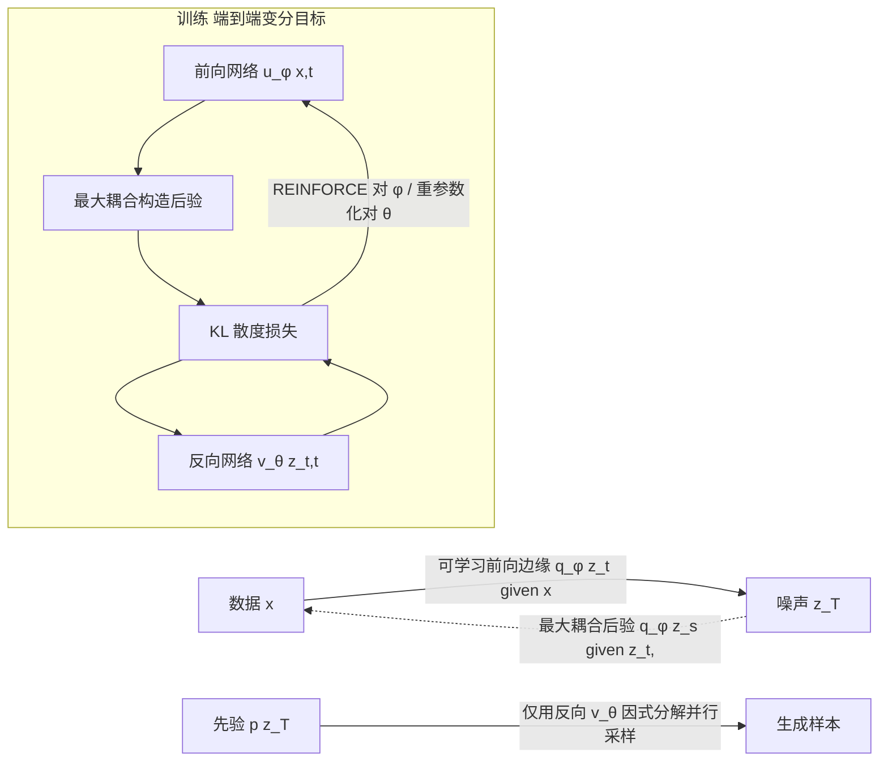

# Forward-Learned Discrete Diffusion: Learning how to noise to denoise faster

**会议**: ICLR 2026  
**OpenReview**: [https://openreview.net/forum?id=45EtKUdgbJ](https://openreview.net/forum?id=45EtKUdgbJ)  
**代码**: 待确认  
**领域**: 生成模型 / 离散扩散  
**关键词**: 离散扩散, 可学习前向过程, 少步生成, 非马尔可夫, 最大耦合, REINFORCE  

## 一句话总结
与其费劲让因式分解的反向过程去逼近复杂目标，FLDD 反过来让**前向加噪过程变成可学习的**，使它诱导出的反向目标恰好是因式分解的、容易被现有采样器匹配的形式，从而在不改采样器、不增推理开销的前提下把离散扩散的采样步数从上百步压到 10 步。

## 研究背景与动机
- **领域现状**：离散扩散在文本、分子、图像等离散域上表现强劲。为了高效并行采样，反向（生成）过程通常被参数化成**因式分解分布** $p_\theta(z_s|z_t)=\prod_i p_\theta(z_s^i|z_t)$，这样所有坐标可以一步并行更新。
- **现有痛点**：连续扩散可以借助生成 ODE 学到连接噪声与数据的确定性轨迹，进而做单步/少步生成；但离散空间**不存在**这种把噪声唯一映射到数据的连续确定性轨迹，蒸馏与一致性加速技术无法直接迁移。结果离散扩散往往需要与序列长度 $D$ 相当的步数 $T$，推理又慢又贵。
- **核心矛盾**：给定一个固定前向过程，反向过程的真实目标是后验的边缘化 $q(z_s|z_t)=\mathbb{E}_{q(x|z_t)}[q(z_s|z_t,x)]$（公式 6），它**一般不是因式分解的**——尤其当 $T$ 很小时偏离最严重。而因式分解的反向模型根本没能力匹配这种非因式分解目标，于是少步直接训练就崩。让反向过程更灵活又会破坏并行采样效率，是个死结。
- **本文目标**：在**不动反向过程、不增推理开销**的前提下，缩小目标 $q(z_s|z_t)$ 与模型 $p_\theta(z_s|z_t)$ 的差距，实现少步生成。
- **核心 idea**：**与其改反向不如改前向**。前向过程隐式定义了反向目标，那就把前向过程做成可学习的，让它自己适配到「反向模型能匹配的因式分解形式」。两个直觉例子点明可行性：两个高斯的混合无法一步因式分解采样，但**两步可以**（先采混合分量索引，再从选中的高斯采）；离散随机游走 $D$ 步可建模，但也能两步（先采 $D-1$ 个独立 $\pm1$，再做前缀和）——关键是这些「好的中间结构」依赖数据分布本身，所以**从数据里学**。

## 方法详解

### 整体框架
FLDD 保持标准离散扩散的因式分解反向采样器与变分目标完全不变，唯一的改动是把前向加噪过程从「固定的马尔可夫链」换成「可学习的非马尔可夫过程」。训练时前向网络 $u_\phi$ 与反向网络 $v_\theta$ 一起端到端优化同一个变分下界：反向过程适配前向，前向过程也反过来适配反向，二者互相迁就，最终前向被「逼」着产出一个反向能匹配的因式分解目标分布。推理时完全不需要前向网络，所以零额外开销。

### 关键设计

**1. 非马尔可夫的可学习前向过程：把目标搬到模型够得着的地方。** 训练时只需要两件事——能高效从边缘 $q(z_t|x)$ 采样、以及后验 $q(z_s|z_t,x)$ 可解析以算 KL。据此把前向从马尔可夫定义 $q(z_{0:T}|x)=q(z_0|x)\prod_t q(z_t|z_s)$ 改写成非马尔可夫形式 $q(z_{0:T}|x)=q(z_T|x)\prod_t q(z_s|z_t,x)$（公式 8），并让其中的边缘 $q_\phi(z_t|x)$ 与后验 $q_\phi(z_s|z_t,x)$ 都带参数 $\phi$ 可学。只要参数化足够灵活，就能找到一组 $\phi$ 使诱导目标 $q_\phi(z_s|z_t)$（公式 6）变成因式分解的——这正是反向模型擅长拟合的形式。

**2. 因式分解的前向边缘：让每个坐标的加噪「看全局」。** 前向边缘沿用与生成模型相同的因式分解形式 $q_\phi(z_t|x)=\prod_i q_\phi(z_t^i|x)$，其中 $q_\phi(z_t^i|x)=\mathrm{Cat}(z_t^i; u_\phi^i(x,t))$（公式 9），从而训练时能高效并行采样 $z_t$。与常规离散扩散的本质区别在于：每个坐标 $z_t^i$ 的加噪分布由参数 $u_\phi^i(x,t)$ 给出，而这个参数**依赖整个数据点 $x$ 而非仅第 $i$ 个分量 $x_i$**——也不只依赖时间步。边界条件 $q_\phi(z_0|x)=\delta(z_0-x)$ 与 $q_\phi(z_T|x)=p(z_T)$ 通过对 $u_\phi$ 适当重参数化来保证。

**3. 最大耦合（Maximum Coupling）后验：非参数地搬运概率质量。** 后验既要可解析，又要与边缘一致即 $q_\phi(z_s|x)=\int q_\phi(z_t|x)q_\phi(z_s|z_t,x)\,dz_t$（公式 10）——也就是要构成一个合法的概率质量「运输方案」。FLDD 用最大耦合这个非参数技巧逐坐标构造：在从 $u_t$ 往 $u_s$ 搬质量时**尽量少动**——对 $z_t=k$，若 $u_s^k\ge u_t^k$ 就保持 $z_s=z_t$；若 $u_s^k<u_t^k$ 则把多出的质量 $u_t^k-u_s^k$ 按缺额分布 $m_{s|t}=\frac{\min(0,u_s-u_t)}{\|\min(0,u_s-u_t)\|}$ 重新分配（公式 11）。整个后验参数只需简单向量运算即可算出，逐坐标独立施加。由此每个坐标的前向轨迹在给定 $x$ 时条件独立，但轨迹可对整个 $x$ 有复杂非线性依赖，无条件分布依然富有表达力。

**4. REINFORCE 优化 + 松弛预热：跨越离散不可导的坎。** 目标对 $\theta$ 可直接重参数化，但对 $\phi$ 的梯度因为 $z_t$ 离散无法用重参数化技巧。FLDD 用 REINFORCE（公式 13）把梯度写成 $\nabla_\phi\mathbb{E}\big[\frac{q_\phi(z_t|x)}{\lfloor q_\phi(z_t|x)\rfloor_{sg}}D_{KL}(\cdot\|\cdot)\big]$ 得到无偏的蒙特卡洛估计，端到端训练（算法 1）。但 REINFORCE 方差高、从头训会不稳，于是引入**松弛预热**：先用 Concrete/Gumbel-Softmax 把类别分布连续松弛 $\bar q_{\tau,\phi}(\bar z_t|x)$，松弛样本的后验按其分量加权组合各离散后验 $\bar q_{\tau,\phi}(z_s^i|\bar z_t^i,x)=\sum_k \bar z_t^{i,k}q_\phi(z_s^i|z_t^i=k,x)$（公式 14），借重参数化稳定起步；温度从 $\tau=1$ 在 $10^4\sim10^5$ 步内指数退火到 $10^{-3}$，预热后切回 REINFORCE。注意 FLDD 必须直接参数化 $q_\phi(z_s|z_t)$，那种「先预测 $\hat x$ 再重采」的常规技巧在此不适用，因为 $q_\phi(x|z_t)$ 一般不可因式分解。

## 实验关键数据

定位：FLDD 是「降低采样步数的通用框架」，目标不是在每个域刷过所有 SOTA，而是证明**在相同反向参数化下、给定步数预算时样本质量更高**，且步数可大幅压缩。前向网络与反向网络用同样架构/超参（参数量翻倍但不增反向容量）。

### 主实验表格

ROCStories 文本生成（Table 1）：

| 方法 | MAUVE ↑ | PPL ↓ | Div ↑ |
|------|---------|-------|-------|
| GPT2 | 0.789 | 20.5 | 0.252 |
| SEDD | 0.598 | 70.8 | 0.336 |
| COSMOS | 0.940 | 26.3 | 0.346 |
| **FLDD, T=100** | 0.538 | 55.2 | 0.280 |
| **FLDD, T=10** | 0.511 | 60.5 | 0.285 |

分子生成 QM9 / ZINC250k（Table 2）：

| 方法 | QM9 Valid↑ | QM9 FCD↓ | ZINC Valid↑ | ZINC FCD↓ |
|------|-----------|----------|-------------|-----------|
| GDSS | 95.72 | 2.900 | 97.01 | 14.656 |
| Dirichlet FM | 99.10 | 0.888 | 97.52 | 14.222 |
| CatFlow | 99.81 | 0.441 | 99.21 | 13.211 |
| **FLDD, T=100** | 99.67 | 0.328 | 97.79 | 8.487 |
| **FLDD, T=10** | 99.08 | 0.385 | 96.77 | 10.414 |

### 消融 / 对比实验

| 设置 | 观察 |
|------|------|
| 二维玩具数据（两高斯混合，2 步生成） | 模型自动先生成因式分解的中间结构，再产出最终混合数据，印证「学到合适中间分布」 |
| Binarized MNIST，T=4，掩码版 FLDD vs 普通 MDM | 普通 MDM 均匀解掩码，少步下生成不自然；FLDD 学到「先解相关性低的 token」的掩码调度，4 步即出更真实图像 |
| T=100 vs T=10（文本/分子） | FLDD 从 100→10 步仅轻微掉点，而常规扩散在 10 步几乎无法生成真实样本 |

### 关键发现
- **质量-延迟权衡显著改善**：T=10 步时 FLDD 仍接近 T=100 的水平，而其它离散扩散在如此少步下基本失效；ZINC250k 上 FLDD 的 FCD（8.487）甚至明显优于诸多 T=100 基线。
- **掩码扩散也能受益**：把前向限制为「条件于全图的掩码概率」，FLDD 学出数据感知的掩码调度，让生成等价于「优先解相关性低的 token」，在相同反向参数化下超过普通 MDM。
- 部分基线在 T=100 时仍胜过 FLDD，作者归因于未调的超参与「直接参数化 $q_\phi(z_s|z_t)$」这一已知次优选择，而非框架本身缺陷。

## 亮点与洞察
- **视角反转**：把「让反向去追复杂目标」的难题，转化为「让前向把目标整理成反向够得着的形状」，是非常干净的 reframing——不动采样器、不增推理开销，纯训练侧改造。
- **加噪也依赖全局数据**：常规扩散每个坐标的破坏只看时间步，FLDD 让每坐标的加噪分布依赖整个 $x$，这才是少步可行的关键——加噪顺序/方式本身编码了数据的相关性结构。
- **最大耦合**这个非参数后验既保证边缘一致性又只需向量运算，巧妙地绕开了「可学习前向后验难以同时满足可解析+一致」的工程难点。
- 框架与现有扩展正交（掩码、分子、文本都能套），是 plug-in 式的通用提速思路。

## 局限与展望
- **依赖 REINFORCE**：对 $\phi$ 的梯度高方差，必须靠 Concrete 松弛预热才稳，训练复杂度与稳定性是隐患；更低方差的估计器是明确的未来方向。
- **前向网络翻倍参数**：虽不增反向容量与推理开销，但训练显存/计算成本上升。
- **反向参数化次优**：FLDD 被迫直接参数化 $q_\phi(z_s|z_t)$，而非更优的「预测 $\hat x$ 再重采」路线，限制了在 T=100 时与最强基线的可比性；如何在保持性质下高效重参数化生成过程未解决。
- **前向参数化非唯一且未充分探索**：边缘可做成部分自回归换取灵活度、后验可用带度量的逐元素最优传输等，作者明确留作未来工作。

## 相关工作与启发
- **可学习前向过程**：连续域的 Neural Flow Diffusion Models（Bartosh et al., 2024）证明学前向能收紧似然界、提升生成；FLDD 把这条线索搬到离散域，用非马尔可夫但可解析的前向边缘+后验参数化。
- **离散扩散加速**：连续域靠蒸馏/一致性（Salimans 2024、Xu 2025）做少步，但离散因式分解反向参数化导致长采样链；FLDD 不改采样器，而是改训练目标的「形状」来实现少步。
- **掩码/吸收态扩散**（SEDD、MDM、Shi et al.）：FLDD 可看作给 MDM 装上「可学习掩码调度」，从均匀解掩码升级为相关性感知的解掩码顺序。
- **启发**：当模型容量被效率约束卡死、无法逼近固定目标时，「重塑目标本身使其落入模型能力范围」往往比「硬扩模型」更划算——这一思路对其它需要并行/少步采样的结构化生成问题（图、代码、布局）有借鉴意义。

## 评分
- 新颖性: ⭐⭐⭐⭐ 把「学习前向」从连续域系统迁移到离散域，并用非马尔可夫+最大耦合给出可训练参数化，reframing 干净且少见。
- 实验充分度: ⭐⭐⭐ 覆盖玩具/文本/分子/图像四类，少步优势清晰；但每个域均非 SOTA，部分基线未调超参，缺乏对 REINFORCE 方差、前向参数化选择的系统消融。
- 写作质量: ⭐⭐⭐⭐ 动机层层递进（两个直觉例子点睛），公式与算法清楚，少步可行的「为什么」讲得透。
- 价值: ⭐⭐⭐⭐ 提供了一条不增推理开销、与现有扩展正交的离散扩散通用提速路径，对追求少步生成的离散域有较强实用与启发价值。

<!-- RELATED:START -->

## 相关论文

- [\[ICLR 2026\] ReDDiT: Rehashing Noise for Discrete Visual Generation](reddit_rehashing_noise_for_discrete_visual_generation.md)
- [\[ICLR 2026\] Consolidating Reinforcement Learning for Multimodal Discrete Diffusion Models](consolidating_reinforcement_learning_for_multimodal_discrete_diffusion_models.md)
- [\[ICML 2026\] Adapting Noise to Data: Generative Flows from Learned 1D Processes](../../ICML2026/image_generation/adapting_noise_to_data_generative_flows_from_1d_processes.md)
- [\[ICLR 2026\] Loopholing Discrete Diffusion: Deterministic Bypass of the Sampling Wall](loopholing_discrete_diffusion_deterministic_bypass_of_the_sampling_wall.md)
- [\[ICLR 2026\] Flow Matching with Injected Noise for Offline-to-Online Reinforcement Learning](flow_matching_with_injected_noise_for_offline-to-online_reinforcement_learning.md)

<!-- RELATED:END -->
