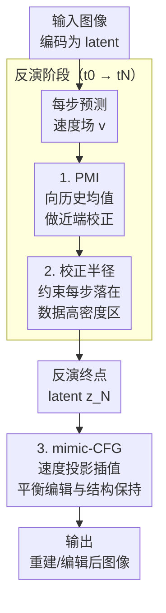

# Free Lunch for Stabilizing Rectified Flow Inversion

**会议**: ICLR 2026  
**arXiv**: [2602.11850](https://arxiv.org/abs/2602.11850)  
**代码**: 无  
**领域**: 扩散模型/图像编辑  
**关键词**: Rectified Flow, 反演稳定性, Proximal-Mean Inversion, 图像编辑, 速度场校正

## 一句话总结
提出PMI（Proximal-Mean Inversion）和mimic-CFG两个无训练方法，通过将速度场向其历史均值做近端梯度校正来稳定Rectified Flow反演，在PIE-Bench上以更少的NFE达到SOTA的重建和编辑质量。

## 研究背景与动机

**领域现状**：Rectified Flow (RF) 模型（FLUX、Wan等）已成为扩散模型的强替代方案，其学到的近似恒定速度场使采样更快更稳定。RF的无训练反演能力支持重建和编辑等下游任务。

**现有痛点**：反演过程中不可避免的近似误差会跨时步累积。理论已证明ODE映射在高维空间中本质上不稳定（几何平均不稳定系数>1的概率随维度增加趋近于1），小的潜空间扰动可导致大的重建误差。现有方法如RF-Solver、FireFlow增加步数/NFE来缓解，计算代价高。

**核心矛盾**：反演精度需要更多步骤（+计算），但实际应用期望高效（少步骤）。速度场扰动在反演中被不稳定性放大，但完全消除扰动不可能。

**本文目标**：不增加NFE的条件下，如何稳定反演过程中被扰动的速度场？

**切入角度**：RF训练目标产生近似恒定的速度场，因此可以用历史速度的滑动均值作为稳定参考方向。通过近端优化将当前速度拉向均值方向，同时约束校正步在理论推导的球面高斯范围内。

**核心 idea**：用速度场的历史均值做近端梯度校正来稳定RF反演，在编辑时用mimic-CFG做速度投影插值平衡编辑力度与结构保持。

## 方法详解

### 整体框架
论文要解决的是 RF 反演里"误差跨时步累积、被高维不稳定性放大"的问题，但又不愿意像 RF-Solver、FireFlow 那样靠加步数来硬抗。它的做法是抓住 RF 训练目标本身的特性——速度场近似恒定——把历史速度的滑动均值当成一个稳定的参考方向，在不增加任何网络调用的前提下顺手把速度场拉回正轨。整条流水线分成两段：反演阶段（$t_0 \to t_N$）用 PMI 对每一步预测的速度做近端梯度校正、并用理论推导的校正半径约束每步走多远，把累积误差压下去；编辑/重建阶段（$t_N \to t_0$）用 mimic-CFG 对速度做投影插值，在"改得动"和"结构不崩"之间调平衡。两段都是 zero-cost，可即插即用到任何 RF 模型上。

### 关键设计

**1. Proximal-Mean Inversion（PMI）：用历史均值给被扰动的速度做近端校正**

反演不稳定的根源是每一步的近似误差会被高维 ODE 映射放大，而完全消除扰动又不可能。PMI 的应对是给每一步的预测速度找一个可信的"锚"——历史速度的加权均值 $\bar{\mathbf{v}}_{t_k} = \frac{1}{t_{k+1}-t_0}\sum_{i=0}^{k}(t_{i+1}-t_i)\mathbf{v}_{t_i}$，因为 RF 的速度场近似恒定，这个均值方向天然稳定。校正写成一个近端优化目标

$$F(\mathbf{v}) = \|\mathbf{v} - \mathbf{v}_{t_{k-1}}\|_1 + \frac{1}{2\lambda}\|\mathbf{v} - \bar{\mathbf{v}}_{t_k}\|_2^2$$

其中 $L_1$ 项约束当前速度别偏离前一步太远（局部一致性），$L_2$ 项把它往历史均值上拉（全局一致性），两者同时成立才算把速度"稳住"。对 $F$ 做一阶 Taylor 近似后能解出闭式更新 $\hat{\mathbf{v}}_{t_k} = \mathbf{v}_{t_k} - r_{t_k}\frac{\nabla F(\mathbf{v}_{t_k})}{\|\nabla F(\mathbf{v}_{t_k})\|_2}$，沿负梯度方向走一步、步长由校正半径 $r_{t_k}$ 控制。整套只需维护一个均值累加器加一次闭式更新，所以不增加 NFE。

**2. 校正半径的理论推导：让每一步校正落在数据高密度区**

PMI 里那个步长 $r_i$ 不能随便选——走太远会偏离数据流形、掉进低密度区，走太近又稳不住速度场。论文用 Proposition 1 从高维高斯分布的集中不等式推出安全半径

$$r_i = \sqrt{2n + 3\sqrt{2n}} \cdot \frac{\Delta t_i}{T} + \epsilon$$

其中 $n$ 是潜空间维度，$\Delta t_i$ 是当前步长。这个式子保证校正后的速度仍落在球面高斯的高密度范围内，是把"校正多少才安全"从经验调参变成了理论可算的量，也是 PMI 敢说自己稳定的依据。

**3. mimic-CFG：编辑阶段用速度投影插值平衡编辑力度与结构保持**

到了编辑/重建阶段，矛盾换成了"改得明显"和"原图结构别崩"。mimic-CFG 先把当前速度投影到编辑历史均值方向上

$$\bar{\mathbf{v}}_{t_k}^{\text{proj}} = \frac{\mathbf{v}_{t_k}^\top \bar{\mathbf{v}}_{t_k}^{\text{edit}}}{\|\bar{\mathbf{v}}_{t_k}^{\text{edit}}\|_2^2}\bar{\mathbf{v}}_{t_k}^{\text{edit}}$$

再和原始速度做线性插值 $\hat{\mathbf{v}}_{t_k} = (1-w)\bar{\mathbf{v}}_{t_k}^{\text{proj}} + w \cdot \mathbf{v}_{t_k}$，用 $w$ 调编辑强度。名字叫"mimic-CFG"是因为它的结构和分类器自由引导（CFG）同构：投影分量类似 CFG 的"无条件"方向负责结构保持，原始速度类似"有条件"方向负责编辑效果，$w$ 就是控制两者权重的旋钮。用投影而非直接插值，是因为投影保留了与稳定参考方向对齐的那部分速度，实验里效果更好。

### 损失函数 / 训练策略
全程无训练，只在推理时改速度场：PMI 做一次近端梯度更新，mimic-CFG 做速度投影加线性插值，两者都不增加 NFE。

## 实验关键数据

### 主实验
PIE-Bench（700编辑任务），基于FLUX模型：

| 方法 | PSNR↑ | LPIPS↓ | 结构距离↓ | CLIP相似度↑ | NFE |
|------|-------|--------|----------|------------|-----|
| DDIM Inversion | 基线 | 基线 | 基线 | 基线 | N |
| RF-Solver | 好 | 好 | 好 | 好 | 2N |
| FireFlow | 好 | 好 | 好 | 好 | 2N |
| 基线+PMI | **更好** | **更好** | **更好** | **更好** | N |
| 基线+PMI+mimic-CFG | **SOTA** | **SOTA** | **SOTA** | **SOTA** | N |

### 消融实验

| 配置 | PSNR↑ | 说明 |
|------|-------|------|
| 无校正 | 基线 | 原始反演 |
| PMI (L1范数) | **最优** | 完整方案 |
| PMI (L2范数) | 次优 | L2不如L1 |
| PMI (L∞范数) | 一般 | 稀疏校正 |
| 无prompt重建 | 验证反演质量 | 排除prompt干扰 |

### 关键发现
- PMI不增加任何NFE但显著提升PSNR(+2-3dB)，名副其实的"免费午餐"
- L1范数在近端目标中表现最好——可能因为L1提供了更适度的稀疏校正
- 在无prompt条件下评估反演质量是一个重要贡献——排除了prompt对齐对重建性能的混淆影响
- mimic-CFG的权重 $w$ 可直观控制编辑强度，$w$ 大偏向编辑、$w$ 小偏向保持

## 亮点与洞察
- **"免费午餐"真的免费**：PMI只需维护一个速度均值的累加器和一次闭式更新，不增加任何额外网络调用，实现了真正零成本的质量提升。
- **理论驱动的校正半径**：不是随意选择超参数，而是从不稳定性定理推导出安全校正范围，理论指导实践。
- **mimic-CFG的优雅类比**：将速度投影+插值类比为CFG的无条件+有条件控制，直觉清晰且易于调控。用投影而非直接插值效果更好（已有实验验证）。
- **prompt-free评估**：提出无条件下评估反演质量的方法论，更纯粹地度量反演稳定性。

## 局限与展望
- $\lambda$ 和 $\epsilon$ 等超参数需要调优，尽管论文给出了合理默认值
- 理论假设速度场接近恒定，对训练不充分或架构特殊的RF模型可能不成立
- mimic-CFG的权重 $w$ 对不同编辑类型可能需要不同设置
- 仅在图像编辑任务上验证，视频编辑/3D等场景未探索

## 相关工作与启发
- **vs RF-Solver/FireFlow**: 这些方法用高阶Taylor展开或双步迭代提升精度，但增加了NFE。PMI不增加NFE，可与它们叠加使用。
- **vs Direct Inversion**: Direct Inversion分离源/目标扩散保持内容，mimic-CFG通过速度投影插值达到类似效果但更轻量
- **vs FlowEdit**: FlowEdit构建源到目标的直接ODE，无需反演。PMI+mimic-CFG保留了反演的灵活性。

## 评分
- 新颖性: ⭐⭐⭐⭐ 近端优化稳定速度场的思路新颖，mimic-CFG类比巧妙
- 实验充分度: ⭐⭐⭐⭐ PIE-Bench全面评估、多baseline叠加测试、prompt-free评估
- 写作质量: ⭐⭐⭐⭐⭐ 理论推导与直觉解释兼备，算法伪代码清晰
- 价值: ⭐⭐⭐⭐⭐ 真正的free lunch方法，对RF反演和编辑有直接实用价值

<!-- RELATED:START -->

## 相关论文

- [\[ICLR 2026\] FlowAlign: Trajectory-Regularized, Inversion-Free Flow-based Image Editing](flowalign_trajectory-regularized_inversion-free_flow-based_image_editing.md)
- [\[ICML 2025\] Taming Rectified Flow for Inversion and Editing](../../ICML2025/image_generation/taming_rectified_flow_for_inversion_and_editing.md)
- [\[ICLR 2026\] Flow Straight and Fast in Hilbert Space: Functional Rectified Flow](flow_straight_and_fast_in_hilbert_space_functional_rectified_flow.md)
- [\[ICLR 2026\] UniEdit-Flow: Unleashing Inversion and Editing in the Era of Flow Models](uniedit-flow_unleashing_inversion_and_editing_in_the_era_of_flow_models.md)
- [\[ICCV 2025\] FlowEdit: Inversion-Free Text-Based Editing Using Pre-Trained Flow Models](../../ICCV2025/image_generation/flowedit_inversion-free_text-based_editing_using_pre-trained_flow_models.md)

<!-- RELATED:END -->
