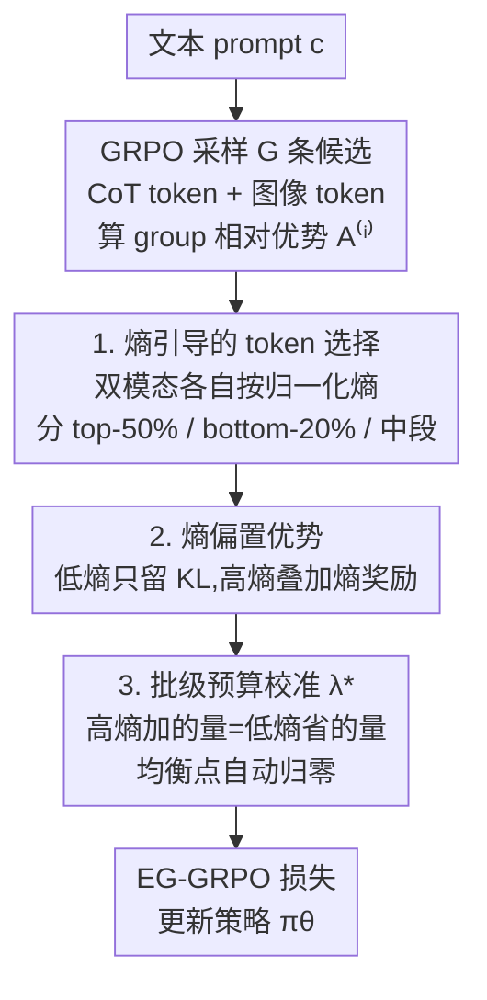

# From Broad Exploration to Stable Synthesis: Entropy-Guided Optimization for Autoregressive Image Generation

**会议**: ICLR 2026  
**OpenReview**: [https://openreview.net/forum?id=NCLjpR2MDq](https://openreview.net/forum?id=NCLjpR2MDq)  
**代码**: https://github.com/minebetter/EG-GRPO  
**领域**: 图像生成 / 自回归 T2I / 强化学习对齐  
**关键词**: 文本生成图像, 自回归生成, GRPO, 熵, Chain-of-Thought

## 一句话总结
本文先用「熵」这把尺子量化 CoT 与 RL 在自回归文生图里的分工——CoT 把生成探索空间撑大、RL 再把它收缩到高奖励区，并发现奖励与图像 token 熵的均值/方差都强负相关；据此提出 EG-GRPO：在 GRPO 基础上按 token 熵重新分配优化预算（低熵 token 只走 KL 保稳、高熵 token 加熵奖励促结构化探索），在 T2I-CompBench 和 WISE 上取得 SOTA。

## 研究背景与动机

**领域现状**：自回归文生图（如 Janus-Pro、Parti）把图像编码成离散 token 序列后逐 token 预测，近来流行在其上叠加两件套——用 Chain-of-Thought（CoT）做语义规划、再用强化学习（GRPO 这类 group-relative 方法）直接优化人类偏好/任务奖励。CoT+RL 确实能提升组合泛化与对齐质量。

**现有痛点**：但「CoT 的探索行为」和「RL 的优化行为」到底怎么互动、这种互动如何影响生成的不确定性与稳定性，一直没有被系统理解。结果就是 RL 把同一个 group-relative 优势 $A^{(i)}$ 无差别广播给序列里所有 token——既对那些已经很自信（低熵）的 token 反复施加奖励梯度（容易把已学好的知识带跑偏），又没把优化火力集中到真正需要降不确定性的高熵 token 上。

**核心矛盾**：文生图同时要在「为多样性而探索」和「为对齐保真而利用」之间权衡，还要在重复采样下保持稳定。GRPO 的逐 token 等权更新对这两个目标都不够精准——它既不区分 token 的置信度，也没有显式机制去压低不稳定性。

**本文目标**：(1) 把 CoT–RL 的互动用可量化的指标讲清楚；(2) 据此设计一个 token 级、按不确定性重新分配预算的 GRPO 改造，且不破坏 GRPO 原有的收敛性质。

**切入角度**：作者用 Shannon 熵同时量化两种模态的 token 级不确定性——文本 CoT token 与图像 token，把每张生成图放进「平均熵 × 奖励」二维空间观察分布。三个实证发现支撑了整套方法：① CoT 扩张熵分布（探索），RL 收缩并左移熵分布（利用）；② 最终奖励与图像 token 熵的**均值和标准差都强负相关**（且 std 越大、均值熵对奖励的负相关越强）；③ 文本 CoT 的熵直接决定下游图像质量——低熵 CoT 产出更紧凑、更高奖励的图像簇。

**核心 idea**：既然奖励 = 压低「不确定性（均值熵）+ 不稳定性（熵 std）」，那就别把优化预算平摊给所有 token，而是**按熵重新分配**：保护低熵 token、把奖励火力投到高熵 token，并给高熵 token 加一个熵奖励促进「结构化探索而不崩溃」。

## 方法详解

### 整体框架

EG-GRPO（Entropy-Guided GRPO）是对 GRPO 的一处 token 级改造，保留其 group-relative 结构，只把更新预算从「自信 token」搬到「不确定 token」。一次更新的流程是：给定 prompt，策略 $\pi_\theta$ 采样 $G$ 条候选序列（每条都含文本 CoT token + 图像 token）并按 group 内相对奖励算出优势 $A^{(i)}$；接着对**文本与图像两种模态分别独立**计算每个 token 的归一化 Shannon 熵 $\bar H^{(i)}_t = H^{(i)}_t / \log|V| \in [0,1]$，按 per-sequence 百分位把 token 分成高熵（top-50%）/ 低熵（bottom-20%）/ 中段三档；然后用两个掩码改写「广播到每个 token 的优势系数」——低熵 token 抹掉奖励驱动项（只剩 KL），高熵 token 在优势上叠加一个熵奖励；最后用一个**批级校准系数** $\lambda^\star$ 把这份「高熵加的量」绑定到「低熵省下的量」，让整批的更新规模仍贴近 GRPO，且该奖励在 GRPO 均衡点会自动归零。

### 关键设计

**1. 熵引导的 token 选择：按不确定性把 token 分档，决定谁该被优化、谁该被保护**

GRPO 把同一个序列级优势 $A^{(i)}$ 等权广播给序列里所有 token，等于对已经很自信的 token 也持续施加奖励梯度，白白浪费预算还可能把学好的知识带偏。本文先量化「自信程度」：对序列 $i$ 第 $t$ 个 token 取策略分布的归一化熵 $\bar H^{(i)}_t = H^{(i)}_t/\log|V|$，并**在文本 CoT 与图像 token 两个模态上各自独立**排序、取 per-sequence 百分位，定义高熵集 $S_{hi}$（top-50%）、低熵集 $S_{lo}$（bottom-20%）、中段 $S_{mid}$（其余 30%）。再引入两个掩码：$M^{(i)}_t = \mathbb{I}[t \notin S_{lo}]$（低熵 token 置 0，移除其奖励驱动更新），$U^{(i)}_t = \mathbb{I}[t \in S_{hi}]$（标记高熵 token 待领熵奖励）。之所以双模态分开排序，是因为分析（§4）显示文本 CoT 熵和图像 token 熵各自独立地影响最终质量，混在一起排会让某一模态的高熵 token 被另一模态淹没。

**2. 熵偏置优势：低熵 token 只走 KL 保稳，高熵 token 加熵奖励促结构化探索**

有了分档掩码，就把广播系数从 $A^{(i)}$ 改写为 token 级的

$$\tilde A^{(i)}_t = M^{(i)}_t\, A^{(i)} + U^{(i)}_t\, \lambda\, \mathrm{sg}\!\left[\bar H^{(i)}_t\right],$$

其中 $\mathrm{sg}[\cdot]$ 是 stop-gradient。两端各司其职：当 $M^{(i)}_t=0$（最低熵的 20% token），奖励梯度消失，该 token 只受 KL-to-reference 约束——这相当于把这些自信区域「冻」在参考策略附近，防漂移、护住已学知识；当 $U^{(i)}_t=1$（最高熵的 50% token），在优势上额外加一项 $\lambda\,\bar H^{(i)}_t$，熵越大奖励越大，把正向更新加强、负向更新削弱，在 softmax 参数化下正好把熵最大处的不确定性往下压。最终损失就是把 $\tilde A^{(i)}_t$ 代回 GRPO：

$$L_{\text{EG-GRPO}}(\theta) = -\frac{1}{G}\sum_{i=1}^{G}\frac{1}{T^{(i)}}\sum_{t=1}^{T^{(i)}} \tilde A^{(i)}_t \log \pi_\theta\!\left(o^{(i)}_t \mid c, o^{(i)}_{<t}\right) + \beta\, D_{\mathrm{KL}}(\pi_\theta \,\Vert\, \pi_{\mathrm{ref}}).$$

它不是用熵替换优势，而是「奖励驱动 + 高熵处的加性熵奖励」并存，因此仍是 reward-driven 的，只是把火力重定向到了真正需要降不确定性的地方。从奖励塑形视角看，这等价于一个 token 级伪奖励 $\tilde r^{(i)}_t = r^{(i)}_{\text{grp}} M^{(i)}_t + \lambda\,\mathrm{sg}[\bar H^{(i)}_t] U^{(i)}_t$，其基线分量仍是 GRPO，故梯度估计无偏。

**3. 批级预算校准与均衡归零：让总更新量贴近 GRPO，不改动收敛点**

加性熵奖励会引入一个新的更新量，若不约束，整体更新规模会偏离 GRPO 失稳。作者用一条预算守恒来钉死 $\lambda$：低熵 token 被抹掉省下了约 $p_{lo}|A^{(i)}|$ 的系数质量，就把这份省下的量按比例「再投资」到高熵 token 上。具体地（Proposition 1）取

$$\lambda^\star = \kappa \cdot \frac{\sum_{i\in\mathcal B} |A^{(i)}| \cdot \frac{1}{T^{(i)}}\sum_{t\in S_{lo}} 1}{\sum_{i\in\mathcal B} \frac{1}{T^{(i)}}\sum_{t\in S_{hi}} \mathrm{sg}[\bar H^{(i)}_t]},\quad \kappa \in (0,1],$$

使整批的逐序列系数预算满足 $\mathbb{E}[B^{(i)}_{\text{EG}}] \approx \kappa\,\mathbb{E}[B^{(i)}_{\text{GRPO}}]$；$\kappa=1$ 即批级预算中性。更关键的是 $\lambda^\star$ 正比于 $\sum_i |A^{(i)}|$，所以在 GRPO 均衡点（group 相对优势相互抵消、$A^{(i)}\equiv 0$）时 $\lambda^\star=0$、熵奖励自动消失，$\tilde A^{(i)}_t\equiv 0$，EG-GRPO 退化为纯 KL 正则（Corollary 5.1）。也就是说，这套熵引导只在「还没收敛、仍在探索」的阶段重分配预算，一旦逼近 GRPO 的不动点就退场，从而**保留 base 目标的全部 stationary points**。

### 损失函数 / 训练策略
训练目标即上面的 $L_{\text{EG-GRPO}}$，$\beta$ 与参考策略 KL 沿用 GRPO（$\beta=0.01$）。骨干为 Janus-Pro-7B，学习率 $1\times10^{-6}$；沿用 T2I-R1 的 6,786 条 T2I-CompBench 文本 prompt（仅文本、无配对图像，带 GPT-4o mini 抽取的 object–attribute 标注）训练。奖励管线组合 HPS（人类偏好）、GroundingDINO（目标定位）、GIT（VQA），并用 LLaVA-OneVision-7B 微调出 object–relation 模块。

## 实验关键数据

### 主实验

在 T2I-CompBench（组合泛化：属性绑定 / 对象关系 / 复杂组合）与 WISE（知识密集推理）上，EG-GRPO 全面超过强基线 T2I-R1，组合绑定（尤其 Shape）提升最明显：

| 数据集/子项 | 指标 | EG-GRPO | T2I-R1（之前SOTA） | 提升 |
|--------|------|------|----------|------|
| T2I-CompBench · Color | 分数 | 84.11 | 82.58 | +1.53 |
| T2I-CompBench · Shape | 分数 | 60.88 | 58.67 | +2.21 |
| T2I-CompBench · Texture | 分数 | 77.38 | 76.94 | +0.44 |
| WISE · Culture | 分数 | 49.00 | 48.00 | +1.00 |
| WISE · Spatio-temporal | 分数 | 56.00 | 55.50 | +0.50 |
| WISE · Science | 分数 | 46.33 | 45.00 | +1.33 |

对照更弱的基线（Janus-Pro-7B 在 Color/Shape/Texture 仅 63.59/35.28/49.36），可见 CoT+RL 这套范式本身已大幅拉升，而 EG-GRPO 在 T2I-R1 之上再稳定加分。

### 消融实验

只对单一模态做熵引导反而比全做更差，甚至可能不如完全不做，说明双模态联合控不确定性是必要的：

| 配置 | Color | Shape | Texture | 说明 |
|------|---------|---------|---------|------|
| EG-GRPO（Full） | 84.11 | 60.88 | 77.38 | 文本+图像 token 都加熵引导 |
| w/ only sem（仅 CoT token） | 81.29 | 55.68 | 74.10 | 只控文本模态，掉点明显 |
| w/ only tok（仅图像 token） | 79.25 | 53.73 | 72.46 | 只控图像模态，掉得更多 |
| w/o All（=T2I-R1） | 82.58 | 58.67 | 76.94 | 不加熵引导的 GRPO 基线 |

值得注意：`w/ only tok`（79.25）甚至低于 `w/o All`（82.58）——单模态熵正则会在优化中制造模态间失衡，比不加还糟。

### 关键发现
- **双模态缺一不可**：仅控一种模态的 token 不仅丢分，还可能低于不加任何熵引导的 GRPO，印证「语义规划与视觉解码两端的不确定性都要管」。
- **降熵不牺牲多样性**：随 RL 收敛，Vendi Score 从 step100 的 2.7305 缓慢降到 step800 的 2.7159（探索-利用权衡的自然结果）；而在质量相当（$|\Delta\text{Quality}|<0.1$）的子集上，EG-GRPO 的 Vendi Score（2.593）与 T2I-R1（2.592）几乎一致——熵奖励压的是「坏的不稳定性」而非语义多样性，没有把模型坍缩成单一模式。
- **分析驱动设计**：奖励对图像熵 std 强负相关（拟合斜率 −1.049）、且 std 越大均值熵的负相关越强，因此把火力放在高 std/高熵的「未收敛探索区」最划算，这正是 token 选择把 top-50% 高熵作为加强对象的依据。

## 亮点与洞察
- **用熵把「CoT vs RL」的分工量化出来**：CoT 撑大熵分布=扩张探索，RL 收缩左移熵分布=利用收敛。这种「在熵-奖励二维空间看分布演化」的视角很可迁移，可用于诊断任何 CoT+RL 流水线是探索不足还是利用过度。
- **预算守恒 + 均衡归零这对性质很巧**：把「低熵省下的量」精确再投到「高熵 token」，既保证整批更新规模贴近 GRPO（不失稳），又让熵奖励在收敛点自动消失（不改 stationary point）。这是一种「只在过程中扰动、不动终点」的安全改造范式，可复用到其它 GRPO 变体。
- **stop-gradient 的熵奖励**：熵奖励用 $\mathrm{sg}[\bar H]$ 当系数而非可导项，避免模型为了多拿奖励去人为抬高熵，只让它充当「该往哪投梯度」的权重。

## 局限与展望
- 实验只在 Janus-Pro-7B 一个离散 latent 自回归骨干上验证，是否迁移到连续 token（如 NextStep/Fluid）或扩散范式未知。
- 分档比例（high 50% / low 20% / mid 30%）是固定超参，论文未给出对该划分的敏感性分析，不同任务的最优分位可能不同。
- 增益在多数子项是 +0.5~+2 的小幅稳定提升，并非数量级飞跃；WISE 的 Spatio-temporal 几乎持平。
- 校准 $\lambda^\star$ 依赖批内 $|A^{(i)}|$ 统计，小 batch 或奖励方差很小时该估计可能噪声大（细节在附录，正文未充分讨论）。

## 相关工作与启发
- **vs T2I-R1 / 标准 GRPO**：T2I-R1 用 bi-level CoT + GRPO 把同一优势广播给所有 token；本文不改奖励来源，只在 token 级按熵重分配预算（低熵护、高熵推），是对 GRPO 的「精装修」而非另起炉灶，故能直接叠在 T2I-R1 之上再涨点。
- **vs Visual-CoG / ReasonGen-R1**：它们靠 stage-aware 中间奖励或 rationale 增强数据改进 CoT–RL；本文的杠杆是「熵」这一无需额外标注的内生信号，从优化预算分配的角度切入，正交可叠加。
- **vs PromptEnhancer**：后者用 CoT 重写 prompt、不动生成器；本文直接改生成器的 token 级 RL 目标，作用点不同。

## 评分
- 新颖性: ⭐⭐⭐⭐ 「用熵量化 CoT-RL 分工 + 按熵重分配 GRPO 预算」的组合视角新颖，预算守恒/均衡归零的性质设计漂亮。
- 实验充分度: ⭐⭐⭐⭐ 两个 benchmark + 双模态消融 + 多样性分析较完整，但只在单一骨干、增益偏小。
- 写作质量: ⭐⭐⭐⭐ 「先分析后方法」结构清晰，公式与命题严谨，可读性好。
- 价值: ⭐⭐⭐⭐ 给 CoT+RL 文生图提供了一个轻量、可叠加、不破坏收敛性的稳健优化插件，分析视角对社区有参考价值。

<!-- RELATED:START -->

## 相关论文

- [\[ICLR 2026\] SoftCFG: Uncertainty-guided Stable Guidance for Visual Autoregressive Model](softcfg_uncertainty-guided_stable_guidance_for_visual_autoregressive_model.md)
- [\[ICLR 2026\] Group Critical-token Policy Optimization for Autoregressive Image Generation](group_critical-token_policy_optimization_for_autoregressive_image_generation.md)
- [\[ICLR 2026\] ToProVAR: Efficient Visual Autoregressive Modeling via Tri-Dimensional Entropy-Aware Semantic Analysis and Sparsity Optimization](toprovar_efficient_visual_autoregressive_modeling_via_tri-dimensional_entropy-aw.md)
- [\[ICLR 2026\] Visual Autoregressive Modeling for Instruction-Guided Image Editing](visual_autoregressive_modeling_for_instruction-guided_image_editing.md)
- [\[ICLR 2026\] VisualPrompter: Semantic-Aware Prompt Optimization with Visual Feedback for Text-to-Image Synthesis](visualprompter_semantic-aware_prompt_optimization_with_visual_feedback_for_text-.md)

<!-- RELATED:END -->
