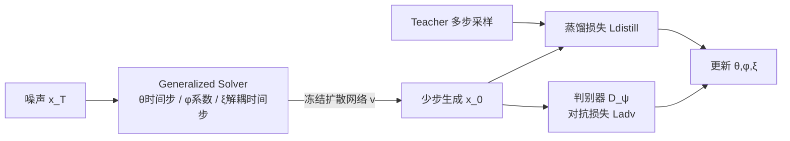

# GAS: Improving Discretization of Diffusion ODEs via Generalized Adversarial Solver

**会议**: ICLR 2026  
**OpenReview**: [https://openreview.net/forum?id=R1l46h8kyM](https://openreview.net/forum?id=R1l46h8kyM)  
**代码**: [https://github.com/3145tttt/GAS](https://github.com/3145tttt/GAS)  
**领域**: 图像生成 / 扩散模型加速  
**关键词**: 扩散 ODE 求解器, 求解器蒸馏, 时间步学习, 对抗训练, 少步采样  

## 一句话总结
本文提出 **Generalized Adversarial Solver (GAS)**：用一个无需训练技巧的"广义求解器"参数化（在理论求解器系数上学加性修正 + 把全部历史点也纳入线性多步签名），再叠加对抗损失，在 4~10 步少步采样下把扩散模型的 FID 系统性压到现有 solver 蒸馏方法之下。

## 研究背景与动机
- **领域现状**：扩散模型生成质量 SOTA，但采样要几十次函数评估（NFE）很慢。加速路线分两类——重训蒸馏出少步学生（质量好但显存/算力极重），以及推理时方法（设计专用 solver、缓存、量化）。后者更轻量，其中"训练 student 求解器去对齐 teacher"的范式（LD3、S4S 等）能直接优化时间步和 solver 系数，是当前最具性价比的方向。
- **现有痛点**：已有的可学习求解器方法存在一堆"训练副作用"——损失尺度不稳定（GITS/DMN 系）、参数空间受限（Tong et al. LD3）、把参数子集解耦训练（S4S Frankel et al.）。这些都让训练方案变得复杂且脆弱。更关键的是，单纯把 solver 蒸馏进一个参数极少的 student，**难以保留细粒度细节**，还会在低 NFE 时引入伪影。
- **核心矛盾**：想要"参数足够表达细节"和"训练简单稳定、不靠 trick"难以兼得；纯回归式蒸馏损失对细节和伪影也力不从心。
- **本文目标**：设计一个简单但表达力更强的求解器参数化，配上能修复伪影、增强细节的损失，在相同算力预算下超过现有 solver/timestep 训练方法。
- **核心 idea**（**广义求解器 + 理论引导 + 对抗损失**）：把线性多步 solver 的签名扩展为"对所有历史点与历史速度做加权和"，并不直接学系数、而是**在一个强基线求解器（DPM-Solver++(3M)）的理论系数上学加性修正**；再把蒸馏损失与对抗损失结合，专门补回细节、压掉伪影。

## 方法详解

### 整体框架
GAS 冻结预训练扩散模型，只训练一个轻量的"student 采样器"。student 用**广义求解器（GS）**签名做每一步：当前点、所有历史点、所有历史速度的加权和；权重由三组参数 $(\theta,\phi,\xi)$ 决定——$\theta$ 控时间步表、$\phi$ 控 solver 系数（在理论系数上加修正）、$\xi$ 控喂给网络的解耦时间步。训练同时用**蒸馏损失**（对齐 teacher 的多步高质量输出）与**对抗损失**（判别器逼真度），最终得到 GAS。

### 关键设计

**1. 广义求解器签名：放开阶数、纳入全部历史点**——传统线性多步 solver 的步进只用最近 $K$ 步的速度，签名为 $x_{n+1}=a_n x_n+\sum_{j=\max(n-K+1,0)}^{n} c_{j,n}\,v(x_j,t_j)$。本文观察到：NFE 越低、步数越少，可用参数本就不多，与其受限不如放开。于是把签名扩展成对**所有**历史点和速度求加权和，并去掉阶数限制：$x_{n+1}=\sum_{j=0}^{n} a_{j,n}\,x_j+\sum_{j=0}^{n} c_{j,n}\,v(x_j,t_j)$。额外把历史点 $x_j$ 显式加进来（理论上点可由速度线性组合表示，这里故意"过参数化"以简化训练）。这一步让 student 的容量随采样步数自然增长，正好补上"参数太少留不住细节"的短板。

**2. 在理论系数上学加性修正（theoretical guidance）**——不直接令 $a_{j,n},c_{j,n}$ 为可学标量，而是拿 DPM-Solver++(3M) 这样的强 solver 当"时间相关的理论引导"，只学**加性修正**。对当前点系数 $a_{n,n}(\theta,\phi)=a_{n,n}(t^\theta_{n:n+1})+\hat a_{n,n}(\phi)$（理论项 + 可学项），历史点系数 $a_{j,n}=\hat a_{j,n}(\phi)$；对最近 $K$ 步内的速度，理论上是有限差分逼近高阶导数的加权和 $\sum_{j=0}^{K-1}[\tilde c_{j,n}(t^\theta_{j:n+1})+\hat c_{j,n}(\phi)]\sum_{i=n-j}^{n}\omega_{i,n}v(x_i,t^\theta_i)$，对更"老"的速度则纯学 $\hat c_{j,n}(\phi)$。所有修正**初始化为零**，于是起步时 solver 就等价于强理论基线，即便时间步突变也不至于崩——保证收敛又稳定（消融见 Table 5：去掉理论引导后 NFE=6 的 FID 从 4.49 暴涨到 10.53）。

**3. 三组参数解耦的时间步设计**——$\theta$ 通过"折棍"式累乘把 logits 变成时间步 $t^\theta_n=(T-\delta)\prod_{j=1}^{n}\sigma(\theta_j)+\delta$，天然保证单调递减且落在合法区间；$\xi$ 则给"喂进网络做预测的时间步"再加一个解耦修正 $t^\theta_j+\xi_j$（沿用 LD3/S4S 思路）。与 S4S 把参数子集解耦分阶段训练不同，GS 把时间步、系数修正、解耦时间步**统一在一个签名里联合优化**，避免了解耦训练带来的不稳定。

**4. 叠加对抗损失补细节、除伪影（GS→GAS）**——把"solver 蒸馏"重新理解为一个**成对翻译/逐样本映射学习**问题：正如 pix2pix、SRGAN 发现回归损失加对抗损失能显著提质，本文在蒸馏损失（pixel 空间用 LPIPS、latent 空间用 L1）之外加判别器 $D_\psi$，做 min-max 训练 $\min_{\theta,\phi,\xi}\max_\psi L_{\text{distill}}+L_{\text{adv}}$。采用 R3GAN 的相对论损失 $f(t)=-\log(1+e^{-t})$ 加梯度惩罚稳定训练，且 teacher 与 student 用不同初始噪声采样。对抗项专门在"回归变难"的低 NFE 区压掉伪影、补回细粒度细节（Table 6：ImageNet NFE=4，GS 7.87 → GAS 传统 GAN 6.49 → 相对论 GAN 5.38）。

## 实验关键数据

### 主实验表格
6 个数据集（CIFAR10 32², AFHQv2/FFHQ 64², LSUN Bedroom/ImageNet 256², MS-COCO 512² + Stable Diffusion），FID（50k 样本），对比 training-free solver 与 solver 优化方法：

| 数据集 (NFE) | UniPC | iPNDM[GITS] | Best LD3 | S4S Alt | GS (本文) | GAS (本文) | Teacher |
|---|---|---|---|---|---|---|---|
| CIFAR10 (4) | 43.92 | 15.63 | 9.31 | 6.35 | 4.41 | **4.05** | 2.03 |
| CIFAR10 (6) | 13.12 | 6.82 | 3.35 | 2.67 | 2.55 | **2.49** | 2.03 |
| FFHQ (4) | 53.25 | 18.05 | 17.96 | 10.63 | 10.70 | **7.86** | 2.60 |
| FFHQ (6) | 11.24 | 9.38 | 5.97 | 4.62 | 4.49 | **3.79** | 2.60 |
| AFHQv2 (4) | — | — | — | — | — | **4.48** | — |
| ImageNet 256² (4) | — | — | — | — | 7.87 | **5.38** | — |
| LSUN Bedroom (5) | — | — | — | — | — | **4.60** | — |
| MS-COCO (4) | — | — | — | — | — | **14.71** | — |

GAS 在所有数据集所有 NFE 上全面超越此前方法，低 NFE 提升尤为明显。

### 消融实验表格

| 消融项 | 设置 | 结果 |
|---|---|---|
| 参数化 vs S4S (CIFAR10, NFE=4) | S4S 31.44 → 本文 **4.39**（LPIPS 0.273→0.116） | 参数化更优、训练更稳 |
| 参数化 vs S4S (FFHQ, NFE=4) | S4S 24.24 → 本文 **10.79** | 同上 |
| 理论引导 (FFHQ, NFE=6) | w/o theory 10.53 → w/ theory **4.49** | 理论引导贡献巨大 |
| 理论引导 (FFHQ, NFE=4) | w/o theory 15.23 → w/ theory **10.70** | 同上 |
| 对抗损失 (ImageNet, NFE=4) | GS 7.87 → 传统 GAN 6.49 → 相对论 GAN **5.38** | GAN 损失稳定提质 |

### 关键发现
- **理论引导是稳定与收敛的关键**：把可学修正初始化为零、让 solver 起步即等价于 DPM-Solver++(3M)，时间步突变时也不崩；去掉它 FID 在所有 NFE 显著恶化。
- **广义参数化训练更稳更快**：LPIPS 评估曲线（Fig.3）显示本文参数化比 S4S 训练过程更平滑、更稳定，复现了 S4S 自身报告的训练不稳定问题。
- **对抗损失专治低 NFE 伪影**：在回归任务最难的少步区，对抗项明显去伪影、补细节；代价是需要更多训练迭代才收敛，但换来更低 FID。

## 亮点与洞察
- **"在强先验上学修正"而非从零学**：把成熟数值求解器的理论系数当 backbone、只学加性 delta 并零初始化，是一个简单却极有效的稳定化技巧——既享受理论收敛性，又获得数据驱动的灵活度。
- **把 solver 蒸馏重构为成对图像翻译**：这个视角解释了为什么对抗损失能补回纯回归损失留不住的高频细节，给"少步采样质量为何会糊"提供了直觉。
- **少步即少参，反而该放开容量**：与"限制参数空间"的主流做法相反，本文论证 NFE 越低越应放开阶数、纳入全部历史，让 student 容量随步数自然增长。
- **方法朴素、无训练 trick**：不需要 S4S 式的参数解耦分阶段训练，统一联合优化即可，工程上更友好。

## 局限与展望
- **需对整个 solver 推理做反向传播**：在更大图像/更大模型上有可扩展性隐忧（显存随步数与分辨率增长）。
- **每个目标 NFE 可能要单独训练**：GS/GAS 是否需要为每个偏好的推理 NFE 分别训练仍是开放问题，作者把"轻量化、跨 NFE 通用"的改进留给未来工作。
- **极低 NFE（1~2 步）表现受限**：可学参数太少，在 NFE=1/2 时质量不如重训蒸馏方法。
- **扩散主干冻结**：好处是更好保留原模型生成能力，但也意味着上限受限于 teacher。

## 相关工作与启发
- **可学求解器/时间步蒸馏**：LD3（Tong et al. 2024）、S4S（Frankel et al. 2025）、GITS、DMN——本文在参数化（Table 1 对比）与训练稳定性上系统性改进了这条线。
- **专用 ODE 求解器**：DDIM、DPM-Solver(++)、DEIS、UniPC——本文不替代它们，而是把 DPM-Solver++(3M) 当理论引导 backbone 复用。
- **对抗蒸馏**：ADD/SDXL-Turbo、DMD、UFOGen 等把 GAN 损失用于扩散蒸馏；本文把同样思路引入"求解器蒸馏"这一更轻量的设定，并采用 R3GAN 相对论损失。
- **启发**：当一个数据驱动模块有强解析先验可用时，"学残差/学修正 + 零初始化"往往比从头学更稳；而对抗损失是补回回归损失丢失高频信息的通用利器。

## 评分
- **新颖性**: ⭐⭐⭐⭐ — 广义签名（全历史点 + 放开阶数）、理论系数加性修正、solver 蒸馏 + 对抗损失的组合都很自然，单点都不算颠覆但合在一起形成了简单有效的新方案。
- **实验充分度**: ⭐⭐⭐⭐ — 覆盖 6 个数据集、像素/潜空间/文生图，主实验 + 参数化/理论引导/对抗损失三组消融齐全，对比 baseline 充分。
- **写作质量**: ⭐⭐⭐⭐ — 动机清晰、Table 1 直观对比参数化、公式推导完整；符号偏密集，方法节阅读门槛略高。
- **价值**: ⭐⭐⭐⭐ — 在轻量、不重训扩散主干的前提下把少步采样质量推到接近 teacher，对资源受限场景实用价值高，代码开源。

<!-- RELATED:START -->

## 相关论文

- [\[ICLR 2026\] Dual-Solver: A Generalized ODE Solver for Diffusion Models with Dual Prediction](dual-solver_a_generalized_ode_solver_for_diffusion_models_with_dual_prediction.md)
- [\[ICLR 2026\] Scalable Energy-Based Models via Adversarial Training: Unifying Discrimination and Generation](scalable_energy-based_models_via_adversarial_training_unifying_discrimination_an.md)
- [\[ICML 2026\] Mitigating the Contractivity Trap in Diffusion ODEs via Stein Stabilization](../../ICML2026/image_generation/mitigating_the_contractivity_trap_in_diffusion_odes_via_stein_stabilization.md)
- [\[ICLR 2026\] LVTINO: LAtent Video consisTency INverse sOlver for High Definition Video Restoration](lvtino_latent_video_consistency_inverse_solver_for_high_definition_video_restora.md)
- [\[ICLR 2026\] Steer Away From Mode Collisions: Improving Composition In Diffusion Models](steer_away_from_mode_collisions_improving_composition_in_diffusion_models.md)

<!-- RELATED:END -->
