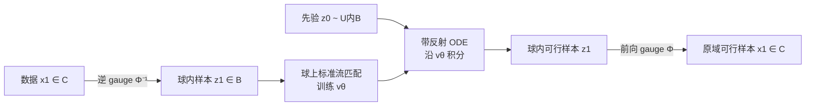

# Gauge Flow Matching: Efficient Constrained Generative Modeling over General Convex Set and Beyond

**会议**: ICLR 2026  
**OpenReview**: [https://openreview.net/forum?id=vxq1OnaAMq](https://openreview.net/forum?id=vxq1OnaAMq)  
**代码**: 待确认  
**领域**: 生成模型 / 约束生成  
**关键词**: 约束生成建模, 流匹配, gauge mapping, 反射采样, 可行性保证  

## 一句话总结
本文提出 Gauge Flow Matching（GFM），用一个显式双射的 gauge 映射把任意紧凸集上的约束生成问题等价转换到单位球上，使得在球内做低复杂度的反射/投影即可严格保证可行性，再映回原空间，从而以接近普通流匹配的开销实现「100% 约束满足 + 高质量 + 高速度」，并进一步推广到星凸、测地凸等非凸集合。

## 研究背景与动机
**领域现状**：扩散与流匹配模型在图像合成、机器人轨迹规划、科学模拟等领域取得了巨大成功，但许多真实场景要求生成样本严格满足问题特定的约束——蛋白质结构约束、图像水印精确放置、机器人关节限位与避障、物理定律一致性等。这些约束不是可选项，而是样本「有意义且可用」的前提。

**现有痛点**：现有约束生成方法（见原文 Table 1）各有硬伤。反射类方法（RDM/RSB/RFM）在边界定位与反射计算上开销巨大，且要求初始分布的支撑集就落在目标集 $C$ 内——而从一般凸集（哪怕均匀分布）采样本身就极其昂贵；引导/投影类方法对一般集合做精确投影代价高，近似版本又缺乏误差分析与可行性保证；镜像映射（mirror map）类方法只对球、单纯形等简单凸集有闭式解，且会把近边界样本映到无穷远，给变换后的生成建模带来理论与实践困难。

**核心矛盾**：在「约束适用范围广」「严格可行性保证」「低生成复杂度」「分布逼近误差可控」这四点上，已有方法无法同时兼顾——要么只能处理盒约束/单纯形这类特例，要么为了可行性付出数倍乃至上百倍的推理时间。

**本文目标**：构建一个对一般紧集（凸或非凸）都适用、可证严格可行、复杂度与普通流匹配相当、且分布逼近误差有界的约束生成框架。

**核心 idea**：**用双射把"难约束空间"换成"易约束空间"**——不去硬碰一般凸集，而是借助 gauge（Minkowski）映射在任意紧凸集与单位球之间建立双 Lipschitz 同胚，把约束生成搬到单位球上完成（球内采样、反射都是闭式 $O(n)$ 操作），最后再用闭式逆映射搬回原域，可行性由映射的双射性天然继承。

## 方法详解

### 整体框架
GFM 把约束生成拆成「映射—建模—生成—映回」四步：训练时把数据样本 $x_1$ 经逆 gauge 映射 $\Phi^{-1}$ 送到单位球 $B$ 上，在球上跑标准流匹配学习速度场 $v_\theta$；生成时从球内先验（如均匀分布）出发，用带反射项的 ODE 求解器在球内积分得到 $z_1$，再经前向 gauge 映射 $\Phi$ 映回原凸集 $C$ 输出严格可行的 $x_1$。

### 关键设计

**1. 广义 gauge 映射：把任意凸集"拉直"成单位球。** 核心工具是 Minkowski 规度函数 $\gamma_C(x, x^\circ) = \inf\{\lambda \ge 0 \mid x \in \lambda(C - x^\circ)\}$，它衡量从内点 $x^\circ$ 出发把点 $x$ 推到边界需要缩放多少。基于它定义球 $B$ 与凸集 $C$ 之间的双射：

$$\Phi(z) = \frac{\|z\|_p}{\gamma_C(z, x^\circ)} z + x^\circ, \qquad \Phi^{-1}(x) = \frac{\gamma_C(x - x^\circ, x^\circ)}{\|x - x^\circ\|_p}(x - x^\circ)$$

直观上 $\Phi$ 先把单位球平移到内点 $x^\circ$，再沿每条径向方向缩放，使球面对齐到凸集边界，所有水平集一一对应。相比 Tabas & Zhang 只在多面体与立方体间构造的版本，本文把它推广到任意一对紧凸集，并给出高效计算：$\gamma_C$ 对线性/二次/锥约束有闭式表达，一般凸约束用二分法线性收敛求解；内点 $x^\circ$ 离线解一次凸可行性问题即可复用。

**2. 双 Lipschitz 性质与"中心"内点选择：让变换不破坏分布。** 双射好用的前提是它别把分布扭曲到无法建模。论文证明（Prop. 4.1）gauge 映射的前向、逆向 Lipschitz 常数被内、外半径 $r_i, r_o$ 控制：$L_\Phi \le 2 r_o + r_o^2/r_i$，$L_{\Phi^{-1}} \le 2/r_i$。当内点贴近边界（$r_i \to 0$）时常数爆炸、分布严重畸变；因此实践中通过约束残差最小化（一次线性优化）求一个 $r_o$ 接近 $r_i$ 的「中心」内点，把双 Lipschitz 常数压到最小。这一有界性正是后续保证变换后分布仍满足正则条件、以及逼近误差可控的基石。

**3. 球上闭式反射 + 映回的严格可行性：复杂度逼近普通 FM。** 在单位球上做约束远比一般凸集容易：先验可以直接均匀采样，生成时只需在球内积分并在碰到球面时加一个反射项 $z_1 = z_0 + \int_0^1 (v_\theta(z_t,t)\,dt + dL_t)$，该反射有闭式表达、复杂度仅 $O(n)$ 且可批量计算，远小于神经网络前向的 $O(n^2)$。由于 $\Phi$ 是 $B \to C$ 的双射，球内可行样本映回后必然落在 $C$ 内，可行性是「构造性」的而非近似的。整体生成复杂度为 $O(\text{NFE} \cdot n^2 + m \cdot \mathcal{C})$，与普通流匹配同阶，$m$ 为约束数、$\mathcal{C}$ 为单约束 gauge 计算代价（线性约束 $O(n)$、二次约束 $O(n^2)$ 等）。

**4. 向非凸集的推广：星凸与测地凸。** gauge 原理不止用于凸集。对**星凸集**（存在一个内点能"看到"整个边界，如 $\ell_{0.5}$-范数球），规度函数与到单位球的双射可从凸情形自然延拓；对**测地凸集**（黎曼流形上任意两点测地线唯一且整段在集内），利用指数映射在内点处提供局部微分同胚，在切空间中构造 gauge 映射。两种推广都继承了凸情形的计算优势。

## 实验关键数据
评测指标包括可行性比例（10,000 个样本满足约束的百分比）、分布逼近误差（MMD）、每轮训练时间、批量推理时间。

### 主实验表格

凸集（关节线性+二次约束，机器人臂构型）：

| 方法 | 可行性(%) | MMD↓(×10⁻³) | 训练(s) | 推理(s) |
|------|-----------|-------------|---------|---------|
| DDPM | 95.0 | 4.79 | 0.17 | 0.59 |
| FM | 95.9 | 8.57 | 0.18 | 0.29 |
| Reflection | 100 | 25.9 | 6.40 | 14.0 |
| Metropolis | 100 | 130 | 6.40 | 6.12 |
| Projection | 100 | 93.5 | 6.40 | 7.12 |
| **GFM** | **100** | **3.50** | **0.18** | **0.63** |

星凸集：

| 方法 | 可行性(%) | MMD↓(×10⁻³) | 训练(s) | 推理(s) |
|------|-----------|-------------|---------|---------|
| FM | 93.4 | 4.92 | 0.22 | 0.39 |
| Reflection | 100 | 7.96 | 5.58 | 12.4 |
| Projection | 100 | 7.89 | 5.58 | 347 |
| **GFM** | **100** | **5.01** | **0.22** | **0.74** |

### 消融 / 跨任务实验表格

约束图像生成（CIFAR-10 水印嵌入，多面体约束，U-Net 34M）：

| 方法 | FID(50K)↓ | 可行性(%)↑ | 训练/轮(s)↓ | 推理 5K 图(s)↓ |
|------|-----------|------------|-------------|----------------|
| FM | 3.57 | 76.66 | 76.7 | 155.2 |
| Projection | 6.88 | 100 | 100.4 | 556.6 |
| Reflection | 6.06 | 100 | 101.3 | 183.9 |
| **GFM** | **5.85** | **100** | **81.2** | **167.6** |

约束时间序列（PEMS-BAY 交通流，二阶锥约束）：GFM 100% 可行 vs 普通 FM 88.5%；投影虽达 100% 但推理从 0.31s 暴增到 49.7s（慢 160×），GFM 仅 0.43s，且 KS 统计量 0.35（p=0.42）分布质量最优。

高维组合优化松弛（$n=10000$，PSD 锥+线性约束）：FM/DDPM 在 $n=50\times50$、$100\times100$ 上可行性全为 0，GFM 始终 100%，MMD 与标准 FM 持平。

### 关键发现
- **可行性 vs 速度的双赢**：普通 DM/FM 可行性只有 ~88–96%，而反射/投影虽能 100% 可行却带来数倍到上百倍的训练/推理开销；GFM 同时拿到 100% 可行与逼近普通 FM 的速度。
- **分布质量不打折**：得益于双 Lipschitz 有界性，GFM 的 MMD/FID/KS 普遍优于其他约束方法，常常接近甚至好于无约束的 FM。
- **维度与几何的鲁棒性**：在 $n=10000$ 的 PSD 锥约束上普通模型完全失效（可行性 0），GFM 仍 100% 可行，且对星凸、测地凸等非凸集合同样有效。

## 亮点与洞察
- **"换坐标系"的优雅**：约束生成的难点全在"约束集形状复杂"，GFM 用一个显式可逆映射把复杂形状一次性归约到单位球这个最规整的集合上，反射/采样瞬间变简单，可行性由双射构造性保证而非事后修补。
- **闭式 + 离线预计算**：gauge 函数对常见约束有闭式、一般凸约束二分法线性收敛，内点离线求一次复用，使得额外开销相比 NN 前向几乎可忽略。
- **理论与工程闭环**：双 Lipschitz 界既解释了为何选「中心」内点能减小分布畸变，又直接给出 Wasserstein 误差界 $W_2 \le L_\Phi e^{1/2+L_\theta}\epsilon_\theta$，把工程选择（内点位置）与理论保证连成一条线。

## 局限与展望
- **依赖内点与 gauge 可计算性**：方法要求能高效求得"中心"内点并计算 gauge 函数；对极端病态、内部极薄的约束集，$r_i$ 很小会放大 Lipschitz 常数、损害分布质量。
- **一般凸约束的二分开销**：当约束没有闭式 gauge 时需逐点二分，虽线性收敛但对约束数 $m$ 很大、单约束评估昂贵的场景仍有成本。
- **非凸推广的范围**：目前只覆盖星凸与测地凸两类"良性"非凸集，更一般的非凸/多连通约束尚未涵盖；如何在保持双射与可行性保证的前提下进一步放宽几何假设是自然的下一步。

## 相关工作与启发
- **反射/投影类约束生成**（RDM、RSB、RFM、Metropolis、Projection）：GFM 的对照组，揭示了"在原域直接做约束"的高开销与对先验支撑集的苛刻要求。
- **镜像映射类**（MDM、MFM）：同样用双射思路，但只对简单凸集闭式且会把近边界点映到无穷；GFM 的有界双 Lipschitz 正是针对这一痛点。
- **bi-Lipschitz 同胚与正则性分析**（Wan et al. 2024 等）：为变换后分布保持正则、误差有界提供理论支撑。
- **启发**：当一个生成/优化问题受困于"定义域形状复杂"时，寻找一个到规整集合的显式双射、并控制其 Lipschitz 性质，往往比在原域硬做约束更省、更可证。

## 评分
- **新颖性**: ⭐⭐⭐⭐ 把控制论中的 gauge/Minkowski 映射系统性引入约束生成，并推广到任意紧凸集及星凸/测地凸，思路简洁而有力。
- **实验充分度**: ⭐⭐⭐⭐ 覆盖合成数据、机器人、交通时序、CIFAR-10 水印、$n=10000$ 组合优化等多任务多约束类型，对照充分。
- **写作质量**: ⭐⭐⭐⭐ 框架清晰、命题与算法配套、图表直观，理论与实验衔接好。
- **价值**: ⭐⭐⭐⭐ 为物理约束、安全关键、水印等需要严格可行性的生成场景提供了实用且可证的通用框架。

<!-- RELATED:START -->

## 相关论文

- [\[ICLR 2026\] Mirror Flow Matching with Heavy-Tailed Priors for Generative Modeling on Convex Domains](mirror_flow_matching_with_heavy-tailed_priors_for_generative_modeling_on_convex_.md)
- [\[ICLR 2026\] LapFlow: Laplacian Multi-scale Flow Matching for Generative Modeling](lapflow_laplacian_multi-scale_flow_matching_for_generative_modeling.md)
- [\[ICLR 2026\] Flow Along the $K$-Amplitude for Generative Modeling](flow_along_the_k-amplitude_for_generative_modeling.md)
- [\[ICLR 2026\] FastFlow: Accelerating The Generative Flow Matching Models with Bandit Inference](fastflow_accelerating_the_generative_flow_matching_models_with_bandit_inference.md)
- [\[ICLR 2026\] Delay Flow Matching](delay_flow_matching.md)

<!-- RELATED:END -->
