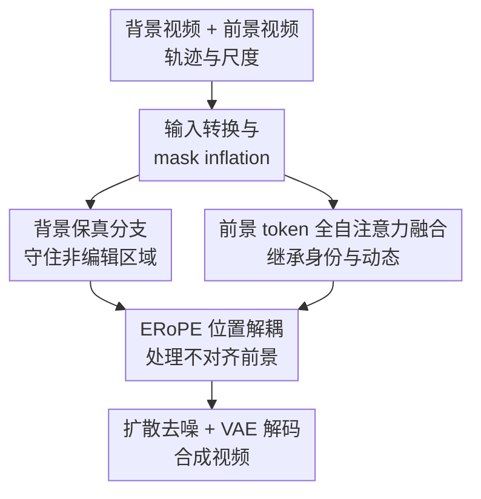

# GenCompositor: Generative Video Compositing with Diffusion Transformer

**会议**: ICLR2026  
**OpenReview**: [https://openreview.net/forum?id=ynim5u2N4i](https://openreview.net/forum?id=ynim5u2N4i)  
**论文**: [Project Page](https://gencompositor.github.io/)  
**代码**: 待开源  
**领域**: 扩散模型 / 视频生成 / 视频编辑  
**关键词**: 生成式视频合成, Diffusion Transformer, 视频编辑, ERoPE, 轨迹控制  

## 一句话总结
GenCompositor 提出“生成式视频合成”任务，用一个专门设计的 DiT 管线把外部前景视频按用户指定轨迹和尺度注入背景视频，在保持背景一致性的同时继承前景的身份与动态，并在视频调和、轨迹控制和消融实验中都明显优于可替代方案。

## 研究背景与动机
**领域现状**：视频编辑和视频生成已经能做文本驱动编辑、图像条件生成、轨迹控制和视频 inpainting，但真正的视频制作流程里，经常需要把一段真实拍摄的动态素材合成到另一段视频里。传统 compositing 依赖人工抠像、遮罩、调色、运动匹配和特效师协作；生成模型如果能直接接管这一步，就可以把“拿一段素材放进另一段视频”变成可交互的视频生成任务。

**现有痛点**：已有方法各自只覆盖了问题的一部分。轨迹控制视频生成方法通常依赖文本或首帧图像，只能大致生成“像某个物体”的结果，很难精确继承外部视频里的身份、纹理和动作细节；视频调和方法则通常先逐帧粘贴前景，再调整 RGB 风格，要求前景 mask 非常准确，也不能自由改变物体的大小和运动轨迹。对真实 compositing 来说，用户希望给一个前景视频、一个背景视频和一条路径，模型自动生成能贴合环境、能投影阴影或产生光照影响的结果，这超出了单纯调色或单纯轨迹生成的能力边界。

**核心矛盾**：这个任务同时要求“背景不乱”和“前景可变”。背景视频和最终结果是 layout-aligned，非编辑区域应该尽量一模一样；但前景视频通常是另一个坐标系里的居中素材，和目标背景并不逐像素对齐。若把两者当成同一空间位置来融合，会把前景形状泄漏到错误位置；若只用 cross-attention 注入高层语义，又会丢掉视频素材的低层纹理和动作。

**本文目标**：作者把生成式视频合成定义为：输入背景视频 $v_b$、前景视频 $v_f$ 和用户控制 $c$，输出合成视频 $z_0$。其中用户控制包括目标轨迹和尺度，模型需要在指定位置生成前景元素，保留其身份和运动，维持背景一致，并让局部光照、阴影、边界和遮挡更自然。

**切入角度**：论文的观察是，视频合成不是普通的文本到视频，也不是普通的 paste-and-harmonize。它需要区分两类条件：背景、mask、masked video 与目标结果共享坐标；前景视频则带有不对齐的动态条件。因此作者围绕 DiT 的 token 表示重新设计条件注入方式，而不是把所有输入简单拼成一张图或依赖语义 cross-attention。

**核心 idea**：用背景保真分支守住非编辑区域，用前景 token 的全自注意力融合继承外部视频细节，再用 ERoPE 给不对齐前景 token 独立位置标签，从而让动态素材能按用户轨迹生成式地融入背景视频。

## 方法详解

### 整体框架
GenCompositor 的输入是背景视频、前景视频，以及用户给定的轨迹和尺度。系统先把用户控制转成一段 mask video 和 masked background video：mask 指定前景应该出现的时空区域，masked background 则把待编辑区域挖空后保留背景上下文；随后，一个轻量背景保真分支把非编辑区域信息注入主干，前景生成主干通过 DiT fusion block 把噪声 token 与前景 token 放在同一 self-attention 里融合，最终只解码噪声 token 对应的部分得到合成视频。

这个流程的关键不是“把前景贴上去”，而是让模型在 mask 指定的区域重新生成前景与局部环境。这样一来，模型既可以继承前景视频的身份和动态，也可以在边界、阴影、光照、爆炸影响等位置生成与背景更协调的变化。

### 关键设计
**1. 输入转换与 mask inflation：把交互控制变成可学习的生成约束**

用户输入的轨迹和尺度本身不是神经网络容易直接使用的条件。GenCompositor 先把轨迹曲线和尺度因子转成每帧二值 mask $M_t$，再构造 masked video $X_t=(1-M_t)\odot v_{b,t}$。如果用户只点击一个点，系统会用光流跟踪该点在后续帧中的运动，近似得到一条轨迹；如果用户给定尺度，则根据前景的 Grounded SAM2 mask 调整目标区域大小，并把它放到指定轨迹上。这样，用户控制最终被编码成 $(M, X)$，而不是额外的文本提示。

更重要的是，作者没有直接使用硬边界 mask，而是用高斯滤波和阈值做 mask inflation：$\tilde{M}_t=G_\sigma * M^{bin}_t$，$M_t=1[\tilde{M}_t>\tau]$。这个膨胀区域给模型留出了一圈可编辑缓冲带，使它不只能改物体内部，也能改边缘附近的背景像素。对视频合成来说，这个缓冲带很关键：阴影、辉光、运动模糊、爆炸影响和 mask 不准造成的边界误差都发生在物体附近，而不是严格落在原始前景轮廓内。

**2. 背景保真分支：只把非编辑背景 token 注入主干**

视频合成的第一条底线是背景不要被无意义改写。论文设计了 Background Preservation Branch（BPBranch）：它接收 mask video 和 masked video，把二者在通道维拼接后经过两个普通 DiT block，对齐到主干 latent 空间。由于 mask 和 masked video 与最终结果共享坐标，作者对它们使用相同 RoPE，让网络明确知道哪些背景位置应该被保留、哪些区域是待生成区域。

BPBranch 的注入方式也很克制。它不是把整段背景特征直接加进主干，而是用 masked token injection：$z_t=z_t+(1-M)\odot z_{BPBranch}$。也就是说，背景分支主要影响非编辑区域，编辑区域仍交给前景生成主干和扩散去噪来生成。这避免了两个极端：如果完全没有背景分支，主干要同时学习背景复原和前景合成，训练更难；如果背景分支不加遮罩地强行注入，又可能压制前景区域的生成自由度。

**3. 前景 token 全自注意力融合：不用 cross-attention 丢掉低层动态细节**

前景视频提供的不是一个语义标签，而是一段有身份、纹理、姿态和运动节奏的动态素材。传统 cross-attention 擅长注入文本、姿态、相机这类较抽象条件，但在这里容易只学到“有火焰”“有蝴蝶”这样的语义，而不能稳定继承前景的具体外观和动作。论文的消融也显示，去掉 DiT fusion block、改用 cross-attention 后，模型能生成语义相关的内容，却不能 faithful 地注入前景元素。

因此 GenCompositor 把待去噪 latent token 和前景视频 token 沿 token 维拼接，送入 DiT fusion block 做 full self-attention。这种做法让前景 token 与目标视频 token 在注意力里直接互相读取，低层纹理和动作信息可以穿过 Transformer 层逐步影响待生成区域。作者特别避免了通道维拼接，因为前景和目标结果并不对齐，粗暴按通道叠在同一 spatial cell 会导致严重内容干扰甚至训练崩溃。最后模型只解码对应 noisy token 的那一部分，前景 token 作为条件参与计算但不直接成为输出。

**4. ERoPE：给 layout-unaligned 前景视频独立位置标签**

RoPE 默认所有 token 处在同一个时空网格里，注意力分数依赖相对位置 $p-q$。这对背景、mask、masked video 是合理的，因为它们和目标结果对齐；但对前景视频不合理，因为前景素材通常被居中裁出，其坐标并不等于目标背景中物体要出现的位置。若前景和背景共享同一套 RoPE，模型会误以为两个流的同位置 token 表示同一个物理位置，结果出现形状泄漏和位置干扰。

ERoPE 的做法很轻量：在标准 RoPE 的位置索引上加入 stream-specific shift。对来自流 $s\in\{BG, FG\}$ 的 token，旋转角从 $\theta_{p,k}=\omega_kp$ 变为 $\theta_{s,p,k}=\omega_k(p+\Delta_s)$。于是两个 token 的注意力关系取决于有效位置差 $(p+\Delta_s)-(q+\Delta_{s'})$，前景流和背景流不会在同一位置标签上碰撞。它不引入额外参数，也不阻止跨流 attention，只是告诉模型“这两个视频的坐标系不同”。附录中的 loss curve 表明，无论沿高度、宽度还是时间方向扩展，ERoPE 相比共享 RoPE 都能明显降低训练 loss。

### 一个完整示例
假设用户想把一段蝴蝶飞舞的视频放进一段花园背景视频。用户在背景首帧上拖出一条从左下到右上的曲线，并把尺度设为 $0.7$。系统先用 Grounded SAM2 得到蝴蝶在前景视频中的 mask，把蝴蝶居中前景转换成目标尺度，再沿用户轨迹生成一段 mask video；随后对 mask 做膨胀，使蝴蝶边界外也有一圈可编辑区域。

扩散生成时，BPBranch 从 masked garden video 中读取花园、树叶和天空等非编辑区域，并只在 $(1-M)$ 区域把这些背景 token 注入主干。前景生成主干则把蝴蝶视频 token 和待生成 token 一起做 self-attention，让模型继承蝴蝶翅膀的纹理和扇动节奏。ERoPE 负责避免“前景视频中心坐标”被误当成“背景中心坐标”。最后输出的不是逐帧粘贴，而是一段重新生成的视频：蝴蝶沿用户轨迹移动，边缘没有硬贴痕迹，光照和背景方向一致，必要时还会生成柔和阴影。

### 损失函数 / 训练策略
训练仍采用 latent diffusion 的噪声预测目标。给定真实合成视频 $z_0$，模型按噪声日程生成 $z_t=\sqrt{\bar{\alpha}_t}z_0+\sqrt{1-\bar{\alpha}_t}\epsilon$，再学习预测噪声：

$$
\min_\theta \mathbb{E}_{z_0,\epsilon,t}\|\epsilon-\epsilon_\theta(z_t\mid v_b,v_f,M,X,t)\|_2^2.
$$

实现上，模型参考 CogVideoX-I2V-5B 设计，复用 CogVideoX 的 VAE 和文本编码器权重，但训练新的 Transformer；训练时使用空文本，因此推理阶段的视频合成实际只依赖输入视频和用户控制。Transformer 约 6B 参数，包括 42 个 DiT fusion blocks，以及约 3.0 亿参数的背景保真分支。模型在 8 张 H20 GPU 上从头训练，推理生成 $480\times720$、49 帧视频约需 65 秒和 34GB 显存。

为了让模型学会适配前景与背景的光照差异，训练时还对前景视频做 luminance augmentation：用 gamma correction 随机改变前景亮度，$\gamma$ 从 $0.4$ 到 $1.9$ 采样。这样模型不能死记前景原始亮度，而必须根据背景上下文调整前景外观。这个增强只在训练中使用，推理时输入原始前景视频即可。

## 实验关键数据

### 主实验
论文没有同任务先例，因此作者从两个相邻方向比较：一是视频调和，检验模型能否把前景融入背景；二是轨迹控制视频生成，检验模型能否按用户轨迹生成并保持前景身份和运动。视频调和部分在 HYouTube 数据集上比较 Harmonizer 和 VideoTripletTransformer（VTT）；轨迹控制部分比较 Tora、Revideo 和 VACE，并用 40 组视频评估 VBench 相关指标、FVD 和 KVD。

| 任务 | 方法 | 代表指标 | 结果 | 结论 |
|------|------|----------|------|------|
| 视频调和 | Harmonizer | PSNR / SSIM / CLIP / LPIPS | 39.7558 / 0.9402 / 0.9614 / 0.0412 | 边界和风格仍有明显不协调 |
| 视频调和 | VTT | PSNR / SSIM / CLIP / LPIPS | 40.0251 / 0.9297 / 0.9564 / 0.0455 | 时空调和有效，但依赖准确粘贴输入 |
| 视频调和 | GenCompositor | PSNR / SSIM / CLIP / LPIPS | **42.0010 / 0.9487 / 0.9713 / 0.0385** | 四个指标全部最好 |
| 轨迹控制生成 | Tora | FVD / KVD | 1402.82 / 94.94 | 能跟轨迹，但身份和背景一致性较弱 |
| 轨迹控制生成 | Revideo | FVD / KVD | 1342.56 / 64.53 | 物体可能消失或时序不稳 |
| 轨迹控制生成 | VACE | FVD / KVD | 942.52 / 120.92 | 依赖首帧参考，动态细节不足 |
| 轨迹控制生成 | GenCompositor | FVD / KVD | **535.71 / 45.91** | 生成质量和动态继承最好 |

从 VBench 维度看，GenCompositor 在 Subject Consistency、Background Consistency、Motion Smoothness、Aesthetic Quality 上分别达到 89.75%、93.43%、98.69%、52.00%，均高于 Tora、Revideo 和 VACE。这个结果说明它的优势不是单一指标刷分，而是前景主体、背景保持、运动连贯和审美质量同时改善。

### 消融实验
消融实验围绕四个组件展开：去掉 DiT fusion block 改用 cross-attention，去掉 BPBranch，去掉 luminance augmentation，去掉 mask inflation。量化结果显示 full model 在视频调和指标和轨迹控制指标上全部最好。

| 配置 | PSNR ↑ | SSIM ↑ | LPIPS ↓ | Background ↑ | Motion ↑ | Aesthetic ↑ | 说明 |
|------|--------|--------|---------|--------------|----------|-------------|------|
| w/o fusion block | 19.8940 | 0.8015 | 0.1535 | 92.21% | 98.34% | 48.85% | cross-attention 无法稳定继承前景 ID 和动态 |
| w/o BPBranch | 40.0099 | 0.9378 | 0.0432 | 89.62% | 97.25% | 51.51% | 背景保持明显变弱，训练负担更重 |
| w/o augmentation | 39.8040 | 0.9295 | 0.0520 | 89.97% | 98.30% | 50.73% | 前景亮度与边界更容易不协调 |
| w/o mask inflation | 41.8553 | 0.9422 | 0.0409 | 91.62% | 98.28% | 50.87% | 只能改严格 mask 内部，边缘伪影更明显 |
| full model | **42.0010** | **0.9487** | **0.0385** | **93.43%** | **98.69%** | **52.00%** | 各组件协同最好 |

视觉消融也和表格一致：没有 fusion block 时模型能生成语义相关火焰，却不能 faithful 地注入原前景；没有 mask inflation 或 luminance augmentation 时，前景边界更容易出现锯齿或亮度割裂；没有 BPBranch 时背景看似自然，但目标元素与主视频的感知一致性下降。

### 关键发现
- DiT fusion block 是最核心的前景注入组件。它一旦被 cross-attention 替代，PSNR 从 42.0010 降到 19.8940，LPIPS 从 0.0385 恶化到 0.1535，说明低层动态视频条件不能只靠语义级 attention 传入。
- BPBranch 主要贡献背景一致性。去掉它后 Background Consistency 从 93.43% 降到 89.62%，也说明让主干同时承担背景复原和前景合成会增加学习难度。
- mask inflation 和 luminance augmentation 看似是训练技巧，但分别对应“边界可编辑”和“光照可适配”。它们对主指标提升不如 fusion block 极端，却直接影响真实合成观感。
- 用户研究支持量化结果：在视频调和任务中 71.58% 的偏好选择 GenCompositor；在轨迹控制生成中 77.37% 的偏好选择 GenCompositor。

## 亮点与洞察
- 这篇论文最有价值的地方是把“视频合成”从传统后期流程重新定义成一个生成任务。它不是在现有视频上做低层调色，也不是从文本生成新视频，而是让一段真实动态素材以用户可控的方式进入另一段视频。
- ERoPE 是一个很干净的设计。它没有引入新参数，只是在 RoPE 的位置索引上加 stream-specific shift，却正好击中了 layout-unaligned 条件融合的根本问题；这种思路可能迁移到多视角条件、参考视频驱动编辑、角色视频迁移等场景。
- full self-attention 融合前景 token 的判断很务实。视频素材条件的价值在低层细节和时序动态，而不是语义摘要；因此让前景 token 直接参与 DiT block 的 self-attention，比把它编码成抽象 condition 更符合任务本质。
- mask inflation 体现了生成式合成和传统粘贴的差异。传统方法害怕 mask 不准，GenCompositor 反而主动扩大可编辑区域，让模型有空间生成阴影、辉光、运动模糊和局部环境反应。
- VideoComp 数据集也很关键。作者从 409K 视频中构建 61K 组 source / foreground / mask 训练样本，并把前景居中以去掉原始全局轨迹，让模型真正学习“由用户 mask 控制目标轨迹”。

## 局限与展望
- 当前模型规模和推理成本较高。6B Transformer 生成 49 帧 $480\times720$ 视频需要约 65 秒和 34GB 显存，这对普通创作者工作流仍偏重。
- 光照适配主要依赖 gamma correction 增强。论文展示了极端明暗背景下的成功案例，但作者也承认复杂极端光照还不够鲁棒，未来可以用更丰富的物理光照或风格增强替代简单亮度扰动。
- 遮挡和 3D 关系仍是难点。GenCompositor 已能生成一些遮挡效果，但复杂环境中的深度顺序、物体穿插、视角变化和近大远小仍可能需要 depth-aware 或 3D prior。
- 论文主要评估单个前景元素，附录展示了多物体合成案例，但多元素之间的相互遮挡、碰撞和语义关系还没有系统量化。
- VideoComp 数据来源和模型权重在论文中承诺发布；在正式复现前，数据构建细节、筛选标准和训练成本仍会影响社区验证。

## 相关工作与启发
- **vs 视频调和方法**: Harmonizer、VTT 等方法通常接收已经粘贴好的前景和 mask，目标是调整颜色与时空一致性。GenCompositor 不要求用户先精确粘贴，而是从前景视频、背景视频和用户轨迹直接生成最终合成结果，能处理边界、阴影和局部环境变化。
- **vs 轨迹控制视频生成**: Tora、Revideo、VACE 等方法可以让生成物体沿轨迹运动，但常依赖文本或首帧图像条件，难以继承外部视频的完整身份与动态。GenCompositor 的条件是一段动态前景视频，因此更适合素材级 compositing。
- **vs cross-attention 条件注入**: IP-Adapter 类思路或视频编辑里的 cross-attention 更适合注入语义或参考图像信息。本文证明，对低层、密集、时序前景条件而言，token-wise self-attention 融合更可靠。
- **vs 视频 inpainting / object removal**: 附录显示，把前景条件换成 blank video 后，GenCompositor 可以自然退化成视频补全或目标移除。这提示生成式 compositing 可能是一个更一般的视频编辑基座任务。

## 评分
- 新颖性: ⭐⭐⭐⭐⭐ 首次系统定义生成式视频合成任务，并围绕 layout-aligned / layout-unaligned 条件设计了专门架构。
- 实验充分度: ⭐⭐⭐⭐☆ 主实验、消融、用户研究和附录案例较完整，但缺少同任务标准 benchmark，部分比较只能借相邻任务近似。
- 写作质量: ⭐⭐⭐⭐☆ 方法主线清晰，公式和图示足够支撑复现理解；少数实现细节仍依赖附录和代码发布。
- 价值: ⭐⭐⭐⭐⭐ 任务非常贴近真实视频制作，ERoPE、mask inflation、前景 token 融合等设计对后续可控视频编辑有较强复用价值。

<!-- RELATED:START -->

## 相关论文

- [\[ICLR 2026\] CreatiDesign: A Unified Multi-Conditional Diffusion Transformer for Creative Graphic Design](creatidesign_a_unified_multi-conditional_diffusion_transformer_for_creative_grap.md)
- [\[CVPR 2026\] DDT: Decoupled Diffusion Transformer](../../CVPR2026/image_generation/ddt_decoupled_diffusion_transformer.md)
- [\[ICLR 2026\] QVGen: Pushing the Limit of Quantized Video Generative Models](qvgen_pushing_the_limit_of_quantized_video_generative_models.md)
- [\[CVPR 2026\] STCDiT: Spatio-Temporally Consistent Diffusion Transformer for High-Quality Video Super-Resolution](../../CVPR2026/image_generation/stcdit_spatio-temporally_consistent_diffusion_transformer_for_high-quality_video.md)
- [\[ICLR 2026\] ColorCtrl: 基于多模态扩散 Transformer 的免训练文本引导颜色编辑](training-free_text-guided_color_editing_with_multi-modal_diffusion_transformer.md)

<!-- RELATED:END -->
