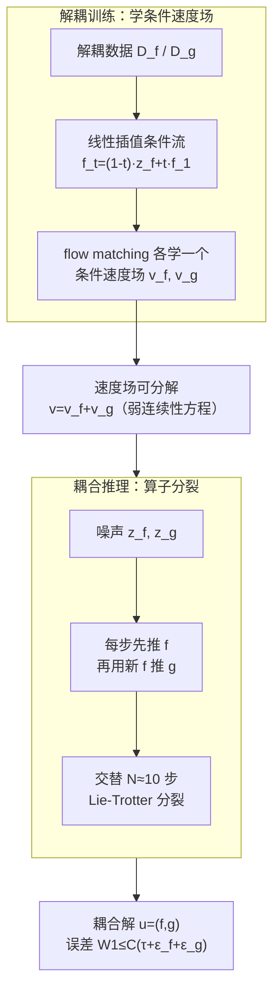

# GenCP: Towards Generative Modeling Paradigm of Coupled Physics

**会议**: ICLR 2026  
**arXiv**: [2601.19541](https://arxiv.org/abs/2601.19541)  
**代码**: [GitHub](https://github.com/AI4Science-WestlakeU/GenCP)  
**领域**: 生成式物理仿真 / 流匹配  
**关键词**: coupled physics simulation, flow matching, operator splitting, multiphysics, decoupled training

## 一句话总结

提出 GenCP，将耦合多物理场仿真建模为概率密度演化问题，利用 flow matching 从解耦数据学习条件速度场，推理时通过 Lie-Trotter 算子分裂合成耦合解，实现"解耦训练、耦合推理"，并提供理论误差可控保证。

## 研究背景与动机

**领域现状**：多物理场耦合仿真（如流固耦合 FSI、核热耦合）是工程应用的核心问题。数值方法分为紧耦合（高精度但计算成本极高）和松耦合（实用但收敛不稳定）两类。代理模型（surrogate）和神经算子虽能加速仿真，但大多依赖耦合解作为训练数据，数据获取成本极高（比解耦数据贵 5 倍以上）。

**现有痛点**：(1) 代理模型方法用 Gauss-Seidel/ADMM 迭代推理近似耦合解，但在复杂时空动力学下表现不佳（难以捕捉高频、高维和随机行为）；(2) 现有生成式方法要么仅处理单物理场，要么直接从耦合数据学习，忽视了从解耦数据学习耦合物理的挑战；(3) M2PDE 尝试在扩散模型每步嵌入耦合迭代，但缺乏理论保证。

**核心矛盾**：工程中获取耦合训练数据成本极高，但解耦数据容易获得。如何从解耦数据学习，在推理时生成高精度耦合解？

**本文目标**：开发一个框架，从解耦训练数据学习耦合物理，同时保证高保真度、高效率和高可靠性（"3H"）。

**切入角度**：将耦合物理仿真重新建模为函数空间中概率密度的演化。利用流匹配学习条件速度场（解耦训练），利用算子分裂在流步中合成耦合推理。通过连续性方程的弱形式和 Lie-Trotter 分裂建立理论基础。

**核心 idea**：在概率空间中用算子分裂将解耦学到的条件流合成为耦合推理，物理上等价于在噪声潜在空间中迭代求解耦合场。

## 方法详解

### 整体框架

GenCP 把"耦合物理仿真"重新看成函数空间里一团概率测度从噪声向真解的传输问题，分训练、推理两步：训练时分别在解耦数据集 $\mathcal{D}_f$、$\mathcal{D}_g$ 上用 flow matching 各学一个条件速度场 $\hat{v}_f$、$\hat{v}_g$；推理时用 Lie-Trotter 算子分裂，在每个流步里交替推动两个场，从噪声逐步演化出耦合解。整套设计的灵魂是把"耦合"放进流的采样步骤里完成，而不是采样完再迭代修正。撑起这两步的是一个理论支点（概率密度演化视角让速度场可分解）和一条误差保证（把分家带来的误差线性钉死）。

### 关键设计

**1. 概率密度演化视角：把耦合仿真翻译成可分解的传输问题**

要从解耦数据学耦合，先得有一个数学框架能把两个场的耦合"拆开又合回去"。GenCP 把联合状态 $u=(f,g)$ 放在积空间 $\mathcal{U}=\mathcal{F}\times\mathcal{G}$ 上，用一族概率测度 $\mu_t$ 描述它从初始噪声分布演化到目标解分布的过程。这里的关键是不能用强形式的连续性方程——经验测度没有密度、无穷维空间里的散度算子也无意义——而要用弱形式 $\int_0^1 \int_{\mathcal{U}} (\partial_t\varphi + \langle D\varphi, v\rangle)\, d\mu_t\, dt = 0$，它在函数空间里数学上是适定的。这一步之所以是整篇文章的支点，是因为弱形式对速度场 $v$ 是线性的，于是 $v = v^{(f)} + v^{(g)}$ 的分解天然成立：耦合速度场可以被拆成两个分别只推一个场的子速度场，这正是后面"解耦训练"得以可能的理论根。

**2. 时间参数化线性插值训练：用最省事的路径把解耦数据变成监督信号**

有了可分解的速度场，剩下的问题是怎么从只含单场的解耦数据里学出每个子速度场。GenCP 选了最简单的条件流路径——线性插值。以场 $f$ 为例，从 $\mathcal{D}_f$ 采一对 $(f_1, \bar{g})$ 和参考噪声 $z_f, z_g$，构造插值 $f_t = (1-t)z_f + t f_1$，那么这条直线路径上的瞬时速度恰好是常数 $v_f = f_1 - z_f$，可以直接当回归目标，不需要解任何 ODE。模型 $\hat{v}_f(f_t, g_t, t; \theta_f)$ 同时吃进当前的 $f_t$、$g_t$ 和时间 $t$，这样即便训练数据是解耦的，网络也学到了"在另一个场 $g$ 给定的条件下该怎么推 $f$"，把耦合关系编码进了条件输入里；场 $g$ 完全对称处理。

**3. Lie-Trotter 算子分裂推理：在流步里交替推两个场，把耦合合成回来**

训练学到的是两个分别只管一个场的条件速度场，推理时要把它们重新组装成耦合演化。GenCP 借用数值分析里的经典 operator splitting：把 $[0,1]$ 切成 $N$ 步、每步 $\tau = 1/N$，在每一步内先更新 $f \leftarrow f + \tau\, \hat{v}_f(f,g,t)$、再用刚更新过的 $f$ 去更新 $g \leftarrow g + \tau\, \hat{v}_g(f,g,t)$。这种交替推进就是一阶 Lie-Trotter 分裂，当 $\tau$ 足够小时它收敛到真正的联合流——而它本就是前面弱连续性方程那个 $v = v^{(f)} + v^{(g)}$ 分解的自然离散化。物理直觉上，这等价于在噪声潜在空间里反复交替求解两个耦合场，把"耦合"嵌进了采样步骤本身，典型只需约 10 步就够。

**4. 理论误差保证：把总误差线性钉死在分裂步长和学习误差上**

把训练和推理分家最大的隐患是误差会不会失控，GenCP 用 Theorem 3.1 给了答案：学到的近似解分布和真分布之间的 Wasserstein 距离满足 $W_1(\mu_1^{(\tau,\text{learn})}, \mu_1) \leq C_{\text{stab}}(\tau + \varepsilon_f + \varepsilon_g)$，即总误差被一阶分裂步长 $\tau$ 和两个场各自的学习误差 $\varepsilon_f, \varepsilon_g$ 线性控制，常数 $C_{\text{stab}}$ 由流的稳定性决定。这条界把"步长取多小""每个场学多准"和"最终耦合解多可靠"直接挂钩，正好补上了 M2PDE 这类把耦合迭代硬塞进每个扩散步、却拿不出任何收敛保证的方法所缺的那块理论。

### 损失函数 / 训练策略

两个速度场各用标准 flow matching 的 MSE 损失独立训练，以 $f$ 为例：

$$\mathcal{L}_f(\theta_f) = \mathbb{E}_{t, (f_1,\bar{g}), z_f, z_g} \big[\|v_f - \hat{v}_f(f_t, g_t, t; \theta_f)\|^2_\mathcal{F}\big]$$

$\mathcal{L}_g(\theta_g)$ 对称定义。推理统一走 Lie-Trotter 分裂，典型 10 步即可生成耦合解。

## 实验关键数据

### 主实验

**2D 合成分布实验**

| 范式 | W1↓ | MMD↓ | Energy Distance↓ |
|------|-----|------|-------------------|
| GenCP (Easy) | 0.4366 | 0.0095 | 0.0411 |
| M2PDE (Easy) | 0.5177 | 0.0141 | 0.0625 |
| GenCP (Complex) | **0.4928** | **0.0053** | **0.0061** |
| M2PDE (Complex) | 25450 | ∞ | 332.4 |

在复杂分布上 M2PDE 完全崩溃，GenCP 保持稳定。

**Turek-Hron FSI 任务（相对 L2 误差）**

| 方法 | u | v | p | SDF | 推理时间 |
|------|---|---|---|-----|---------|
| Joint Training | 0.0088 | 0.0344 | 0.0544 | 0.0079 | — |
| M2PDE-FNO* | 0.0590 | 0.2415 | 0.2474 | 0.2482 | 277.2s |
| Surrogate-FNO* | 0.0550 | 0.2257 | 0.2553 | 0.0112 | 93.2s |
| **GenCP-FNO*** | **0.0396** | **0.1678** | **0.1897** | **0.0081** | **19.5s** |

GenCP 在 FNO* 骨干上平均误差降低 ~26.77%，推理速度快 14 倍。

### 消融实验

| 骨干 | GenCP vs M2PDE 误差降低 | GenCP vs Surrogate 误差降低 | 效率提升 |
|------|------------------------|---------------------------|---------|
| FNO* | ~26.77% | 显著 | ~14× |
| CNO | ~12.54% | 显著 | ~18× |

### 关键发现

1. **解耦训练→耦合推理可行**：GenCP 从条件分布训练能成功回复联合分布，在复杂分布上远超 M2PDE
2. **效率优势极大**：仅需约 10 个采样步就能生成精确耦合解，比 M2PDE 快 14-18 倍
3. **在 SDF 场上接近联合训练**：CNO 骨干上 GenCP 的 SDF 误差（0.0183）接近联合训练（0.0079），说明耦合信息通过分裂传递有效
4. **Surrogate 的表面低误差具有欺骗性**：代理模型在 SDF 场上误差看似低但完全未能捕捉梁的振荡弯曲动力学，GenCP 是唯一捕获这一耦合效应的方法
5. **M2PDE 在复杂场景中严重不稳定**：迭代到收敛设计 + 中间估计误差累积导致模式崩溃

## 亮点与洞察

- **理论优雅**：从弱连续性方程出发，自然导出速度场分解和 Lie-Trotter 分裂，理论推导一气呵成
- **误差可控保证**：证明总误差由分裂步长和学习误差线性控制（Theorem 3.1），在 AI for Science 领域少见的理论严谨性
- **实用价值突出**：解耦数据获取成本比耦合数据低 5 倍以上，GenCP 使大规模多物理场仿真成为可能
- **"coupling in flow"设计精妙**：将耦合过程嵌入流匹配的采样步骤中，而非采样后迭代，效率优势根本性
- **数据集开源**：开源了流固耦合和核热耦合的数据集，推动领域发展

## 局限与展望

1. **一阶分裂精度**：Lie-Trotter 是一阶方法，可考虑 Strang 分裂（二阶）提升精度
2. **仅两场耦合**：虽声称可扩展到 m 个场，但实验仅验证两场
3. **依赖 flow matching 骨干**：FNO*/CNO 的表达能力限制了最终精度
4. **训练仍需解耦仿真数据**：相比使用真实实验数据，解耦仿真数据获取仍有一定门槛
5. **长时演化的误差累积**：论文主要验证短期预测（12步），长时序列的误差累积需进一步研究

## 相关工作与启发

- 与 **M2PDE** 的直接对比：M2PDE 在扩散模型每步嵌入耦合但缺乏理论保证，GenCP 通过算子分裂提供严格理论
- 与数值方法 **operator splitting** 的联系：将经典数值分析工具（Trotter/Strang splitting）引入生成模型推理
- 对 **AI for Science** 的启发：概率密度演化视角可能推广到更广泛的多场耦合问题
- 与 **conditional diffusion** 的区别：不是简单地以一个场为条件生成另一个场，而是在流演化过程中交替更新

## 评分

- **新颖性**: ⭐⭐⭐⭐⭐ — 将 operator splitting 与 flow matching 优雅结合，建立了解耦训练-耦合推理的理论范式
- **实验充分度**: ⭐⭐⭐⭐ — 合成+两个FSI+核热共四个场景，但仅两场耦合，长时演化未验证
- **写作质量**: ⭐⭐⭐⭐ — 理论推导严谨清晰，但数学密度较高，对非数学背景读者不友好
- **价值**: ⭐⭐⭐⭐⭐ — 为多物理场仿真提供了全新范式，理论+实践价值兼备

<!-- RELATED:START -->

## 相关论文

- [\[ICLR 2026\] Flow Along the $K$-Amplitude for Generative Modeling](flow_along_the_k-amplitude_for_generative_modeling.md)
- [\[ICLR 2026\] Partition Generative Modeling: Masked Modeling Without Masks](partition_generative_modeling_masked_modeling_without_masks.md)
- [\[ICLR 2026\] LapFlow: Laplacian Multi-scale Flow Matching for Generative Modeling](lapflow_laplacian_multi-scale_flow_matching_for_generative_modeling.md)
- [\[CVPR 2026\] Test-Time Instance-Specific Parameter Composition: A New Paradigm for Adaptive Generative Modeling](../../CVPR2026/image_generation/test-time_instance-specific_parameter_composition_a_new_paradigm_for_adaptive_ge.md)
- [\[ICLR 2026\] Mirror Flow Matching with Heavy-Tailed Priors for Generative Modeling on Convex Domains](mirror_flow_matching_with_heavy-tailed_priors_for_generative_modeling_on_convex_.md)

<!-- RELATED:END -->
