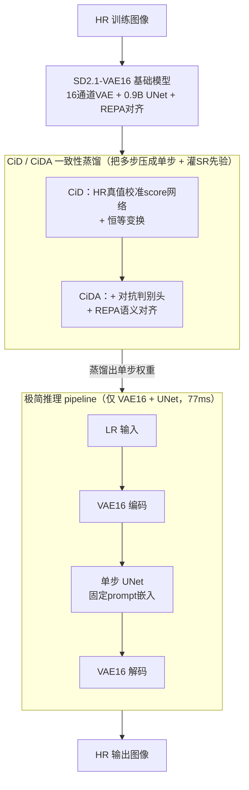

# GenDR: Lighten Generative Detail Restoration

**会议**: ICLR 2026  
**arXiv**: [2503.06790](https://arxiv.org/abs/2503.06790)  
**代码**: 无  
**领域**: 图像生成  
**关键词**: 单步超分, 潜在空间扩展, 分数蒸馏, VAE16通道, 一致性蒸馏

## 一句话总结
提出GenDR——面向生成式细节复原的轻量单步扩散超分模型：识别T2I和SR任务目标的根本分歧（T2I需多步+4通道 vs SR需少步+16通道）→构建定制SD2.1-VAE16基础模型（0.9B，通过REPA表示对齐扩展潜在空间而不增加模型规模）→提出CiD/CiDA一致性分数恒等蒸馏（将SR特定先验融入score distillation + 对抗学习 + 表示对齐）→极简pipeline仅含UNet+VAE→77ms推理在所有质量和效率指标上超越现有SOTA。

## 研究背景与动机

**领域现状**：基于扩散模型的真实世界超分辨率（SR）已取得显著进展，质量远超GAN方法，但推理速度慢且细节保真度存在瓶颈。

**核心矛盾**：T2I和SR的任务目标存在根本分歧——T2I从噪声生成完整图像需多步推理+低维潜在空间（4通道VAE降低生成难度），而SR仅需补充高频细节、步数需求少，但需要更大的潜在空间（16通道VAE）保留输入信息。

**现有方法困境**：加速推理（如OSEDiff一步蒸馏）会导致质量显著下降，提升质量（如DreamClear用PixArt-α+ControlNet）则引入巨大计算开销，陷入质量-效率的两难困境。

**模型过大**：现有16通道VAE的扩散模型（如FLUX 12B、SD3.5）对SR任务来说模型过大——FLUX做4×SR的单步处理需>40GB显存和1.4s运行时间，是SD2.1的5.3×/11.4×。

**蒸馏方法缺陷**：现有score distillation（VSD/SiD）面向T2I设计，直接用于SR会因训练分布不一致和对不完美score函数的过度依赖而产生质量/内容不一致。

**本文切入**：SR任务需要定制的基础模型（16通道+适当规模0.9B）+ 定制的蒸馏方法（融入SR先验的CiD）+ 极简化推理pipeline。

## 方法详解

### 整体框架

GenDR把"为SR定制扩散模型"拆成三层：先把SD2.1 UNet配上16通道VAE训成一个0.9B的基础模型（SD2.1-VAE16），让潜在空间装得下SR需要保留的细节；再用CiD/CiDA一致性蒸馏把多步采样压成单步，同时把SR的图像先验灌进蒸馏过程；最后剥掉scheduler和text encoder，留下VAE+UNet的极简管线，单步77ms出图。下面四个关键设计正好沿着"基础模型 → 蒸馏 → 推理管线"的顺序依次落地。

### 关键设计

**1. SD2.1-VAE16：用16通道潜在空间换回SR丢掉的细节**

SR的关键不是从噪声里凭空生成，而是补回高频细节，所以输入信息能不能完整进入潜在空间至关重要。4通道VAE是为T2I降低生成难度而设计的，不可逆压缩会抹掉精细纹理和结构；FLUX/SD3.5这类16通道DiT虽然信息容量够，但12B规模做4×SR要40GB显存、1.4s，是SD2.1的5.3×/11.4×，纯属杀鸡用牛刀。作者因此在轻量SD2.1 UNet上换装开源16通道VAE，全参数训练出0.9B的基础模型，在信息容量和规模之间取平衡。训练时用表示对齐（REPA）补充语义监督：在UNet第一个下采样块后插一个MLP投影头 $h$，把UNet中间特征 $\mathbf{h}_t = f_\theta(\mathbf{z}_t)$ 对齐到预训练DINOv2编码器对HR图的表示 $\mathbf{h}_\mathcal{E} = \mathcal{E}(\mathbf{x}_h)$：

$$\mathcal{L}^{(\text{repa})} = -\mathbb{E}_{\mathbf{x}_h, t}\left[\frac{1}{N}\sum_{n=1}^{N}\text{sim}\left(\mathbf{h}_\mathcal{E}[n], h(\mathbf{h}_t[n])\right)\right]$$

这样既扩了通道又没扩模型，VAE16在T2I上只是略退（GenEval −0.02、FID +14.44），换来SR上细节保真的明显增益。

**2. CiD：把SR先验灌进score蒸馏，让单步输出稳得住**

VSD/SiD这类score distillation本是为T2I设计的，"真实"score网络对齐的是文本嵌入分布，直接拿来做SR会出现训练分布不一致——内容漂移、质量忽好忽坏。CiD在SiD基础上做两处改动：一是用HR目标图像 $\mathbf{z}_h$ 去训练"真实"score网络 $\phi$，把它的输出分布钉在高保真图像流形上而非文本流形；二是把蒸馏目标里波动的生成结果 $\mathbf{z}_g$ 换成稳定的 $\mathbf{z}_h$ 做恒等变换，避免生成质量抖动反过来污染score估计。最终损失在原始SiD项 $\mathcal{L}_\theta^{(1)}$ 之外加上以 $\mathbf{z}_h$ 为目标、带CFG增强引导的 $\mathcal{L}_\theta^{(3)}$：

$$\mathcal{L}_\theta^{(\text{cid})} = \mathcal{L}_\theta^{(3)} - \xi \mathcal{L}_\theta^{(1)}$$

其中 $\xi$ 是经验权重。靠HR真值校准score网络加上恒等变换，CiD把SR的图像先验真正塞进了蒸馏过程，消融里相对SiD把Q-Align从4.391抬到4.428。

**3. CiDA：对抗学习去"AI假感"，REPA稳结构、加速收敛**

纯score蒸馏容易出那种过度平滑、一眼假的细节，于是CiDA在CiD上再叠两项。对抗项直接复用预训练UNet $\phi$ 当特征提取器、接一个判别头 $h$，逼生成结果落进真实纹理分布；REPA项继续在高层语义空间正则化，避免对抗训练把结构带偏，同时加快收敛。三项加权组合：

$$\mathcal{L}_\theta^{(\text{cida})} = \lambda_1 \mathcal{L}_\theta^{(\text{cid})} + \lambda_2 \mathcal{L}_\theta^{(\text{adv})} + \lambda_3 \mathcal{L}_\theta^{(\text{repa})}$$

工程上靠两招控成本：判别器只用LoRA适配（rank=64、alpha=128），并让score网络和判别器共享同一个base model做特征提取，省去多份UNet的显存。叠完对抗后Q-Align进一步到4.453，CiD贡献约0.05、对抗约0.03。

**4. 极简推理pipeline：单步用不上的零件全部删掉**

既然是单步推理，scheduler的多步调度就是多余的，作者直接固定 $\bar{\alpha}_t = \bar{\beta}_t = 0.5$ 把它去掉；text encoder和tokenizer也不要，换成预计算的固定prompt嵌入——SR场景下一句通用质量描述就够用。代价极小：相比DAPE/Qwen2.5VL动态生成prompt，固定嵌入的MUSIQ只降0.17，却把参数从1775M/8.3B压到933M、推理从113ms/3.18s压到77ms（512²像素，A100）。最终管线只剩VAE+UNet两个模块。

## 实验结果

### 表1：合成数据集 ImageNet-Test 量化比较（×4超分）

| 方法 | 步数 | PSNR↑ | NIQE↓ | LIQE↑ | ClipIQA↑ | MUSIQ↑ | Q-Align↑ |
|------|------|-------|-------|-------|----------|--------|----------|
| Real-ESRGAN | GAN | 26.62 | 4.49 | 3.84 | 0.509 | 64.81 | 3.423 |
| DiffBIR-50 | 50 | 25.45 | 4.93 | 4.64 | 0.749 | 73.04 | 4.323 |
| DreamClear-50 | 50 | 24.76 | 5.38 | 4.43 | 0.765 | 70.08 | 4.092 |
| OSEDiff-1 | 1 | 24.82 | 4.28 | 4.56 | 0.678 | 71.74 | 4.067 |
| InvSR-1 | 1 | 23.81 | 4.39 | 4.56 | 0.711 | 72.38 | 3.987 |
| **GenDR-1** | **1** | 24.14 | **4.13** | **4.81** | 0.740 | **74.68** | **4.361** |

### 表2：真实数据集 RealSet80 量化比较

| 方法 | 推理时间 | NIQE↓ | LIQE↑ | ClipIQA↑ | MUSIQ↑ | Q-Align↑ |
|------|----------|-------|-------|----------|--------|----------|
| StableSR-50 | 3731ms | 3.40 | 3.85 | 0.740 | 67.58 | 4.087 |
| SeeSR-50 | 6359ms | 4.37 | 4.28 | 0.712 | 69.74 | 4.306 |
| DreamClear-50 | 6892ms | 3.73 | 3.96 | 0.724 | 67.22 | 4.121 |
| OSEDiff-1 | 103ms | 3.98 | 4.13 | 0.704 | 69.19 | 4.306 |
| InvSR-1 | 115ms | 4.03 | 4.29 | 0.727 | 69.79 | 4.301 |
| **GenDR-1** | **77ms** | **3.98** | **4.52** | **0.742** | **71.57** | **4.453** |

### 消融实验：蒸馏策略（RealSet80）

| 基础模型 | 蒸馏策略 | LIQE↑ | ClipIQA↑ | MUSIQ↑ | Q-Align↑ |
|----------|----------|-------|----------|--------|----------|
| SD2.1-VAE4 | VSD | 4.13 | 0.704 | 69.19 | 4.306 |
| SD2.1-VAE4 | CiDA | 4.32 | 0.723 | 70.13 | 4.386 |
| SD2.1-VAE16 | VSD | 4.12 | 0.691 | 68.82 | 4.373 |
| SD2.1-VAE16 | SiD | 4.25 | 0.702 | 69.33 | 4.391 |
| SD2.1-VAE16 | CiD | 4.44 | 0.715 | 70.61 | 4.428 |
| SD2.1-VAE16 | **CiDA** | **4.52** | **0.742** | **71.57** | **4.453** |

## 关键发现

1. **T2I和SR的目标分歧是根源**：T2I需从噪声生成全部内容→多步+4通道；SR仅补高频细节→少步+16通道。直接复用T2I模型做SR是次优方案。
2. **16通道VAE对SR至关重要**：即使在0.9B的小模型上，VAE16也比VAE4保留更多细节和结构信息。VAE16在T2I任务上略有下降（GenEval -0.02, FID +14.44），但在SR任务上显著更优。
3. **CiDA逐步提升显著**：VSD→SiD→CiD→CiDA，Q-Align从4.373→4.391→4.428→4.453，每一步改进都有明确贡献（CiD占0.05，对抗占0.03）。
4. **固定prompt嵌入不损失质量**：相比DAPE/Qwen2.5VL动态生成prompt，固定嵌入的MUSIQ仅降0.17但推理时间从113ms/3.18s降至77ms，参数从1775M/8.3B降至933M。
5. **速度-质量帕累托最优**：GenDR以77ms（最快）和933M参数（次小）在所有NR-IQA指标上取得最佳，相比DreamClear加速89.5×且参数减半。

## 亮点

- **问题洞察深刻**：首次系统分析T2I和SR任务的目标分歧（步数需求+潜在空间维度），为SR定制diffusion model提供理论基础。
- **系统性解决方案**：从基础模型（VAE16）→蒸馏方法（CiD/CiDA）→推理pipeline（极简化）三个层面全面优化。
- **效率突出**：77ms单步推理、933M参数，比多步方法快近90×，比OSEDiff/InvSR也快25-33%。
- **CiDA训练效率**：LoRA + 模型共享策略实现三个UNet的高效联合训练。

## 局限性

- **未探索更大通道VAE**：验证了16通道有效但未研究32/64通道等更大潜在空间，因训练整个SD模型成本过高。
- **CiDA显存需求高**：虽用LoRA和DeepSpeed优化，CiDA仍需大量GPU显存，难以扩展到DiT模型（如FLUX/SD3.5）。
- **PSNR不占优**：GenDR在感知质量指标（LIQE/MUSIQ/Q-Align）上领先，但PSNR低于GAN方法和部分多步方法，说明存在像素级保真度的权衡。

## 相关工作对比

| 维度 | OSEDiff (Wu et al., 2024b) | GenDR (本文) |
|------|---------------------------|-------------|
| 基础模型 | SD2.1 (4通道VAE, 0.9B) | SD2.1-VAE16 (16通道VAE, 0.9B) |
| 蒸馏方法 | VSD直接应用+L1/MSE正则 | CiDA: 融入SR先验+对抗+REPA |
| 推理时间 | 103ms | 77ms |
| Q-Align | 4.306 | 4.453 |

| 维度 | DreamClear (Ai et al., 2025) | GenDR (本文) |
|------|------------------------------|-------------|
| 基础模型 | PixArt-α (2.2B) | SD2.1-VAE16 (0.9B) |
| 推理步数 | 50步 | 1步 |
| 辅助模块 | 2个ControlNet + MLLM | 无（固定嵌入） |
| 推理时间 | 6892ms (3×A100) | 77ms (1×A100) |
| MUSIQ | 67.22 | 71.57 |

## 评分 (1-5)

- **新颖性**: 4 — 对T2I/SR目标分歧的洞察新颖，CiD将SR先验融入score distillation是原创贡献，但整体框架仍在已有组件（SiD/REPA/LoRA）上改进组合。
- **技术深度**: 4 — CiD/CiDA的数学推导严谨，从VSD→SiD→CiD的演进逻辑清晰，各设计决策有消融验证。
- **实验充分度**: 4 — 覆盖合成+真实数据集，13种IQA指标，用户研究和MLLM评估，详细消融（蒸馏策略/VAE通道/prompt策略），但缺少下游任务评估。
- **写作质量**: 4 — 动机阐述清晰（Fig.2的可视化直观），方法推导层层递进，但notation较多需仔细跟。

<!-- RELATED:START -->

## 相关论文

- [\[ICLR 2026\] Eliminating VAE for Fast and High-Resolution Generative Detail Restoration](eliminating_vae_for_fast_and_high-resolution_generative_detail_restoration.md)
- [\[ICLR 2026\] Massive Activations are the Key to Local Detail Synthesis in Diffusion Transformers](massive_activations_are_the_key_to_local_detail_synthesis_in_diffusion_transform.md)
- [\[ICLR 2026\] Bridging Degradation Discrimination and Generation for Universal Image Restoration](bridging_degradation_discrimination_and_generation_for_universal_image_restorati.md)
- [\[ICLR 2026\] LVTINO: LAtent Video consisTency INverse sOlver for High Definition Video Restoration](lvtino_latent_video_consistency_inverse_solver_for_high_definition_video_restora.md)
- [\[AAAI 2026\] Multi-Metric Preference Alignment for Generative Speech Restoration](../../AAAI2026/image_generation/multi-metric_preference_alignment_for_generative_speech_restoration.md)

<!-- RELATED:END -->
