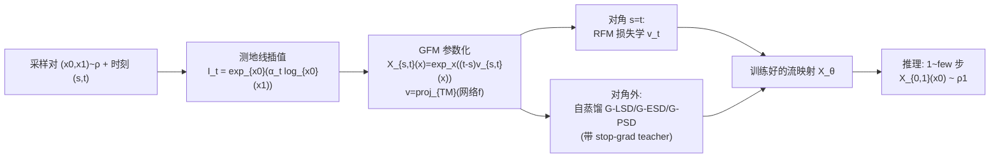

# Generalised Flow Maps for Few-Step Generative Modelling on Riemannian Manifolds

**会议**: ICLR 2026  
**OpenReview**: [https://openreview.net/forum?id=1YHF7B8Yjk](https://openreview.net/forum?id=1YHF7B8Yjk)  
**代码**: 待确认  
**领域**: 生成模型 / 几何深度学习  
**关键词**: 流映射(Flow Map)、黎曼流形、少步生成、自蒸馏、一致性模型、流匹配  

## 一句话总结
把欧氏空间的「流映射」(Flow Map) 框架推广到任意黎曼流形，提出 Generalised Flow Maps (GFM)，用三种自蒸馏损失从零训练出能在流形上「一步/少步」采样的几何生成模型，统一并提升了一致性模型、shortcut 模型、MeanFlow 到流形设定。

## 研究背景与动机
- **领域现状**：扩散、流匹配 (flow matching)、随机插值 (stochastic interpolants) 这套「动力学测度传输」范式不仅在欧氏数据(图像)上称霸，还自然延伸到本质几何的数据——蛋白质骨架 (SE(3)$^N$)、分子材料、地理空间数据、概率单纯形上的离散数据等，催生了一大批黎曼生成模型。
- **现有痛点**：这些模型训练靠简单回归目标、快且 simulation-free，但**推理极贵**——必须数值求解 ODE，反复评估大网络几十上百步。几何设定下更雪上加霜：每步还要算流形约束算子(如 SO(3) 的指数/对数映射需截断无穷矩阵幂级数)，既慢又引入额外数值误差。
- **核心矛盾**：欧氏空间已有成熟的「少步加速」方案——高阶采样器，以及**直接学流映射**(ODE 的全局解算子，而非瞬时向量场)的蒸馏方法(一致性模型/shortcut/MeanFlow)。但这些方法**默认数据在 $\mathbb{R}^d$**，流映射的参数化 $X_{s,t}(x_s)=x+(t-s)v_{s,t}(x_s)$ 是线性外推，结果不落在流形上。
- **本文目标**：把「流映射」原理搬到任意黎曼流形，得到一类既保留几何归纳偏置、又能少步推理的新生成模型。
- **核心 idea**：**用指数映射替换线性外推**——把流映射重参数化为 $X_{s,t}(x_s)=\exp_{x_s}\big((t-s)\,v_{s,t}(x_s)\big)$，自动满足边界条件且永远落在流形上；再把欧氏的三种自蒸馏损失(Eulerian/Lagrangian/Progressive)用黎曼度量逐一「升维」到流形，从零(无需预训练 teacher)自蒸馏出流映射。

## 方法详解

### 整体框架
GFM 想学的是 ODE 的「跳跃算子」$X_{s,t}$：给定概率流 ODE 的任一轨迹 $(x_t)$，对任意时刻对 $(s,t)$ 都满足 $X_{s,t}(x_s)=x_t$，于是一步采样就是 $x_0\sim\rho_0$ 后直接算 $X_{0,1}(x_0)\sim\rho_1$。训练分两半：对角线 $s=t$ 上用黎曼流匹配 (RFM) 学瞬时向量场 $v_{t,t}=v_t$，对角线外用自蒸馏损失逼出全局跳跃一致性，总损失 $\mathcal{L}=\mathcal{L}_{\text{RFM}}+\mathcal{L}_{\text{GFM-SD}}$。

### 关键设计

**1. 指数映射参数化 + 切空间投影，把流映射「焊」在流形上**：欧氏流映射的 $x+(t-s)v$ 在流形上会飞出去，作者改用指数映射 $X_{s,t}(x_s)=\exp_{x_s}\big((t-s)v_{s,t}(x_s)\big)$，因为 $\exp_{x_s}(\vec 0)=x_s$，边界条件 $X_{s,s}=\mathrm{Id}$ 天然成立。插值器也不再是 $x_0,x_1$ 的线性组合，而是连接两点的**测地线** $I_t=\exp_{x_0}(\alpha_t\log_{x_0}(x_1))$，使整条轨迹始终在 $M$ 上。底层神经网络 $f^\theta:[0,1]^2\times M\to\mathbb{R}^d$ 的输出再投影回切平面 $v^\theta_{s,t}(p):=\mathrm{proj}_{T_pM}\big(f^\theta_{s,t}(p)\big)$，保证后续所有指数/对数/微分运算不会 ill-defined。作者证明当 $M=\mathbb{R}^d$ 时整套退回到 Albergo & Vanden-Eijnden 的欧氏情形。

**2. 三个等价刻画 ⇒ 三种黎曼自蒸馏损失**：Proposition 1 证明上述参数化是唯一 GFM 当且仅当满足拉格朗日条件 $\partial_t X_{s,t}=v_t(X_{s,t})$、欧拉条件 $\partial_s X_{s,t}+d(X_{s,t})_{x_s}[v_s]=0$、或半群条件 $X_{u,t}(X_{s,u}(x_s))=X_{s,t}(x_s)$ 三者之一。每个条件对应一个损失：**G-LSD**(拉格朗日)惩罚 $\big\|\partial_t X^\theta_{s,t}(I_s)-v^\theta_{t,t}(X^\theta_{s,t}(I_s))\big\|_g^2$；**G-ESD**(欧拉)惩罚 $\big\|\partial_s X^\theta_{s,t}(x_s)+d(X^\theta_{s,t})_{I_s}[v^\theta_{s,s}(I_s)]\big\|_g^2$；**G-PSD**(渐进)用测地距离 $d_g$ 强制半群一致性 $d_g^2\big(X^\theta_{s,t}(I_s),\,X^\theta_{u,t}(X^\theta_{s,u}(I_s))\big)$。三者范数都换成黎曼度量 $\|\cdot\|_g$，使量级和流匹配损失可比。

**3. stop-gradient 自举训练，规避高阶导数与不稳定**：直接优化上述损失训练动态不稳，作者沿用文献做法，给每个损失的「teacher」项加 stop-gradient，只让另一项有梯度，把目标变成自举蒸馏。G-LSD 把 $v^\theta_{t,t}(\cdot)$ stop 掉(反传 $\partial_t X^\theta_{s,t}$ 靠现代库的前向模式 JVP 即可)；G-ESD 把含空间导数的 $d(X^\theta_{s,t})_{I_s}[\cdot]$ 项 stop 掉，避免二阶导；G-PSD 把两小步组合 $X^\theta_{u,t}(X^\theta_{s,u}(I_s))$ 作为大步的 teacher，取 $u=\tfrac12 s+\tfrac12 t$ 形成两个半步。

**4. 统一并提升欧氏少步模型到流形**：作者证明这些黎曼损失在特定设计下精确回收已有方法——G-ESD 与黎曼版 MeanFlow 紧密相关(作者实现为 **G-MF**，且像 MeanFlow 一样不带流匹配损失训练)；G-PSD 取半步即把 Frans 等人的 shortcut 模型推广到流形；对角线上则等价于一致性模型的思路。于是 GFM 成为「一致性模型 / shortcut / MeanFlow」三者的黎曼统一框架。

## 实验关键数据
覆盖五类流形数据：蛋白质侧链扭转角 ($T^2\cong S^1\times S^1$)、RNA 骨架 ($T^7$)、地球灾害地理数据 ($S^2$)、3D 旋转 SO(3) 合成数据、Poincaré 双曲圆盘。指标为 MMD(衡量少步样本质量，越低越好)和 NLL(衡量学到的向量场，越低越好)。主基线为 SOTA 的 RFM (Chen & Lipman 2024)。

### 主实验：1-NFE 样本质量 (MMD，蛋白/RNA 扭转角)

| 方法 | General(2D) | Glycine(2D) | Proline(2D) | Pre-Pro(2D) | RNA(7D) |
|------|------|------|------|------|------|
| RFM | 0.45 | 0.27 | 0.52 | 0.47 | 0.68 |
| **G-LSD (ours)** | **0.02** | **0.03** | **0.04** | **0.05** | **0.08** |
| G-PSD (ours) | 0.11 | 0.05 | 0.07 | 0.08 | 0.14 |
| G-ESD (ours) | 0.29 | 0.13 | 0.44 | 0.26 | 0.45 |
| G-MF (ours) | 0.11 | 0.04 | 0.09 | 0.09 | 0.20 |

单步评估下 G-LSD 在 "General" 上把 MMD 从 0.45 降到 0.02，约 **22×** 提升——这是 RFM(只能学瞬时场)做不到的能力。

### 主实验：Earth 地理数据 NLL ($S^2$，越低越好)

| 方法 | Volcano | Earthquake | Flood | Fire |
|------|------|------|------|------|
| RDM | −6.61 | −0.40 | 0.43 | −1.38 |
| RFM | **−7.93** | −0.28 | 0.42 | −1.86 |
| G-LSD (ours) | −4.96 | −0.93 | −0.38 | −2.14 |
| G-PSD (ours) | −3.50 | −0.63 | −0.76 | −2.48 |
| G-ESD (ours) | −4.49 | −0.67 | −0.88 | −2.29 |
| G-MF (ours) | −3.73 | **−1.08** | −0.72 | −2.24 |

GFM 的隐式流 $v^\theta_{t,t}$ 在四个数据集中三个(Earthquake/Flood/Fire)的 NLL 超过 RFM 及所有基线，仅 Volcano(仅 827 样本)上 RFM 更优。

### 消融：MMD vs 推理步数 (NFE) 与 SO(3)

| SO(3) | 1 NFE | 2 NFE | 100 NFE | NLL |
|------|------|------|------|------|
| RFM | 0.147 | 0.083 | 0.042 | −7.15 |
| G-LSD (ours) | **0.064** | **0.059** | 0.044 | −7.11 |
| G-PSD (ours) | 0.121 | 0.073 | **0.039** | −7.15 |

MMD-vs-NFE 曲线显示：低 NFE(1~2 步)时 GFM 全面大幅领先 RFM，高 NFE 时与 RFM 收敛到同等高质量；NLL 上各方法在 SO(3) 上基本持平。

### 关键发现
- **G-LSD 是少步质量最强变体**，几乎在所有数据集 1-NFE MMD 上居首。
- **隐式流的似然不输甚至超过多步基线**：少步采样能力没有以牺牲分布拟合为代价。
- **跨流形鲁棒**：在平坦环面、球面、SO(3)、双曲圆盘上均有效，证明方法不依赖特殊流形结构。

## 亮点与洞察
- **一个参数化换掉一类问题**：把「$x+(t-s)v$」换成「$\exp_x((t-s)v)$」这一步，几乎无痛地把整个欧氏流映射理论体系搬上流形，且 $M=\mathbb{R}^d$ 时严格退化，理论很干净。
- **统一视角有价值**：明确证明一致性模型 / shortcut / MeanFlow 都是该框架在不同条件/设计下的特例，给「少步生成」家族提供了流形上的统一坐标系。
- **工程上接地气**：三种损失对应「需要时间导/需要空间导/无导数」三档实现复杂度，G-PSD 最易移植(无任何时空导数)，给实践者梯度选择。

## 局限与展望
- **未上大规模**：实验停在低维流形(2D~7D 环面、$S^2$、SO(3)、双曲圆盘)的科学小数据集，尚未验证蛋白质骨架 SE(3)$^N$ 全设计、分子材料等真正高影响场景。
- **小数据集上 NLL 偶有退步**：Volcano(827 样本)与 RNA 上 NLL 略逊 RFM，提示少步蒸馏在数据稀疏时仍有 trade-off。
- **流形算子成本未消除**：虽减少步数，但每步仍需 $\exp/\log$、微分等算子，复杂流形(如 SO(3) 矩阵幂级数截断)的数值稳定性与开销仍是隐忧(作者在附录给了成本分析)。
- **G-ESD 偏弱**：欧拉变体在多个 MMD 表上明显落后于 G-LSD/G-PSD，为何如此、能否改进值得后续探究。

## 相关工作与启发
- **流映射的源头**：Boffi et al. (2024, 2025) 定义并自蒸馏训练欧氏流映射，本文是其黎曼推广。
- **少步生成家族**：一致性模型 (Song et al. 2023)、shortcut 模型 (Frans et al. 2025)、MeanFlow (Geng et al. 2025) 被统一收编。
- **黎曼生成模型**：RFM (Chen & Lipman 2024)、RDM/RSGM (Huang/De Bortoli 2022)、Moser Flow、随机插值 (Albergo et al. 2023) 是基线与理论基石。
- **启发**：这条「把欧氏加速技术 + 流形几何约束 = 几何少步生成」的路线，对蛋白/分子/材料等需快速采样且本质几何的科学生成任务有直接吸引力；统一框架也方便把未来欧氏新蒸馏损失一键移植到流形。

## 评分
- **新颖性**: ⭐⭐⭐⭐⭐ 首次把流映射框架系统推广到任意黎曼流形，并理论统一三大欧氏少步方法，框架性贡献清晰。
- **实验充分度**: ⭐⭐⭐⭐ 覆盖 5 类流形 + MMD/NLL 双指标 + NFE 曲线 + 4 个变体对比，扎实；但局限于低维科学小数据集，缺大规模/高影响场景验证。
- **写作质量**: ⭐⭐⭐⭐ 理论推导严谨(命题+证明+欧氏退化检验)，图 1 直观；公式密集，对无几何背景读者门槛偏高。
- **价值**: ⭐⭐⭐⭐ 给几何生成建模提供了即插即用的少步加速范式与统一理论，对科学生成(蛋白/分子/地理)落地潜力大。

<!-- RELATED:START -->

## 相关论文

- [\[ICML 2026\] Riemannian MeanFlow for One-Step Generation on Manifolds](../../ICML2026/image_generation/riemannian_meanflow_for_one-step_generation_on_manifolds.md)
- [\[NeurIPS 2025\] Riemannian Consistency Model](../../NeurIPS2025/image_generation/riemannian_consistency_model.md)
- [\[ICLR 2026\] FALCON: Few-step Accurate Likelihoods for Continuous Flows](falcon_few-step_accurate_likelihoods_for_continuous_flows.md)
- [\[ICLR 2026\] PairFlow: Closed-Form Source-Target Coupling for Few-Step Generation in Discrete Flow Models](pairflow_closed-form_source-target_coupling_for_few-step_generation_in_discrete_.md)
- [\[ICLR 2026\] DistillKac: Few-Step Image Generation via Damped Wave Equations](distillkac_few-step_image_generation_via_damped_wave_equations.md)

<!-- RELATED:END -->
