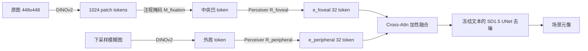

# Generating Metamers of Human Scene Understanding

**会议**: ICLR 2026  
**OpenReview**: [https://openreview.net/forum?id=cSDXx8V6K9](https://openreview.net/forum?id=cSDXx8V6K9)  
**代码**: [https://rainarit.github.io/metamergen/](https://rainarit.github.io/metamergen/)  
**领域**: 图像生成 / 计算认知科学  
**关键词**: 场景元像（Scene Metamer）、注视引导生成、潜在扩散、DINOv2、中央凹-外周视觉、行为实验  

## 一句话总结
MetamerGen 用一个双流（中央凹+外周）条件化的潜在扩散模型，把人在自由观看场景时的少数注视点合成成「人脑理解中的场景」，并通过 same/different 行为实验筛出真正让人判为"相同"的**场景元像**，进而拆解出是哪些层级的视觉特征决定了人对场景的理解。

## 研究背景与动机
- **领域现状**：认知科学想知道"人看完一个场景后，脑子里到底留下了什么"。已知答案是——人靠外周视觉的低分辨率"要旨（gist）"加上少量注视点采集的高分辨率信息，拼凑出对场景的连贯理解。过往的"元像（metamer）"研究（Freeman & Simoncelli、Rosenholtz 等）证明：可以合成物理上不同、但人无法分辨的刺激，以此反推视觉系统编码了什么。
- **现有痛点**：以往元像工作只用简单生成模型合成纹理/形状，且把眼位**固定**，只能研究外周视觉的低层统计。它们没法回答"注视点变化之后、人对模糊外周里相信存在什么物体"这类**后-gist、场景理解层面**的问题。
- **核心矛盾**：现代扩散模型能生成逼真场景，但它是从文本或完整图像生成，**不是**从"高分辨率中心 + 模糊外周"这种中央凹化（foveated）输入生成；如何把这种变分辨率的人眼采样信号塞进预训练扩散模型，是没解决的图到图合成问题。
- **本文目标**：造一个能"根据某人的真实注视轨迹，生成该人理解中的场景"的工具，并用行为实验验证生成结果确实是该观看者的场景元像，再借此分析哪些视觉特征决定元像成立。
- **核心 idea**：**[双流 foveated 条件化]** 用 DINOv2 把图像拆成"被注视区域的中央凹 token"和"整图模糊后的外周 token"两路，经各自 Perceiver 重采样器压成条件，分别加性注入 Stable Diffusion 的 cross-attention，让模型在非注视的模糊像素里"脑补"出与人理解一致的场景内容。

## 方法详解

### 整体框架
给定一张图和一组注视点，MetamerGen 用 DINOv2-Base（带 register）同时提取两路特征：对高分辨率原图用注视二值掩码只保留被注视 patch 得到**中央凹特征**，对下采样再上采样的模糊图保留全部 patch 得到**外周特征**。两路各过一个 Perceiver-based 重采样网络压成 32 个条件 token，分别经独立 cross-attention 加性融合进冻结文本的 Stable Diffusion 1.5 UNet，去噪生成出"人理解中的整张场景"。生成结果再进入 same/different 行为范式判定是否为元像。

### 关键设计

**1. 双流中央凹-外周表示：用一个自监督编码器同时承载"看清了什么"和"瞥见了什么"。** 作者不另造视觉前端，而是借 DINOv2 单一编码器的两种用法来对应人眼两种采样。DINOv2 把 $448\times448$ 图切成 $32\times32=1024$ 个 patch token（768 维）；对原图，用对应人类注视位置的二值掩码 $M_\text{fixation}$ 把非注视 patch 全部置零，保留的 token 既编码了注视点的高分辨率细节、也带有局部上下文，恰好类比中央凹+近凹采样；对外周，则把图先下采样到 $\{0.0625\times,\dots,1\times\}$ 再升回 $448$ 得到模糊图 $I_\text{peripheral}$，过 DINOv2 后**不掩码**保留全部 token，编码整张场景里"不确定、需注视去核验"的外周信息。这样两路天然对齐人类视觉的高低分辨率二元结构，而非堆叠两个独立网络。

**2. 适配器式双条件注入与加性 cross-attention：在不重训 SD 的前提下塞进两种视觉条件。** 仿照 IP-Adapter，把 DINOv2 patch 嵌入（而非 CLIP 全局嵌入）经 Perceiver 重采样器压成条件 token：$e_\text{foveal}=R_\text{foveal}(\text{DINOv2}(I_\text{original})\odot M_\text{fixation})$，$e_\text{peripheral}=R_\text{peripheral}(\text{DINOv2}(I_\text{downsample}))$。文本、foveal、peripheral 三路各自投影出 $K_c,V_c$，然后**加性**地汇入去噪：
$$\text{Attn}=\text{softmax}\!\Big(\tfrac{QK_\text{text}^T}{\sqrt{d_k}}\Big)V_\text{text}+\lambda_\text{foveal}\,\text{softmax}\!\Big(\tfrac{QK_\text{foveal}^T}{\sqrt{d_k}}\Big)V_\text{foveal}+\lambda_\text{peripheral}\,\text{softmax}\!\Big(\tfrac{QK_\text{peripheral}^T}{\sqrt{d_k}}\Big)V_\text{peripheral}$$
其中 $\lambda_\text{foveal}=1.2$、$\lambda_\text{peripheral}=0.7$ 调控两路贡献，推理时把文本 caption 一律设空串以"冻结"文本路。可训练的只有两个重采样器及其 $K/V$ 投影矩阵，其余 SD 权重不动，因此训练轻量。

**3. 面向行为实验的训练采样策略：让随机训练能泛化到人眼真实注视。** 在 MS-COCO 11.8 万张图上训练时，foveal 掩码**随机**保留 $\{1,2,3,5,10\}$ 个 DINOv2 patch（对齐行为实验最多 10 次注视的上限），外周则随机选 $\{0.0625\times,\dots,1\times\}$ 模糊度；训练注视点随机采样、推理时才换成实验真实注视。同时以 $p_\text{foveal}=0.05$、$p_\text{peripheral}=0.10$ 随机丢弃条件——外周丢弃率更高是因为模糊外周仍残留大量信息，需防止模型过度依赖外周而忽视稀疏中央凹。推理用 DDIM 50 步 + CFG++。这套设计使模型在推理时面对真人千变万化的注视轨迹仍能稳定生成合理场景。

**4. 行为元像判定范式：用人的"相同/不同"回答把生成物锚定到人脑表征。** 方法本身只是生成器，"是否元像"必须由人定义。作者搭了实时 gaze-contingent 范式：被试自由观看场景直到达到预设注视数 $\{1,2,3,5,10\}$→图像移除→5 秒空屏内 MetamerGen 实时据其注视生成新场景→呈现第二张图仅 200 ms（短到来不及眼动但够做知觉判断）→被试判"相同/不同"。判为"相同"的生成即被定义为该观看者的**场景元像**。另设"随机注视"对照组（生成基于随机采样的注视点）。这一闭环把生成模型变成可被认知科学检验的假设发生器。

## 实验关键数据

### 主实验：生成质量与元像率

| 评估 | 设置 | 结果 |
|---|---|---|
| FID（vs COCO-10k-test） | 外周尺度↑ | FID 持续下降，外周上下文越多生成越贴近真实 |
| FID | 各模糊度 | 所有模糊水平都能稳定生成合理场景 |
| FID baseline | SD-1.5 文生图（10k 随机 caption） | MetamerGen 一致优于纯文生图基线 |
| 元像率（own fixations） | n=45，300 trial | 29.4% |
| 元像率（random fixations） | n=12 对照 | 27.7%（与上者 p=0.24，无显著差） |

### 消融：中央凹 vs 外周条件（10 名新被试）

| 条件 | 元像率 |
|---|---|
| 完整模型（foveal+peripheral） | **54.5%** |
| 仅外周（peripheral-only） | 45.8% |
| 仅中央凹（foveal-only） | 8.4% |

### 刺激与实验细节
- 行为刺激为 Visual Genome（YFCC100M 子集）中的 **300 张图**，刻意避开训练用的 COCO；用 DreamSim 在语义空间聚类后每簇取一张代表图以最大化视觉多样性，并过滤掉人、印刷文字、时钟等当前扩散模型难处理的元素。
- 主实验每名被试 300 trial、全程眼动追踪，注视数在 $\{1,2,3,5,10\}$ 间系统变化以考察"更多信息是否提升元像率"。

### 关键发现
- **元像跨越整个视觉层级**：用对模糊鲁棒、且与 V1→IT 神经响应对齐的 AlexNet 提取早/中/晚层特征，发现注视引导生成里特征相似度越高、判"相同"比例越高，且**各层都成立**——元像需要低到高层视觉特征的广泛表征对齐，而非单一处理阶段。
- **高层语义最强预测元像**：DreamSim 距离越小越易判"相同"，是最清晰的高层证据；CLIP 相似度也预测元像，但**仅在用观看者自己的注视生成时**成立，随机注视下不成立——说明源于自身注意的生成才与内部场景表征语义对齐。
- **中层深度/proto-object**：用 Depth Anything 测深度图差异（SiLog），深度差越大元像率越低，深度是决定场景布局元像的重要因素；proto-object 分割 mIoU 越高也越易判"相同"，但效应弱于深度。
- **低层纹理反直觉**：生成图 Gabor/Sobel 边缘响应**强于**原图反而带来更多"相同"判断——增强的纹理使边界更清晰、提升了感知真实感。
- **外周比中央凹更重要**：仅外周(45.8%)远高于仅中央凹(8.4%)，因外周能捕获全局场景结构布局；但二者结合(54.5%)优于仅外周，说明中央凹注入的细节与语义确实有额外贡献。
- **随机注视的"反常"**：随机注视生成里相似度高时元像率反而下降——非注视区的逼真细节会暴露与观看者内部表征不一致之处，使其被识破。

## 亮点与洞察
- **生成模型作为认知科学的"假设发生器"**：把扩散模型的产物当作"人相信自己外周里有什么"的可检验假设，再用行为实验回收为元像，是方法论上的漂亮闭环，超出了一般"图到图合成"的范畴。
- **用 DINOv2 单编码器统一中央凹/外周**，借其 patch token 既含细节又含局部上下文的特性对应人眼采样，避免另造前端，工程上简洁且有神经科学依据。
- **"外周主导、中央凹补强"的反直觉结论**：场景理解元像更依赖全局 gist 而非局部细节，量化地支持了 gist-first 的场景认知观点。
- **可解释性贯穿全文**：不止给生成质量，而是系统地从低/中/高层特征逐一回归，定位元像成立的视觉成因。

## 局限与展望
- **继承 SD 弱点**：难生成精细人脸、肢体关节，文字即便被直接注视也常不可读；为此行为实验**主动剔除**含人脸/文字/时钟的图像，限制了刺激的生态效度。
- **元像率绝对值不高**（主实验约 29%、消融完整模型 54.5%），且 own vs random 在主实验中无显著差异，说明"自身注视优势"主要体现在特征相似度的交互趋势上而非总体率。
- 行为实验规模有限（主实验 n=45，消融 n=10、对照 n=12），高层回归 $R^2=0.039$ 偏低，结论更多是趋势性证据。
- 训练数据 COCO、刺激用 Visual Genome 避免重叠，但仍限于自然场景，未涉及更复杂或抽象场景。
- 展望：可扩展到含人/文字的场景（待生成模型改进）、引入更精细的眼动时序建模、以及把该范式用于诊断特定脑区或个体差异的场景理解。

## 相关工作与启发
- **场景/纹理元像**：Freeman & Simoncelli 2011、Balas et al. 2009、Rosenholtz et al. 2012——本文把元像从固定眼位的纹理/形状层扩展到自由观看、后-gist 的场景理解层。
- **潜在扩散与适配器**：Stable Diffusion（Rombach 2022）、IP-Adapter（Ye 2023）、T2I-Adapter（Mou 2023）——提供了把视觉条件注入冻结扩散模型的技术基底，本文创新在双流 foveated 条件。
- **自监督表征与脑对齐**：DINOv2（Oquab 2024）、Adeli et al. 2023/2025（自监督编码器捕获 object-centric 表征、预测高层神经活动）、Jang & Tong 2024（模糊鲁棒 AlexNet 对齐 V1-IT）——支撑了用 DINOv2/AlexNet 作为视觉层级代理的合理性。
- **启发**：把"生成-行为验证"闭环迁到其他知觉问题（听觉、触觉元像）、或用元像率作为评估生成模型"是否与人类知觉对齐"的新指标，都是值得延伸的方向。

## 评分
- **新颖性**: ⭐⭐⭐⭐⭐ 把扩散生成、双流 foveated 条件与行为元像范式三者打通，开辟了"用生成模型探测人类场景理解"的新问题，跨 ML 与认知科学。
- **实验充分度**: ⭐⭐⭐⭐ FID 质量评估 + 三套量化分析（神经对齐特征/可解释低中高层/foveal-peripheral 消融）相当扎实，但被试规模与高层回归 $R^2$ 偏弱，元像率绝对值与显著性有待加强。
- **写作质量**: ⭐⭐⭐⭐ 动机叙述清晰、方法与公式完整、分析层层递进；图表丰富，认知科学背景介绍到位。
- **价值**: ⭐⭐⭐⭐⭐ 提供了一个可被实验检验的场景理解探针，对认知科学和"人类对齐的生成模型"评估都有方法论价值。

<!-- RELATED:START -->

## 相关论文

- [\[ICLR 2026\] EchoGen: Generating Visual Echoes in Any Scene via Feed-Forward Subject-Driven Auto-Regressive Model](echogen_generating_visual_echoes_in_any_scene_via_feed-forward_subject-driven_au.md)
- [\[ICLR 2026\] Generate Any Scene: Scene Graph Driven Data Synthesis for Visual Generation Training](generate_any_scene_scene_graph_driven_data_synthesis_for_visual_generation_train.md)
- [\[CVPR 2025\] ShowHowTo: Generating Scene-Conditioned Step-by-Step Visual Instructions](../../CVPR2025/image_generation/showhowto_generating_scene-conditioned_step-by-step_visual_instructions.md)
- [\[ICML 2025\] Compositional Scene Understanding through Inverse Generative Modeling](../../ICML2025/image_generation/compositional_scene_understanding_through_inverse_generative_modeling.md)
- [\[ECCV 2024\] Generating Human Interaction Motions in Scenes with Text Control](../../ECCV2024/image_generation/generating_human_interaction_motions_in_scenes_with_text_control.md)

<!-- RELATED:END -->
