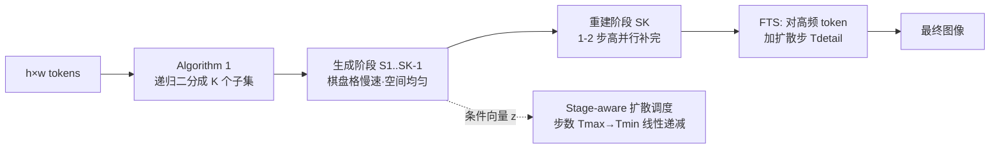

# Generation then Reconstruction: Accelerating Masked Autoregressive Models via Two-Stage Sampling

**会议**: ICLR 2026  
**OpenReview**: [https://openreview.net/forum?id=qIujRzzWnd](https://openreview.net/forum?id=qIujRzzWnd)  
**代码**: [https://github.com/feihongyan1/GtR](https://github.com/feihongyan1/GtR)  
**领域**: 图像生成 / 自回归生成加速  
**关键词**: Masked Autoregressive, 训练免学加速, 两阶段采样, 棋盘格采样, 频率加权  

## 一句话总结
把 Masked Autoregressive（MAR）图像生成拆成"先用棋盘格慢速搭骨架、再单步快速补细节"的两阶段采样，配合给高频细节 token 额外分配扩散步数，无需训练就让 MAR-H 提速 3.72×、FID/IS 几乎不掉。

## 研究背景与动机
**领域现状**：自回归（AR）范式被引入视觉生成后，逐像素/逐 token 的因果建模天然无法并行，速度受限。MAR（Masked Autoregressive）改用"next-set prediction"——编码器用双向注意力为每个 token 生成条件向量 $z$，再由扩散头建模连续 token 分布，从而一步并行预测多个 token，兼顾质量与并行度。

**现有痛点**：MAR 的并行潜力被"单步内空间相关 token 的联合分布建模难度"卡住。一步预测的 token 越多，要估计的高维联合分布越复杂，质量越掉。论文用两个观察点破题：(1) 一个 token 被解码后，其**空间相邻 token 会发生显著变化**（图 1，相邻步特征差异大），说明相邻 token 应分开解码；(2) **覆盖更多空间位置 = 创造更多信息**——"棋盘格"采样（已解码 token 空间均匀散布）即使后半段换不同随机种子，七张图几乎一致；而"连续块"采样后半段差异巨大，说明只要空间均匀地解码完一半 token，图像主体内容就已基本定下来。

**核心矛盾**：随机排列采样既可能同时预测相邻 token（难建模），又违反人类"先立全局结构、再补局部细节"的由粗到细范式，后期容易留下信息不足的空白区，质量下降。同时 MAR 对每个 token 都付出相同扩散步数，忽略了"细节复杂的 token 比平坦区域更难生成"这一事实。

**本文目标**：在**完全不训练、不改模型权重**的前提下，重新设计 MAR 的采样顺序与算力分配，逼近极致加速且不掉质量。

**核心 idea**（**训练免学的分层采样**）：把生成显式拆成"创造（generation）"与"重建（reconstruction）"两个语义阶段——慢速创造主体、单步重建细节，并按频率把扩散算力倾斜给高频细节 token。

## 方法详解

### 整体框架
GtR 把生成过程组织成"两阶段棋盘格"采样。给定 $h\times w$ 个 token（行列索引 $i,j$）：**生成阶段**只解码满足 $(i+j)\bmod 2=0$ 的棋盘格位置，且刻意放慢（每步只出少量 token）以建立全局语义骨架；**重建阶段**再解码剩下 $(i+j)\bmod 2=1$ 的位置，因为此时每个待生成 token 都被四周已生成 token 包围、形成强因果约束，可用极高并行比（甚至单步）一次性补完。为避免生成阶段早期把 token 挤在局部、推迟全局结构形成，作者进一步把生成阶段递归二分成 $K-1$ 个子阶段（Algorithm 1），让第一个子阶段就铺满全图的空间均匀 token。算力侧再叠加两个调度：扩散步数随阶段线性递减，以及把高频 token 额外加步。

### 关键设计

**1. 两阶段棋盘格采样（Generation-then-Reconstruction）：让"创造"慢、"重建"快。** 联合分布按棋盘格阶段重写为 $p(x_1,\dots,x_n)=\prod_{k=1}^{K}p(S_k\mid S_1,\dots,S_{k-1})$，其中生成阶段先解码 $(i+j)\bmod 2=0$ 的一半 token 来"创造"主体内容，因为它定夺图像信息所以放慢节奏；重建阶段解码另一半时，每个 token 都被邻居环绕、分布被强烈约束，"重建"远比"创造"容易，因而能在 1~2 步内高并行补完。由于 MAR 本身就在所有 token 顺序的随机排列上训练过（自然包含 GtR 的顺序），整套采样可直接套到任意 MAR 上而**无需重训**。

**2. 递归二分的阶段划分（Algorithm 1）：尽早铺满全局结构。** 若只是简单两段，生成阶段内的随机采样可能把 token 堆在局部，导致全局语义迟迟不成形。算法每轮把未分配集合 $R$ 按 $(i+j)\bmod 2^k$ 二分，一半送进新子阶段、另一半留作下一轮的 $R$，最终得到 $K$ 个互不相交、各自在全图均匀分布的子集 $\{S_1,\dots,S_K\}$。这样第一个子阶段就用最少的 MAR 步铺出空间均匀 token，奠定语义骨架；越往后已生成 token 越多、条件越强，后续阶段的生成率 $r_k$ 就越高（MAR 用 $K=3$、$r_k=\{2.67,10.67,64\}$；LightGen 用 $K=4$、$r_k=\{16,42.6,85.3,256\}$）。

**3. 阶段感知的扩散步数调度（Stage-aware Diffusion Scheduling）：把步数花在刀刃上。** MAR 的算力不只在编码器/解码器，还在为每个 token 建模分布的扩散头，传统做法对每个 MAR 步用相同扩散步数，忽视了建模复杂度随阶段下降。GtR 让生成阶段的扩散步数从 $T_{max}=50$ **线性递减**到 $T_{min}=20$（前期搭结构难、给足步数；后期有更多累积条件、变简单），重建阶段统一用 $T_{rec}=20$，从而在不掉质量的前提下省下大量扩散算力。

**4. 频率加权的 token 选择（FTS）：给细节 token 开小灶。** 重建阶段各 token 难度不均，纹理复杂的细节区域用 $T_{rec}$ 步建模不准。FTS 对每个 token 的条件向量 $z_i\in\mathbb{R}^D$ 做离散傅里叶变换并取幅值谱 $A(z_i)(n)$，再按"高频分量权重线性更大"算重要度 $s_i=\sum_{n=1}^{\lfloor D/2\rfloor}A(z_i)(n)\cdot\left(1+\frac{n}{\lfloor D/2\rfloor}\right)$。作者发现（图 2）特征空间高频 token 与像素空间的细纹理/高频细节区域**空间对齐**，于是只给得分最高的 top $\beta=10\%$ token 分配 $T_{detail}=50$ 的加强扩散步，精准刻画复杂纹理，而不必对全部 token 加步。

## 实验关键数据

### 主实验表格（ImageNet 256×256 类条件生成，MAR-H）

| 方法 | GPU 延迟(s)↓ | FLOPs(T)↓ | 加速↑ | FID↓ | IS↑ |
|------|------------|----------|------|------|-----|
| MAR-H (64步, 原始) | 0.81 | 64.52 | 1.00× | 1.59 | 299.1 |
| +Halton | 0.33 | 27.11 | 2.38× | 3.18 | 261.7 |
| +DiSA | 0.27 | 21.59 | 2.99× | 2.11 | 283.1 |
| +LazyMAR | 0.27 | 18.85 | 3.42× | 1.94 | 284.1 |
| **+GtR (Ours)** | **0.22** | **17.34** | **3.72×** | **1.59** | **304.4** |

GtR 在更高加速比下 FID 与原始持平、IS 反而更高（+5.3），全面压过 Halton/DiSA/LazyMAR。MAR-H+GtR 与 MAR-L+GtR 还能在质量和效率上同时超越更小的原始 MAR 变体。

### 文生图（LightGen 7B，512×512，GenEval）

| 方法 | GPU 延迟(s)↓ | 加速↑ | Overall↑ |
|------|------------|------|---------|
| LightGen-32 (原始) | 1.03 | 1.00× | 0.55 |
| +LazyMAR | 0.43 | 2.40× | 0.53 |
| **+GtR (Ours)** | **0.27** | **3.82×** | **0.55** |

### 消融实验表格

| GtR*(enc-dec) | GtR†(diffusion) | FTS | 加速↑ | FID↓ | IS↑ |
|:---:|:---:|:---:|:---:|:---:|:---:|
| ✗ | ✗ | ✗ | 1.43× | 1.64 | 297.3 |
| ✓ | ✗ | ✗ | 2.90× | 1.70 | 300.1 |
| ✗ | ✓ | ✗ | 1.90× | 1.59 | 300.4 |
| ✓ | ✓ | ✗ | 3.73× | 1.65 | 303.4 |
| ✓ | ✓ | ✓ | 3.72× | **1.59** | **304.4** |

FTS 的 token 选择策略对比：High-Freq.(本文) FID 1.59 / IS 304.4，优于 Random、Low-Freq.、Full-Enhanced（均 FID≈1.64~1.65）。采样顺序对比（MAR-H）：Raster 24.61 → Subsample 5.19 → Random 1.82 → **GtR 1.59**。

### 关键发现
- **棋盘格 > 随机 > 子采样 > 光栅**：空间均匀采样能尽早定下全局结构，是质量与加速兼得的关键。
- **GtR 同时作用于编码-解码器和扩散头时收益叠加**（3.73× 速度，FID 仅 +0.06）；FTS 再把质量拉回原始水平甚至更好。
- **高频 token 才值得加扩散步**：给低频/全部 token 加步反而不如随机，说明算力要精准倾斜到细节区域。

## 亮点与洞察
- **"创造难、重建易"的直觉被实验坐实**：图 3 用"换随机种子后图像是否一致"巧妙度量了"信息是否已确定"，为两阶段拆分提供了干净的证据，而非纯靠工程直觉。
- **完全训练免学、即插即用**：因为 MAR 训练时见过所有 token 顺序，GtR 只换采样顺序即可零成本套用到任意 MAR/LightGen，落地门槛极低。
- **频率视角统一了"细节难建模"与"算力分配"**：把"哪些 token 难"量化为条件向量的高频能量，并验证其与像素空间纹理对齐，让算力倾斜有了可解释的依据。

## 局限与展望
- 方法专为 MAR/next-set 范式设计，棋盘格 + 频率假设是否迁移到纯 next-token AR、VAR 等多尺度范式仍待验证。
- 阶段数 $K$、生成率 $r_k$、$T_{max}/T_{min}/T_{rec}$、$\beta$ 等超参偏多，论文给的是手调配置，缺乏对不同分辨率/模型规模的自适应策略。
- "重建阶段单步即可"的强假设建立在棋盘格邻域约束上，对极高分辨率或非自然图像（如稀疏/结构化内容）是否仍成立未充分讨论。

## 相关工作与启发
- **MAR / MaskGIT 谱系**：MaskGIT 开创 next-set 并行预测，MAR 用扩散损失把离散 token 扩展到连续空间；GtR 站在这条线上只改采样顺序。
- **MAR 加速对照组**：LazyMAR（token/condition 缓存）、DiSA（扩散步退火）、Halton-MaskGIT（固定 Halton 顺序）各有短板——或不改采样策略、或忽视区域建模难度差异、或固定顺序损失多样性；GtR 在采样顺序与算力分配两条线同时优化。
- **启发**：把"采样顺序"当作免训练的优化变量，配合"用频率/能量度量逐 token 难度并差异化分配算力"的思路，可推广到其他迭代式生成模型（如扩散采样调度、并行解码）的加速设计。

## 评分
- **新颖性**: ⭐⭐⭐⭐ —— "创造慢/重建快"的两阶段棋盘格 + 频率加权 token 选择组合新颖，且用换种子一致性实验给出了干净的动机证据。
- **实验充分度**: ⭐⭐⭐⭐ —— 覆盖 MAR-B/L/H 三规模 + LightGen 文生图，对比多种加速基线，消融拆清了 GtR/FTS/采样顺序各自贡献。
- **写作质量**: ⭐⭐⭐⭐ —— 动机—观察—方法逻辑链清晰，图 1/2/3 直观，公式与算法完整。
- **价值**: ⭐⭐⭐⭐ —— 训练免学、即插即用、3.72× 实测加速且不掉质量，对 MAR 类生成模型的工程落地有直接价值。

<!-- RELATED:START -->

## 相关论文

- [\[ICCV 2025\] LazyMAR: Accelerating Masked Autoregressive Models via Feature Caching](../../ICCV2025/image_generation/lazymar_accelerating_masked_autoregressive_models_via_feature_caching.md)
- [\[ICLR 2026\] Stage-wise Dynamics of Classifier-Free Guidance in Diffusion Models](stage-wise_dynamics_of_classifier-free_guidance_in_diffusion_models.md)
- [\[ICLR 2026\] Uni-X: Mitigating Modality Conflict with a Two-End-Separated Architecture for Unified Multimodal Models](uni-x_mitigating_modality_conflict_with_a_two-end-separated_architecture_for_uni.md)
- [\[ICLR 2026\] What Exactly Does Guidance Do in Masked Discrete Diffusion Models](what_exactly_does_guidance_do_in_masked_discrete_diffusion_models.md)
- [\[ICLR 2026\] Autoregressive Image Generation with Randomized Parallel Decoding](autoregressive_image_generation_with_randomized_parallel_decoding.md)

<!-- RELATED:END -->
