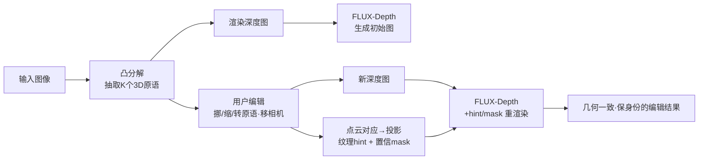

# Generative Blocks World: Moving Things Around in Pictures

**会议**: ICLR 2026  
**OpenReview**: [https://openreview.net/forum?id=ypFvQSXFNC](https://openreview.net/forum?id=ypFvQSXFNC)  
**代码**: 待确认  
**领域**: 图像生成 / 3D 感知图像编辑  
**关键词**: 凸原语分解, 3D 可编辑表示, Rectified Flow, 深度条件生成, 纹理 hint, 相机移动  

## 一句话总结
把图像场景分解成一小堆可拖动的 3D 凸多面体（blocks world），用户直接在 3D 里挪动/缩放/旋转这些原语或移动相机，再由深度+纹理 hint 条件化的 FLUX 流模型重新渲染，实现几何一致、保身份的 3D 感知图像编辑。

## 研究背景与动机
- **领域现状**：图像编辑的主流交互范式是「2D 图像中心」的——拖点（DragGAN/DragDiffusion）、文本指令、key-value 风格注入等。这些方法在像素/特征层面操作，缺少显式的 3D 表示。
- **现有痛点**：2D 拖点天然有歧义（拖一个点到底是平移还是缩放说不清），导致物体被推远时尺寸不缩、形状走样、细节丢失；纯文本难以描述复杂空间编辑；key-value 风格迁移只能保住高层语义和风格，物体身份与纹理细节在编辑后常被改写。
- **核心矛盾**：任何支持「相机移动」的编辑本质上都需要某种 3D 表示，但要构建一个既**足够精确**（让重渲染后的图真实）又**足够紧凑**（支持实时交互、可被人直接拿手挪）的 3D 表示一直很难——直接重建 mesh（Image Sculpting/OMG3D）精确但被重建质量卡脖子，box 原语（LooseControl/Build-A-Scene）紧凑但太粗、只能整体变换、且需要 LoRA 微调来弥合粗深度的域差。
- **本文目标**：造一个「完全 3D 交互」的图像编辑器，表示既紧凑又精确，支持物体级与零件级的多尺度编辑、相机移动，同时保住物体身份和纹理。
- **核心 idea**：**用凸多面体装配近似场景**——借鉴经典 Blocks World / geons 思想，但用现代凸分解（CVXNet/CDIS）把图像拆成一组稀疏凸多面体；这些原语既可选、又与物体边界对齐、又精确到能渲出与原图几乎一致的深度图。**用深度+投影纹理 hint 双条件驱动现成 FLUX**，无需微调即可重渲染，且 hint 利用 3D 对应关系把纹理「跟着原语一起搬」。
作者反复强调显式 3D 表示带来的三个隐性好处，正是 2D 编辑器难以保证的：**形状恒常**（物体在透视视图中平移时，焦点在物体坐标里移动会让形状/可见表面标记变化，远近还要相应缩放，处理不好会让观众误以为物体变了形）、**接触一致**（挪桌上的罐头时用户默认它仍贴着桌面，3D 表示能显式管理是否接触）、**形状补全**（物体有看不见的背面，挪动其他物体时背面可能产生遮挡效果，显式 3D 能捕捉）。

## 方法详解

### 整体框架
Generative Blocks World 是一条四阶段、训练-free 推理的流水线：(i) 用凸分解模型从任意输入图抽取多尺度 3D 凸原语；(ii) 渲染原语得到深度图，条件化 FLUX 生成初始图；(iii) 用户在 3D 里编辑原语和/或相机；(iv) 根据更新后的原语渲染新深度图 + 用 3D 对应关系投影出纹理 hint，再条件化生成新图，保住源纹理。其中原语预测模型需训练，生成端完全复用预训练 FLUX-Depth，不微调。

### 关键设计

**1. 凸多面体原语作为可编辑的几何中间层：让人能「伸手进场景里挪东西」。** 原语词汇表用 CVXNet 式的混合 3D 凸多面体：每个凸体由一组半平面 $H_h(x)=n_h\cdot x+d_h$ 定义，用 LogSumExp 把硬最大值平滑成可微近似 SDF $\Phi(x)=\mathrm{LogSumExp}\{\sigma H_h(x)\}$，再经 Sigmoid 转成指示函数 $C(x|\theta)=\mathrm{Sigmoid}(-\delta\Phi(x))$ 以支持可微优化。模型用 ResNet-18 编码器 + 3 层全连接解码出原语参数。关键在于这套表示同时具备四个可编辑性质：**可选（**单个原语能被直观点选拖动**）、物体对齐（**按原语分割≈按物体分割，挪一个原语常等于挪一个物体或零件**）、变尺度（**同一场景可用不同数量 $K$ 的原语表示，少则一动牵全身做粗编辑、多则做精细零件级编辑**）、精确（**原语深度图能逼近原始深度，为纹理投影打底）。由于没有原语参数的 ground truth，训练靠「让原语在深度图边界附近正确分类点」的损失而非直接回归参数；为 scale 到真实场景，作者从 LAION 收 180 万张图，用 DepthAnythingv2 生成深度监督并 lift 成点云。

**2. 深度条件 + hint/mask inpainting：把粗糙原语「洗」成真实图，又不强行覆盖。** 不直接编辑难改的深度图，而是编辑易改的 3D 原语，再 ray-march SDF 渲染出深度图去条件化 FLUX——深度条件天然能滤掉原语过分割带来的「chatter」噪声，又给高频细节留余地。生成端直接用 FLUX.1 Depth [dev]（或其 LoRA 版，LoRA 多一个 `loraweight`∈[0,1] 调深度图影响强度，应对原语过粗时）。纹理保持靠一个 hint 图 $x_{hint}$ 加一个置信 mask $m$：hint 先被 VAE 编码进 latent，去噪时只在时间窗 $t_{end}\le t\le t_{start}$ 内、按 mask 融合 $x_t=(1-m)\cdot x_{hint,t}+m\cdot x_t$，其中 $x_{hint,t}=\mathrm{SchedulerScaleNoise}(x_{hint},t,\epsilon)$ 把 hint 加噪到当前步噪声级别。窗口外完全忽略 hint，让模型自由填补低置信区域（如移动原语后露出的洞、模糊投影纹理）。

**3. 基于 3D 点云对应的纹理 hint：纹理「跟着原语一起搬」，碾压 key-value 注入。** 这是保身份的核心。常见做法是把风格图的 key/value 复制进新图（StableFlow 在 DiT 的「vital layers」做），但作者实测发现它扛不住相机/原语移动——只能保高层语义和风格，物体身份和细节会变。Generative Blocks World 改用几何投影：给定 ray-原语交点的点云、记录每像素命中哪个原语的 `convex_map`、每原语的变换（缩放/旋转/平移）和丢弃阈值 `max_distance`，建立新视图每个 3D 点相对原视图的对应关系，再把旧视图像素投影到新视图生成 $x_{hint}$。因为输入点云是同一场景在世界坐标下的表示，它**天然鲁棒地处理相机移动**；又因为对应是逐原语的，**原语一动它的纹理就跟着动**。置信 mask 标出不可信区域（多在深度不连续/移动原语边界，如狗毛），交给扩散机制清理。对应+hint 生成约 1–2 秒/图，FLUX 30 步 512 分辨率约 3 秒（H100）。

## 实验关键数据

### 主实验表格（与 LooseControl 对比，48 张随机相机移动测试图，K=10）

| 方法 | AbsRel_src ↓ | AbsRel_dst ↓ | PSNR ↑ | SSIM ↑ |
|------|------|------|------|------|
| **Ours** | **0.072** | **0.076** | **18.7** | **0.874** |
| LooseControl | 0.143 | 0.146 | 6.65 | 0.670 |

- AbsRel_src / AbsRel_dst：生成图对所请求原语几何（源/编辑后）的相对深度误差，衡量几何贴合度；PSNR/SSIM：把编辑后图按点云对应反投影回原相机视角，与源图比纹理一致性。本文在几何贴合与纹理保持上同时大幅领先（PSNR 18.7 vs 6.65）。

### 消融 / 定性对比

| 对比项 | 结论 |
|------|------|
| vs Drag Diffusion（Fig.4） | 拖点有歧义，钟表变形、推远不缩小、罐子细节丢失；本文显式操控原语，几何/尺度/纹理都对 |
| vs LooseControl 相机移动（Fig.5） | LooseControl 相机右移后苹果数量变、水位变、多出冰块/石头；本文因 hint 由几何派生而强约束变化，是「同一场景换个视角」 |
| 纹理 hint 消融（Fig.6） | 无 hint→几何对但纹理变；StableFlow（KV 注入）→常改纹理/身份；本文投影 hint→保真；两者结合偶尔改善细节（如宝箱） |
| 多尺度 K（Fig.7） | K 小时挪一个原语搬动大片纹理（粗编辑），K 大时可做精细零件级编辑 |

### 关键发现
- 原语深度与 SOTA 深度估计网络之间的域差「不显著」，故能直接喂现成 FLUX-Depth 无需微调。
- key-value 风格迁移只保高层语义/风格，对相机和原语移动这类几何编辑无能为力；几何投影 hint 才是保身份关键。
- hint 不必全程使用：当 $t_{end}>0$ 时前若干去噪步不用 hint，模型反而能清理掉 hint 中模糊/锯齿纹理，并在移动露出的「洞」处合理补全。
- 置信 mask 自动把移动原语边界（如狗毛、深度不连续处）标为低置信，交给扩散机制重画，避免投影伪影直接进入结果。
- LoRA 版的 `loraweight` 提供一个连续旋钮：原语相对目标场景过粗时调低，让模型有更多自由度补几何细节。

## 亮点与洞察
- **把经典 Blocks World 思想现代化**：用可微凸分解复活了 1963 年的「积木世界」，但原语比 cuboid 丰富得多，且与物体边界对齐，让「3D 交互式图像编辑」第一次变得既直观又精确。
- **训练-free 生成端**：原语精度足够高，深度图与真实深度域差小，因而无需像 LooseControl 那样 LoRA 微调即可驱动现成模型，工程上很轻。
- **几何 > 像素 的纹理保持**：用 3D 点云对应投影纹理，从根上解决了相机/物体移动时的纹理跟随问题，比 KV 注入更稳——这是本文最实用的洞察。
- **变尺度多分辨率控制**：同一场景可用不同 $K$ 表示，粗到搬整块、细到调零件，给用户连续的控制粒度。
- **深度作为「降噪缓冲层」**：用深度而非原语本身做条件，天然滤掉过分割带来的 chatter，又给高频细节留空间，是「粗几何 + 强生成模型」组合能成立的关键工程取舍。

## 局限与展望
- **非凸形状困难**：椅子底面、咖啡杯把手等非凸结构难表示，需更多/更多类型原语或额外分割。
- **光照不跟随**：像素空间 hint 不建模反射/阴影等视依赖光照，挪动物体时静态反射不更新（Fig.8 上）。
- **分解失败**：杂乱场景或图像边缘处稀疏深度会让原语拟合失败，把相邻物体（瓶子与纸巾）错误合并。
- **大旋转崩坏**：约 50° 大旋转会破坏几何/纹理一致性，产生扭曲或幻觉内容（如变形文字），疑似 hint 分布漂移。
- **依赖原噪声与原 prompt**：编辑需从与源图相同的噪声张量和 prompt 出发才好，现有 inverter 不支持本编辑模型；与文本 prompt 冲突的编辑易出问题。
- **景深/bokeh**：把失焦物体拉进焦点时，散景模糊可能无法被解析或锐化。
- **交互式补救**：实践中可手动扩大置信 mask 把问题区域（如不随原语移动的反射）纳入重画，缓解部分失败。
- **展望**：把点云对应直接用进网络层（如 vital layers）可能更鲁棒；当前不处理视依赖光照、也不保视频时序一致。

## 相关工作与启发
- **原语分解谱系**：Roberts Blocks World(1963)→Binford 广义柱→Biederman geons→BSP-Net/CSG-Net/CVXNet（凸多面体并）→CDIS 把 CVXNet 拟合到 RGB-D 场景，本文以 CDIS 为骨干并增强对野外深度/位姿噪声的鲁棒性。
- **条件图像合成**：layout-to-image（GAN 时代）→Stable Diffusion/ControlNet/T2I-Adapter→本文用预训练 FLUX-Depth。
- **拖点交互**：DragGAN/DragDiffusion/StableDrag 等 2D 拖点本文证明有歧义；NeRF 多视一致是另一路；本文用可编辑 3D 原语取代 2D 点。
- **物体/场景级 3D 编辑**：Image Sculpting/OMG3D 重建显式 mesh 再渲染，精确但受重建质量瓶颈；本文操作抽象原语，省去 mesh 操控复杂度。
- **原语场景创作**：LooseControl/Build-A-Scene 用 box 原语 + LoRA，受限于整体变换且需微调；本文用多凸多面体、支持相机移动、可从零拼装新场景。
- **网络视图合成的复用**：纹理一致性评估借鉴了 NVS 文献的 cycle consistency / 重投影误差思路，把编辑后图反投影回源视角再比对。
- **启发**：当编辑天然涉及 3D（相机、遮挡、透视）时，与其在 2D 特征里硬怼，不如造一个紧凑而精确的显式几何中间层——几何先行、生成模型只负责「美化」，往往更可控更保真。

## 评分
- 新颖性: ⭐⭐⭐⭐ — 把经典凸原语分解与现代流模型缝合成「完全 3D 交互」的编辑范式，几何投影纹理 hint 的思路简洁有效，明显区别于拖点和 box 原语路线。
- 实验充分度: ⭐⭐⭐ — 与 LooseControl/Drag Diffusion/StableFlow 有定量+大量定性对比，几何与纹理双指标设计合理，但量化主表仅 48 图、单一 baseline，缺更大规模与用户研究。
- 写作质量: ⭐⭐⭐⭐ — 动机层层递进（shape constancy/contact/completion），图示丰富，方法与失败案例都讲得清楚。
- 价值: ⭐⭐⭐⭐ — 训练-free、即插现成模型、交互直观，对 3D 感知图像编辑工具链有较强实用与启发价值。

<!-- RELATED:START -->

## 相关论文

- [\[ICLR 2026\] Verification of the Implicit World Model in a Generative Model via Adversarial Sequences](verification_of_the_implicit_world_model_in_a_generative_model_via_adversarial_s.md)
- [\[ICML 2026\] Generative Visual Code Mobile World Models](../../ICML2026/image_generation/generative_visual_code_mobile_world_models.md)
- [\[ICLR 2026\] WorldEdit: Towards Open-World Image Editing with a Knowledge-Informed Benchmark](worldedit_towards_open-world_image_editing_with_a_knowledge-informed_benchmark.md)
- [\[ICLR 2026\] ChronoEdit: Towards Temporal Reasoning for In-Context Image Editing and World Simulation](chronoedit_towards_temporal_reasoning_for_in-context_image_editing_and_world_sim.md)
- [\[ICLR 2026\] ImagenWorld: Stress-Testing Image Generation Models with Explainable Human Evaluation on Open-ended Real-World Tasks](imagenworld_stress-testing_image_generation_models_with_explainable_human_evalua.md)

<!-- RELATED:END -->
