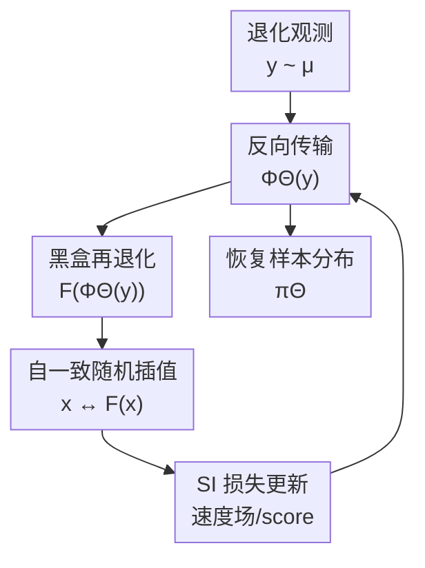

# Generative Modeling from Black-Box Corruptions via Self-Consistent Stochastic Interpolants

**会议**: ICLR2026  
**OpenReview**: [https://openreview.net/forum?id=RJHHbXhokV](https://openreview.net/forum?id=RJHHbXhokV)  
**代码**: https://github.com/modichirag/SCSI  
**领域**: 生成建模 / 随机插值 / 图像逆问题  
**关键词**: 黑盒退化, 随机插值, 逆生成建模, 自一致训练, 图像复原  

## 一句话总结
本文提出 Self-Consistent Stochastic Interpolant（SCSI），在只有退化观测样本和黑盒退化模拟器、没有干净样本和显式似然的情况下，反复学习“观测分布 → 潜在干净分布 → 再退化回观测分布”的自一致传输，从而恢复干净数据分布并可进一步训练生成模型。

## 研究背景与动机
**领域现状**：扩散模型、flow matching、stochastic interpolants 这类基于传输的生成模型，通常都假设训练者能直接看到干净样本 $x \sim \pi$。在标准图像生成里，这个假设很自然：数据集本身就是目标分布。但在科学观测、医学成像、天文光谱、压缩图像等场景里，真实信号往往只通过一个退化过程被间接观测到，训练集中可见的是 $y = F(x)$，而不是 $x$ 本身。

**现有痛点**：如果要从这些退化观测中学出干净分布，传统思路会走经验贝叶斯或 EM 路线：先用当前 prior 估 posterior，再用 posterior 样本更新 prior。问题是这条路通常需要知道似然 $P(dy|x)$，还要能做 posterior sampling。只拥有一个能把 $x$ 送进退化通道并吐出 $y$ 的模拟器，并不等价于能评估似然；而对高维图像或科学数据做 posterior sampling 又很贵，误差也难控制。

**核心矛盾**：单个样本层面的逆问题可能不可逆，比如噪声、遮挡、模糊都会丢信息；但分布层面的逆问题有时仍然可解。论文把目标写成 $K\pi = \mu$：$\pi$ 是未知干净分布，$\mu$ 是观测分布，$K$ 是由黑盒退化通道诱导的分布算子。只要 $K$ 在分布层面足够可辨识，就有机会恢复 $\pi$ 这个 prior，而不必为每个 $y$ 求精确 posterior。

**本文目标**：作者要解决的是“逆生成建模”而不只是单张图像复原：给定退化观测数据集 $\{y_i\}$ 和黑盒前向通道 $F$，学习一个从观测分布推回干净数据分布的传输映射；再把得到的恢复样本当成干净数据，用标准生成模型继续生成新样本或做条件推断。

**切入角度**：随机插值（Stochastic Interpolants, SI）本来提供了一种在两个分布之间训练速度场/score 场的方法。作者的观察是：虽然我们没有干净样本 $x \sim \pi$，但如果当前模型能把观测 $y$ 先反推成一个候选干净样本 $x^{(k)}$，那么黑盒 $F$ 可以把它再送回观测空间，得到 $\tilde y^{(k)} = F(x^{(k)})$。于是训练目标不再依赖真实干净样本，而是要求“模型自己恢复出来的样本再经过退化后，应当回到真实观测分布”。

**核心 idea**：用 stochastic interpolant 表示从退化观测到干净样本的反向传输，并通过“恢复后再退化”的自一致固定点迭代，让黑盒通道 $F$ 本身成为训练信号。

## 方法详解
### 整体框架
SCSI 的输入是观测分布 $\mu$ 中的退化样本 $y$，以及一个只能调用、不可求似然也不要求可微的前向退化通道 $F$。模型维护一个由参数 $\Theta$ 表示的反向传输映射 $\Phi_\Theta$：它从 $y$ 出发，通过 ODE 或 SDE 轨迹走到候选干净样本 $x = \Phi_\Theta(y)$。训练时，作者把这个候选样本再送入黑盒通道得到 $\tilde y = F(x)$，然后在 $x$ 与 $\tilde y$ 之间构造随机插值，并用标准 SI 的平方损失更新速度场/去噪场。

换句话说，它不是用成对的 $(x,y)$ 监督“把这个退化图像还原成那张干净图像”，而是在分布层面闭环：当前恢复分布 $\pi^{(k)} = (\Phi_{\Theta^{(k)}})_\#\mu$ 经过退化通道后应当重新匹配 $\mu$。如果这个固定点存在且前向通道在分布层面可辨识，那么固定点对应的恢复分布就是目标干净分布 $\pi$。

训练完成后，SCSI 直接给出一批恢复样本 $\Phi_\Theta(y_i)$。如果只想复原观测数据，这些样本已经有用；如果想做真正的生成建模，可以再用它们训练一个常规扩散模型，或者先训练观测分布的生成器再接上 SCSI 的反向传输。

### 关键设计
**1. 自一致固定点：把不可见的干净分布变成可验证的闭环条件**

标准 SI 需要同时采样 $x_0 \sim \pi$ 和 $x_1 \sim \mu$，再构造 $I_t = \alpha_t x_0 + \beta_t x_1 + \gamma_t z$。本文的难点正是 $x_0$ 不可见。SCSI 的处理方式是先用当前传输模型从观测 $y \sim \mu$ 生成候选干净样本 $x^{(k)} = \Phi_{\Theta^{(k)}}(y)$，再调用黑盒通道得到 $\tilde y^{(k)} = F(x^{(k)})$，于是新的插值变成

$$
I_t^{(k+1)} = \alpha_t \Phi_{\Theta^{(k)}}(y) + \beta_t F(\Phi_{\Theta^{(k)}}(y)) + \gamma_t z.
$$

这个式子的关键不在于它形式复杂，而在于它把训练数据从“真实干净样本”替换成“当前模型恢复样本”。如果当前恢复分布是对的，那么再经过 $F$ 后的分布就应该等于真实观测分布 $\mu$；如果不对，SI 训练会沿着 $x^{(k)} \leftrightarrow F(x^{(k)})$ 的轨迹更新反向传输。这样，黑盒模拟器提供的是分布一致性约束，而不是样本级标签或似然值。

**2. 双层但截断的 SI 训练：保留 EM 直觉，避开 posterior sampling**

算法可以理解成一个类似 EM 的双层迭代。外层用当前 $\Theta^{(k)}$ 产生恢复分布 $\pi^{(k)}$；内层固定这批恢复样本和它们的再退化结果，用 SI 的 least-squares loss 训练新的速度场/去噪场 $\Theta^{(k+1)}$。ODE 情况只需要学习速度场 $b$；SDE 情况还可以学习 denoiser/score 相关的 $g$，或直接学习组合 drift。

与 EM 的差别很重要。经验贝叶斯 EM 会在 E-step 里近似采样 $P^{(k)}(dx|y)$，这通常需要显式 likelihood 和可控的 posterior sampler。SCSI 的“E-step”只是调用当前传输 $\Phi_{\Theta^{(k)}}$ 和黑盒 $F$，不要求 $F$ 可微，也不要求评估 $P(dy|x)$。实践中作者甚至不把每个内层问题优化到收敛，而是从当前参数 warm start 后做 $T_{tr}$ 步 SGD；实验里 $T_{tr}=1$ 已经足够稳定，相当于对插值构造里的当前样本路径做 stop-gradient 式更新。

**3. 分布层面可辨识：把“单样本不可逆”与“prior 可恢复”区分开**

论文反复强调，样本级逆问题和分布级逆问题不是一回事。以 AWGN 为例，单个 $y=x+\sigma\xi$ 的最佳复原仍然有不可消除的 MSE；但观测分布满足卷积关系 $\mu = \pi * \gamma_\sigma$，在分布层面可以做反卷积。SCSI 正是利用这种差异：它不承诺恢复每个样本的真实原像，而是学习一个把 $\mu$ 推到某个 $\hat\pi$ 的传输，使得 $K\hat\pi = \mu$。

这个设定也解释了理论中的两个条件。首先，$K$ 必须在考虑的分布类上 injective，否则多个干净分布都会产生同一个观测分布，自一致固定点无法唯一指向 $\pi$。其次，还需要某种正则化后的 condition number $\chi$，把观测空间的误差 $KL(K\pi||K\rho)$ 控制回数据空间的误差 $KL(\pi||\rho)$。这让论文的理论不是只说“固定点是对的”，而是进一步给出在一定假设下迭代会收缩。

**4. 黑盒前向通道兼容性：从线性遮挡扩展到 JPEG、运动模糊和非高斯噪声**

很多 corrupted-data 生成模型依赖线性算子、高斯噪声或可微前向模型；这些条件在真实退化里经常不成立。SCSI 的训练只需要采样 $F(x)$，所以它自然覆盖非线性运动模糊、JPEG 压缩、Poisson 噪声这类难以写成简单可微 likelihood 的通道。对于每个样本伴随的隐藏或观测退化参数，比如随机 mask、运动模糊方向、JPEG 质量因子，作者把这些变量拼到条件里，让速度场在同一个框架下适配不同退化强度。

这种设计的代价是：模型解决的是由当前通道族定义的分布逆问题，而不是无限制的图像增强。若退化参数未知、通道不 injective，或者恢复分布类太宽导致 condition number 很差，闭环一致性可能不足以选择出唯一且语义正确的 prior。论文的 quasar 和 JPEG 实验展示了黑盒兼容性的价值，同时也说明这类方法仍依赖合理的物理模拟器和分布假设。

### 损失函数 / 训练策略
SCSI 沿用 stochastic interpolants 的回归损失。给定插值 $I_t$，速度场 $b$ 通过最小化 $\mathbb{E}[\|\hat b(t,I_t)-\dot I_t\|^2]$ 学习；SDE 版本还可以学习 $g(t,x)=\mathbb{E}[z|I_t=x]$，或把概率流中的组合 drift 一次性回归出来。反向采样时，ODE 版本设置扩散系数 $\epsilon=0$，只积分概率流；SDE 版本则加入 score/denoiser 项和 Brownian noise。

实际训练使用 Dhariwal & Nichol 风格 U-Net。图像实验中 SI 模型用 64 个 base channels，约 3200 万参数；DPS 和后续扩散生成器用 96 channels，约 7000 万参数。主实验大多采用 ODE，64 个传输步，线性 schedule $\alpha_t=1-t, \beta_t=t, \gamma_t=0$；SDE 附录中使用 $\gamma_t=t(1-t)$ 和 $\epsilon=0.1$。作者还加入一个稳定化细节：训练早期 $F(\Phi_\Theta(y))$ 可能偏离真实观测分布太远，所以以概率 $p=0.9$ 使用模型再退化样本，以概率 $1-p$ 直接使用原始 $y$，在不改变固定点的前提下缓解早期漂移。

## 实验关键数据

### 主实验
论文在三类任务上验证 SCSI：低维 two-moon AWGN、CIFAR-10/CelebA 图像退化、以及 quasar 光谱重建。最关键的图像结果是：在没有干净训练样本、没有前向梯度的情况下，SCSI 的复原 LPIPS 在随机遮挡和高噪声 Gaussian blur 上优于 DPS；而 DPS 还额外使用了干净数据预训练扩散 prior、前向梯度、更大的网络和任务级超参搜索。

| 任务 / 前向模型 | 指标 | SCSI | DPS | SI-Oracle | 结论 |
|--------|------|------|-----|-----------|------|
| Random Mask, $\sigma_n=10^{-6}$ | LPIPS↓ | 0.0051 | 0.0049 | 0.0044 | SCSI 接近使用干净 prior 的 DPS |
| Random Mask, $\sigma_n=0.1$ | LPIPS↓ | 0.0064 | 0.0072 | 0.0055 | 噪声稍高时 SCSI 优于 DPS |
| Gaussian Blur, $\sigma_n=0.1$ | LPIPS↓ | 0.005 | 0.009 | 0.0051 | 接近 oracle SI |
| Gaussian Blur, $\sigma_n=0.25$ | LPIPS↓ | 0.015 | 0.025 | 0.0011 | 高噪声下明显优于 DPS |
| Motion Blur, $\sigma_n=10^{-6}$ | LPIPS↓ | 0.0069 | 0.0026 | 0.003 | DPS 在低噪声运动模糊上更强 |
| Motion Blur, $\sigma_n=0.1$ | LPIPS↓ | 0.011 | 0.012 | 0.003 | SCSI 与 DPS 接近 |

在生成建模评价上，作者先用 SCSI 恢复随机遮挡观测，再在恢复样本上训练扩散模型。这个流程的 FID 接近 EM Posterior，并显著好于 Ambient Diffusion，同时训练成本低得多。

| 方法 | Mask 概率 $\rho$ | FID↓ | 额外条件 / 备注 |
|------|------------------|------|----------------|
| Ambient Diffusion | 0.20 | 11.70 | 线性 corrupted-data 生成基线 |
| Ambient Diffusion | 0.40 | 18.85 | 腐蚀更强时明显退化 |
| EM Posterior | 0.25 | 5.88 | 需要 EM/posterior diffusion 流程 |
| EM Posterior | 0.50 | 6.76 | 论文报告训练约 512 GPU hours |
| SCSI + diffusion | 0.25 | 5.38 | 先恢复再训练扩散模型 |
| SCSI + diffusion | 0.50 | 6.74 | 总计约 86 GPU hours |
| Clean baseline | 0.00 | 5.16 | 干净 CIFAR-10 上的大扩散模型 |

quasar 光谱实验更像科学逆问题：观测同时包含分辨率、噪声和 calibration offset。SCSI 在两个极端观测制度下都优于 Wiener filter：高分辨率低 SNR 时，观测 MSE 为 $13.94\pm0.99$，SCSI 为 $0.82\pm0.08$，WF 为 $8.02\pm0.55$；低分辨率高 SNR 时，观测 MSE 为 $0.87\pm0.05$，SCSI 为 $0.31\pm0.03$，WF 为 $0.55\pm0.04$。

### 消融实验
| 配置 | 关键指标 | 说明 |
|------|---------|------|
| ODE, two-moon low/intermediate noise | 视觉质量与 SDE 类似 | 腐蚀不强时 ODE 与 SDE 都能恢复分布 |
| SDE, two-moon high noise | 更稳定 | 高噪声下 ODE 会把 two-moon 恢复成过薄结构，SDE 更稳 |
| ODE, 高维图像主实验 | 主文默认 | 作者发现 ODE 对 schedule 和步数更鲁棒，也更省算力 |
| SDE, Gaussian blur 图像 | FID 16.8 vs ODE 6.17 | 附录显示 SDE 未充分调参时弱于 ODE |
| $T_{tr}=1$ | Wasserstein $0.0491\pm0.0038$ | 内层只做一步已足够 |
| $T_{tr}=10$ | Wasserstein $0.0460\pm0.0038$ | 略好但差异很小 |
| $T_{tr}=100$ | Wasserstein $0.0476\pm0.0047$ | 与 1/10 步接近 |
| $T_{tr}=1000$ | Wasserstein $0.0593\pm0.0021$ | 外层迭代太少，反而变差 |
| SI channels 48/64/80/96 | FID 1.69/1.40/1.26/1.17 | 更大网络提升恢复样本质量，但 wall-clock 更贵 |

### 关键发现
- SCSI 的主要优势不是在所有单样本复原指标上压过有干净 prior 的方法，而是在信息条件更弱的情况下仍能接近它们：没有 clean pretraining、没有前向梯度、没有显式 likelihood，却能在多种退化下给出可用的恢复分布。
- ODE 与 SDE 的关系很有意思：理论中 AWGN Gaussian case 显示 ODE 对 EM-like 更新有收敛率优势；实验中，高维图像主结果也更偏向 ODE，因为 SDE 对 noise schedule 和传输步数敏感。
- 黑盒兼容性是实证亮点。JPEG compression、motion blur、Poisson noise 这些通道不是传统 Ambient Diffusion 最舒服的线性高斯设定，SCSI 仍可以通过“调用 $F$”训练。
- 随机遮挡的生成 FID 说明，SCSI 恢复出来的样本不只是看起来像复原图，也足以作为后续扩散模型的训练集。

## 亮点与洞察
- 把逆问题从 posterior sampling 改写成分布自一致传输，是本文最核心的抽象。这个视角让“我不知道 likelihood”不再是硬阻碍，只要能反复调用前向模拟器，就能构造训练信号。
- stochastic interpolant 在这里不只是另一个 flow/diffusion 训练工具，而是承担了“连接当前恢复分布与其再退化分布”的固定点算子。它天然适合表达 ODE/SDE 两种反向传输，也方便做理论收缩分析。
- 论文区分了 restoration、generation 和 posterior inference 三个层次。SCSI 直接产出的是恢复数据集；要生成无限新样本，需要接一个标准生成模型；要做条件 posterior，还要在恢复出的 prior 上训练条件传输模型。这个边界说得很清楚，避免把方法夸成万能逆问题 solver。
- 理论结果虽然假设较强，但给了一个有用的语言：injectivity 保证固定点唯一，condition number 描述观测误差能否稳定传回数据空间，$\epsilon$ 则控制收缩和估计误差之间的 trade-off。

## 局限与展望
- 理论假设仍然偏理想化。KL 收缩需要 Lipschitz stability、有限 condition number、统一的 drift/score 估计误差等条件；这些条件在真实 U-Net 和复杂图像通道上很难直接验证。
- 方法恢复的是边缘干净分布 $\pi$，不是天然给定 $y$ 的 posterior $P(dx|y)$。如果下游任务需要多模态后验不确定性，还需要额外的条件生成模型或 lifted formulation。
- 对黑盒通道的依赖是一把双刃剑。SCSI 不要求似然和梯度，但要求模拟器 $F$ 足够接近真实观测过程；如果 simulator misspecification 很大，自一致固定点可能只是“适配错误通道”的分布。
- 高维实验的算力成本仍不低：单个 SI 图像模型训练约 54 GPU hours，随后训练扩散生成器还要额外成本。相比 512 GPU hours 的 EM Posterior 已经省很多，但离轻量离线复原还有距离。
- SDE 版本在低维高噪声下更稳，但高维图像中调参敏感。后续可以研究更好的 noise schedule、预条件插值、或把 Fokker-Planck channel 信息直接嵌入插值设计。

## 相关工作与启发
- **vs Ambient Diffusion**: Ambient Diffusion 从 corrupted observations 学干净分布，但主要依赖线性观测结构和相应可分析条件；SCSI 放宽到只需黑盒采样的非线性、非高斯前向通道，代价是引入迭代传输和更复杂的固定点训练。
- **vs EM Posterior / DiffEM**: EM 类方法显式构造 posterior 样本，再更新 prior；SCSI 学的是边缘分布传输，不做 posterior sampling，也不需要 likelihood。两者都可看作经验贝叶斯思想，但 SCSI 更像 model-free simulator interaction。
- **vs DPS**: DPS 是强复原 baseline，但需要已经在干净数据上训练好的 diffusion prior，并且需要前向算子的梯度。SCSI 的条件更弱，目标也更偏“从脏数据学 prior”，所以在实验中即使某些复原指标不如 DPS，也更贴近无干净数据场景。
- **vs 标准 stochastic interpolants / flow matching**: 标准 SI 连接两个已知分布；本文把其中一端替换成“当前模型恢复出的分布”，再用 $F$ 构造另一端，从而把 SI 变成一个自一致迭代算子。
- **启发**: 许多科学 ML 问题都有可靠模拟器但缺少干净样本，比如 telescope observation、cryo-EM、医学投影、传感器退化。SCSI 提供了一种思路：先恢复边缘 prior，再把 posterior inference 留给后续条件生成模型，而不是一开始就强行解每个观测的 posterior。

## 评分
- 新颖性: ⭐⭐⭐⭐⭐ 自一致 SI 把黑盒退化模拟器接进逆生成建模，思路清晰且区别于 EM/posterior sampling 路线。
- 实验充分度: ⭐⭐⭐⭐ 覆盖低维、图像和科学光谱任务，也有 ODE/SDE、内层步数和模型规模分析；但更大规模自然图像或真实退化数据还不多。
- 写作质量: ⭐⭐⭐⭐ 问题建模和理论链条完整，实验条件也交代清楚；部分理论假设较抽象，需要读者有 SI/Fokker-Planck 背景。
- 价值: ⭐⭐⭐⭐⭐ 对“只有 corrupted data + simulator”的生成建模场景很有启发，尤其适合科学观测和非可微退化通道。

<!-- RELATED:START -->

## 相关论文

- [\[ICLR 2026\] Latent Stochastic Interpolants](latent_stochastic_interpolants.md)
- [\[ICLR 2026\] Stochastic Self-Guidance for Training-Free Enhancement of Diffusion Models](stochastic_self-guidance_for_training-free_enhancement_of_diffusion_models.md)
- [\[ICLR 2026\] BézierFlow: Learning Bézier Stochastic Interpolant Schedulers for Few-Step Generation](bézierflow_learning_bézier_stochastic_interpolant_schedulers_for_few-step_genera.md)
- [\[NeurIPS 2025\] BoltzNCE: Learning Likelihoods for Boltzmann Generation with Stochastic Interpolants](../../NeurIPS2025/image_generation/boltznce_learning_likelihoods_for_boltzmann_generation_with_stochastic_interpola.md)
- [\[ICML 2026\] Support-Proximity Augmented Diffusion Estimation for Offline Black-Box Optimization](../../ICML2026/image_generation/support-proximity_augmented_diffusion_estimation_for_offline_black-box_optimizat.md)

<!-- RELATED:END -->
