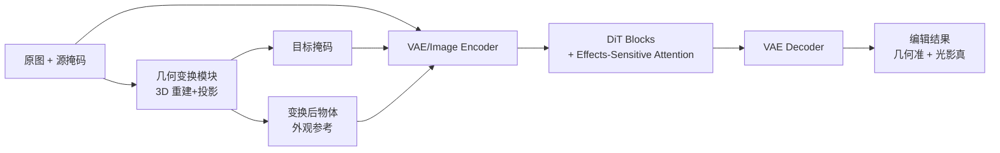

# Geometric Image Editing via Effects-Sensitive In-Context Inpainting with Diffusion Transformers

**会议**: ICLR 2026  
**OpenReview**: [https://openreview.net/forum?id=0JfUjV1uIS](https://openreview.net/forum?id=0JfUjV1uIS)  
**代码**: 待确认  
**领域**: 图像编辑 / 扩散模型 / 几何编辑  
**关键词**: 几何图像编辑, In-Context Inpainting, Diffusion Transformer, 光影效果, 注意力调制  

## 一句话总结
GeoEdit 用 3D 重建驱动的几何变换 + 基于 DiT 的 in-context 重绘，再配一个软偏置的 Effects-Sensitive Attention 专门补光影阴影，让物体的平移/旋转/缩放编辑既几何精确又物理真实。

## 研究背景与动机
**领域现状**：扩散模型把图像编辑推到了新高度，但「几何图像编辑」——把场景里的某个物体平移、旋转、缩放且保持背景一致——一直是硬骨头，尤其在大幅变换（长距离平移、大角度旋转、显著缩放）和复杂场景下。

**现有痛点**：现有方法走两条路都不够。早期「复制粘贴 + 图像融合」简单但扛不住大变换，也补不出真实光影；后来的扩散类方法把图像反演到噪声空间做仿射变换再解码，支持的变换范围更广，但**光照和阴影在物理上不自洽**；另一条用大规模视频学习环境光先验的路线，光影学到了，却**做不出精确复杂的几何变换**。

**核心矛盾**：高保真的物体几何变换 与 照片级真实的光影效果，至今没有方法能同时拿下——要么几何准但光影假，要么光影真但几何糙。

**本文目标**：一个框架内同时实现精确几何变换与真实光影生成。

**核心 idea**：① 把几何变换交给 **3D 重建**——把物体抬升到 3D 网格空间做参数化平移/旋转/缩放，再投影回 2D，几何控制天然精确；② 把光影生成交给 **Effects-Sensitive Attention（ESA）**——一个软性注意力偏置，既强化编辑区对物体特征的关注、又保留对周边区域（含光影）的跨区交互，并有理论证明其逼近「理想注意力分布」；③ 现有数据集兼顾不了精确几何与高质量光影，于是自建 **RS-Objects** 12 万对图像数据集补足训练。

## 方法详解

### 整体框架
GeoEdit 建立在 FLUX.1 Fill（一个 DiT 架构的 inpainting 模型）之上，是一个「effects-sensitive in-context inpainting」流水线。给定原图与源掩码，**几何变换模块**先用 3D 重建对物体施加平移/旋转/缩放，产出目标掩码与变换后的物体外观参考；这些连同原图一起送进 **Diffusion Transformer 模块**，成对掩码显式约束内容生成区域，**ESA** 在注意力层自适应捕捉光影；最后经 VAE 解码出编辑结果。值得一提的是，它把原本的 T5 文本编码器换成了 SigLIP 图像编码器，让「外观参考图」直接作为视觉 prompt 驱动重绘。

### 关键设计

**1. 几何变换模块：把 2D 编辑抬到 3D 再投影**
论文不在 2D 平面上硬凑变换，而是把三种操作拆开各自处理，本质都在「精确控制 + 保外观」之间求稳。平移最简单，直接把源掩码复制到目标位置，不改形状纹理，给后续变换提供稳定空间参考；缩放则用均匀缩放图像与掩码来模拟相机轴向位移带来的深度变化，给出朴素的深度线索。旋转是难点，也是 3D 重建真正发力的地方：先用 Hunyuan3D-2.1 把物体重建成带纹理的 3D 网格，旋到任意角度后做正交投影到白色画布；为避免裁切，先在 3 倍目标分辨率的画布上渲染并用深度缓冲处理遮挡，再裁到物体包围盒、乘 0.7 的安全因子缩放回目标分辨率并居中，同样流程在黑底上渲白色 mesh 得到对应掩码。这样物体在大角度旋转下依然纹理一致、几何精确，而这正是纯 2D/隐空间方法做不到的。

**2. Effects-Sensitive Attention：软偏置而非硬遮挡，光影才补得出来**
这是全文的核心。标准注意力把权重广撒到整个场景，全局一致性好但编辑区聚焦不足，物体插不进去；一个直接的修法是 **Hard Modulation**——把编辑区 query 对物体 key 的相似度直接设为 $+\infty$、其余区域照常，物体是插进去了，但因为彻底切断了编辑区与周边（含光影区）的交互，阴影和打光直接丢失。ESA 的做法是给编辑区 query 的注意力 logits 加一个温和的偏置项而非无穷大：

$$S_{ij}^{\text{ESA}} = \begin{cases} q_i k_j^\top/\sqrt{d} + \delta, & q_i \in \mathcal{T}(Q)_{\text{edit}} \\ q_i k_j^\top/\sqrt{d}, & q_i \in \mathcal{T}(Q)_{\text{aux}} \end{cases}$$

其中 $\delta = \alpha \cdot \mathrm{std}(S_{ij})$ 是按原始 logits 标准差缩放的偏置，$\alpha>0$ 控制强度。这个「加一点而不是加无穷」的设计让编辑区既加强对物体的关注，又保留对辅助区域的跨区交互，于是光影能被自然带出来。同样的思路也用在背景修复区（强化其对背景特征的注意力），且物体插入与背景修复用不同的 $\alpha$（实验取 $\alpha_1=0.1$、$\alpha_2=1$）。

**3. ESA 的理论保证：逼近理想注意力 $A^\star$**
论文不止给直觉，还给了 Thm 3.1。设 $A^\star$ 为同时关注物体区与视觉效果区的「理想注意力图」、$\rho$ 为其区分关键/非关键区域的阈值。当 $\rho \ge 1/|\mathcal{T}(Q)_{\text{edit}}|$ 时：① ESA 比标准注意力更靠近理想分布，$D_{\text{KL}}(A^\star\|A^{\text{ESA}}) \le D_{\text{KL}}(A^\star\|A)$，且差距至少为 $\delta(|\mathcal{T}(Q)_{\text{edit}}|\cdot\rho - 1)\ge 0$；② Hard Modulation 的 KL 散度发散到 $+\infty$，而 ESA 有有限上界，所以 ESA 也优于 Hard。直观说就是：软偏置在「向物体聚焦」和「逼近能生成光影的理想分布」之间取到了 Hard 做不到的平衡。

**4. RS-Objects：渲染 + 合成两阶段造数据**
精确几何变换与真实光影兼备的成对数据现实中很难采集，论文用两阶段管线自造。渲染阶段用 Blender 渲染 24 个物体丰富的场景、30 个不同物体，多相机环在参数化平移/旋转/缩放下生成 2 万对图像，用来训练初始 LoRA；合成阶段先用 AnyInsertion-V1 与 Hunyuan3D-2.1 的 mesh 生成预处理图与目标掩码，再用上一步的 LoRA 批量生成约 80 万张几何/纹理感知的物体图，最后 20 人标注团队历时三周按空间一致性、特征一致性、光照一致性等做人工质检，保留 10 万+ 高质量图–掩码对。两部分合计 12 万+ 对，构成最终 RS-Objects。

## 实验关键数据

### 主实验表格
在 GeoBench（整合 PIE-Bench 与 Subjects200K，811 张源图、5988 条编辑指令）上，遵循 FreeFine 用 7 个指标评估。2D-edits 任务 GeoEdit **七项全胜**：

| 方法 | FID↓ | DINOv2↓ | SUBC↑ | BC↑ | WE↓ | MD↓ |
|---|---|---|---|---|---|---|
| DesignEdit | 32.55 | 142.45 | 0.874 | 0.962 | 0.098 | 10.15 |
| Magic Fixup | 27.32 | 114.08 | 0.889 | 0.966 | 0.075 | 10.39 |
| FreeFine | 27.48 | 109.23 | 0.906 | 0.971 | 0.056 | 9.42 |
| **GeoEdit (Ours)** | **25.07** | **90.66** | **0.910** | **0.977** | **0.054** | **9.23** |

3D-edits（旋转，更难）同样领先：FID 64.30 vs FreeFine 65.94、DINOv2 350.69 vs 366.39、BC 0.977 vs 0.967、WE 0.051 vs 0.052。

### 消融实验表格
注意力调制与数据组成的消融（2D-edits）：

| 维度 | 变体 | FID↓ | DINOv2↓ | SUBC↑ | BC↑ | WE↓ | MD↓ |
|---|---|---|---|---|---|---|---|
| 注意力 | Standard | 29.11 | 115.04 | 0.891 | 0.969 | 0.097 | 15.75 |
| 注意力 | Hard Modulation | 27.09 | 107.83 | 0.899 | 0.964 | 0.063 | 11.11 |
| 注意力 | **ESA (Ours)** | **25.28** | **94.79** | **0.908** | **0.977** | **0.057** | **9.32** |
| 数据 | Rendered only | 26.14 | 110.82 | 0.889 | 0.969 | 0.076 | 10.55 |
| 数据 | AIGC only | 25.82 | 106.03 | 0.898 | 0.972 | 0.066 | 9.96 |
| 数据 | **Both** | **25.28** | **94.79** | **0.908** | **0.977** | **0.057** | **9.32** |

### 关键发现
- **软 > 硬 > 标准**：ESA 在 FID、Warp Error 上均最优，且定性图（Fig 7）显示它显著改善了光影阴影生成——印证了「Hard 切断交互会丢光影」的核心论点与 Thm 3.1。
- **渲染 + 合成数据缺一不可**：单用渲染数据最弱，加入 AIGC 数据全面提升，两者结合最佳，说明数据多样性强化了几何先验。
- **用户研究三维度全胜**：在 Quality / Consistency / Effectiveness 三个人评维度上，GeoEdit 在所有任务上偏好率均最高，3D-edits 中是唯一能产出「感知上令人信服」结果的方法。
- 超参取 $\alpha_1=0.1$（物体插入）、$\alpha_2=1$（背景修复）在编辑保真与上下文一致间最平衡。

## 亮点与洞察
- **把几何控制外包给 3D，把真实感外包给注意力**：几何精确靠 3D 重建天然保证，物理真实感靠 ESA 软偏置，两个难题各用对的工具解，而非用一个隐空间硬凑——是清晰的「分而治之」。
- **ESA 的「软 vs 硬」对比极有说服力**：Hard Modulation 看似更聚焦却丢光影，正好说明「跨区交互」才是光影生成的来源，软偏置保留交互是关键洞察，且有 KL 散度有限/发散的理论背书。
- **in-context 范式 + SigLIP 替换 T5**：把「变换后物体外观图」当视觉 prompt，绕开了文本描述几何变换的困难，契合几何编辑任务本质。

## 局限与展望
- **重度依赖 3D 重建质量**：旋转完全建立在 Hunyuan3D-2.1 的网格重建上，对纹理复杂、非刚体、透明/反光物体，重建误差会直接传导为编辑伪影。
- **数据构造成本高**：80 万合成 + 20 人三周人工质检才得 10 万对，管线重、可复现成本高。
- **理论假设的现实性**：Thm 3.1 依赖 $A^\star$ 的若干「必要条件」和阈值假设，理想注意力在真实场景中是否成立、$\alpha$ 是否需场景自适应仍待验证。
- 缩放仅用均匀缩放模拟深度变化，对强透视/遮挡变化的深度线索可能不足。

## 相关工作与启发
- **训练free 几何编辑**（DiffusionHandles、GeoDiffuser、FreeFine）在隐空间/注意力上施加几何约束，无需逐实例训练但大姿态变化下易出伪影、光影不自洽——GeoEdit 用 3D 重建 + 训练范式正面回应。
- **视频/3D 先验蒸馏**（Magic Fixup 等）能学环境光先验，但几何变换精度受限——本文用 RS-Objects 把「精确几何 + 真实光影」一并喂给模型。
- **视觉 in-context learning / paint-by-example**（AnyInsertion 等）把参考/示例当统一视觉 prompt 单次前向处理，GeoEdit 沿用此范式并针对几何编辑做了 ESA 等任务定制修改。
- 启发：当一个生成任务里「结构正确性」与「外观真实性」彼此拉扯时，与其在同一空间硬调，不如把可参数化的部分（几何）交给显式 3D 表示、把难以显式建模的部分（光影）交给带理论保证的注意力软偏置。

## 评分
- **新颖性**: ⭐⭐⭐⭐ 「3D 重建做几何 + 软偏置注意力补光影 + 自建数据集」组合清晰，ESA 的软 vs 硬对比与 KL 散度理论是亮点；单个组件多为已有技术的巧妙组合，故非满分。
- **实验充分度**: ⭐⭐⭐⭐ GeoBench 上 2D/3D 各 7 指标、与 8 个 baseline 对比、注意力与数据双消融、用户研究三维度，覆盖较全；缺对 3D 重建失败案例的系统分析。
- **写作质量**: ⭐⭐⭐⭐ 动机—方法—理论—实验链条清楚，图示（框架/注意力对比）到位，理论与直觉相互印证。
- **价值**: ⭐⭐⭐⭐ 同时解决几何精确与光影真实两个长期痛点，RS-Objects 数据集对社区有复用价值，落地图像编辑应用前景明确。

<!-- RELATED:START -->

## 相关论文

- [\[ICLR 2026\] ChronoEdit: Towards Temporal Reasoning for In-Context Image Editing and World Simulation](chronoedit_towards_temporal_reasoning_for_in-context_image_editing_and_world_sim.md)
- [\[ICLR 2026\] Follow-Your-Preference: Towards Preference-Aligned Image Inpainting](follow-your-preference_towards_preference-aligned_image_inpainting.md)
- [\[ICLR 2026\] Scaling Laws for Diffusion Transformers](scaling_laws_for_diffusion_transformers.md)
- [\[ICLR 2026\] MADFormer: Mixed Autoregressive and Diffusion Transformers for Continuous Image Generation](textitmadformer_mixed_autoregressive_and_diffusion_transformers_for_continuous_i.md)
- [\[CVPR 2026\] SpotEdit: Selective Region Editing in Diffusion Transformers](../../CVPR2026/image_generation/spotedit_selective_region_editing_in_diffusion_transformers.md)

<!-- RELATED:END -->
