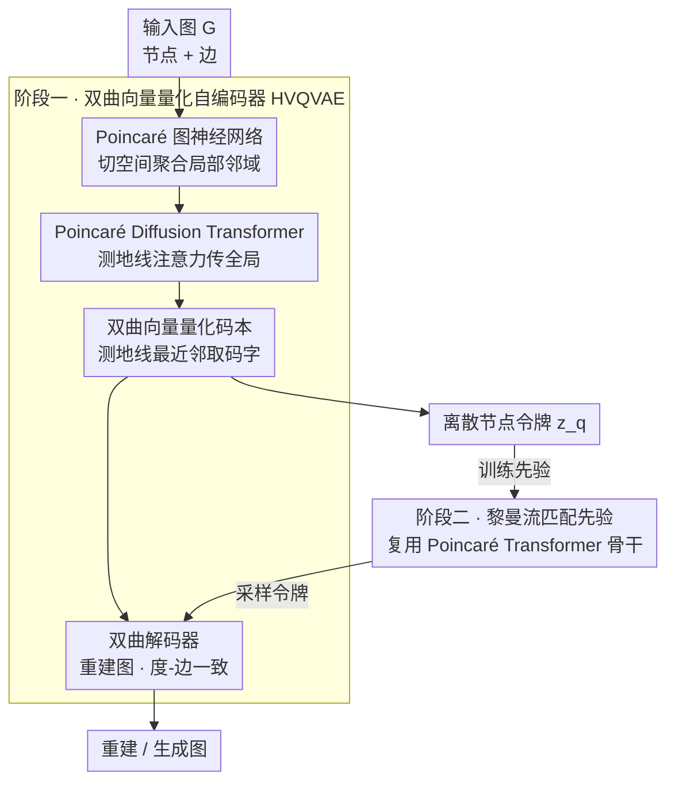

# GGBall: Graph Generative Model on Poincaré Ball

**会议**: ICLR 2026  
**arXiv**: [2506.07198](https://arxiv.org/abs/2506.07198)  
**代码**: [GitHub](https://github.com/AI4Science-WestlakeU/GGBall)  
**领域**: 图生成 / 双曲几何  
**关键词**: 双曲空间, 图生成, Poincaré球模型, 向量量化, Flow Matching

## 一句话总结
提出 GGBall，首个完全基于 Poincaré 球模型的图生成框架，通过双曲向量量化自编码器（HVQVAE）和黎曼流匹配先验，在层次图和分子图生成上达到 SOTA，在层次图数据集上平均生成误差降低 18%。

## 研究背景与动机
- **领域现状**: 图生成是分子设计、材料发现等领域的核心任务，现有方法（如 DiGress、GDSS）主要在欧氏空间或离散图空间操作
- **现有痛点**: 欧氏隐空间天生不适合捕获图数据中的层次结构和幂律度分布，导致社区结构、父子关系等被扭曲
- **核心矛盾**: 图的组合性、层次性本质与欧氏空间的线性增长体积之间存在几何不匹配
- **切入角度**: 双曲空间的指数体积增长天然适合表示层次结构（Gromov 定理）
- **核心 idea**: 将标准欧氏隐空间生成管线完全转换为双曲空间，统一用节点级隐变量表示图拓扑

## 方法详解

### 整体框架
GGBall 想把整条「编码→量化→先验→解码」的生成管线都搬到 Poincaré 球上，让双曲几何天生的指数体积增长去承接图里的层次结构和幂律度分布。整体走两阶段：第一阶段是双曲向量量化自编码器（HVQVAE），把一张图编码成 Poincaré 球上的一组离散节点级令牌——Poincaré 图神经网络先在双曲空间里聚合局部邻域结构，Poincaré Diffusion Transformer 再传播全局依赖，最后量化到一本可学习的双曲码本里，再由解码器重建图；第二阶段冻结自编码器，在这个离散隐空间上用黎曼流匹配学一个先验，其骨干复用同一套 Poincaré Transformer。生成时先从流匹配先验采样出隐变量令牌，再解码回图。整篇的关键在于全程不离开双曲流形，边的连接被当成隐空间几何的涌现属性，而不是单独建模的离散对象。

### 关键设计

**1. Poincaré 图神经网络：把消息传递整个搬进双曲空间**

欧氏 GNN 直接在向量空间里做加权求和，但双曲流形上没有现成的加法。GGBall 的做法是借切空间过渡：先用对数映射 $\log_0^c(\cdot)$ 把节点表示拉到原点切空间这个局部欧氏近似里，在那里完成邻域聚合，再用指数映射 $\exp_0^c(\cdot)$ 送回流形，从而保证每一步运算都落在 Poincaré 球内。更关键的是消息函数本身带了曲率感知的距离调制 $\text{M}(\mathbf{m}_{ij}) = \gamma_{ij} \cdot \mathbf{m}_{ij} + \beta_{ij}$，其中缩放项 $\gamma_{ij}$ 和偏置项 $\beta_{ij}$ 都是节点对双曲距离 $d_c(\mathbf{h}_i, \mathbf{h}_j)$ 的函数。这意味着两个节点在层次上离得越远，消息被调制的方式就越不同，模型因此能直接把层次关系的强度编码进表示里，而不是像欧氏 GNN 那样让所有边一视同仁。

**2. Poincaré Diffusion Transformer：用测地线距离替掉点积注意力，传播全局结构**

GNN 只能看到局部邻域，全局拓扑要靠 Transformer 补。但标准的点积注意力是欧氏内积，搬到双曲空间会破坏几何一致性。GGBall 把注意力打分换成测地线距离形式 $\alpha_{ij} \propto \exp(-\tau d_c(\mathbf{q}_i, \mathbf{k}_j))$——query 和 key 在流形上越近、得分越高，温度 $\tau$ 控制锐度。注意力算出来后的值聚合不再用普通加权和，而是用 Möbius gyromidpoint（双曲版的加权中点），保证聚合结果仍然落在流形上、几何自洽。这个 Transformer 同时承担流匹配先验的骨干，所以还会注入时间步嵌入做时间调制，让同一套结构既能编码图、又能在第二阶段为先验提供条件。

**3. 双曲向量量化自编码器（HVQVAE）：把连续双曲嵌入离散化成可学习码本**

连续隐空间难直接配一个表达力强的先验，所以 GGBall 引入向量量化，把节点嵌入映射到一本可学习的 Poincaré 码本 $\mathcal{C}$ 上。量化规则同样改成双曲版的最近邻——按测地线距离取最近码字 $\mathbf{z}_q = \arg\min_{\mathbf{c}_j} d_c(\mathbf{z}, \mathbf{c}_j)$，而非欧氏 L2。码本的初始化用双曲 k-means 聚类得到，更新交给黎曼优化器，保证码字始终待在流形上。为了避免 VQ 常见的码本坍缩，它加了稳定机制：用过期阈值检测长期不被命中的码字并替换掉，码字本身的更新则用加权 Einstein 中点（双曲均值）而非欧氏平均，让活跃码字在几何上稳定收敛。

### 损失函数 / 训练策略
第一阶段联合训练自编码器与码本，总损失 $\mathcal{L}_{\text{HVQVAE}} = \lambda_1 \mathcal{L}_{\text{AE}} + \lambda_2 \mathbb{E}[d_c^2(\text{sg}(\mathbf{z}_q), \mathbf{z})] + \lambda_3 \mathbb{E}[d_c^2(\mathbf{z}_q, \text{sg}(\mathbf{z}))]$ 由三部分构成：自编码项 $\mathcal{L}_{\text{AE}}$ 把图重建损失、度-边一致性损失和 L2 正则打包在一起，约束解码图既忠实又保持度分布；后两项是 VQ 的承诺损失，但 L2 距离全部换成测地线距离 $d_c$，并用停梯度 $\text{sg}(\cdot)$ 分别拉近码字与编码器输出。第二阶段冻结自编码器，在离散隐空间上用黎曼条件流匹配训练先验，沿测地线插值路径回归向量场，从而在双曲流形上学到从噪声到隐变量的连续传输。

## 实验关键数据

### 主实验：抽象图生成

| 方法 | Community-small Avg↓ | Ego-small Avg↓ | 空间 |
|------|---------------------|----------------|------|
| GraphVAE | 0.6233 | 0.1167 | 欧氏 |
| GDSS | 0.0460 | 0.0173 | 图空间 |
| DiGress | 0.0380 | - | 图空间 |
| HGDM | 0.0240 | 0.0137 | 混合 |
| **GGBall** | **0.0197** | **0.0117** | 双曲 |

### 分子图生成 (QM9)

| 方法 | Validity↑ | Uniqueness↑ | Novelty↑ | V.U.N↑ |
|------|-----------|-------------|----------|--------|
| DiGress | 99.00 | 96.34 | 32.51 | 31.04 |
| CatFlow | 98.47 | 97.58 | 65.62 | 63.02 |
| **GGBall** | **98.33** | **96.38** | **93.77** | **88.45** |

### 关键发现
- HVQVAE 相比 HAE 显著提升化学有效性（95.18→99.14%）和边精度
- 双曲编码器在度分布保持上比欧氏基线低 4× MMD 误差
- 新颖性 93.77% 远超 DiGress 的 32.51%，表明双曲空间的表达力更强

## 亮点与洞察
- 首个完全在 Poincaré 球上的图生成框架，统一了编码-量化-先验-解码全流程
- 用节点级隐变量统一表示图拓扑，将边连接视为隐空间几何的涌现属性
- 在 QM9 上实现最高 V.U.N 分数（新颖性+唯一性+有效性的综合度量）

## 局限与展望
- 自回归先验在初步实验中不如 FM，值得深入探索
- 分子图上有效性略低于 DiGress（98.33 vs 99.00），精细化学约束的融合有待加强
- 计算开销：双曲空间操作比欧氏操作更复杂

## 相关工作与启发
- **vs HGDM**: HGDM 仅在 Poincaré 嵌入上做边去噪，仍在离散图空间操作；GGBall 完全在双曲隐空间
- **vs DiGress**: DiGress 在图空间迭代去噪，受限于欧氏几何；GGBall 利用双曲变量解耦层次结构

## 评分
- 新颖性: ⭐⭐⭐⭐⭐ 首个全双曲图生成框架，从 GNN 到 Transformer 到 VQ 到 FM 全部双曲化
- 实验充分度: ⭐⭐⭐⭐ 覆盖抽象图和分子图，消融充分，但缺少大规模图数据
- 写作质量: ⭐⭐⭐⭐ 数学严谨，流程清晰
- 价值: ⭐⭐⭐⭐ 为非欧几何在生成模型中的应用开辟新方向

<!-- RELATED:START -->

## 相关论文

- [\[ICLR 2026\] PolyGraph Discrepancy: a classifier-based metric for graph generation](polygraph_discrepancy_a_classifier-based_metric_for_graph_generation.md)
- [\[ICLR 2026\] Verification of the Implicit World Model in a Generative Model via Adversarial Sequences](verification_of_the_implicit_world_model_in_a_generative_model_via_adversarial_s.md)
- [\[ICLR 2026\] HOG-Diff: Higher-Order Guided Diffusion for Graph Generation](hog-diff_higher-order_guided_diffusion_for_graph_generation.md)
- [\[ICLR 2026\] Continuously Augmented Discrete Diffusion model for Categorical Generative Modeling](continuously_augmented_discrete_diffusion_model_for_categorical_generative_model.md)
- [\[ICLR 2026\] GenCP: Towards Generative Modeling Paradigm of Coupled Physics](gencp_towards_generative_modeling_paradigm_of_coupled_physics.md)

<!-- RELATED:END -->
