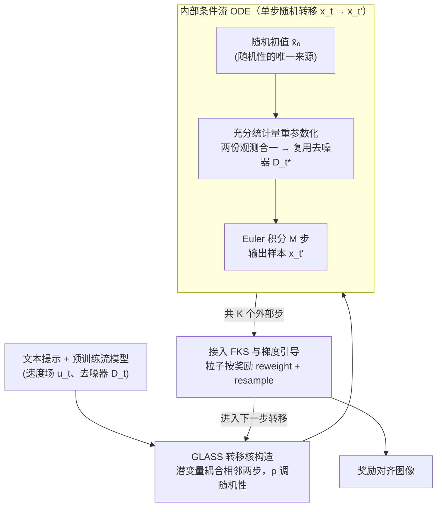

# GLASS Flows: Efficient Inference for Reward Alignment of Flow and Diffusion Models

**会议**: ICLR 2026 Oral  
**OpenReview**: [https://openreview.net/forum?id=vH7OAPZ2dR](https://openreview.net/forum?id=vH7OAPZ2dR)  
**代码**: 有  
**领域**: 图像生成 / 扩散模型  
**关键词**: flow matching, diffusion models, reward alignment, Feynman-Kac steering, GLASS, stochastic transitions, inference-time scaling

## 一句话总结
提出 GLASS (Gaussian Latent Sufficient Statistic) Flows——一种"流模型中的流模型"新采样范式，通过高斯充分统计量重参数化将随机马尔可夫转移 $p_{t'|t}(x_{t'} | x_t)$ 重铸为内部 ODE 求解问题（复用预训练去噪器，无需重训），在无需权衡 ODE 效率和 SDE 随机性的条件下实现 Feynman-Kac Steering，在 FLUX 文生图模型上一致超越 Best-of-N ODE 基线，刷新推理时奖励对齐 SOTA。

## 研究背景与动机
**领域现状**：流匹配/扩散模型在推理时可通过奖励适配算法增强性能（推理时缩放 inference-time scaling）。现有方法如 Sequential Monte Carlo (SMC)、Feynman-Kac Steering (FKS) 需要在去噪轨迹中引入随机性来探索高奖励区域。

**现有痛点**：随机转移（SDE 采样）效率远低于确定性 ODE 采样，且在少步数情况下质量严重下降。实验表明标准 FKS 使用 SDE 转移甚至无法超越简单的 Best-of-N ODE 基线——效率与随机性之间存在根本矛盾。

**核心矛盾**：FKS/SMC 等方法理论上需要 SDE 提供的随机分支来有效探索后验分布，但 SDE 的计算和质量代价使其在实际 SOTA 模型上不可行。Best-of-N ODE 足够高效但不利用中间步骤的奖励信号。

**本文目标** 消除效率与随机性之间的权衡——让 ODE 采样也能产生丰富的随机转移，使 FKS 真正有效。

**切入角度**：观察到高斯转移核 $p_{t'|t}$ 可以通过充分统计量和时间重参数化，转化为用预训练去噪器驱动的内部条件流匹配 ODE。

**核心 idea**：将随机转移重铸为"内部流匹配"ODE，通过充分统计量复用预训练模型，实现"ODE 速度 + SDE 多样性"。

## 方法详解

### 整体框架
GLASS Flows 要解决的矛盾是：奖励对齐采样（如 Feynman-Kac Steering, FKS）必须靠**随机转移**在去噪轨迹里分叉、探索高奖励区域，但传统的 SDE 随机转移在少步数下会严重降质，反而拖垮整体效果。它的整体思路是——**外层的奖励引导循环原样不动，只把其中每一步的随机转移换成一个高效的"内部流匹配 ODE"**。

具体地，外层是一个 FKS 循环：维护一组粒子，沿着 $x_1 \to \cdots \to x_0$ 的去噪轨迹推进，每隔若干步按奖励对粒子做 reweight + resample，把算力集中到高奖励轨迹上。原本 FKS 用 SDE 来完成相邻时刻 $x_t \to x_{t'}$ 的随机转移；GLASS 把**这一步随机转移本身**重铸成一个小的条件流匹配问题：给它一个随机初值 $\bar{x}_0 \sim \mathcal{N}(\bar{\gamma} x_t, \bar{\sigma}_0^2 I)$，再用预训练去噪器驱动一段辅助时间 $s\in[0,1]$ 上的内部 ODE $\frac{d\bar{x}_s}{ds} = \bar{u}_s(\bar{x}_s \mid x_t, t)$，Euler 积分 $M$ 步即得终态 $\bar{x}_1 \sim p_{t'|t}(\cdot \mid x_t)$，也就是一个 $x_{t'}$ 样本。随机性全部来自起点、之后的演化是确定性 ODE——于是同时拿到 SDE 的多样性和 ODE 的稳定与效率。这正是"流模型中的流模型"。

### 关键设计

**1. GLASS 转移核构造：用一个潜变量把两步含噪观测耦合起来，让随机性变成可调的旋钮**

要让 ODE 也能产生随机分支，第一步是给随机转移一个干净的概率模型。GLASS 把相邻两步 $(X_t, X_{t'})$ 看成同一个潜变量 $Z$ 的两个"含噪观测"：$X_t = \alpha_t Z + \sigma_t \epsilon_1$，$X_{t'} = \alpha_{t'} Z + \sigma_{t'} \epsilon_2$，并让两份噪声相关，$\text{Corr}(\epsilon_1, \epsilon_2) = \rho$。于是联合分布是一个带相关结构的高斯：

$$\begin{pmatrix} X_t \\ X_{t'} \end{pmatrix} = \begin{pmatrix} \alpha_t \\ \alpha_{t'} \end{pmatrix} Z + \begin{pmatrix} \sigma_t \epsilon_1 \\ \sigma_{t'} \epsilon_2 \end{pmatrix}, \quad \Sigma = \begin{pmatrix} \sigma_t^2 & \rho \sigma_t \sigma_{t'} \\ \rho \sigma_t \sigma_{t'} & \sigma_{t'}^2 \end{pmatrix}$$

相关参数 $\rho$ 就是控制随机性强度的那个旋钮：取 $\rho = \alpha_t \sigma_{t'} / (\sigma_t \alpha_{t'})$ 时整个核退化回标准 DDPM 转移，取 $\rho = 1$ 时退化为确定性 ODE，中间值则给出介于二者之间的随机程度。实验中默认 $\rho = 0.4$ 最优——既保留足够的探索性，又不至于像 SDE 那样把质量拖垮。

**2. 充分统计量重参数化：靠高斯共轭把两份观测压成一个，直接复用预训练去噪器，零额外训练**

有了转移核，关键问题是怎么不重训就采样它——这是 GLASS 最核心的贡献。利用高斯共轭结构，可以把 $x_t$ 和内部状态 $\bar{x}_s$ 这两个含噪观测压缩成一个充分统计量

$$S(\mathbf{x}) = \frac{\mu^\top \Sigma^{-1}}{\mu^\top \Sigma^{-1} \mu} \begin{pmatrix} x_t \\ \bar{x}_s \end{pmatrix}, \quad \mu = (\alpha_t, \bar{\alpha}_s + \bar{\gamma}\alpha_t)^\top$$

证明随之而来：GLASS 去噪器可以精确写成预训练去噪器在一个等效时间上的取值，

$$D_{\mu, \Sigma}(x_t, \bar{x}_s) = D_{t^\star}(\alpha_{t^\star} S(\mathbf{x}))$$

其中 $t^\star = g^{-1}\big((\mu^\top \Sigma^{-1} \mu)^{-1}\big)$，$g(t) = \sigma_t^2 / \alpha_t^2$ 是信噪比函数。直观上就是：把两个含噪观测合并成一份等效观测 $S(\mathbf{x})$，再喂给原模型在等效时间 $t^\star$ 去噪。正因为这一步是精确的代数恒等而非近似，整个重参数化完全训练无关，不需要给 GLASS 单独训一个网络。

**3. 内部条件流 ODE：把单步随机转移本身当成一个完整的流匹配问题来解，这就是"流中流"**

把上面的 GLASS 去噪器代回条件流匹配框架，单步随机转移 $x_t \to x_{t'}$ 就变成了一段内部 ODE。引入辅助时间 $s \in [0,1]$ 和 CondOT 调度 $\bar{\alpha}_s = s \bar{\alpha}_1$、$\bar{\sigma}_s = (1-s)\bar{\sigma}_0 + s\bar{\sigma}_1$，内部速度场为

$$\bar{u}_s = w_1(s)\, \bar{x}_s + w_2(s)\, D_{\mu(s), \Sigma(s)}(x_t, \bar{x}_s), \quad w_1(s) = \frac{\dot{\bar{\sigma}}_s}{\bar{\sigma}_s}, \quad w_2(s) = \dot{\bar{\alpha}}_s - \bar{\alpha}_s \frac{\dot{\bar{\sigma}}_s}{\bar{\sigma}_s}$$

用 Euler 法积分 $M$ 步即得一个 $x_{t'}$ 样本。这里随机性全部来自随机初始条件 $\bar{x}_0 \sim \mathcal{N}(\bar{\gamma} x_t, \bar{\sigma}_0^2 I)$，之后的演化是确定性 ODE——这正是它和 SDE 的本质区别：SDE 沿途逐步注入噪声、误差累积导致少步数下严重降质，而 GLASS 把噪声一次性放进起点，靠 ODE 积分器的稳定性把质量保住。每个内部步只需 1 次网络调用，和 SDE 单步成本相同。

**4. 即插即用接入 FKS 与梯度引导：换掉采样器即可，模型和训练都不动**

GLASS 转移核是一个 drop-in replacement——任何原本用 SDE 转移的方法只要把转移换成 GLASS 就能直接受益。最典型的就是 FKS-GLASS：在 Feynman-Kac Steering 中用 GLASS 转移替换 SDE 转移，配合粒子的 reweight 与 resample 去探索高奖励区域。若要更强的引导，还可以在内部 ODE 里直接加上奖励梯度 $\nabla_y r\big(D_{t^\star}(y)\big)\big|_{y=\alpha_{t^\star}S(\mathbf{x})}$。计算预算上，总 NFE $= K \times M$（$K$ 个外部步 × 每步 $M$ 个内部 ODE 步），所有与 SDE 的对比都在相同总 NFE 下公平进行。

## 实验关键数据

### 主实验：FLUX 文生图奖励对齐（GenEval + PartiPrompts）

| 方法 | CLIP ↑ | PickScore ↑ | HPSv2 ↑ | ImageReward ↑ | GenEval ↑ |
|------|--------|------------|---------|--------------|-----------|
| ODE (Best-of-8) | 基线 | 基线 | 基线 | 基线 | 基线 |
| FKS + SDE | < Best-of-8 | < Best-of-8 | < Best-of-8 | < Best-of-8 | ≈ |
| FKS + GLASS | **> Best-of-8** | **> Best-of-8** | **> Best-of-8** | **> Best-of-8** | **提升** |
| FKS + GLASS + Guidance | **最高** | **最高** | **最高** | **最高** | **最高** |

### 消融实验

| 配置 | 关键指标 | 说明 |
|------|---------|------|
| Best-of-N (ODE) | 基线 | 简单但无法利用中间奖励信号 |
| Best-of-N (GLASS) | ≈ Best-of-N (ODE) | 同分布采样，终点质量一致 |
| FKS + SDE | < Best-of-N (ODE) | SDE 质量太差，拖累 FKS |
| $\rho = 0.2, 0.4, 0.6, 0.8, 1.0$ | $\rho = 0.4$ 最优 | 所有 $\rho$ 值均达到 ODE 级质量 |
| DreamSim Diversity | ODE ≈ SDE ≈ GLASS | 三种方法采样自同一边际分布 |
| SiT-XL ImageNet-256 | GLASS FID ≈ ODE FID | 在非 FLUX 模型上同样有效 |

### 关键发现
- **FKS + SDE 在 FLUX 上不工作**：标准 SDE 转移在 FLUX 的 50 步 ODE 配置下严重降质（产生残余噪声），甚至不如 Best-of-N ODE
- **GLASS 消除了效率-随机性权衡**：FKS-GLASS 在所有 4 个奖励模型 × 2 个 benchmark 上一致超越 Best-of-N ODE，而 FKS-SDE 做不到
- **GLASS 的随机性来源是初始条件**：$\bar{X}_0 \sim \mathcal{N}(\bar{\gamma} x_t, \bar{\sigma}_0^2 I)$ 提供随机分支，后续演化是确定性 ODE——不同于 SDE 的逐步注入噪声
- **GLASS 精确保持边际分布**：理论证明组合 GLASS 转移后 $X_{t_k} \sim p_{t_k}$，对任意 $\rho$ 都成立

## 亮点与洞察
- **"流中流"的概念原创且优雅**：将一步随机转移视为一个完整的条件流匹配问题，概念简洁、实现简单
- **充分统计量构造的数学美感**：利用高斯共轭将两个含噪观测压缩为一个，精确复用预训练去噪器，零额外训练
- **解决了一个实际痛点**：FKS/SMC 在 SOTA 模型上因 SDE 质量差而不可用，GLASS 直接解决了此瓶颈
- **drop-in replacement 的实用性**：不改变模型、不重训、只改采样器——任何使用 SDE 转移的现有方法都可受益
- **与 RL fine-tuning 互补**：GLASS 可加速 DDPO/Flow-GRPO 等 RL 训练中的 SDE 采样，也可应用于已 fine-tune 模型的推理

## 局限与展望
- 依赖高斯转移核假设，对非高斯架构的适用性未验证
- $\rho$ 目前为常数，理论上可做时间依赖的自适应 $\rho(t, t')$
- 仅在 FLUX 和 SiT-XL 上验证，其他架构（SD3、Stable Cascade）未测试
- 内部 ODE 步数 $M$ 增大会增加计算量，最优 $M$ 的选择依赖任务
- 未与离散时间扩散模型（如 DDPM 的标准离散调度）深入对比数值稳定性

## 相关工作与启发
- **vs DDPM/SDE 采样**: GLASS 在连续极限下精确采样相同转移分布，但用 ODE 积分器代替 SDE，质量和效率同时提升
- **vs TADA (arXiv:2506.21757)**: TADA 使用相同的高斯共轭/充分统计量数学工具，但用于不同目的（augmented dynamics for training-free improvement）。GLASS 用于构建随机转移替代 SDE
- **vs Transition Matching (DTM)**: DTM 是 $\rho = 1$ 的特例，但 DTM 是不同的预训练范式（per-patch 近似），不直接可比
- **vs Best-of-N**: Best-of-N 只用终点奖励且各采样独立，GLASS+FKS 利用中间步骤奖励和粒子重采样

## 评分
- 新颖性: ⭐⭐⭐⭐⭐ "流中流"概念和充分统计量构造极具原创性，数学优雅
- 实验充分度: ⭐⭐⭐⭐ 在 FLUX 768×1360 上的 4 奖励模型 × 2 benchmark 验证有说服力，但缺少更多架构对比
- 写作质量: ⭐⭐⭐⭐⭐ 数学推导严谨清晰，从直觉到形式化层层递进，reviewer dnmw 评 "excellent soundness"
- 价值: ⭐⭐⭐⭐⭐ 直接解决了推理时奖励对齐的实际瓶颈，作为 drop-in replacement 的实用性极强

<!-- RELATED:START -->

## 相关论文

- [\[ICLR 2026\] DenseGRPO: From Sparse to Dense Reward for Flow Matching Model Alignment](densegrpo_from_sparse_to_dense_reward_for_flow_matching_model_alignment.md)
- [\[CVPR 2026\] Learning Straight Flows: Variational Flow Matching for Efficient Generation](../../CVPR2026/image_generation/learning_straight_flows_variational_flow_matching_for_efficient_generation.md)
- [\[ICLR 2026\] Diffusion Blend: Inference-Time Multi-Preference Alignment for Diffusion Models](diffusion_blend_inference-time_multi-preference_alignment_for_diffusion_models.md)
- [\[ICLR 2026\] Inference-Time Scaling of Diffusion Models Through Classical Search](inference-time_scaling_of_diffusion_models_through_classical_search.md)
- [\[ICLR 2026\] CMT: Mid-Training for Efficient Learning of Consistency, Mean Flow, and Flow Map Models](cmt_mid-training_for_efficient_learning_of_consistency_mean_flow_and_flow_map_mo.md)

<!-- RELATED:END -->
