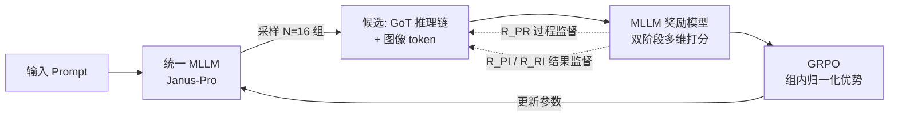

# GoT-R1: Unleashing Reasoning Capability of Autoregressive Visual Generation with Reinforcement Learning

**会议**: ICLR 2026  
**OpenReview**: [https://openreview.net/forum?id=Z9FjSaBuYt](https://openreview.net/forum?id=Z9FjSaBuYt)  
**代码**: [https://github.com/gogoduan/GoT-R1](https://github.com/gogoduan/GoT-R1)  
**领域**: 图像生成 / 自回归视觉生成 / 强化学习  
**关键词**: 自回归图像生成, Generation Chain-of-Thought, GRPO, MLLM 奖励模型, 组合式生成, 语义-空间推理  

## 一句话总结
GoT-R1 把语言模型里 GRPO 那套"靠强化学习自己摸索推理策略"的成功经验搬到自回归图像生成上，用一个 MLLM 打分的双阶段多维奖励同时监督"推理链"和"最终图像"，让模型在组合式 prompt（多物体 + 精确空间关系 + 属性绑定）上的生成保真度大幅提升。

## 研究背景与动机

**领域现状**：文生图模型（扩散 / 自回归）已经能产出高保真图像，但遇到"一只蝴蝶在蜡烛左边""一个黄桶在黑马桶旁"这类指定多物体、精确空间关系和属性绑定的复杂 prompt 时频频翻车——因为它们是把文本 embedding 直接映射到视觉特征，中间没有对场景组合结构做任何显式推理。

**现有痛点**：前作 GoT（Generation Chain-of-Thought）提出在出图前先生成一段"语义+空间坐标"的推理链（如 `a playful brown dog (100,200),(350,450)`），把复杂 prompt 拆成带坐标的物体描述，显著改善了组合保真度。但 GoT 是用人工模板标注的数据做监督微调（SFT）训出来的，这带来两个硬伤：① 推理策略被固定模板锁死，模型无法自主发现更有效的推理方式；② SFT 训出来的模型会生成"格式上很规整但内容上不忠实于 prompt"的推理链（论文 Fig.1 里蝴蝶/蜡烛的坐标就跟描述对不上），这种错误推理反而成了下游生成的瓶颈。

**核心矛盾**：自回归架构天然适合逐 token 的序列推理（和 o1/DeepSeek-R1 用 RL 激发 CoT 是同一种契合），但把 RL 搬到视觉生成上有两个独特难点——其一，视觉输出的奖励很难设计，要同时评估语义保真、空间排布、属性绑定、连贯性、美学等多个维度；其二，如果只用"结果奖励"（prompt-图像对齐），中间的推理过程就完全没人管，模型可能生成"图好看但组合错"或"推理规划得好却没落实到图上"的结果。

**本文目标**：给自回归视觉生成模型装上一套既监督推理过程、又监督最终输出的强化学习框架，让模型自主探索超越模板的推理策略。

**核心 idea**：**用 MLLM 当裁判的双阶段多维奖励 + GRPO**。基座是一个统一建模文本和图像 token 的 MLLM（Janus-Pro），先 SFT 拿到基础推理能力，再用 GRPO 让它放飞自我地探索更优推理链；奖励由 MLLM 从"prompt↔推理""推理↔图像""prompt↔图像"三对关系打分，把过程监督和结果监督串成一条完整链路。

## 方法详解

### 整体框架

GoT-R1 在 GoT 的"先推理后出图"范式上叠加强化学习。基座是统一 MLLM（如 Janus-Pro），输入 prompt，先输出一段 GoT 推理链（带物体坐标），再续接一串图像 token。训练分两阶段：**SFT 阶段**用 GoT 数据集把模板化推理能力初始化好；**RL 阶段**对每个 prompt 采样 N=16 条不同的推理链+图像候选，用 MLLM 奖励模型打分，再用 GRPO 按组内相对优势更新参数，鼓励高奖励的推理策略、压制低奖励的。

### 关键设计

**1. 双阶段多维奖励：把"过程"和"结果"都纳入监督。** 这是全文的核心，针对"只用结果奖励会放任推理过程乱来"的痛点设计。框架把生成拆成 prompt→推理链、推理链→图像两个阶段，对应定义四类奖励：$R_{PI}$ 衡量 prompt 与生成图像的整体对齐；$R_{PR}$ 衡量推理过程对 prompt 的忠实度（过程监督）；$R_{RI}$ 衡量生成图像对推理规划的还原度；$R_{HPS}$ 用 HPS v2.1 兜底图像美学质量。其中 $R_{PR}$ 又拆成语义奖励 $R_{sem}$ 和空间奖励 $R_{spa}$。总奖励取各项乘积——任何一环崩了都会把总分拉下来，强制模型四个维度都不能掉链子：

$$R_{total} = R_{PI} \cdot R_{PR} \cdot R_{RI} \cdot R_{HPS} = R_{PI} \cdot \frac{(R_{sem}+R_{spa})}{2} \cdot R_{RI} \cdot R_{HPS}$$

**2. 把坐标"画出来"再让 MLLM 评空间——空间奖励 $R_{spa}$ 的关键 trick。** 作者发现一个要命的问题：轻量级 MLLM 对文本形式的 bounding box 坐标极不敏感，直接喂坐标数字让它判断"蜂在微波炉左边对不对"基本判不准。他们的关键观察是——**MLLM 处理视觉数据时的空间理解能力远强于处理文本坐标**。于是把推理链里的文本坐标渲染成空白画布上的实际 bounding box 图像，再让 MLLM 看图打分，空间判断的可靠性显著提升。这是个很朴素但有效的"模态对齐"技巧：与其让 MLLM 做它不擅长的"读数算空间"，不如把任务转成它擅长的"看图判空间"。

**3. 语义奖励 $R_{sem}$ 的四维细分打分。** 针对推理链是否忠实于 prompt，让 MLLM 从四个维度各打 0–10 分：完整性（是否涵盖 prompt 里所有概念）、忠实性（有没有引入与 prompt 矛盾的内容）、一致性（推理逻辑是否自洽）、清晰度（表述是否连贯、格式是否规范）。这套细分让奖励信号比单一"对齐分"更细腻，直接对治 SFT 模型"格式规整但内容不忠实"的老毛病。

**4. 用 IoU 把"推理规划"和"实际出图"对账——$R_{RI}$。** RL 过程中模型有时会生成偏离自己推理规划的图（规划得好但没落实）。$R_{RI}$ 用 MLLM 对生成图像做 grounding，定位出每个物体的实际 bounding box $B_{Image}$，再和推理链里规划的 box $B_{GoT}$ 算 IoU，对所有 N 个物体取平均。这保证了"推理→图像"这一段不会脱节，让推理链真正成为出图的有效蓝图而非摆设。

## 实验关键数据

训练基于 Janus-Pro-1B / 7B，先在 LAION-GoT、JourneyDB-GoT、FLUX-GoT 上预训练 70000 步，再用 T2I-CompBench 训练集 + LAION-Aesthetics 的 prompt 做 1000 步 GRPO。奖励模型用 Qwen2.5-VL-7B，LoRA rank/alpha=32，N=16 候选，8×L40S 训 48 小时。

### 主实验

**T2I-CompBench（核心组合式生成 benchmark）**：

| 模型 | Color | Shape | Texture | 2D-Spatial | Non-Spatial | Complex |
|------|-------|-------|---------|-----------|-------------|---------|
| FLUX.1 | 0.7407 | 0.5718 | 0.6922 | 0.2863 | 0.3127 | 0.3703 |
| Stable v3 | 0.8132 | 0.5885 | 0.7334 | 0.3200 | 0.3140 | 0.3771 |
| Janus-Pro-7B | 0.6359 | 0.3528 | 0.4936 | 0.2061 | 0.3085 | 0.3559 |
| Janus-Pro-7B-GoT | 0.6551 | 0.5008 | 0.5836 | 0.2457 | 0.3113 | 0.3754 |
| **GoT-R1-7B** | **0.8139** | **0.5549** | **0.7339** | **0.3306** | **0.3169** | **0.3944** |
| GoT-R1-1B | 0.7632 | 0.5174 | 0.6589 | 0.2674 | 0.3101 | 0.3749 |

GoT-R1-7B 在 6 个类别里拿下 5 个 SOTA，最高提升约 15%；GoT-R1-1B 在多个类别上甚至超过更大的 Janus-Pro-7B。

**GenEval**：

| 模型 | Overall | Single | Two Obj | Counting | Colors | Position | Attr. Binding |
|------|---------|--------|---------|----------|--------|----------|---------------|
| Janus-Pro-7B-GoT | 0.64 | 0.99 | 0.69 | 0.48 | 0.85 | 0.43 | 0.43 |
| **GoT-R1-7B** | **0.75** | 0.99 | **0.94** | 0.50 | **0.90** | 0.46 | **0.68** |

总分 0.64→0.75 创新 SOTA，双物体生成 0.69→0.94、属性绑定 0.43→0.68 提升最猛。

**COCO 2014 通用质量**：GoT-R1-7B 的 CLIP Score 31.83、Aesthetic 5.41，300 prompt 人评偏好率 77%（vs Janus-Pro-7B 9%、Janus-Pro-GoT-7B 14%）。

### 消融实验

在 Janus-Pro-1B-GoT 上做 1000 步 GRPO，逐项验证奖励组合（T2I-CompBench）：

| 配置 | $R_{sem}$ | $R_{spa}$ | $R_{RI}$ | $R_{PI}$ | Color | 2D-Spatial | Complex |
|------|-----------|-----------|----------|----------|-------|-----------|---------|
| Baseline | ✗ | ✗ | ✗ | ✗ | 0.6336 | 0.2140 | 0.3490 |
| 仅 $R_{RI}$ | ✗ | ✗ | ✓ | ✗ | 0.3340 | 0.0076 | 0.2488 |
| 仅 $R_{PI}$ | ✗ | ✗ | ✗ | ✓ | 0.7401 | 0.2398 | 0.3724 |
| 仅 $R_{PR}$ | ✓ | ✓ | ✗ | ✗ | 0.7050 | 0.2283 | 0.3619 |
| **全部（GoT-R1-1B）** | ✓ | ✓ | ✓ | ✓ | **0.7632** | **0.2674** | **0.3749** |

### 关键发现
- **四类奖励缺一不可，全开才最优**：去掉任意一类都掉点，完整组合在几乎所有类别上最好。
- **$R_{RI}$ 不能单用**：只用 $R_{RI}$（推理-图像 IoU 对齐）会灾难性崩盘（2D-Spatial 仅 0.0076）——因为它只逼图像还原推理，但推理本身可能就是错的，等于在错误目标上较劲；必须配合 prompt 侧的过程/结果监督才有意义。
- **空间奖励的"画框再评"显著有效**：把坐标渲染成图后 MLLM 的空间判断可靠性大幅提升，是 2D-Spatial 类别涨点的关键。

## 亮点与洞察
- **把 RL-for-reasoning 干净地迁移到视觉生成**：不是简单套 GRPO，而是抓住"自回归架构天然适配序列推理"这个契合点，让图像生成也能像 o1/R1 那样自主探索推理策略，跳出人工模板的牢笼。
- **乘积式总奖励是个聪明的强约束**：四项相乘意味着任何维度短板都会被放大惩罚，逼模型全面均衡，比加权求和更能避免"刷某一维分数"的投机。
- **"画框再评"是真正可复用的洞察**：MLLM 看图比读坐标强，这个发现不止适用于本文，对任何需要 MLLM 做空间评估/打分的任务都有借鉴价值。
- **过程监督 + 结果监督的闭环**：prompt→推理→图像三段两两对账（$R_{PR}/R_{RI}/R_{PI}$），保证推理链既忠实于 prompt 又被图像如实还原，维护了整条 pipeline 的可解释性和可控性。

## 局限与展望
- **重度依赖 MLLM 奖励模型的判断力**：整套奖励的天花板被 Qwen2.5-VL-7B 的理解/grounding 能力锁住，奖励模型的偏差会直接传导到生成；论文未深究奖励 hacking 风险。
- **奖励计算成本高**：每个 prompt 采样 N=16 候选、每个候选都要 MLLM 多次打分 + grounding + 渲染画框，RL 阶段开销不小（8×L40S 48 小时虽只 1000 步）。
- **绝对空间精度仍有限**：2D-Spatial 即便提升后也只 0.33 左右，组合式空间生成远未解决。
- **未验证更复杂场景**：当前主打 2–3 物体的组合 prompt，对密集多物体场景、长程关系推理的泛化性待考。

## 相关工作与启发
- **GoT (Fang et al., 2025)**：本文直接前作，提出"出图前先做语义-空间推理链"的范式；GoT-R1 用 RL 解决了它"模板锁死 + 推理不忠实"的局限。
- **DeepSeek-R1 / GRPO (Shao et al., 2024)**：提供了无需 critic、靠组内相对奖励归一化的高效 RL 算法，是本文 RL 引擎；GoT-R1 是它在视觉生成域的成功落地之一。
- **统一 MLLM（Janus-Pro / Chameleon / Emu3）**：提供了能联合建模文本+图像 token 的基座，让"端到端生成推理链和图像"成为可能。
- **T2I-R1 (并行工作)**：同样用 BiCoT-GRPO 联合优化语义级和 token 级 CoT，思路相近，可对比借鉴。
- **启发**：当一个生成任务可以拆成"中间显式规划 + 最终输出"两段时，给中间步骤单独设计过程奖励、并用 IoU/grounding 这类客观信号对账两段一致性，是个值得推广的范式；同时"把抽象表示渲染成模型擅长的模态再评估"是提升奖励可靠性的通用技巧。

## 评分
- **新颖性**: ⭐⭐⭐⭐ 把 RL-for-reasoning 系统迁移到自回归视觉生成，双阶段多维奖励 + "画框再评"空间奖励的组合是扎实的新设计，尽管 GRPO 和 GoT 都是现成砖块。
- **实验充分度**: ⭐⭐⭐⭐ T2I-CompBench / GenEval / COCO + 人评全覆盖，奖励组合消融做得细致且揭示了"$R_{RI}$ 单用崩盘"这类有价值的结论；缺奖励 hacking 和更复杂场景的分析。
- **写作质量**: ⭐⭐⭐⭐ 动机—难点—方法—消融逻辑清晰，图示（Fig.1–4）把奖励设计讲得很直观。
- **价值**: ⭐⭐⭐⭐ 在组合式生成这个真实痛点上拿到明显 SOTA，"画框再评"和"乘积式多维奖励"两个洞察对后续 MLLM-as-reward 的工作有可复用价值。

<!-- RELATED:START -->

## 相关论文

- [\[ICLR 2026\] RePrompt: Reasoning-Augmented Reprompting for Text-to-Image Generation via Reinforcement Learning](reprompt_reasoning-augmented_reprompting_for_text-to-image_generation_via_reinfo.md)
- [\[ICLR 2026\] Group Critical-token Policy Optimization for Autoregressive Image Generation](group_critical-token_policy_optimization_for_autoregressive_image_generation.md)
- [\[NeurIPS 2025\] Janus-Pro-R1: Advancing Collaborative Visual Comprehension and Generation via Reinforcement Learning](../../NeurIPS2025/image_generation/janus-pro-r1_advancing_collaborative_visual_comprehension_and_generation_via_rei.md)
- [\[ICLR 2026\] BAR: Refactor the Basis of Autoregressive Visual Generation](bar_refactor_the_basis_of_autoregressive_visual_generation.md)
- [\[ICLR 2026\] Autoregressive Image Generation with Randomized Parallel Decoding](autoregressive_image_generation_with_randomized_parallel_decoding.md)

<!-- RELATED:END -->
