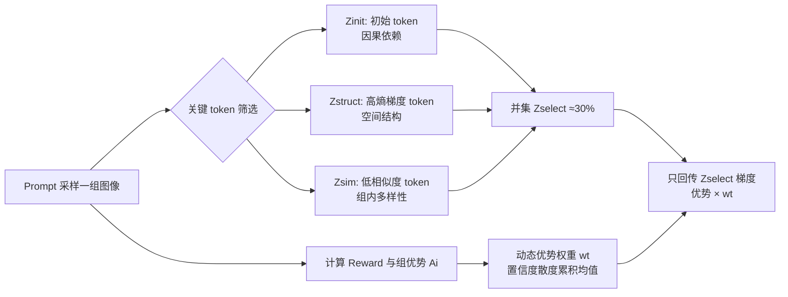

# Group Critical-token Policy Optimization for Autoregressive Image Generation

**会议**: ICLR 2026  
**OpenReview**: [https://openreview.net/forum?id=hYMlDtplMf](https://openreview.net/forum?id=hYMlDtplMf)  
**代码**: [https://github.com/zghhui/GCPO](https://github.com/zghhui/GCPO)  
**领域**: 图像生成 / 自回归视觉生成 / RLVR  
**关键词**: 自回归图像生成, GRPO, RLVR, 关键 token, token-wise 优化, 文生图  

## 一句话总结
本文提出 GCPO，从因果依赖、熵梯度空间结构、组内 token 多样性三个角度筛出自回归图像生成中真正"关键"的 token，只对其中 30% 的 token 做 RLVR 优化并配以动态优势权重，就能超越对全部 token 做 GRPO 的效果。

## 研究背景与动机
- **领域现状**: RLVR（尤其是 GRPO）已被陆续引入自回归（AR）文生图，通过视觉 CoT、奖励设计、定制数据集等方式提升偏好对齐与可控性，取得了不错进展。
- **现有痛点**: 现有方法默认"每个图像 token 对训练目标的贡献相同"，对整条 token 序列做**均匀优化**。但显然不同 token 角色迥异——有的决定全局结构，有的只是背景或细节，一视同仁既浪费算力又稀释了真正重要的梯度信号。
- **核心矛盾**: LLM 推理里已有工作发现"fork token"（高熵逻辑连接词）主导推理能力，但视觉生成因为**因果 AR 建模**和**二维双向图像结构**更复杂，无法直接套用 LLM 那套靠熵筛 token 的做法（作者实测发现高/低熵 token 并不稳定对应结构或背景）。
- **本文目标**: 找到一套适配 AR 视觉生成的关键 token 识别准则，并对这些 token 做有针对性的 token-wise 优化。
- **核心 idea**: **【关键 token 筛选 + 动态优势权重】** 从三个互补视角（因果、熵梯度、组内多样性）取并集圈出关键 token，再用策略/参考模型间的置信度散度作为逐 token 的探索权重，只回传关键 token 的策略梯度。

## 方法详解

### 整体框架
GCPO 在标准 GRPO 流程上插入"选 token + 加权"两步：对每个 prompt 采样一组图像并算 reward 后，先按三条准则圈出关键 token 集合 $Z_{select}=Z_{init}\cup Z_{struct}\cup Z_{sim}$，再为每个关键 token 计算一个基于置信度散度的动态优势权重 $w_t$，最后在 GRPO 目标里用指示函数只保留关键 token 的梯度、并把优势乘上 $w_t$。

### 关键设计

**1. 因果依赖筛初始 token：早期 token 是全局结构的地基。** AR 的因果注意力让先生成的 token 持续影响后续所有 token。作者向不同位置注入噪声做扰动实验：扰动前 58 个 token（index 0~58）会大幅改变图像全局结构，而扰动中段 token（index 250~308）只影响局部细节。这证明初始 token 充当"全局先验与结构引导"，因此把最前面 $K_{init}$ 个 token 选为 $Z_{init}$。

**2. 熵梯度筛结构 token：不是熵本身、而是熵的空间梯度才稳定对应结构。** 作者先模仿 LLM 用熵筛 token，却发现高/低熵 token 在不同 prompt 下并不稳定（有时对应背景、有时对应主体）。进一步把熵序列 reshape 成二维熵图后观察其 2D 梯度，发现**高熵梯度 token 一致对应主体结构和区域间过渡带**，且随 RL 训练愈发明显。为抑制噪声先做局部邻域平均 $\bar{H}_t=\text{mean}(H_t+H_t^{(l,u)}+H_t^{(u)}+H_t^{(r,u)}+H_t^{(l)})$，再用中心差分算梯度，取梯度最大的 $K_{struct}$ 个 token 作 $Z_{struct}$。

**3. 组内多样性筛 token：相似度低的位置才携带有效奖励信息。** GRPO 靠样本间差异指引优化方向，一组太相似的样本提供的奖励信息有限。作者把视角下沉到 token 级：在一组 $G$ 张图像的同一序列位置 $t$ 上算两两 token embedding 的余弦相似度 $S^{(t)}_{jk}=\frac{e_{t,j}\cdot e_{t,k}}{\lVert e_{t,j}\rVert\lVert e_{t,k}\rVert}$，再取平均 $\bar{S}_t$。背景纹理区相似度高、几乎反映不出图间差异，而复杂结构区相似度低、信息更丰富，于是选 $\bar{S}$ 最低的 $K_{sim}$ 个 token 作 $Z_{sim}$。三类子集各占序列长度 10%，并集约 30%。

**4. 动态优势权重：用策略/参考模型的置信度散度自动调节探索强度。** 不同关键 token 需要不同探索约束——初始 token 探索要克制以防全局结构崩塌，高熵梯度与低相似度 token 则该更大胆探索。作者发现策略模型与参考模型间的置信度散度恰好满足这种分布（初始 token 散度小、结构 token 散度大），且随训练动态变化。考虑到位置 $t$ 由其前序 token 预测，用累积平均散度作权重 $w_t=\frac{1}{t}\sum_{j=1}^{t}\text{clip}(C^{policy}_j-C^{ref}_j,-\epsilon_w,\epsilon_w)$，其中 $C$ 为 log 概率，$\epsilon_w$ 截断防止权重过大破坏稳定性。最终目标在 GRPO 基础上对每 token 乘指示函数 $\mathbb{I}[z_t\in Z_{select}]$ 并把优势乘以 $w_t$。

## 实验关键数据

### 主实验表格（GenEval Overall）

| 模型 | Overall↑ | Counting↑ | Color↑ | Position↑ |
|------|----------|-----------|--------|-----------|
| Janus-Pro-7B | 0.80 | 0.59 | 0.90 | 0.79 |
| Janus-Pro-7B + GRPO | 0.87 | 0.71 | 0.94 | 0.92 |
| **Janus-Pro-7B + GCPO** | **0.90** | **0.90** | 0.90 | **0.95** |
| Janus-Pro-1B + GRPO | 0.84 | 0.59 | 0.84 | 0.88 |
| **Janus-Pro-1B + GCPO** | **0.85** | 0.63 | 0.88 | 0.91 |
| LlamaGen + GRPO | 0.39 | 0.28 | 0.68 | 0.11 |
| **LlamaGen + GCPO** | **0.42** | 0.25 | 0.71 | 0.13 |

仅用 30% token，GCPO 全面超越用全部 token 的 GRPO，Janus-Pro-7B Counting 任务大涨 +0.19。

### 消融实验表格（T2I-CompBench / DEQA / HPS）

| Init-T | HG-T | LS-T | DAW | GenEval↑ | Shape↑ | Texture↑ | Spatial↑ | HPS↑ |
|:--:|:--:|:--:|:--:|--------|--------|----------|----------|------|
| ✓ | - | - | - | 0.82 | 0.282 | 0.350 | 0.237 | 28.90 |
| - | ✓ | - | - | 0.81 | 0.271 | 0.337 | 0.226 | 28.22 |
| - | - | ✓ | - | 0.82 | 0.294 | 0.410 | 0.257 | 28.78 |
| ✓ | ✓ | ✓ | - | 0.83 | 0.292 | 0.399 | 0.294 | 29.33 |
| ✓ | ✓ | ✓ | ✓ | **0.85** | **0.320** | **0.480** | **0.322** | **29.61** |

三类关键 token 缺一不可，三者并集明显优于任意单类；再叠加 DAW 后所有指标到达最优。

### 关键发现
- **30% 关键 token > 70% 其余 token**: 70% 的"其余 token"数量是关键 token 的两倍多，但训练效果反而掉点，凸显选对 token 比数量重要。
- **几乎零额外开销**: GCPO 相比 GRPO 仅增加约 1% 训练时间。
- **选择比例存在拐点**: 每类在 10% 选择比时增益最大（+2.81），超过后增益锐减（+0.95）；总比例从 30%→45% 几乎无提升，30%→15% 显著退化，对全部 token 用 DAW 反而下降。
- **跨范式可迁移**: 方法可从 next-token 扩展到 next-scale 预测范式（初始 token 重要性→早期 scale 重要性）。
- **泛化性**: 在与训练数据分布差异较大的 T2I-CompBench 上，Shape +0.117、Texture +0.118、Spatial +0.134。

## 亮点与洞察
- **把"关键 token"概念从 LLM 推理迁到 AR 视觉生成，并指出关键差异**：视觉生成不能直接靠熵筛，作者用"熵的二维空间梯度"这个更精细的代理量解决了熵与结构对应不稳定的问题。
- **三视角互补且各有清晰物理含义**：因果（时间维度地基）、熵梯度（空间维度结构）、组内多样性（奖励信息密度），三者正交，消融验证缺一不可。
- **动态优势权重免去手工调参**：用策略/参考模型置信度散度自然得到"初始 token 少探索、结构 token 多探索"的分布，省掉人工指定约束。
- **效率与性能双赢**：30% token 即超越全 token baseline，且几乎无额外时间成本。

## 局限与展望
- 三个子集各固定 10%、总 30% 属经验设定，虽有消融支撑但缺乏自适应选择机制，不同模型/数据可能并非最优。
- 关键 token 筛选依赖熵图、组内相似度等中间量计算，方法描述偏启发式，理论上为何这三者恰好是"关键"缺乏更深刻的统一刻画。
- 主要在 GenEval/HPS 类 reward 与 Janus-Pro/LlamaGen 上验证，对更大规模统一多模态模型或更复杂奖励（如人工偏好细粒度）的可扩展性有待进一步检验。
- 对全部 token 使用 DAW 反而掉点的现象提示动态权重与 token 选择存在耦合，机制尚未完全厘清。

## 相关工作与启发
- **AR 视觉生成**: LlamaGen、Emu3、Show-o、Janus-Pro、BAGEL 等用 next-token 范式做文生图，并逐步统一理解与生成。
- **视觉生成的 RL**: SimpleAR 验证 GRPO 能提升 AR 模型美学与对齐，T2I-R1 联合优化语义级与 token 级 CoT，本文沿用 GRPO 框架但首次做 token 级筛选。
- **LLM 的关键 token RL**: Critical Tokens Matter、ConfPO、fork token 等工作启发了"少而精地优化关键 token"的思路，本文将其从一维文本推广到二维因果图像序列。
- **启发**: "并非所有 token 都值得同等优化"是一个跨模态通用的洞察；如何用模型自身信号（熵梯度、组内多样性、置信度散度）无监督地定位关键单元，是把 RLVR 做精做省的一条通用路径。

## 评分
- **新颖性**: ⭐⭐⭐⭐ — 首次系统性地把"关键 token 优化"引入 AR 视觉生成，三视角筛选 + 熵梯度代理量 + 动态优势权重的组合有清晰创新。
- **实验充分度**: ⭐⭐⭐⭐ — 覆盖 GenEval/T2I-CompBench/DrawBench/HPS 多基准与三个 base 模型，消融拆解每个组件且分析了选择比例拐点，较扎实。
- **写作质量**: ⭐⭐⭐⭐ — 动机—观察—方法链条清晰，图表（扰动实验、熵梯度图、相似度图）有力支撑论点。
- **价值**: ⭐⭐⭐⭐ — 30% token 超越全 token 且几乎零额外开销，对实际 RLVR 文生图训练有直接的效率与效果价值。

<!-- RELATED:START -->

## 相关论文

- [\[CVPR 2026\] MaskFocus: Focusing Policy Optimization on Critical Steps for Masked Image Generation](../../CVPR2026/image_generation/maskfocus_focusing_policy_optimization_on_critical_steps_for_masked_image_genera.md)
- [\[CVPR 2026\] Curriculum Group Policy Optimization: Adaptive Sampling for Unleashing the Potential of Text-to-Image Generation](../../CVPR2026/image_generation/curriculum_group_policy_optimization_adaptive_sampling_for_unleashing_the_potent.md)
- [\[ICLR 2026\] Hyperspherical Latents Improve Continuous-Token Autoregressive Generation](hyperspherical_latents_improve_continuous-token_autoregressive_generation.md)
- [\[ICLR 2026\] NextStep-1: Toward Autoregressive Image Generation with Continuous Tokens at Scale](nextstep-1_toward_autoregressive_image_generation_with_continuous_tokens_at_scal.md)
- [\[ICLR 2026\] PCPO: Proportionate Credit Policy Optimization for Preference Alignment of Image Generation Models](pcpo_proportionate_credit_policy_optimization_for_preference_alignment_of_image_.md)

<!-- RELATED:END -->
