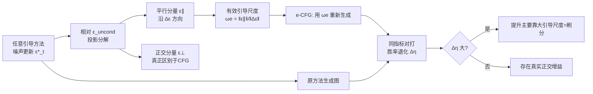

# Guidance Matters: Rethinking the Evaluation Pitfall for Text-to-Image Generation

**会议**: ICLR 2026  
**OpenReview**: [https://openreview.net/forum?id=T9xcbgFD3k](https://openreview.net/forum?id=T9xcbgFD3k)  
**代码**: [https://github.com/Maxwells-Demons/Guidance-Matters](https://github.com/Maxwells-Demons/Guidance-Matters)  
**领域**: image_generation / diffusion guidance / 评估方法  
**关键词**: Classifier-Free Guidance、人类偏好模型、评估偏置、有效引导尺度、扩散采样  

## 一句话总结
本文揭露了一个被忽视的评估陷阱——HPSv2、ImageReward 等人类偏好指标对大引导尺度有强烈偏好，单纯调大 CFG 即可刷分；并提出"有效引导尺度校准"的 GA-Eval 框架做公平比较，结果发现近期八种扩散引导方法的"提升"大多只是在偷大引导尺度的红利。

## 研究背景与动机
- **领域现状**：扩散模型的文生图质量越来越依赖 HPS v2、PickScore、ImageReward 等基于人类偏好微调的奖励模型来评估，业界普遍认为它们比 IS/FID/CLIPScore 更贴近人类审美，于是成了各种新引导方法（SAG、PAG、SEG、CFG++、FreeU、APG、Z-Sampling 等）刷榜的事实标准。
- **现有痛点**：人类天然偏爱色彩浓烈鲜艳的图片，而大引导尺度恰恰会让图像高度饱和。这两者高度相关，导致人类偏好模型对大引导尺度产生系统性偏好——**即使图像已经过饱和、出现伪影、质量明显劣化，分数反而更高**（图 1 中 SDXL 在 ω 从 5.5 升到 20，HPSv2 一路涨）。
- **核心矛盾**：新引导方法报告的"提升"到底是真的改善了生成质量，还是仅仅因为它们隐式地增大了有效引导强度、从而骗过了带偏置的指标？现有评估范式无法区分这两种来源。
- **本文目标**：把各方法相对 CFG 的"平行增强效应"（等价于放大引导尺度）与"正交效应"（真正区别于 CFG 的新东西）解耦，在相同有效引导强度下做公平对照，量化每个方法究竟有多少提升是"刷出来的"。
- **核心 idea**：**用偏置去检验偏置**——既然指标偏爱大引导尺度，那就把每个方法折算成等效的 CFG 尺度（e-CFG），让标准 CFG 在同样强度下重新生成图像并比较胜率，胜率掉得越多说明该方法越是在吃大引导尺度的红利。

## 方法详解

### 整体框架
论文不是提出一个更好的生成方法，而是搭建一套**揭露+校准+证伪**的评估体系：先实证人类偏好指标对大引导尺度的偏置，再把任意引导方法的噪声更新投影分解出"平行/正交"两部分、由平行分量算出有效引导尺度 $\omega_e$，最后用 $\omega_e$ 校准后的 e-CFG 与原方法对打、看胜率退化 $\Delta\eta$；并故意造一个"只会刷分不会真改善"的 TDG 方法来反向坐实这个陷阱的存在。

### 关键设计
**1. 大引导尺度偏置的实证揭露：指标被高饱和度蒙蔽。** 论文系统地把多种指标在 ω∈[5.5, 20] 区间扫一遍（图 3，SDXL + Pick-a-Pic），发现除 AES 和 PickScore 外，HPSv2、ImageReward、CLIPScore 都随引导尺度增大而单调给出更高分。机理是：大引导尺度在每步把预测噪声 $\tilde{\epsilon}_t$ 更强地推向条件噪声 $\epsilon^{cond}_t$ 方向，使图像语义对齐更强但同时过饱和；CLIP 系指标默认"对齐好=图好"，而在人类偏好数据上微调的奖励模型其训练数据本身就与高饱和结果重叠，于是被大引导尺度系统性地骗高。这意味着"调大 ω"几乎是免费的刷分手段。

**2. 有效引导尺度 $\omega_e$：把任意方法折算回 CFG 强度。** 标准 CFG 的更新是 $\tilde{\epsilon}_t = \epsilon^{uncond}_t + \omega(\epsilon^{cond}_t - \epsilon^{uncond}_t)$，引导尺度可写成 $\omega = \frac{\tilde{\epsilon}_t - \epsilon^{uncond}_t}{\Delta\epsilon}$，其中 $\Delta\epsilon = \epsilon^{cond}_t - \epsilon^{uncond}_t$。对任意引导方法，其更新 $\tilde{\epsilon}^*_t - \epsilon^{uncond}_t$ 都可沿 $\Delta\epsilon$ 做正交分解为平行分量 $\epsilon^{\parallel}_t = \frac{\langle \tilde{\epsilon}^*_t - \epsilon^{uncond}_t,\ \Delta\epsilon\rangle}{\langle \Delta\epsilon, \Delta\epsilon\rangle}\Delta\epsilon$ 与正交分量 $\epsilon^{\perp}_t$。平行分量等价于"沿 CFG 方向的增强"，因此定义每步有效引导尺度 $\omega^e_t = \frac{\|\epsilon^{\parallel}_t\|}{\|\Delta\epsilon\|}$，并沿采样路径取平均 $\omega_e = \frac{1}{T}\sum_t \omega^e_t$ 作为该方法折算后的恒定 CFG 尺度。对那些在 latent 层面改采样（如 Z-Sampling、CFG++）而非显式改噪声的方法，可用 DDIM 反推 $\tilde{\epsilon}^*_t = \frac{\sqrt{\alpha_t}x_{t-1} - \sqrt{\alpha_{t-1}}x_t}{\sqrt{\alpha_t\beta_{t-1}} - \sqrt{\alpha_{t-1}\beta_t}}$ 把它还原成等效噪声更新，从而统一处理。

**3. GA-Eval 胜率退化 $\Delta\eta$：相同有效强度下的公平对照。** 拿到 $\omega_e$ 后，让标准 CFG 用 $\omega_e$ 生成 e-CFG 图像，与原方法图像在同一指标 $M$ 下逐 prompt 对打。定义胜率 $\eta^{CFG} = \frac{1}{N}\sum_i \mathbb{1}[M(X^*_i, c_i) \succ M(X^{CFG}_i, c_i)]$（对标准 ω 的 CFG）和 $\eta^{e\text{-}CFG}$（对 $\omega_e$ 的 e-CFG），核心诊断量是退化 $\Delta\eta = \eta^{CFG} - \eta^{e\text{-}CFG}$：如果一个方法相对原始 CFG 看似领先，但一旦让 CFG 也跑到同样的有效引导强度，领先就大幅缩水（$\Delta\eta$ 大），就说明它的提升主要来自偷引导尺度而非真实创新。

**4. TDG——故意造一个"会刷分但没用"的方法来证伪。** 为坐实陷阱可被滥用，作者顺手设计了 Transcendent Diffusion Guidance：随机把文本 prompt $c$ 中的 token 替换成空 token $\varnothing$ 得到弱化提示 $c^*$，用同一网络得到弱条件分数 $\epsilon^{weak}$ 与 $\epsilon^{cond}$、$\epsilon^{uncond}$ 组合进采样（模仿 SAG/PAG 等"造弱条件"的套路，零额外训练）。结果 TDG 在传统评估框架里能显著拉高 HPSv2 等人类偏好分，但在 GA-Eval 下立刻露馅（$\Delta\eta$ 高），证明"刷高人类偏好分"和"真改善质量"完全可以脱钩。

## 实验关键数据
模型涵盖 SD-XL、SD-2.1、SD-3.5、DiT-XL/2；数据集用 Pick-a-Pic(100)、DrawBench(200)、HPD(3200)、GenEval(553)，以及 COCO-30K / ImageNet-50K 算 FID/IS；指标用 HPSv2、AES、PickScore、ImageReward、CLIPScore。

### 主实验：SD-XL 上八种方法的胜率与退化（节选，格式 ηCFG/ηe-CFG/Δη 取 Average η 与 ωe）

| 方法 | Pick-a-Pic Avg η (CFG/e-CFG) | ωe | DrawBench Avg η (CFG/e-CFG) | ωe |
|---|---|---|---|---|
| Z-Sampling | 73% / 69% | 13.51 | 74% / 60% | 11.94 |
| CFG++ | 61% / 58% | 8.91 | 61% / 51% | 8.89 |
| SAG | 60% / 52% | 8.14 | 59% / 52% | 7.42 |
| TDG(刷分用) | 57% / 48% | 8.27 | 58% / 52% | 8.24 |
| SEG | 52% / 47% | 6.10 | 52% / 51% | 6.13 |
| PAG | 52% / 45% | 5.98 | 53% / 53% | 6.04 |
| FreeU | 46% / 40% | 7.47 | 47% / 43% | — |
| APG | 41% / 38% | 15.05 | — | — |

> 标准 ω=5.5，但多数方法 ωe 远大于 ω（如 Z-Sampling 13.51、APG 15.05），说明它们隐式放大了引导强度；一旦让 CFG 跟到同样强度，几乎所有方法胜率都掉到 50% 上下甚至更低。

### 消融/对照发现

| 现象 | 证据 |
|---|---|
| 指标对大引导尺度的偏好方向 | HPSv2/ImageReward/CLIPScore 随 ω↑ 单调升；**AES、PickScore 反而下降**（图 3） |
| AES 出现负 Δη | 对多个方法 AES 给大引导尺度更低分，与人类偏好指标方向相反 |
| TDG 验证 | 传统框架显著刷高人类偏好分，GA-Eval 下退化明显 |

### 关键发现
- **单纯调大 CFG 即可与多数引导方法打平**：e-CFG 在视觉上（图 2）能取得与近期方法相当的"提升"。
- **几乎所有方法都存在严重胜率退化**，只有 Z-Sampling 在折算到 ωe 后仍维持较高胜率，暗示它含有较多正交于 CFG 的真实增益；APG 甚至打不过标准 CFG（因为它专门压制过饱和、反被偏好指标"歧视"）。
- 不同指标自带不同偏向，单看某一个人类偏好分极易被误导。

## 亮点与洞察
- **"用偏置检验偏置"的思路很巧**：不需要新建无偏指标，只要在相同有效引导强度下对照胜率退化，就能把"刷尺度"和"真创新"分开，几乎对任意引导方法即插即用。
- **投影分解给出可计算的 $\omega_e$**：把"这个方法相当于多大的 CFG"变成一个有闭式表达、沿路径平均的标量，且通过 DDIM 反推统一了"改噪声"和"改 latent"两类方法。
- **TDG 作为反例的说服力强**：主动造一个明知无用却能刷分的方法，是对评估陷阱最直接的证伪，提醒社区"分数涨了≠方法有效"。
- **对 APG 被"歧视"的观察**有现实意义：真正去做减饱和、更符合人眼舒适度的方法，反而在现行指标下吃亏，说明评估范式正在错误地激励研究方向。

## 局限与展望
- 论文长于"证伪"而短于"立新"：揭示了陷阱、给了诊断工具，但没有提出一个无大引导尺度偏置的新评估指标，社区仍缺一把干净的尺子。
- $\omega_e$ 把方法的全部平行增强折算成单一恒定 CFG 尺度，对那些时变/局部自适应引导强度的方法可能损失信息；沿路径平均也可能掩盖逐步差异。
- 评测主要围绕 SD 系列与少量 DiT，对更新的 flow-matching / rectified flow 架构下偏置是否同样成立、TDG 套路是否仍奏效，尚需验证。
- 正交分量 $\epsilon^{\perp}$ 究竟带来多少"有益"信息，论文给了胜率证据但缺乏更细的质量解析，未来可深入刻画"正交增益"的本质。

## 相关工作与启发
- **CFG 及其改进谱系**：SAG/PAG/SEG（造弱条件/扰动注意力）、CFG++（解决 off-manifold）、FreeU（放大 U-Net 特征）、Z-Sampling/W2SD（去噪与反演的引导差）、APG（投影消过饱和）——本文把它们统一拉进同一个 $\omega_e$ 标尺下重审。
- **评估指标**：从 IS/FID/CLIPScore 到 HPSv2/PickScore/ImageReward/MPS 等人类偏好模型，本文首次系统指出后者的大引导尺度偏置。
- **启发**：任何依赖"学习出来的偏好模型"做基准的领域（图像、视频、3D 生成乃至对齐评估）都应警惕——指标与某个易调超参高度相关时，刷榜可能只是在拟合指标的盲点。做评估应同时报告减饱和/抗刷分类指标，并在相同"有效强度"下做对照。

## 评分
- 新颖性: ⭐⭐⭐⭐⭐ 视角新颖，把"评估陷阱"从直觉变成可计算的 $\omega_e$ + $\Delta\eta$ 诊断，并用 TDG 反例钉死结论，对整个引导方法社区是当头一棒。
- 实验充分度: ⭐⭐⭐⭐ 覆盖 4 模型 × 6 数据集 × 多指标、八种方法横评，证据扎实；略欠新架构（flow matching）与更系统的人类主观对照实验。
- 写作质量: ⭐⭐⭐⭐ 逻辑清晰、图表有力（图 1/2/3 直观），个别英文表述有小瑕疵但不影响理解。
- 价值: ⭐⭐⭐⭐⭐ 直击文生图领域刷榜乱象，提供可复用的公平对照工具，极有可能改变后续引导方法的评估惯例与研究方向。

<!-- RELATED:START -->

## 相关论文

- [\[ICLR 2026\] Routing Matters in MoE: Scaling Diffusion Transformers with Explicit Routing Guidance](routing_matters_in_moe_scaling_diffusion_transformers_with_explicit_routing_guid.md)
- [\[ICLR 2026\] Rethinking Global Text Conditioning in Diffusion Transformers](rethinking_global_text_conditioning_in_diffusion_transformers.md)
- [\[CVPR 2026\] GenColorBench: A Color Evaluation Benchmark for Text-to-Image Generation](../../CVPR2026/image_generation/gencolorbench_a_color_evaluation_benchmark_for_text-to-image_generation.md)
- [\[ICLR 2026\] ImageDoctor: Diagnosing Text-to-Image Generation via Grounded Image Reasoning](imagedoctor_diagnosing_text-to-image_generation_via_grounded_image_reasoning.md)
- [\[CVPR 2026\] Self-Evaluation Unlocks Any-Step Text-to-Image Generation](../../CVPR2026/image_generation/self-evaluation_unlocks_any-step_text-to-image_generation.md)

<!-- RELATED:END -->
