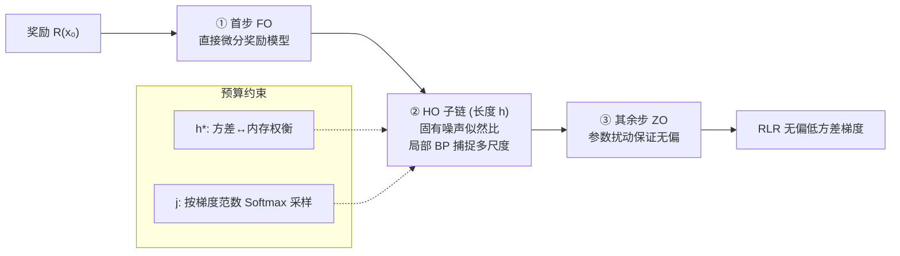

# Half-order Fine-Tuning for Diffusion Model: A Recursive Likelihood Ratio Optimizer

**会议**: ICLR 2026  
**OpenReview**: [https://openreview.net/forum?id=AZ6lqcvHLX](https://openreview.net/forum?id=AZ6lqcvHLX)  
**代码**: [https://github.com/RTkenny/RLR-Optimizer](https://github.com/RTkenny/RLR-Optimizer)  
**领域**: 图像生成 / 扩散模型微调 / 梯度估计  
**关键词**: 扩散模型对齐, 似然比梯度估计, 半阶优化, 奖励微调, 无偏低方差  

## 一句话总结
本文提出 **Recursive Likelihood Ratio (RLR)** 优化器，把扩散链的每一步梯度估计统一进「一阶（FO）+ 半阶（HO）+ 零阶（ZO）」的设计空间，利用扩散模型自带的随机噪声做似然比估计，得到一个**无偏、低方差、内存可控**的扩散微调梯度估计器，同时解决了截断 BP 的结构性偏差与 RL 的高方差问题。

## 研究背景与动机
- **领域现状**：扩散模型（DM）已是高保真视觉生成的主流框架，但预训练后要对齐到下游偏好（美学、人类偏好奖励等）必须做后训练微调。微调的核心难点在于：要对一条递归去噪链（T 步，每步共享 backbone）求奖励对参数的梯度。
- **现有痛点**：两条主流路线都有硬伤。① **全量反向传播（full BP）** 理论精确但内存随步数和模型规模爆炸——SD 1.4 用 batch=1、50 步全量 BP 需约 **1TB 显存**，不现实。② **截断 BP**（AlignProp/VADER 等）只回传最后 T′ 步省内存，但引入**结构性偏差**，丢掉早期步的多尺度信息，越截越容易**模型坍塌**（生成退化成纯噪声，Figure 3）。③ **强化学习（RL，如 DDPO）** 不依赖步间可微连接、省显存，但梯度估计**方差极大**、样本效率低、收敛慢。
- **核心矛盾**：截断 BP 用**偏差**换内存，RL 用**方差**换内存，二者无法同时兼顾「无偏 + 低方差 + 内存可控」。
- **本文目标**：在给定计算/内存预算下，构造一个**无偏且方差最小**的扩散梯度估计器。
- **核心 idea**：**用扩散模型「自带的固有噪声」替代外部扰动做似然比估计**。把整条链拆成可自由组合的逐步估计策略——首步用一阶直接穿过奖励模型，中间一段用「半阶」局部 BP 子链捕捉多尺度信息，其余步用零阶参数扰动保证无偏。因为既需要扰动（像零阶）又保留一段局部 BP（像一阶），故称 **Half-Order（半阶）**。

## 方法详解

### 整体框架
RLR 把扩散链每一步的梯度估计视为一个**可选策略的设计空间** $\mathcal{G}_{full}$：每步可选一阶（FO，精确 BP）、半阶（HO，似然比 + 局部 BP）或零阶（ZO，参数扰动）。在「无偏约束 + 预算约束下最小化方差」的优化问题里，通过结构化约束把设计空间收敛成一个具体形态：**首步 FO 接奖励模型 → 从随机起点 $j$ 起一段长度为 $h$ 的 HO 子链 → 其余步全用 ZO**。最后只剩两个决策变量——子链长度 $h$ 与起点 $j$，分别由方差-内存权衡和梯度范数重要性采样确定。

微调目标是最大化期望奖励 $\max_\theta \mathbb{E}[R(x_0)] = \mathbb{E}_{z_{1:T}}[R(\phi_{1:T}(x_T, z_{1:T}; \theta))]$，其中 $x_{t-1} = \phi_t(x_t, z_t; \theta)$ 是带噪声 $z_t = \sigma_t \epsilon_t$ 的单步去噪映射。

### 关键设计

**1. 三类估计子构成的统一设计空间：把梯度估计当成一个可优化的组合问题。** 论文跳出「BP vs RL 二选一」的框架，指出每个时间步都能独立选三种策略之一：FO 用精确反传（方差最小、内存最大）；ZO 直接给参数加扰动 $\phi_t(x_t; \theta + \sigma_t\epsilon_t)$、仅靠函数值估计 $\frac{R(\cdot)}{\sigma_t}\epsilon_t$（内存最小、方差最大）；本文新提的 HO 则利用**固有噪声 $z_t$**（而非外加扰动）配合似然比技巧，给出形如 $R(x_0)\cdot D_\theta^\top \phi_{t:t+h-1}\cdot \nabla\log f(z_t)$ 的估计——其中 $D_\theta\phi_{t:t+h-1}$ 是长度为 $h$ 的局部子链雅可比，$f$ 是噪声密度。关键洞察是 **RL 只是 $h=1$ 的 HO 特例**，三者都无偏，方差/内存呈 FO < HO < ZO 的连续谱（Table 1），从而把离散的方法选择变成可在预算下优化的连续设计。

**2. RLR 估计器的结构化形态：FO + HO 子链 + ZO 三段拼接。** 为让问题可解，论文加两条结构约束：HO 步必须连续成一条子链（拆开会放大方差），FO 必须直接接奖励模型（符合其定义）。于是完整估计器写成三项之和（式 6）：
$$G = \underbrace{D_\theta^\top \phi(x_1, z_1; \theta)\frac{dR(x_0)}{dx_0}}_{\text{首步一阶}} - \underbrace{R(x_0)D_\theta^\top \phi_{j:j+h}\nabla_z\ln f(z_j)}_{h\text{ 步半阶}} - \underbrace{\sum_{i\in C} R(x_0)\nabla_z\ln f(z_i)}_{\text{零阶}}$$
首项让梯度精确穿过奖励模型、避免黑箱处理；中间 HO 项借助固有扰动 $z_j$ 开一条局部 $h$ 步 BP 链，**专门捕捉某个尺度的视觉信息**；末项对剩余步 $C=\{1,\dots,T\}\setminus\{j,\dots,j+h\}$ 直接给参数注噪做 ZO，无需缓存中间潜变量、内存极省。三段拼起来**整体无偏**，又把昂贵的全量 BP 压缩成一小段。

**3. $h$ 与 $j$ 的求解：方差-内存权衡 + 重要性采样。** 子链长度 $h$ 通过对估计器方差上界做代理目标、在内存预算 $B_h h + B_z(T-1-h)\le B$ 下求解（式 7），得到闭式解 $h^* = \min\{\lfloor\frac{B-B_z(T-1)}{B_h-B_z}\rfloor, \lfloor\frac{TV_z}{2(V_z-V_h)}-1\rfloor\}$（式 8）。由于 HO/FO 方差 $V_h$ 远小于 ZO 方差 $V_z$，第二项约等于 $T/2-1\approx 24$ 通常更大，实践中 $h$ 直接由内存预算决定（取 $B_h=8\text{GB},\ B_z=0.24\text{GB}$，30–40GB 预算下推荐 $h=2$），**无需估计方差常数**。起点 $j$ 则用**梯度范数衡量各步重要性**，从类别分布 $j\sim\text{CAT}(\text{Softmax}(\|g_1\|,\dots,\|g_{T-h}\|))$ 采样，让 HO 子链优先落在梯度信息最丰富的步上。

**4. Diffusive Chain-of-Thought（DCoT）：与 RLR 天然协同的多尺度提示技巧。** 利用扩散「由粗到细」的生成特性，把整条链分成 coarse/mid/fine 三段（靠近初始噪声管轮廓、中间管几何结构、靠近输出管细节），并让 ChatGPT 把原始 prompt 拆成对应三个尺度的多级提示，不同生成步用不同 prompt 条件。当某个尺度有缺陷（如手部生成）时，**把 HO 子链的采样起点约束到该尺度对应的步区间** $j\sim U(a,b)$（手部任务设 $a=30, b=40$），就能精准地把低方差无偏梯度集中到出问题的尺度上，实现提示技巧与梯度估计的协同。

## 实验关键数据

### 主实验：Text2Image 奖励分数（Table 2，节选）

| 模型 | 方法 | PickScore | HPSv2 | AES | ImageReward |
|------|------|-----------|-------|-----|-------------|
| SD1.4 | Base | 16.19 | 22.08 | 4.42 | 32.90 |
| SD1.4 | DDPO (RL) | 17.53 | 22.79 | 5.52 | 52.06 |
| SD1.4 | AlignProp (截断BP) | 19.17 | 27.02 | 6.02 | 67.18 |
| SD1.4 | **RLR** | **21.38** | **29.22** | **6.65** | **76.55** |
| SD2.1 | Base | 16.25 | 23.32 | 4.57 | 36.03 |
| SD2.1 | **RLR** | **23.22** | **30.98** | **6.74** | **83.07** |

RLR 在两个 DM、多个奖励模型上**全面超越** RL 与截断 BP 基线。

### 主实验：Text2Video（VBench，Table 3，节选）

| 方法 | 动态度 DD | 美学 AQ | 加权平均 |
|------|-----------|---------|----------|
| VADER (截断BP) | 66.94 | 66.04 | 83.45 |
| DDPO (RL) | 58.29 | 59.23 | 80.78 |
| **RLR** | **70.69** | **66.15** | **84.63** |

RLR 在动态度（DD）和美学（AQ）上大幅领先，加权平均最优，甚至超过 Gen-2/Pika 等闭源 API 模型。

### 消融实验（Table 5，SD1.4 + HPD v2）

| 变体 | PickScore | HPSv2 | AES | ImageReward |
|------|-----------|-------|-----|-------------|
| RLR w/o HO & ZO（退化为单步截断BP） | 18.43 | 23.66 | 5.78 | 60.07 |
| RLR w/o ZO（有偏） | 20.11 | 27.07 | 6.23 | 68.35 |
| RLR w/o HO（无偏但缺多尺度） | 19.28 | 26.70 | 5.92 | 63.85 |
| **RLR（完整）** | **21.38** | **29.22** | **6.65** | **76.55** |

### DCoT 协同（Table 4）
RLR-DCoT 在所有指标上最优（ImageReward 49.88 vs RLR w/o 的 43.09），证明多尺度提示与 HO 子链定向能协同增益。

### 关键发现
- **样本效率**（Figure 5）：DDPO 收敛极慢（高方差），AlignProp 早期与 RLR 相当但后期严重坍塌，唯有 **RLR 能持续稳定提升奖励**。
- **无偏性至关重要**：消融中 w/o ZO（有偏）虽然重排了计算图，仍劣于完整 RLR；说明保证整体无偏比单纯加 HO 更关键。
- **$h$ 不宜盲目增大**：方差随 $h$ 减小但收益递减，内存线性增、时间增长更快，实践 $h=2$ 即可。

## 亮点与洞察
- **统一视角**：把 BP、RL、ZO 全部纳入「FO/HO/ZO 逐步组合」的设计空间，并证明 RL 是 HO 在 $h=1$ 的特例，这是非常漂亮的理论统一。
- **巧用固有噪声**：扩散模型每步本就有随机噪声 $z_t$，RLR 不额外注入扰动而是直接拿它做似然比估计，几乎零额外成本地获得无偏梯度。
- **理论完备**：论文给出截断 BP 的结构性偏差命题、各估计器方差比较、以及 RLR 的收敛保证，形式化解释了「为什么截断 BP 会坍塌而 RLR 不会」。
- **工程可落地**：$h$ 有内存预算闭式解、$j$ 有重要性采样，超参几乎免调，且把 1TB 全量 BP 压到 30–40GB 量级。

## 局限与展望
- HO 子链长度 $h$ 与起点分布 $J$ 的最优选择依赖方差/梯度范数的代理估计，理论闭式解建立在 $V_h \ll V_z$、$T>2$ 等假设上，极端配置下是否仍最优有待验证。
- 实验集中在 SD 1.4/2.1 与 VideoCrafter 等相对早期骨干，对 SDXL、DiT、Flow Matching 等新架构的可迁移性未充分展示。
- DCoT 依赖人工/ChatGPT 写多尺度提示并手动指定缺陷尺度区间（如手部 $a=30,b=40$），自动化程度有限，规模化时需要更系统的尺度-缺陷定位。
- 仍依赖一个外部奖励模型，奖励本身的偏差与 reward hacking 问题不在本文解决范围内。

## 相关工作与启发
- **截断 BP 路线**（AlignProp、VADER、DRaFT）：省内存但有结构性偏差，本文用 Figure 3 直观展示其坍塌现象并给出理论命题。
- **RL 路线**（DDPO、DPO 变体、RLHF-inspired）：无偏但高方差，本文证明它是 HO 的退化特例。
- **零阶/前向学习**（Salimans 进化策略、似然比/扰动分析等随机梯度估计）：RLR 直接继承 LR 技术并把它「局部化」成 HO 子链，是把经典随机优化思想嫁接到扩散链的成功案例。
- **启发**：把「逐步选择估计策略 + 预算约束下最小化方差」作为统一框架，思路可推广到任何**长递归/长序列**的梯度估计场景（如自回归长序列 RL、长视频扩散），固有噪声似然比这一招尤其值得借鉴。

## 评分
- **新颖性**: ⭐⭐⭐⭐⭐ 提出 HO 估计器并构建 FO/HO/ZO 统一设计空间，把扩散微调梯度估计形式化为带预算的方差最小化问题，视角与方法都新。
- **实验充分度**: ⭐⭐⭐⭐ 覆盖 Text2Image（两 DM、四奖励模型）与 Text2Video（VBench、含闭源对比），有样本效率曲线、消融与 DCoT 协同；但骨干偏早期、缺 SDXL/DiT 验证。
- **写作质量**: ⭐⭐⭐⭐ 问题动机清晰、理论与方法递进自然、Figure 3/4 直观；公式较密、部分理论细节下放附录需对照阅读。
- **价值**: ⭐⭐⭐⭐⭐ 同时攻克截断 BP 偏差与 RL 高方差两大顽疾，把全量 BP 内存从 1TB 压到几十 GB，对扩散对齐微调有很强的实用与理论双重价值。

<!-- RELATED:START -->

## 相关论文

- [\[ICCV 2025\] ShortFT: Diffusion Model Alignment via Shortcut-based Fine-Tuning](../../ICCV2025/image_generation/shortft_diffusion_model_alignment_via_shortcut-based_fine-tuning.md)
- [\[ICLR 2026\] Any-step Generation via N-th Order Recursive Consistent Velocity Field Estimation](any-step_generation_via_n-th_order_recursive_consistent_velocity_field_estimatio.md)
- [\[ICLR 2026\] Diffusion Fine-Tuning via Reparameterized Policy Gradient of the Soft Q-Function](diffusion_fine-tuning_via_reparameterized_policy_gradient_of_the_soft_q-function.md)
- [\[ECCV 2024\] Memory-Efficient Fine-Tuning for Quantized Diffusion Model](../../ECCV2024/image_generation/memory-efficient_fine-tuning_for_quantized_diffusion_model.md)
- [\[ICLR 2026\] Quantization-Aware Diffusion Models for Maximum Likelihood Training](quantization-aware_diffusion_models_for_maximum_likelihood_training.md)

<!-- RELATED:END -->
