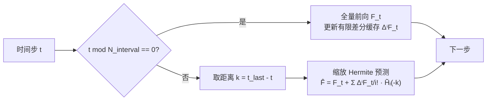

# HiCache: A Plug-in Scaled-Hermite Upgrade for Taylor-Style Cache-then-Forecast Diffusion Acceleration

**会议**: ICLR 2026  
**OpenReview**: [https://openreview.net/forum?id=faYbbo1KsQ](https://openreview.net/forum?id=faYbbo1KsQ)  
**代码**: [https://github.com/fenglang918/HiCache](https://github.com/fenglang918/HiCache)  
**领域**: 扩散模型加速 / 特征缓存  
**关键词**: 扩散加速, 特征缓存, Hermite 多项式, 免训练, Diffusion Transformer  

## 一句话总结
HiCache 发现 DiT 特征的有限差分近似服从多元高斯分布，据此用「缩放 Hermite 多项式」替换 TaylorSeer 中的单项式 Taylor 基，配合双重缩放保证数值稳定，在 FLUX.1-dev 上实现 5.55× 加速且画质反超原始模型，并能零额外 FLOPs 即插即用地升级现有缓存方法。

## 研究背景与动机
- **领域现状**：扩散模型迭代采样代价高昂，特征缓存（feature caching）作为免训练加速手段流行起来。早期方法（DeepCache、FORA、ToCa、ClusCa）属于「缓存后复用」（cache-then-reuse），直接搬用相邻时间步特征；近期 TaylorSeer 提出「缓存后预测」（cache-then-forecast），用 Taylor 级数对未来时间步特征做外推，大幅降低缓存误差。
- **现有痛点**：Taylor 级数的标准单项式基（monomial basis）是单调增长的，无法刻画扩散特征轨迹中那些**非单调、带拐点**的复杂动态。论文 Figure 2 直观显示 Taylor 外推在轨迹转折处明显偏离真值，误差随预测步长和阶数迅速发散（Proposition 1：误差 $O(k^{m+1}/(m+1)!)$，在拐点处上确界可任意大）。
- **核心矛盾**：数学工具（单调多项式）与经验性质（非单调特征轨迹）不匹配，导致在质量崩坏之前能达到的加速比被卡死。
- **本文目标**：找到一个与特征动态的内在统计性质对齐的预测基，在不改变 Taylor 式预测器形式、不增训练、不增显著算力的前提下，把「缓存后预测」推到更高加速比仍保质。
- **核心 idea**：**[经验观察→理论选基]** 实测发现 DiT 特征的导数近似一致呈现多元高斯分布，而按逼近论 Hermite 多项式正是高斯相关过程的（潜在）最优正交基，因此用缩放 Hermite 基替换单项式基。

## 方法详解

### 整体框架
HiCache 保持 TaylorSeer 的「周期性全量计算 + 中间步外推」骨架不变：每隔 $N_{interval}$ 步做一次完整前向并更新各阶有限差分缓存 $\{\Delta^i F_t\}$，其余步用预测器外推。唯一改动是把外推公式里的单项式基 $(-k)^i$ 换成缩放 Hermite 基 $\tilde H_i(-k)$——同样的预测器形式、同样的计算结构，仅多几个标量基函数求值，无额外矩阵乘法。

### 关键设计
**1. 高斯性发现：为什么是 Hermite 而不是别的基。** 方法的根基是一个经验+理论的双重论证。经验上（Proposition 2），特征差 $\Delta F_t = F(x_t,t) - F(x_{t-\Delta}, t-\Delta)$ 通过局部线性化得到条件高斯性 $\Delta F_t \approx \mathcal{N}(\mu_t, \Sigma_t)$，再经网络多组件聚合由中心极限定理收敛到高斯（Berry-Esseen 界 $O(\eta_t)$）。理论上（Corollary 1），当时间相关性可用高斯核 $K(s,t)=\exp(-(s-t)^2/2\tau^2)$ 近似时，其 Karhunen-Loève 展开的特征函数恰好是缩放 Hermite 函数——也就是说在加权 $L^2(\gamma)$ 意义下 Hermite 是最优正交基。这把「换基」从经验技巧上升为有逼近论依据的选择。

**2. 缩放 Hermite 基：拿振荡性换单调性。** 标准 Hermite 多项式 $H_n(x)=(-1)^n e^{x^2}\frac{d^n}{dx^n}e^{-x^2}$ 满足递推 $H_{n+1}(x)=2xH_n(x)-2nH_{n-1}(x)$，与单调增长的 Taylor 基不同，它本身是**振荡**的，这种振荡天然能贴合特征轨迹的拐点，并提供隐式正则。但 Hermite 在大自变量下数值不稳，论文引入收缩因子 $\sigma\in(0,1)$ 定义缩放版 $\tilde H_n(x)=\sigma^n H_n(\sigma x)$，最终预测器为
$$\hat F^{HiCache}_{t-k} = F_t + \sum_{i=1}^{N_{order}} \frac{\Delta^i F_t}{i!}\,\tilde H_i(-k)$$

**3. 双重缩放：一个超参同时治两种发散。** 收缩因子 $\sigma$ 起双重稳定作用：输入缩放 $\sigma x$ 把预测约束在稳定的振荡区间内，系数缩放 $\sigma^n$ 抑制高阶项的指数增长。误差界 $\|E_{total}\| \le O\!\big((\sigma\sqrt 2|\Delta s|)^{N+1}/\sqrt{(N+1)!}\big) + O(\Delta t_{hist}\sqrt N) + O(\epsilon_{machine})$ 显示，当 $\sigma\sqrt 2|\Delta s|<1$ 时 Hermite 截断误差因 $\sigma^{N+1}$ 抑制而可小于 Taylor 的对应项，得到条件优越性。这个双重缩放机制还能**单独**作用到 TaylorSeer 上带来增益（消融中的 Hi-Taylor）。

**4. 即插即用：零成本升级现有缓存框架。** 因为只换基函数、不动预测器形式与计算图，HiCache 是模型无关、免训练的 drop-in 替换，可直接嵌入任意 Taylor 式「缓存后预测」管线（TaylorSeer、ClusCa 等），算力开销仅每步几个标量求值。

## 实验关键数据
覆盖文生图（FLUX.1-dev）、文生视频（HunyuanVideo）、类条件生成（DiT-XL/2）、超分（Inf-DiT）四类任务。

### 主实验表格（FLUX.1-dev 文生图，5.55× 加速）

| 方法 | Speed (FLOPs) ↑ | ImageReward ↑ | PSNR ↑ | LPIPS ↓ |
|---|---|---|---|---|
| FLUX.1-dev 50 步（基线） | 1.00× | 0.9872 | ∞ | 0.0000 |
| FORA (N=7) | 5.55× | 0.7418 | 28.32 | 0.5409 |
| ClusCa (N=7) | 5.52× | 0.9480 | 28.63 | 0.4560 |
| TaylorSeer (N=7,O=2) | 5.55× | 0.9572 | 28.63 | 0.4520 |
| **Hi-ClusCa** (N=7) | 5.52× | 0.9840 | 28.94 | 0.4040 |
| **HiCache** (N=7,O=2,σ=0.5) | 5.55× | **0.9979** | 28.94 | 0.3982 |

HiCache 在 5.55× 加速下 ImageReward（0.9979）甚至**超过未加速基线**（0.9872）；把 ClusCa 的 Taylor 预测器换成 Hermite（Hi-ClusCa）即零额外 FLOPs 将其 ImageReward 从 0.9480 提到 0.9840。

### 消融实验表格（FLUX.1-dev，σ 与双重缩放）

| 配置 | Speed | ImageReward ↑ | LPIPS ↓ |
|---|---|---|---|
| HiCache σ=0.4 | 5.55× | 0.9683 | 0.3914 |
| **HiCache σ=0.5** | 5.55× | **0.9979** | 0.3982 |
| HiCache σ=0.7 | 5.55× | 0.9623 | 0.4479 |
| HiCache σ=1.0（无收缩） | 5.55× | 0.7586 | 0.7208 |
| Hi-Taylor σ=0.5 | 5.55× | 0.9624 | 0.3998 |
| TaylorSeer (N=7) | 5.55× | 0.9572 | 0.4520 |

### 关键发现
- **收缩因子至关重要**：σ=1.0（即不缩放的原始 Hermite）ImageReward 崩到 0.7586，印证 Hermite 大自变量数值不稳；σ=0.5 是甜区。
- **双重缩放可独立增益**：Hi-Taylor（仅给 TaylorSeer 加双重缩放、不换基）就把 0.9572 提到 0.9624，说明缩放机制本身正交于换基。
- **加速比越高优势越大**：视频任务在 N=7,O=2 时 HiCache 对 TaylorSeer 的领先更明显（VBench 79.65 vs 79.28）；类条件生成在 ~7.1× 时 FID/sFID 相对提升约 6%。

## 亮点与洞察
- **「经验观察→选最优基」的范式很优雅**：先实测特征差的高斯性，再用逼近论（KL 展开/Hermite 是高斯过程最优正交基）反推工具选择，把换基从 trick 提升为有理论支撑的设计。
- **一个超参 σ 同时治两类发散**（输入越界 + 系数指数爆炸），并且这个稳定化机制可拆出来单独用，工程上很干净。
- **真正的 drop-in**：不改预测器形式、不动计算图、零额外矩阵乘，能给整条缓存方法家族「白嫖」式涨点，落地门槛极低。

## 局限与展望
- 高斯性论证依赖局部线性化和 CLT 近似，是「近似最优」而非严格最优；对非高斯特征动态的任务是否仍占优未充分讨论。
- σ 需按任务/加速比调（如 schnell 用 σ=0.3、dev 用 σ=0.5），虽是单超参但仍需调参，缺自适应选择机制。
- 实测 wall-clock 加速（超分约 2.43×）显著低于理论 FLOPs 加速（~5.93×），存在访存/调度瓶颈，端到端落地收益需具体评估。

## 相关工作与启发
- **TaylorSeer**（Liu et al., 2025）是直接前身，开创「缓存后预测」并用 Taylor 外推；HiCache 指出其单项式基的根本缺陷并替换之。
- **缓存后复用系**（DeepCache/FORA/ToCa/ClusCa）是被升级对象，HiCache 能即插即用增强它们。
- 启发：当一类方法的核心是「用某组基函数拟合信号」时，先去量化信号的统计性质（这里是高斯性），再据此挑数学上最优的基，往往比堆更高阶/更复杂模型更有效。

## 评分
- 新颖性: ⭐⭐⭐⭐ 「特征差高斯性 → Hermite 最优基」的洞察新颖且有逼近论支撑，不是简单换基。
- 实验充分度: ⭐⭐⭐⭐ 四类任务 + 多模型 + σ/双重缩放消融 + 即插即用验证，覆盖全面。
- 写作质量: ⭐⭐⭐⭐ 命题/推论组织清晰，Figure 2 的轨迹对比直观点题，理论与经验衔接顺畅。
- 价值: ⭐⭐⭐⭐ 免训练、零额外 FLOPs、可升级整族缓存方法，实用价值高，落地门槛低。

<!-- RELATED:START -->

## 相关论文

- [\[CVPR 2026\] Forecast the Principal, Stabilize the Residual: Subspace-Aware Feature Caching for Diffusion Transformers](../../CVPR2026/image_generation/forecast_the_principal_stabilize_the_residual_subspace-aware_feature_caching_for.md)
- [\[CVPR 2026\] ResCa: Residual Caching for Diffusion Transformers Acceleration](../../CVPR2026/image_generation/resca_residual_caching_for_diffusion_transformers_acceleration.md)
- [\[ICLR 2026\] SSG: Scaled Spatial Guidance for Multi-Scale Visual Autoregressive Generation](ssg_scaled_spatial_guidance_for_multi-scale_visual_autoregressive_generation.md)
- [\[ICLR 2026\] RNE: plug-and-play diffusion inference-time control and energy-based training](rne_plug-and-play_diffusion_inference-time_control_and_energy-based_training.md)
- [\[ICLR 2026\] Generation then Reconstruction: Accelerating Masked Autoregressive Models via Two-Stage Sampling](generation_then_reconstruction_accelerating_masked_autoregressive_models_via_two.md)

<!-- RELATED:END -->
