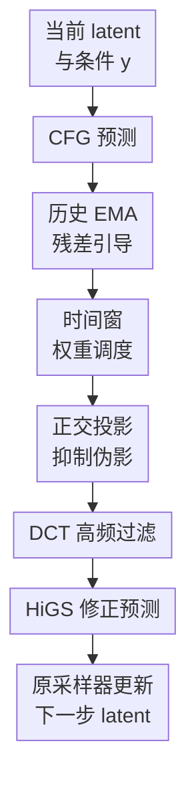

# HiGS: History-Guided Sampling for Plug-and-Play Enhancement of Diffusion Models

**会议**: ICLR 2026  
**OpenReview**: [https://openreview.net/forum?id=cyQUZDMpg3](https://openreview.net/forum?id=cyQUZDMpg3)  
**代码**: 未确认  
**领域**: 扩散模型 / 图像生成  
**关键词**: 历史引导采样, 扩散模型加速, CFG, 低步数生成, 频域过滤  

## 一句话总结
HiGS 是一个无需训练、无需额外网络前向的扩散采样插件，它用当前模型预测与历史预测 EMA 之间的差值来修正采样方向，在低 NFE 或低 CFG scale 下显著提升图像清晰度、结构和细节。

## 研究背景与动机
**领域现状**：扩散模型已经成为图像生成的主流范式，从 Stable Diffusion、SDXL 到 DiT、SiT 这类 Transformer 架构，都依赖反向去噪过程逐步把噪声转成图像。实际部署时，采样器通常要做多次 neural function evaluations（NFEs），并且在条件生成里还会配合 classifier-free guidance（CFG）来提升图像质量和 prompt 对齐。

**现有痛点**：高质量扩散采样并不便宜。减少采样步数能降低延迟，但图像容易变糊、局部细节丢失、全局结构不稳；降低 CFG scale 能减少过饱和和多样性损失，却又常常让图像质量下降。相反，如果直接提高 CFG scale，虽然结构和视觉冲击力会增强，但会带来颜色过饱和、纹理假象和多样性下降。

**核心矛盾**：问题的根本不只是“采样步数太少”，而是每一步采样只看当前模型预测，忽略了最近若干步预测中已经出现的轨迹信息。扩散反向过程本来就是连续动态系统，当前预测和历史预测之间的变化方向包含了“模型正在如何修正图像”的信息；标准采样器却没有显式利用这部分历史。

**本文目标**：作者希望找到一种训练自由、模型无关、采样器友好的增强方式，让预训练扩散模型在较少步数、较低 CFG scale、甚至蒸馏模型的短采样设置下也能得到更清晰、更稳定的图像，同时不增加新的前向推理成本。

**切入角度**：论文把 Euler 采样解释为在随时间变化的能量函数上做梯度下降，并借鉴 STORM 这类动量式方差缩减方法。直觉是：如果当前梯度估计不够稳定，那么加入“当前预测相对过去预测的变化”可以提供类似动量或多步修正的信号，帮助采样轨迹更快走向高质量区域。

**核心 idea**：用当前扩散模型预测减去历史预测的加权平均，得到一个 history-guided correction，再经过时间调度、投影和高频过滤后加回当前预测，从而以 plug-and-play 的方式增强扩散采样。

## 方法详解

### 整体框架
HiGS 不改训练过程，也不替换基础扩散模型；它只是在每个采样步拿到模型输出后，多做一次轻量的“历史校正”。在有 CFG 的条件生成中，标准流程先计算条件预测和无条件预测，再得到 $D_{CFG}(z_{t_k})$；HiGS 随后把当前 $D_{CFG}$ 与历史预测的 EMA 平均相减，形成校正方向，最后把这个方向按时间、方向和频率筛过一遍，再交给原采样器继续更新 latent。

整体看，HiGS 像是给扩散采样器加了一个记忆缓冲区：缓冲区并不保存图像或额外模型，只保存过去若干步的 denoiser 预测。这个记忆在早中期采样阶段最有价值，因为此时图像结构和主要细节正在形成；到后期接近干净图像时，过强的历史校正反而可能制造噪声或颜色异常，所以需要调度衰减。

最终的 HiGS 输出可以概括为：

$$
D_{HiGS}(z_{t_k}) = D_{CFG}(z_{t_k}) + w_{HiGS}(t_k) \cdot \mathrm{iDCT}\left(H(R) \cdot \mathrm{DCT}(\Delta D_{t_k}(\eta))\right).
$$

其中 $\Delta D_{t_k}$ 来自当前预测与历史预测平均的差值，$w_{HiGS}(t_k)$ 控制什么时候启用校正，$\Delta D_{t_k}(\eta)$ 是经过投影后的方向，$H(R)$ 是 DCT 频域高通滤波器。这个形式看起来多了几步，但都发生在模型输出张量上，不需要额外 denoiser forward，因此推理成本几乎和原 CFG 一样。

### 关键设计
**1. 历史 EMA 残差引导：把“当前预测比过去好在哪里”变成采样方向**

HiGS 的核心不是简单平均多步输出，而是计算当前预测和历史预测平均之间的差。给定采样时间网格 $t_0 > t_1 > \cdots > t_M$，在第 $k$ 步，历史集合记为 $H_k = \{D_{CFG}(z_{t_i})\}_{i \in I_k}$。论文发现，如果启用了 CFG，把 CFG 后的预测 $D_{CFG}$ 放进历史缓冲区比只放条件预测 $D_c$ 更有效，因为它记录的是实际参与采样的引导后方向。

历史函数采用近期权重更高的 EMA 式加权平均：

$$
g(H_k)=\sum_{i \in I_k} \alpha(1-\alpha)^{k-1-i}D_{CFG}(z_{t_i}).
$$

然后校正项定义为 $\Delta D_{t_k}=D_{CFG}(z_{t_k})-g(H_k)$。这相当于问一个很具体的问题：当前 denoiser 预测相对最近几步预测新增了什么结构、边缘或细节？如果早期预测更模糊，当前预测更接近干净图像，那么这个差值就近似捕捉到了从“较差版本”走向“较好版本”的方向。它和 autoguidance 的直觉相似，但不需要训练或调用一个弱模型，弱信号直接来自同一个模型的历史输出。

**2. 时间窗权重调度：只在历史信号最有用的阶段发力**

如果把 $\Delta D_{t_k}$ 在所有时间步都等强度加回去，效果并不稳定。论文观察到，HiGS 的收益主要集中在早期和中期采样：这时图像的大结构、物体边界和主要纹理正在被建立，历史残差能帮助采样器少走弯路。到了后期，图像已经接近收敛，继续强化历史差值容易把细小噪声、过锐纹理或颜色偏差放大。

因此 HiGS 使用一个按时间变化的权重 $w_{HiGS}(t)$，在 $t \le t_{min}$ 时关闭，在 $t_{min}<t\le t_{max}$ 内逐渐开启，在 $t>t_{max}$ 时也关闭：

$$
w_{HiGS}(t)=
\begin{cases}
0, & t \le t_{min},\\
w_{HiGS}\sqrt{\frac{t-t_{min}}{t_{max}-t_{min}}}, & t_{min}<t\le t_{max},\\
0, & t>t_{max}.
\end{cases}
$$

这个设计让 HiGS 更像一个“中段加速器”，而不是无脑放大的额外 guidance。消融显示，$t_{min}$ 过低会让后期指导过强，$t_{min}$ 过高又会错过有效阶段；论文推荐的稳定范围大致是 $t_{min}\in[0.3,0.5]$、$t_{max}\in[0.9,1.0]$。

**3. 正交投影抑制伪影：避免校正项沿着 CFG 方向继续过饱和**

CFG 本身已经会沿条件方向放大模型预测，高 CFG scale 下最常见的问题是颜色过饱和、亮度异常和纹理伪影。如果 HiGS 的残差方向和当前 $D_{CFG}(z_{t_k})$ 高度平行，直接加回去就可能进一步增强这些问题。因此论文引入一个可选投影，把 $\Delta D_{t_k}$ 分解成相对于当前预测的平行分量和正交分量。

具体地，平行分量可写为：

$$
\Delta D^{\parallel}_{t_k}=\frac{\langle \Delta D_{t_k},D_{CFG}(z_{t_k})\rangle}{\langle D_{CFG}(z_{t_k}),D_{CFG}(z_{t_k})\rangle}D_{CFG}(z_{t_k}),
$$

正交分量为 $\Delta D^{\perp}_{t_k}=\Delta D_{t_k}-\Delta D^{\parallel}_{t_k}$，最终使用 $\Delta D_{t_k}(\eta)=\Delta D^{\perp}_{t_k}+\eta\Delta D^{\parallel}_{t_k}$。当 $\eta<1$ 时，HiGS 会压低与当前 CFG 方向一致的那部分更新，保留更多横向修正。直观上，这不是再把 CFG “拧大一圈”，而是让历史信号更多地补结构和细节，少去推高已经很强的颜色或对比度方向。

**4. DCT 高频过滤：把历史修正限制在细节与结构上**

论文还观察到，单靠投影仍不足以完全避免颜色构图异常，因为颜色分布和大面积光照往往对应图像的低频成分，而 HiGS 想增强的主要是边缘、纹理、局部细节和结构清晰度。于是作者对校正项做离散余弦变换（DCT），用径向频率 $R=\sqrt{f_x^2+f_y^2}$ 上的 sigmoid 高通滤波器压低低频：

$$
H(R)=\mathrm{Sigmoid}(\lambda(R-R_c)).
$$

经过 $\mathrm{iDCT}(H(R)\cdot\mathrm{DCT}(\Delta D_{t_k}(\eta)))$ 后，HiGS 更倾向于改进高频细节，而不是重写整张图的色调和大块构图。消融里去掉 DCT filtering 会出现不自然颜色组合和视觉伪影；加上过滤后，输出更稳定。实现细节中常用 $R_c\approx0.05$、$\lambda=50$，说明这个滤波并不是复杂调参，而是一个很轻的保护层。

### 损失函数 / 训练策略
HiGS 没有训练损失，因为它完全发生在推理阶段。它依赖的基础模型可以是 Stable Diffusion XL、Stable Diffusion 3、Stable Diffusion 3.5、DiT-XL/2、SiT-XL + REPA，也可以是 SDXL-Flash、SDXL-Lightning 这类蒸馏模型。

主要超参数包括 $w_{HiGS}$、EMA 系数 $\alpha$、投影权重 $\eta$、时间窗 $t_{min},t_{max}$、DCT 阈值 $R_c$。论文给出的经验设置是：$\alpha=0.5$ 或 $0.75$ 通常稳定；$w_{HiGS}\le3$ 比较可靠；$t_{min}$ 取 $0.3$ 到 $0.5$、$t_{max}$ 接近 $1$；DCT 阈值 $R_c\approx0.05$。由于历史平均可以在线更新，实际并不需要保存完整历史序列，内存开销也很小。

## 实验关键数据

### 主实验
论文实验覆盖文本到图像、ImageNet 类条件生成、不同采样步数、不同 CFG scale、不同基础模型和蒸馏模型。文本到图像主要用 HPSv2、ImageReward、win rate 和 CLIP Score；ImageNet 使用 FID、IS、Precision、Recall。作者特别强调所有对比都在相同 NFE 和 CFG scale 下进行，以避免把收益混到更多计算量里。

| 模型 | 设置 | 基线指标 | +HiGS 指标 | 主要提升 |
|------|------|----------|------------|----------|
| SiT-XL + REPA | ImageNet, 同步数同 CFG scale | FID 12.08, IS 187.11 | FID 4.86, IS 277.20 | FID 大幅下降，精度 0.68→0.80 |
| DiT-XL/2 | ImageNet, 同步数同 CFG scale | FID 8.73, IS 173.21 | FID 7.15, IS 180.05 | 质量和多样性指标同时改善 |
| Stable Diffusion XL | 文本到图像 / COCO 评估 | FID 28.49, IS 35.07 | FID 26.18, IS 36.22 | 视觉质量和 precision/recall 均提升 |
| Stable Diffusion 3 | 文本到图像 / COCO 评估 | FID 27.19, IS 40.11 | FID 26.84, IS 40.94 | 改善幅度较小但方向一致 |

在偏好指标上，HiGS 的收益更明显。DrawBench 上 SDXL 的 HPSv2 从 0.224 提升到 0.249，win rate 从 0.07 到 0.93；Stable Diffusion 3.5 的 HPSv2 从 0.258 到 0.270，win rate 从 0.21 到 0.79。Parti Prompts 和 HPS Prompts 也表现出类似趋势：ImageReward、HPSv2 和 win rate 基本都提升，而 CLIP Score 在附录中显示基本保持不变，说明 HiGS 主要提升图像质量和人类偏好，不是靠牺牲 prompt 对齐换来的。

ImageNet 结果是论文最醒目的定量结论之一：在 REPA-E 上，unguided 250 步的 FID 为 1.83，而 HiGS 用 30 步达到 FID 1.61；在 CFG 设置下，REPA-E 250 步 FID 为 1.26，HiGS 用 40 步达到 FID 1.32，接近原模型长采样结果。这说明 HiGS 不只是小幅润色图片，也能在短步数采样里起到明显的加速作用。

### 消融实验
| 配置 | 关键指标 | 说明 |
|------|----------|------|
| Baseline with CFG | HPSv2 0.238, ImageReward 0.174, CLIP 0.317 | 不使用历史预测 |
| +HiGS using conditional history | HPSv2 0.249, ImageReward 0.234, CLIP 0.315 | 历史里放条件预测也有效 |
| +HiGS using CFG history | HPSv2 0.255, ImageReward 0.371, CLIP 0.322 | 放 CFG 后预测效果最好 |
| Constant schedule | HPSv2 0.261, ImageReward 0.36 | 简单时间窗也可用 |
| Square-root schedule | HPSv2 0.261, ImageReward 0.39 | 作者默认选择，视觉更好 |
| Linear schedule | HPSv2 0.260, ImageReward 0.37 | 与其他调度相近 |
| EMA average | HPSv2 0.255, ImageReward 0.371 | 在线实现方便，视觉表现稳定 |

另一个重要消融是 DCT filtering 和 projection。附录中的可视化显示，不做 DCT 高频过滤时，HiGS 容易产生不自然色块或颜色组合；做过滤后颜色更真实。投影在一些高 guidance 或强修正设置下能减少过饱和区域，因此它不是收益的唯一来源，但对稳定性很关键。

### 关键发现
- HiGS 在低步数和低 CFG scale 下尤其有价值，因为这些设置正是标准采样容易变糊、结构不稳的区域。
- 使用 $D_{CFG}$ 作为历史缓冲区输入比使用条件预测更强，说明“真实采样方向的历史”比单独条件分支更有信息量。
- DCT 高频过滤是让方法稳定可用的关键保护层，否则历史残差会过多干预低频颜色与全局色调。
- HiGS 和蒸馏模型互补：SDXL-Flash 的 HPSv2 从 0.273 提升到 0.298，win rate 达到 0.97；SDXL-Lightning 也从 0.277 提升到 0.285。
- HiGS 与不同采样器也兼容，在 DiT-XL/2 上对 DDIM、DPM++、DDPM、PLMS、UniPC 都有 FID 改善，说明它不是某个单一 solver 的专用 trick。

## 亮点与洞察
- HiGS 最巧妙的地方是把“历史预测”当作免费弱模型使用。它不需要训练一个 bad model，也不需要额外前向，却能从同一模型较早、更模糊的预测中构造负信号。
- 论文把扩散 Euler 采样和能量函数上的梯度下降联系起来，使历史残差不只是经验 trick，而有动量式方差缩减和局部截断误差改善的解释。附录里还论证了理想条件下可把 Euler 的局部误差从 $O(h_k^2)$ 改到 $O(h_k^3)$。
- 频域过滤这个细节很实用。很多 sampling enhancement 方法容易在视觉上“更锐但更怪”，HiGS 明确把低频颜色从校正项里压掉，使方法更适合作为通用插件。
- 对部署很友好。HiGS 不改权重、不重新蒸馏、不增加 denoiser 调用，适合插入已有推理 pipeline；对商业或创作系统来说，这类小改动比重新训练大模型更容易落地。
- 这篇论文也提示了一个更广的方向：扩散采样过程里还有很多未被利用的中间状态，过去的预测、误差、频域变化都可能成为训练自由的增强信号。

## 局限与展望
- HiGS 仍然继承基础扩散模型的偏差、失败模式和安全风险。它让图像更真实、更清晰，但不会解决模型训练数据偏差、内容真实性或误用问题。
- 方法引入了若干超参数，如 $w_{HiGS}$、$t_{min}$、$t_{max}$、$\eta$、$R_c$ 和 $\alpha$。论文给了稳定范围，但不同模型、分辨率和采样器上仍可能需要调。
- 实验主要集中在图像生成，视频、3D、音频等扩散任务是否同样稳定还需要更多验证。尤其视频生成对时间一致性敏感，历史残差可能同时影响空间细节和时序闪烁。
- HiGS 的人类偏好指标提升很明显，但 HPSv2、ImageReward 仍是代理指标。更严格的人类评测、真实应用任务评测和失败案例分类会让结论更完整。
- 未来可以研究自适应调度：让模型根据当前图像状态自动决定何时启用 HiGS、用多大权重，而不是手动设定固定时间窗。

## 相关工作与启发
- **vs CFG**: CFG 通过条件预测和无条件预测的差值增强条件对齐与视觉质量，但高 scale 会增加饱和和多样性问题。HiGS 不替代 CFG，而是在 CFG 输出之后利用历史预测差值做额外修正，并且可以在低 CFG scale 下提升质量。
- **vs DPM-Solver / UniPC / PLMS 等快速采样器**: 这些方法主要从 ODE/SDE 数值求解角度设计更好的更新公式。HiGS 更像是模型输出层面的 correction，可以叠加到多种采样器上，附录结果也显示它和不同 solver 互补。
- **vs 扩散蒸馏方法**: 蒸馏通过训练学生模型减少步数，代价是额外训练成本和模型维护成本。HiGS 不训练新模型，但能进一步增强 SDXL-Flash、SDXL-Lightning 这类已蒸馏模型，说明两条路线可以组合。
- **vs Autoguidance / APG**: Autoguidance 借助弱模型构造负信号，APG 调整 guidance 方向以减少伪影。HiGS 的负信号来自历史预测，成本更低；同时它也能和 APG 叠加，说明历史校正与 guidance 方向校正不是同一个维度。
- **启发**: 对很多生成模型而言，推理轨迹本身就是有价值的数据。以后可以把“历史状态”扩展到跨步注意力、预测不确定性、频域演化或多分辨率残差，用更少训练成本换取更强推理质量。

## 评分
- 新颖性: ⭐⭐⭐⭐ 历史预测残差的想法直观但很有效，和动量优化、autoguidance、频域保护结合得比较巧。
- 实验充分度: ⭐⭐⭐⭐⭐ 覆盖多模型、多采样步数、多 CFG scale、ImageNet、文本到图像、蒸馏模型和多种 sampler，消融也比较完整。
- 写作质量: ⭐⭐⭐⭐ 主线清楚，公式和算法给得足；少数投影符号在正文里容易读混，需要结合伪代码理解。
- 价值: ⭐⭐⭐⭐⭐ 训练自由、低开销、可插入现有 pipeline，对扩散模型实际部署和低步数采样很有直接价值。

<!-- RELATED:START -->

## 相关论文

- [\[ICLR 2026\] RNE: plug-and-play diffusion inference-time control and energy-based training](rne_plug-and-play_diffusion_inference-time_control_and_energy-based_training.md)
- [\[CVPR 2026\] Diffusion Sampling Path Tells More: An Efficient Plug-and-Play Strategy for Sample Filtering](../../CVPR2026/image_generation/diffusion_sampling_path_tells_more_an_efficient_plug-and-play_strategy_for_sampl.md)
- [\[ICLR 2026\] Synthetic History: Evaluating Visual Representations of the Past in Diffusion Models](synthetic_history_evaluating_visual_representations_of_the_past_in_diffusion_mod.md)
- [\[CVPR 2026\] PromptLoop: Plug-and-Play Prompt Refinement via Latent Feedback for Diffusion Model Alignment](../../CVPR2026/image_generation/promptloop_plug-and-play_prompt_refinement_via_latent_feedback_for_diffusion_mod.md)
- [\[ICLR 2026\] Foresight Diffusion: Improving Sampling Consistency in Predictive Diffusion Models](foresight_diffusion_improving_sampling_consistency_in_predictive_diffusion_model.md)

<!-- RELATED:END -->
