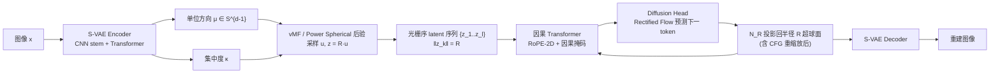

# Hyperspherical Latents Improve Continuous-Token Autoregressive Generation

**会议**: ICLR 2026  
**OpenReview**: [https://openreview.net/forum?id=H13wHRiL3i](https://openreview.net/forum?id=H13wHRiL3i)  
**代码**: [https://github.com/guolinke/SphereAR](https://github.com/guolinke/SphereAR)  
**领域**: 图像生成 / 自回归生成 / 连续 token tokenizer  
**关键词**: 自回归图像生成, 超球面 VAE, 连续 token, vMF / Power Spherical, 方差坍缩, classifier-free guidance  

## 一句话总结
把连续 token 自回归（AR）图像生成的所有输入输出（含 CFG 后的预测）都约束到固定半径的超球面上，用超球面 VAE 替换对角高斯 VAE，消除导致方差坍缩的尺度自由度，让纯 next-token 光栅序 AR 首次在同等参数规模上超过扩散与掩码生成模型（SphereAR-H 943M 在 ImageNet 256×256 上 FID 1.34）。

## 研究背景与动机
- **领域现状**：连续 token AR（VAE 出 token 级 latent + AR 预测下一个 latent，配 diffusion head）虽与语言建模天然对齐、对统一多模态最友好，但在同等参数下长期落后于潜空间扩散（DiT/SiT）和掩码生成（MAR/MaskGIT）、next-scale（VAR）方法。一个有意思的反差：**用离散 token 时 AR 反而强于掩码生成**（LlamaGen-L 343M FID 3.07 vs MaskGIT 207M 4.02），但换成连续 token 后形势完全逆转。
- **现有痛点**：根因是对角高斯 VAE 的 latent **方差跨维度/跨 token 严重不均匀（scale heterogeneity）**。AR 逐步解码时，exposure bias 和 classifier-free guidance（CFG）会逐步放大这种尺度漂移，最终触发**方差坍缩（variance collapse）**，生成质量崩坏。
- **核心矛盾**：以往的补救（GIVT 抬高 KL 权重、LatentLM 固定方差 σ-VAE）只是缓解不稳定，**没有动尺度自由度本身**——scale 仍然是可漂移的多余维度，CFG 下照样会失稳。
- **本文目标**：从根上消除尺度自由度，让喂给 AR / 从 AR 出来的每一个信号都**尺度不变（scale-invariant）**。
- **核心 idea**：**【尺度不变 latent】** 离散 token 之所以在 AR 下稳，是因为它落在概率单纯形上（分量和为 1）天然尺度不变；那就让连续 latent 也"尺度不变"——把每个 latent token 约束到**固定半径的超球面**（恒定 $\ell_2$ 范数），用**超球面 VAE（S-VAE）** 只建模方向、不建模尺度，并在推理时（含 CFG 重缩放后）把预测投影回该超球面。

## 方法详解

### 整体框架
SphereAR 由两部分耦合：(1) 一个**超球面 VAE（S-VAE）** 把图像编码成一串约束在半径 $R$ 超球面 $S^{d-1}$ 上的 latent token，每个 token 只由单位方向 $\mu$ 和标量集中度 $\kappa$ 参数化；(2) 一个**因果 Transformer + token 级 diffusion head**，按光栅序自回归地建模下一个超球面 token 的分布。训练时 teacher forcing 喂入超球面 latent；推理时把 AR（含 CFG 重缩放后的）预测投影回半径 $R$ 超球面以去掉径向分量，再由 VAE decoder 重建图像。

### 关键设计

**1. 超球面 VAE（S-VAE）：把尺度自由度从源头拿掉。** 标准 VAE 用对角高斯后验 $z = \mu_\phi(x) + \sigma_\phi(x)\odot\epsilon$，逐维的数据相关方差 $\sigma_\phi(x)$ 正是异质方差的来源。S-VAE 改为只在单位球面上建模方向：encoder 输出单位均值方向 $\mu\in S^{d-1}$（经 $\ell_2$ 归一化）和非负集中度 $\kappa$，方向后验取 von Mises–Fisher 分布 $q_\phi(u\mid x)=C_d(\kappa)\exp(\kappa\,\mu^\top u)$，先验取球面均匀分布 $\mathrm{Unif}(S^{d-1})$，再用固定半径 $R$ 把方向放大成 $z=Ru$ 喂给 decoder。ELBO 相应变为 $\mathcal{L}_{\text{S-VAE}}=\mathbb{E}_{q_\phi(u\mid x)}[\log p_\psi(x\mid z{=}Ru)]-D_{\mathrm{KL}}(q_\phi(u\mid x)\,\|\,p(u))$。这样每个 token 都恒定范数 $\|z\|_2=R$，AR 看到的全是纯方向信号。

**2. Power Spherical 后验：可重参数化、无拒绝采样。** vMF 虽原理干净但采样需要 rejection sampling、效率低。作者改用 Power Spherical 后验 $q_\phi(u\mid x)\propto(1+\mu^\top u)^\kappa$，保留球面支撑与旋转对称性，且**完全可重参数化**。具体做法：令轴向投影（余弦相似度）$c=\mu^\top u$，仿射变换 $C=(c+1)/2$，则 $C$ 服从 $\mathrm{Beta}(\alpha{=}\frac{d-1}{2}{+}\kappa,\ \beta{=}\frac{d-1}{2})$；从 Beta 采 $C$ 得 $c=2C-1$，再在 $\mu$ 的正交切空间均匀采单位向量 $v_\perp$，合成 $u=c\,\mu+\sqrt{1-c^2}\,v_\perp$（可用 Householder 变换对齐基底）。这个 inverse-CDF 构造给出低方差、数值稳定的可重参数化梯度，ELBO 形式不变。论文同时给出理论分析：相比"高斯后验 + 事后归一化"（Gaussian+norm），S-VAE 优化的是更紧的变分界——Gaussian+norm 会多出一个非负的径向 KL 项，且其方向分布（projected-normal / ACG）level set 是椭圆、非轴对称，与纯方向结构不匹配。

**3. AR 输出投影 $N_R$：让尺度误差无法跨步累积。** 这是稳定性的关键。对每个 token 的临时预测做半径投影 $N_R(z)=R\,z/\|z\|_2$ 投回超球面。在球面参考点处，$N_R$ 的微分恰好是切空间上的正交投影算子——一阶近似下，归一化只移除径向（尺度）扰动、保留切向（方向）扰动。因此把归一化复合到 next-token 预测器之后，就**在重新喂入前去掉了单步误差的径向分量，尺度误差不会跨自回归步累积**。Table 2 的消融证实：相比只归一化 VAE decoder 输入，**归一化作用在 AR 输入/输出上更关键**。

**4. Token 级 Rectified Flow diffusion head：连续 token 的分布建模。** 沿用 MAR 的思路，在因果 Transformer 隐状态 $h_{k-1}$ 条件下用一个 MLP diffusion head 建模下一 token 分布，训练目标用 Rectified Flow：给先验 $z_k^0\sim N(0,I)$、目标 $z_k^1=z_k$、线性插值 $z_k^t=(1-t)z_k^0+t z_k^1$，head 预测速度 $v_\omega(z_k^t,t,h_{k-1})$，损失 $\mathcal{L}_{\text{RF}}=\mathbb{E}\big[\|z_k^1-z_k^0-v_\omega(z_k^t,t,h_{k-1})\|_2^2\big]$。推理时从 $N(0,I)$ 出发用 100 步 Euler 积分速度场，**全程不做中间归一化，只在 $N$ 步后做一次半径投影**；CFG 也是先做引导组合、最后才单次投影，最大化保留 diffusion 采样的表达力同时锁住范数。AR 主干则用现代因果 Transformer（pre-norm + RMSNorm + FlashAttention + SwiGLU + 2D RoPE，严格因果掩码），VAE 用 CNN stem + Transformer 的混合骨干（质量持平 CNN 但快约 2.6×）。

## 实验关键数据

### 主实验表格
ImageNet 256×256 类条件生成，FID 为主指标（50k 样本，ADM 评测）：

| 模型 | 类型 | 序 | 参数 | Epochs | FID↓ | IS↑ | Pre.↑ | Rec.↑ |
|---|---|---|---|---|---|---|---|---|
| VAR-d30 | next-scale | - | 2B | 350 | 1.92 | 323.1 | 0.82 | 0.59 |
| DiT-XL/2 | diffusion | - | 675M | 400 | 2.27 | 278.2 | 0.83 | 0.57 |
| SiT-XL/2 | diffusion | - | 675M | 400 | 2.06 | 277.5 | 0.83 | 0.59 |
| LatentLM-L | AR raster | raster | 479M | 400 | 2.24 | 253.8 | - | - |
| MAR-L | 掩码 | random | 479M | 800 | 1.78 | 296.0 | 0.81 | 0.60 |
| MAR-H | 掩码 | random | 943M | 800 | 1.55 | 303.7 | 0.81 | 0.62 |
| **SphereAR-B (ours)** | AR raster | raster | 208M | 400 | **1.92** | 277.8 | 0.81 | 0.61 |
| **SphereAR-L (ours)** | AR raster | raster | 479M | 400 | **1.54** | 295.9 | 0.80 | 0.63 |
| **SphereAR-H (ours)** | AR raster | raster | 943M | 400 | **1.34** | 300.0 | 0.80 | 0.64 |

要点：SphereAR-H（943M）FID 1.34 刷新 AR 模型 SOTA，胜过 VAR-d30（2B, 1.92）与 MAR-H（943M, 1.55）；SphereAR-L（479M）以约一半参数追平 MAR-H；SphereAR-B（208M）FID 1.92 即超过 2B 的 VAR-d30 与 LatentLM-L（479M, 2.24）。与 LatentLM 唯一差别就是 latent 参数化（固定方差对角高斯 vs 超球面），1.54 vs 2.24 的巨大差距说明**恒定范数方向 latent 是关键**。

### 消融实验表格
归一化作用界面与后验族（SphereAR-L 骨干，VAE/AR 各训 50 epochs）：

| No. | VAE Decoder 归一化 | AR 归一化 | 后验 | FID↓ | IS↑ |
|---|---|---|---|---|---|
| 1 | ✗ | ✗ | Gaussian | 2.97 | 240.2 |
| 2 | ✓ | ✗ | Gaussian | 2.89 | 254.3 |
| 3 | ✓ | ✓ | Gaussian | 2.68 | 257.3 |
| 4 | ✓ | ✓ | Spherical | **2.52** | 258.4 |

### 关键发现
- **S-VAE 全程最优最稳**：FID-vs-CFG 曲线上 S-04 最低、S-08 次之，对角高斯加大 KL（β-VAE）或固定方差（σ-VAE）都会在大 CFG 下失稳且始终低于 S-VAE；固定方差相比标准高斯没有优势。
- **事后归一化有用但不够**：对对角高斯 latent 做 $\ell_2$ 归一化（N-x）每个都优于对应 G-x、且高 CFG 更稳，印证"尺度不变稳定 AR"的动机；但最佳的 N-08 仍输给 S-04，与"Gaussian+norm 是更松的变分界"理论一致。
- **AR 端归一化最关键**：只归一化 VAE decoder 输入仅 2.97→2.89；加上 AR 端归一化降到 2.68，再换超球面后验到 2.52。

## 亮点与洞察
- **诊断精准**：把连续 token AR 落后的根因锁定为"尺度自由度 + CFG 下的尺度漂移/方差坍缩"，并用离散 token（单纯形上天然尺度不变）的对照点把直觉讲清楚。
- **解法干净且有理论支撑**：不是堆 trick，而是从表示几何上删掉多余的尺度维度；并证明球面后验严格优于"高斯 + 事后归一化"（更紧的变分界 + 轴对称方向分布）。
- **里程碑结论**：首次让纯 next-token、光栅序的 AR 图像生成器在同等参数规模上超过扩散和掩码生成——这对统一多模态（图文同构用 next-token 建模）很有吸引力。
- **工程实用**：Power Spherical 无拒绝采样、可重参数化；混合 VAE 骨干快 2.6×；推理只在 diffusion 采样末尾做一次投影，最大化保留表达力。

## 局限与展望
- 仅在 ImageNet-1K 256×256 类条件生成上验证，未涉及文本到图像、高分辨率、视频或真正的统一多模态训练，超球面约束在更复杂条件/模态下的收益待证。
- 固定半径 $R=\sqrt{d}$、latent 维度 $d=16$ 为超参，半径/维度与 token 表达力的权衡未充分扫描，超球面是否会限制高频细节重建有待更系统分析。
- 仍依赖 token 级 diffusion head 与 100 步 Euler 采样，推理速度相比一步式生成仍有开销；CFG 仅末尾单次投影的近似在极端引导强度下的行为缺乏更深入刻画。
- 理论分析基于一阶（线性化）误差与切空间投影论证，对多步累积非线性误差的严格界仍是开放问题。

## 相关工作与启发
- **连续 token AR 与 tokenizer**：GIVT、LatentLM（σ-VAE 固定方差）、NextStep-1（对高斯后验 latent 做恒定范数归一化）都试图稳住方差，本文用超球面后验从理论与实验上证明优于事后归一化；与 MAR 共享 token 级 diffusion head 但把骨干换成严格因果 next-token。
- **球面/归一化几何**：ViT-VQGAN 归一化特征再算 codebook 距离、BSQ 二值化球面 latent——本文把球面几何从量化器推广到连续 latent 后验，并强调其对 AR 稳定性的作用。
- **超球面 VAE 谱系**：vMF S-VAE（Davidson 2018）与 Power Spherical（De Cao & Aziz 2020）提供了可重参数化的方向后验基础，本文把它们落地到大规模图像 AR 生成。
- **启发**：当某种表示在序列解码下不稳定时，与其加正则去"压"多余自由度，不如从几何上"删掉"它；尺度不变是把离散 token 稳定性迁移到连续 token 的桥梁。

## 评分
- 新颖性: ⭐⭐⭐⭐ — 把"尺度不变 latent"这一来自离散 token 的直觉系统迁移到连续 token AR，用超球面 VAE 从根上解决方差坍缩，并配理论证明优于事后归一化，思路清晰且有原创性。
- 实验充分度: ⭐⭐⭐⭐ — 三种规模刷新 AR SOTA、与扩散/掩码/next-scale 全面对比，消融把"归一化界面 + 后验族"逐项拆开，对照设计扎实；但仅限 ImageNet 256 单一基准，跨模态/高分辨率未验证。
- 写作质量: ⭐⭐⭐⭐ — 动机用离散 vs 连续对照引入、方法与理论衔接顺畅、图表清楚，可读性强。
- 价值: ⭐⭐⭐⭐ — 首次证明纯 next-token 光栅序 AR 能在同等参数下超扩散与掩码生成，对统一多模态自回归生成有直接借鉴意义，代码开源。

<!-- RELATED:START -->

## 相关论文

- [\[ICLR 2026\] NextStep-1: Toward Autoregressive Image Generation with Continuous Tokens at Scale](nextstep-1_toward_autoregressive_image_generation_with_continuous_tokens_at_scal.md)
- [\[ICLR 2026\] Group Critical-token Policy Optimization for Autoregressive Image Generation](group_critical-token_policy_optimization_for_autoregressive_image_generation.md)
- [\[ICLR 2026\] MADFormer: Mixed Autoregressive and Diffusion Transformers for Continuous Image Generation](textitmadformer_mixed_autoregressive_and_diffusion_transformers_for_continuous_i.md)
- [\[ICLR 2026\] Autoregressive Image Generation with Randomized Parallel Decoding](autoregressive_image_generation_with_randomized_parallel_decoding.md)
- [\[ICLR 2026\] From Prediction to Perfection: Introducing Refinement to Autoregressive Image Generation](from_prediction_to_perfection_introducing_refinement_to_autoregressive_image_gen.md)

<!-- RELATED:END -->
