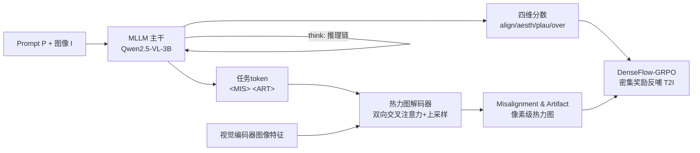

# ImageDoctor: Diagnosing Text-to-Image Generation via Grounded Image Reasoning

**会议**: ICLR 2026  
**OpenReview**: [https://openreview.net/forum?id=04HwYGgp2w](https://openreview.net/forum?id=04HwYGgp2w)  
**项目主页**: [https://image-doctor.github.io/](https://image-doctor.github.io/)  
**领域**: 图像生成 / T2I 评估 / 偏好建模  
**关键词**: 文生图评估, 人类偏好模型, 多维度打分, 缺陷热力图, GRPO, 密集奖励  

## 一句话总结
ImageDoctor 把文生图质量评估从"打一个分"升级为"像医生看病"——以多模态大模型为底座，按"看-想-判（look-think-predict）"流程先定位缺陷区域、再推理、最后给出语义对齐/美学/合理性/总体四维分数与像素级缺陷热力图，并把这份密集反馈接入 DenseFlow-GRPO 作为奖励，让 T2I 模型的偏好对齐比标量奖励高约 10%。

## 研究背景与动机
**领域现状**：随着扩散/流模型把文生图质量推到很高水平，评估器（reward model / verifier）越来越关键——它既是测量质量的标尺，也是 RLHF 与 test-time scaling 的反馈来源。主流的 HPS、ImageReward、PickScore 等人类偏好模型，本质都是把一张图压缩成**单个标量分数**。

**现有痛点**：单标量评估有两个硬伤。其一是**信息坍缩**——两张图可能拿到相同分数，但一张美却不对齐 prompt、另一张对齐却充满诡异伪影，标量分无法把这些维度解耦，可解释性差。其二是**缺乏空间定位**——评估器只会给整图一个判断，说不清"问题出在图的哪里"。而现实中大量 T2I 失败属于"局部失守"：prompt 大部分满足，但某个细粒度细节缺失或画错，没有定位就无法提供可操作的反馈。

**核心矛盾**：当评估器被当成奖励函数喂给 RLHF（如 Flow-GRPO）时，**稀疏的图像级标量奖励**会把奖励均匀摊到所有像素上，好区域和坏区域一视同仁，无法对局部低质区施加更强惩罚，训练信号过粗。

**本文目标**：造一个像医生一样会"诊断"的统一评估框架——既给多维度分数，又给定位缺陷的热力图，并让这份密集反馈真正能驱动 T2I 模型变好。

**核心 idea**：**「诊断式评估」**——用 MLLM 的推理与常识能力，遵循 **「look-think-predict」** 范式做 grounded image reasoning（先定位缺陷框 → 再结合局部证据推理 → 最后输出四维分+热力图），并设计 **DenseFlow-GRPO** 把热力图变成像素级密集奖励，闭环优化生成模型。

## 方法详解

### 整体框架
ImageDoctor 以一个微调后的 MLLM（Qwen2.5-VL-3B）为主干：输入 prompt $P$ 与图像 $I$，主干按"看-想-判"输出四个标量分数 $s_d,\ d\in\{\text{align, aesth, plau, over}\}$ 以及两个特殊任务 token `<MIS>`/`<ART>`；这两个 token 连同图像特征、热力图 token 一起送入轻量级**热力图解码器**，生成 misalignment 与 artifact 两张像素级热力图 $H_d\in\mathbb{R}^{H\times W}$。训练分两阶段（冷启动 SFT + GRPO 强化微调），最后把整套密集反馈接入下游的 DenseFlow-GRPO 反哺生成模型。

### 关键设计

**1. 统一架构 + SAM 式热力图解码器：让一个模型同时吐"文本分数"和"像素热力图"**。标量分数可以直接由 MLLM 文本输出，但像素级热力图需要图像输出能力，于是作者设计了一个轻量解码器来补足这条支路。解码器吃三样东西——视觉编码器抽的图像特征、一个可学习的 heatmap token，以及由 MLLM 生成的任务 token $t\in\{\texttt{<ART>}, \texttt{<MIS>}\}$。关键在于任务 token 是 MLLM 在融合了图像、prompt 和推理链之后产生的，相当于把"这张图该往哪看"的高层判断压进 token 里去引导解码。借鉴 SAM 的 mask decoder，解码器用**双向交叉注意力**融合 token 与图像 embedding，再经卷积上采样回原图尺寸，最后用更新后的 heatmap token 与图像特征做点积动态预测热力图。消融显示去掉任务 token 后 artifact/misalignment 的 CC 分别掉 0.024/0.042，说明这个"由推理驱动的 token"才是定位精度的关键。

**2. look-think-predict：把人类诊断流程显式化为 grounded image reasoning**。不同于直接输出结论，ImageDoctor 先**看（look）**——预测缺陷区域的 bounding box 锁定要重点审视的地方；再**想（think）**——把局部视觉证据与上下文理解结合，生成评估多个维度的结构化推理；最后**判（predict）**——给出四维分数与定位 token。这一范式让评估有迹可循：消融里"think"对分数精度更关键（去掉后 PLCC 0.720→0.708），"look"对热力图定位更关键（去掉后 misalignment CC 0.224→0.160），二者互补——前者强化语义推理、后者强化空间定位。

**3. 两阶段训练：冷启动 SFT 教格式，GRPO 强化微调激励推理**。冷启动分两小步：先把 MLLM 微调到直接预测四维分数，再用 CoT 数据教会它"看-想-判"格式。CoT 数据的构造很巧——先从真值热力图里检测高亮区生成缺陷 box，再用 Gemini 2.5 Flash 配合精心设计的 prompt 在图像与人工标注之间生成详细推理，最后把 box、推理链、真值标注组织成 look-think-predict 格式。冷启动损失同时优化文本 CoT 与热力图 L2：
$$L = -\sum_i \log p_\theta(z_i \mid z_{<i}, I, P) + \sum_d \|H_d - \tilde{H}_d\|_2^2$$
第二阶段用 GRPO 对一组 $N$ 个候选响应做组内归一化优势估计，进一步激励推理多样性与泛化。

**4. 三件套可验证奖励：grounding + score + heatmap 各管一摊**。RFT 阶段设计了三个可验证奖励来共同塑形推理行为。**Grounding reward** $R_G$ 督促模型用"少而准"的框覆盖缺陷区，含三项互补分量：Completeness（所有框的并集要盖住热力图高亮区，用覆盖面积与热力图总强度之比衡量）、Compactness（每个框内尽量是缺陷区少含正常区，用框内平均热力图强度衡量）、Uniqueness（框之间别冗余重叠，对成对框的 IoU 超标处罚）。**Score reward** 用 $\ell_1$ 距离 $R_S = \sum_d (1 - \|s_d - \tilde{s}_d\|_1)$ 拉近预测分与人类分。**Heatmap reward** 用 $\ell_2$ 距离 $R_H = \sum_d (1 - \|H_d - \tilde{H}_d\|_2^2)$ 鼓励锐利精准的定位。总奖励 $R = R_G + R_S + R_H$。

**5. DenseFlow-GRPO：把热力图变成像素级密集奖励反哺生成模型**。原始 Flow-GRPO 用图像级标量奖励 $R(x_0^i, c)$，整图所有像素共享同一优势 $\hat{A}_t^i$，无法对局部低质区下重手。DenseFlow-GRPO 先重写每步的似然比，借助 stop-gradient 让像素级优势可回传到局部区域：
$$s_t^i(\phi, h, w) = \text{sg}\big(r_t^i(\phi)\big) \cdot \frac{p_\phi(x_{t-1}^i \mid x_t^i, c)_{h,w}}{\text{sg}\big(p_\phi(x_{t-1}^i \mid x_t^i, c)_{h,w}\big)}$$
再把图像级奖励 $R$ 与像素级奖励 $R_P$ 合成密集奖励 $R_D(x_0^i, c, h, w) = R(x_0^i, c)\cdot(1 - R_P(x_0^i, c, h, w))$，据此算逐像素归一化优势 $\hat{A}_t^i(h,w)$。这一形式数值上等于原 $r_t^i$ 但允许像素级优势 backprop 到局部，类似 GSPO-token 的思路，作者发现它比直接算像素级似然比更稳定，从而让 T2I 模型既学会"全局什么是好图"又学会"如何精修局部"。

## 实验关键数据

### 主实验表格（RichHF-18K 分数预测，PLCC↑ / SRCC↑）

| 方法 | Plausibility | Aesthetics | Semantic Align. | Overall | 平均 PLCC | 平均 SRCC |
|---|---|---|---|---|---|---|
| ResNet-50 | 0.495 | 0.370 | 0.108 | 0.337 | 0.328 | 0.319 |
| CLIP | 0.390 | 0.357 | 0.398 | 0.353 | 0.374 | 0.370 |
| PickScore | 0.010 | 0.131 | 0.346 | 0.202 | 0.172 | 0.183 |
| RichHF | 0.693 | 0.600 | 0.474 | 0.580 | 0.586 | 0.582 |
| **ImageDoctor** | **0.727** | **0.681** | **0.808** | **0.745** | **0.741** | **0.724** |

语义对齐维度提升最猛（PLCC 0.474→0.808），平均 PLCC 从 0.586 拉到 0.741。热力图预测（Table 2）上 artifact/misalignment 的 MSE、CC、KLD、SIM 全面领先 RichHF。

跨数据集泛化（仅在 RichHF-18K 训练，零微调直测）：GenAI-Bench RichHF-PLCC 0.514（次优 EvalMuse 0.498），TIFA PLCC 0.808 / SRCC 0.799，全面超越 CLIPScore、ImageReward、PickScore、HPSv2/v3、VQAScore、EvalMuse。

### 消融实验表格（RichHF-18K）

| 设置 | 平均 PLCC↑ | 平均 SRCC↑ | Artifact CC↑ | Misalign CC↑ |
|---|---|---|---|---|
| Cold Start Stage 1 | 0.660 | 0.656 | - | - |
| + Heatmap | 0.655 | 0.650 | 0.532 | 0.165 |
| + Heatmap w/o task token | 0.653 | 0.645 | 0.508 | 0.123 |
| Cold Start Stage 2 | 0.720 | 0.707 | 0.558 | 0.224 |
| w/o "look" | 0.714 | 0.705 | 0.534 | 0.160 |
| w/o "think" | 0.708 | 0.698 | 0.542 | 0.190 |
| Reinforcement Finetuning | **0.741** | **0.724** | **0.571** | 0.225 |
| w/o grounding reward | 0.734 | 0.718 | 0.566 | 0.225 |

### 关键发现
- **任务 token 是定位关键**：去掉后 artifact/misalignment CC 各掉 0.024/0.042。
- **look 管定位、think 管分数**：去 think 时 PLCC 掉得多，去 look 时 misalignment CC 掉得多，二者互补。
- **下游收益（DrawBench，SD3.5-medium）**：作为奖励，Flow-GRPO 用 ImageDoctor（ImageReward 1.029）优于用 PickScore（1.002）与 RichHF（0.879）；再上 DenseFlow-GRPO 的密集奖励拿到最佳（ImageReward 1.100 / CLIPScore 0.969 / UnifiedReward 3.000），相对标量奖励约 +10%。
- **作为 verifier**：在 Flux-dev 1024×1024 采样 16 张选最优时，比 PickScore/ImageReward 更可靠地挑出忠实 prompt、物体尺度合理的图。
- **训练成本极轻**：仅 4 张 AMD MI250，3B 主干，RFT 仅 400 步。

## 亮点与洞察
- **把"评估"重新定义为"诊断"**：单标量→四维分数+像素热力图，可解释性和可操作性同时拉满，思路直觉但落地完整（统一架构+推理范式+奖励设计三件齐活）。
- **热力图不是摆设而是奖励信号**：DenseFlow-GRPO 让评估器的空间反馈真正闭环进生成模型训练，回答了"定位有什么用"这个常被忽略的问题。
- **任务 token 的设计很聪明**：让 MLLM 的高层推理结论以 token 形式注入解码器，把"语言推理"与"像素定位"打通，而非两条独立支路。
- **可验证奖励工程扎实**：grounding reward 拆成 completeness/compactness/uniqueness 三项，把"框要少而准"这个直觉量化得很清楚。

## 局限与展望
- **训练数据高度依赖 RichHF-18K**：缺陷类型与标注偏好绑定在该数据集（Pick-a-Pic 子集 + 27 名标注者），对全新风格/领域图像的缺陷覆盖度有待验证，虽然 GenAI-Bench/TIFA 上零微调泛化不错。
- **CoT 数据由 Gemini 2.5 Flash 合成**：推理链质量受教师模型上限与 prompt 设计影响，可能引入教师偏差。
- **主干仅 3B**：作者未报告更大主干的 scaling 曲线，更强 MLLM 是否带来更细致的诊断仍是开放问题。
- **DenseFlow-GRPO 只在 SD3.5-medium / Flow 模型上验证**：对自回归 T2I 等其他范式的适配性未探讨。
- **四个维度是否够用**：plausibility/alignment/aesthetics/overall 之外（如安全性、版权、文字渲染）仍可扩展。

## 相关工作与启发
- **人类偏好模型谱系**：从 CLIPScore、PickScore、ImageReward 到 HPS 系列、HPSv3（MLLM 主干+不确定性排序）、ICT-HP，本文延续"用 MLLM 做评估"的趋势但补上了多维+定位的短板；UnifiedReward-think、VisualQuality-R1 则是同期用 RL 训评估器的工作。
- **多维评估先驱**：RichHF、HELM 已尝试超越单分，ImageDoctor 在此基础上加了推理范式和密集奖励闭环。
- **架构借鉴**：热力图解码器借 SAM mask decoder 的双向交叉注意力；密集似然比借 GSPO-token 的稳定化技巧。
- **启发**：评估器从"标量裁判"走向"可解释诊断 + 可微反馈源"，这条路对任何需要 RLHF 的生成任务（视频、3D、音频）都有迁移价值——把"哪里不好"做成密集监督，比"整体打分"更能驱动模型精修局部。

## 评分
- **新颖性**: ⭐⭐⭐⭐ — 多维分数+像素热力图的"诊断式评估"并非全新概念（RichHF 已多维），但 look-think-predict 推理范式 + 任务 token 解码器 + DenseFlow-GRPO 密集奖励三者组合形成完整闭环，工程创新度高。
- **实验充分度**: ⭐⭐⭐⭐ — 三数据集（含两个零微调泛化）+ 细致消融 + 两类下游应用（verifier/reward），证据链完整；略欠主干 scaling 与更多生成范式验证。
- **写作质量**: ⭐⭐⭐⭐ — "医生诊断"的类比贯穿全文、图表清晰、动机到方法逻辑顺畅，公式与奖励设计交代到位。
- **价值**: ⭐⭐⭐⭐ — 可解释评估器 + 密集奖励对 T2I 的 RLHF 实用价值明确（+10%），且范式可迁移到其他生成模态，低训练成本（4×MI250/3B）利于复现。

<!-- RELATED:START -->

## 相关论文

- [\[ICLR 2026\] RePrompt: Reasoning-Augmented Reprompting for Text-to-Image Generation via Reinforcement Learning](reprompt_reasoning-augmented_reprompting_for_text-to-image_generation_via_reinfo.md)
- [\[ICLR 2026\] MILR: Improving Multimodal Image Generation via Test-Time Latent Reasoning](milr_improving_multimodal_image_generation_via_test-time_latent_reasoning.md)
- [\[ICML 2026\] OcclusionFormer: Arranging Z-Order for Layout-Grounded Image Generation](../../ICML2026/image_generation/occlusionformer_arranging_z-order_for_layout-grounded_image_generation.md)
- [\[ICLR 2026\] Guidance Matters: Rethinking the Evaluation Pitfall for Text-to-Image Generation](guidance_matters_rethinking_the_evaluation_pitfall_for_text-to-image_generation.md)
- [\[ICLR 2026\] FLUX-Reason-6M & PRISM-Bench: A Million-Scale Text-to-Image Reasoning Dataset and Comprehensive Benchmark](flux-reason-6m_prism-bench_a_million-scale_text-to-image_reasoning_dataset_and_c.md)

<!-- RELATED:END -->
