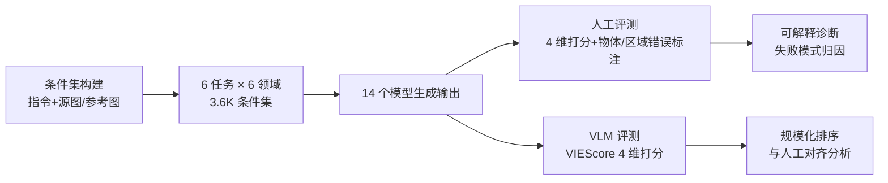

# ImagenWorld: Stress-Testing Image Generation Models with Explainable Human Evaluation on Open-ended Real-World Tasks

**会议**: ICLR 2026  
**OpenReview**: [https://openreview.net/forum?id=bld9g6jFh9](https://openreview.net/forum?id=bld9g6jFh9)  
**项目主页**: [https://tiger-ai-lab.github.io/ImagenWorld/](https://tiger-ai-lab.github.io/ImagenWorld/)  
**代码**: 待确认  
**领域**: 图像生成 / 评测基准  
**关键词**: 图像生成基准, 可解释人类评测, 图像编辑, 统一生成模型, VLM-as-a-judge  

## 一句话总结
ImagenWorld 用 3.6K 条件集 × 6 任务 × 6 领域 + 2 万条细粒度人工标注，构建了一个能"指出模型错在哪个物体/哪个区域"的可解释图像生成评测基准，系统揭示了当前 14 个生成/编辑模型在局部编辑和文字密集内容上的共性失败模式。

## 研究背景与动机
**领域现状**：扩散、自回归与混合架构已经把文生图、编辑、参考引导合成推到了高质量水平，近期更出现了能在单一框架内同时做生成与编辑的"统一模型"（GPT-Image-1、Gemini、BAGEL、OmniGen2 等）。

**现有痛点**：评测没跟上建模进度。已有基准要么只覆盖孤立任务（纯文生图、纯编辑、纯个性化），要么偏向窄领域（艺术画、文字图），要么只给一个标量分数却说不清模型到底错在哪。这导致一个核心问题悬而未决——这些统一模型在真实世界全谱系用例上到底泛化得怎么样。

**核心矛盾**：标量分数（FID、CLIPScore、VLM 打分）能排序但不可解释；而真正能定位失败模式（哪个物体缺了、哪个区域畸变了）的细粒度判断又依赖人工，难以规模化。如何在一个统一协议下既覆盖任务/领域多样性、又给出可解释的错误归因，是缺口所在。

**本文目标**：建一个既严谨又能当"诊断工具"的基准——覆盖六大任务、六大领域，配套结构化人工评测，不仅打分还标出具体失败模式，同时纳入 VLM-as-a-judge 做规模化对照。

**核心 idea**：**统一框架** 把生成与编辑都归约为"指令 + 可选源图/参考图"的条件式任务；**可解释 schema** 让标注者在打分之外，用文字标记物体级错误、用 Set-of-Mark 掩码标记区域级错误，从而回答"模型为什么失败"。

## 方法详解

### 整体框架
ImagenWorld 把所有任务统一到指令驱动框架下：每个任务都以自然语言指令 $t_{ins}$ 为条件，可选附带源图 $I_{src}$ 或参考图集合 $I_R$，据此分成"指令驱动生成"与"指令驱动编辑"两大类、共六个任务。数据集由人工撰写 prompt + 配图、再经自动精炼构建，覆盖六大领域、每个任务×领域组合各 100 样本，共 3.6K 条件集。每张模型输出同时交给三名人工标注者（用可解释 schema）和 VLM（仅打分）评估，最终汇成 2 万条标注。

### 关键设计

**1. 六任务统一形式化：把"生成 vs 编辑 × 参考图数量"拉成一张表**——作者将真实用户与生成系统的交互归纳为一个共同的条件式接口，再沿"有无源图"和"参考图数量"两个轴展开成六个任务。生成侧有文本引导生成 TIG（$y=f(t_{ins})$）、单参考生成 SRIG（$y=f(I_{ref},t_{ins})$）、多参考生成 MRIG（$y=f(I_R,t_{ins})$）；编辑侧对称地有 TIE（$y=f(t_{ins},I_{src})$）、SRIE（$y=f(I_{ref},t_{ins},I_{src})$）、MRIE（$y=f(I_R,t_{ins},I_{src})$）。这套对称结构的好处是让"生成 vs 编辑"的难度差、"单参考 vs 多参考"的组合难度都可在同一坐标系下直接对比，而不是散落在互不可比的孤立基准里。

**2. 六领域 × 细粒度子主题：刻意把"文字/符号密集"内容拉进来压测**——数据集横跨艺术画 (A)、写实图 (P)、信息图 (I)、文字图 (T)、计算机图形 (CG)、截图 (S) 六大主题，每个再细分子主题保证多样性。这一设计的针对性在于：传统基准偏爱艺术/写实这类"好看"的领域，而信息图、截图、文字图这类需要精确渲染文字、对齐版面、保持语义一致的符号密集内容恰恰是模型最薄弱、也最被忽视的地方。把它们配额纳入（每个任务×领域各 100 样本）才能把这些系统性短板暴露出来。

**3. 四维打分 + 可解释错误标注：从"打几分"升级到"错在哪"**——评测沿用四个互补维度，均按 5 点 Likert 评分再归一到 $[0,1]$：Prompt Relevance（是否忠实于指令）、Aesthetic Quality（视觉美感与版面）、Content Coherence（逻辑/语义一致，如标签是否指错区域、"增长"图却在下降）、Artifacts（畸变文字、扭曲边缘、多余肢体等技术瑕疵）。真正的创新在于错误归因的两条互补 taxonomy：**物体级错误**先把指令与源/参考图喂给 Gemini-2.5-Flash 生成"预期应出现的物体清单"，标注者再逐项标记缺失、渲染错误或畸变的物体；**区域级错误**用 Set-of-Mark (SoM) 把生成图切分成若干区域，标注者勾选含视觉缺陷的具体段落。这样每个分数都能回溯到"是哪个物体没画出来 / 是哪一块区域畸变了"，把标量分变成可定位的诊断信号。

**4. 人机双评测对照：让 VLM-as-a-judge 既当规模化裁判又被诚实校准**——每张图由三名标注者独立评分（用 Krippendorff's α 衡量评分者一致性），同时用 Gemini-2.5-Flash 按 VIEScore 范式产出同样四维的 VLM 分数，并辅以 CLIPScore、LPIPS 作自动指标。通过 Spearman 秩相关 $\rho_s$ 和 Kendall 准确率量化"VLM 排序 vs 人工排序"的对齐程度，从而既检验 VLM 能否替代人工做相对排序，又诚实暴露 VLM 在细粒度可解释归因上的不足。

## 实验关键数据

### 主实验设置
- **规模**：3.6K 条件集，6 任务 × 6 领域，每组合 100 样本；2 万条细粒度人工标注。
- **模型**：共 14 个，含 4 个能做全部六任务的统一模型（GPT-Image-1、Gemini 2.0 Flash、BAGEL、OmniGen2）+ 10 个任务专精模型（SDXL、InstructPix2Pix、Infinity、Janus Pro、UNO、Step1X-Edit、IC-Edit、Flux.1-Krea-dev、Flux.1-Kontext-dev、Qwen-Image），覆盖扩散 / 自回归 / 混合三大架构家族。
- **评测**：人工三标注者 + VLM（Gemini-2.5-Flash, VIEScore 范式），四维 Likert 打分 + 物体/区域错误标注。

### 任务级与领域级关键结果

| 维度 | 观察 |
|------|------|
| 闭源 vs 开源 | GPT-Image-1 整体最强，平均超 Gemini 2.0 Flash 约 0.1–0.2；编辑任务差距更大 |
| 生成 vs 编辑 | 所有模型在编辑任务 (TIE/SRIE/MRIE) 上系统性低于对应生成任务 (TIG/SRIG/MRIG)，平均差约 0.1 |
| 领域难度 | 艺术画/写实图最好（均值≈0.78，GPT-Image-1≈0.9）；文字图/计算机图形≈0.68；截图/信息图最难（≈0.55）|
| 规模 ≠ 成功 | 部分开源模型 (Flux-Krea-dev、Qwen-Image、Flux-Kontext-dev) 在文生图/编辑上超过 Gemini，但无一开源统一模型能追上闭源 |

### 关键发现
- **编辑两种失败模式**：模型要么"重新生成一张全新图"，要么"原样返回输入不改"，且往往偏执于其中一种——说明当前架构缺乏对局部区域做细粒度修改的控制机制。
- **文字密集内容是共性短板**，但 Qwen-Image 是例外：它在文字图上持续领先，因其采用了专为文字密集图像定制的合成数据 curation pipeline——说明短板不纯是架构问题，更与数据设计深度绑定，定向数据增强是务实的破局路径。
- **VLM 可当规模化裁判但难当可解释裁判**：现代 VLM 指标 Kendall 准确率最高达 0.79，接近甚至超过人-人一致性，可靠地做相对排序；但在细粒度失败模式标注上仍力不从心，可解释维度上人类不可替代。

## 亮点与洞察
- **从"打分基准"升级到"诊断工具"**：物体级 + 区域级双 taxonomy 让每个分数可回溯到具体错误源，这是相比 ImagenHub、MMIG-Bench、GenAI-Arena 等的核心差异化（详见论文 Table 1 的属性对比）。
- **统一形式化的可比性红利**：六任务沿对称轴展开，使"生成-编辑难度差""单/多参考组合难度"等以往难以横比的现象首次落在同一坐标系下被量化。
- **数据视角的洞察**：Qwen-Image 在文字图上的反常领先，把"模型短板"从纯架构叙事拉回到"数据 curation"，给后续改进指了一条可操作的路。

## 局限与展望
- **人工标注成本高、难规模化**：可解释 schema 依赖三标注者 + SoM 切分 + Gemini 生成预期物体清单，扩展到更大规模或持续更新成本不低。
- **VLM 裁判仍有偏置**：VIEScore 依赖 Gemini-2.5-Flash，自动评分继承了专有模型的偏置，且无法做细粒度归因。
- **领域/任务虽广但仍是快照**：14 个模型与六领域是当前时点的覆盖，生成模型迭代极快，基准需要持续维护才能保持诊断价值。
- **展望**：作者期望这套可解释人工标注能成为训练下一代"可解释 VLM 自动评测器"的基础，把人类的细粒度判断蒸馏进自动指标。

## 相关工作与启发
- **评测指标谱系**：从 FID/LPIPS（保真度）、CLIPScore（对齐）到 VIEScore/VQAScore（VLM 语义）、Pick-a-Pic/ImageReward/HPS（人类偏好），ImagenWorld 站在 VLM-as-a-judge 一侧但补上了可解释维度。
- **基准谱系**：DrawBench/PartiPrompts（文生图）、ImagenHub/MMIG-Bench（多任务）、Gecko（大规模对齐评测）、GenAI-Arena（Elo 排名）——ImagenWorld 的定位是"统一任务×领域 + 结构化可解释人工评测"。
- **启发**：对做生成模型的研究者，这套基准提供了一份"按物体/区域定位的失败地图"；对做评测的研究者，它给出了"VLM 能排序但不能解释"的清晰边界，提示可解释自动评测是值得攻坚的下一站。

## 评分
- **新颖性**: ⭐⭐⭐⭐ — 可解释的物体级+区域级错误归因 schema 是真正的差异化贡献，把图像生成评测从"标量分"推进到"诊断地图"，统一六任务×六领域的形式化也颇具系统性。
- **实验充分度**: ⭐⭐⭐⭐⭐ — 3.6K 条件集、2 万人工标注、14 个跨三大架构家族的模型、人机双评测 + 多维统计检验（Krippendorff α、Spearman ρ、Kendall），规模与严谨度都很扎实。
- **写作质量**: ⭐⭐⭐⭐ — 动机—缺口—贡献链条清晰，四点核心 insight 提炼到位，图 1/图 2/图 3 把 pipeline 和标注示例讲得直观。
- **价值**: ⭐⭐⭐⭐⭐ — 作为兼具基准与诊断工具的资源，对推动鲁棒图像生成与可解释自动评测都有持久参考价值，编辑短板与数据 curation 的洞察尤具指导性。

<!-- RELATED:START -->

## 相关论文

- [\[ICLR 2026\] WorldEdit: Towards Open-World Image Editing with a Knowledge-Informed Benchmark](worldedit_towards_open-world_image_editing_with_a_knowledge-informed_benchmark.md)
- [\[ICML 2026\] WISE: A World Knowledge-Informed Semantic Evaluation for Text-to-Image Generation](../../ICML2026/image_generation/wise_a_world_knowledge-informed_semantic_evaluation_for_text-to-image_generation.md)
- [\[CVPR 2025\] UniReal: Universal Image Generation and Editing via Learning Real-world Dynamics](../../CVPR2025/image_generation/unireal_universal_image_generation_and_editing_via_learning_real-world_dynamics.md)
- [\[ICLR 2026\] Guidance Matters: Rethinking the Evaluation Pitfall for Text-to-Image Generation](guidance_matters_rethinking_the_evaluation_pitfall_for_text-to-image_generation.md)
- [\[ICLR 2026\] ChronoEdit: Towards Temporal Reasoning for In-Context Image Editing and World Simulation](chronoedit_towards_temporal_reasoning_for_in-context_image_editing_and_world_sim.md)

<!-- RELATED:END -->
