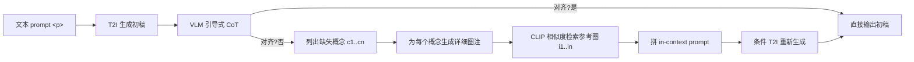

# ImageRAG: Dynamic Image Retrieval for Reference-Guided Image Generation

**会议**: ICLR 2026  
**OpenReview**: [https://openreview.net/forum?id=VT3tTfXrDi](https://openreview.net/forum?id=VT3tTfXrDi)  
**代码/主页**: [https://rotem-shalev.github.io/ImageRAG](https://rotem-shalev.github.io/ImageRAG)  
**领域**: 图像生成 / 检索增强生成 (RAG)  
**关键词**: Retrieval-Augmented Generation, Rare Concept Generation, Vision-Language Model, Training-free, Reference-guided Generation  

## 一句话总结
ImageRAG 把 LLM 里的 RAG 思路搬到图像生成：先让 T2I 模型生成初稿，再用 VLM 的引导式思维链找出"画错/画不出"的概念，按需检索参考图喂回模型，全程无需任何额外训练就能显著提升稀有、细粒度概念的生成能力。

## 研究背景与动机
**领域现状**：扩散类 T2I 模型（SDXL、FLUX、OmniGen 等）在常见概念上已经能产出高质量、多样化的图像，并衍生出布局生成、图像编辑、风格迁移等丰富任务。

**现有痛点**：这些模型受限于训练数据，对稀有概念、用户特定概念、细粒度类别（如某种具体鸟类 *Cyanocitta cristata*）经常生成失败，甚至在不理解 prompt 时"幻觉"出与文本无关的内容。已有的个性化 / 风格化 / 稀有概念生成方法几乎都要为每个新概念做训练或优化；少数用检索辅助生成的工作（RDM、knn-diffusion、ReImagen 等）要么专门训练检索-生成模型，要么需要为每个底座模型单独训一个检索模块，通用性差。

**核心矛盾**：文本领域的 RAG 可以把检索到的所有相关信息塞进上下文，但图像生成的上下文窗口极其有限——无法为 prompt 里每个概念都提供参考图。因此必须回答三个问题：**该用哪些图、怎么检索、怎么用**。

**本文目标**：提出一个**训练无关**、**底座无关**、**条件方式无关**的方法，在采样阶段动态检索参考图来增强已有 T2I 模型的稀有/细粒度概念生成能力。

**核心 idea**：**只补模型画不出来的概念**——利用 T2I 模型本身已能生成大量概念这一事实，先生成初稿，用 VLM 的引导式思维链定位"生成缺口"（generation gap），仅对缺失概念检索参考图，再通过现成的图像条件工具（IP-Adapter、OminiControl、OmniGen 原生图像输入）把参考图作为 in-context 示例喂回模型。

## 方法详解

### 整体框架
给定文本 prompt `
`，ImageRAG 先用 T2I 模型出一张初稿；然后用 VLM 跑一段引导式思维链，判断初稿是否对齐 prompt，若不对齐就列出缺失概念并为每个缺失概念生成一句"检索用图注"；用这些图注从外部数据库检索参考图，最后把参考图按 in-context 模板拼进 prompt 重新生成。整条管线无需训练，可选地迭代直到 VLM 判定对齐。

### 关键设计

**1. 引导式多模态思维链：把"找缺口"拆成三步逼问。** 直接问 VLM"这张图有什么问题"往往得到泛泛或过度发散的答案，所以作者把诊断显式拆成串行的三问：先问 `Q: 这张图和 prompt 匹配吗？`（决策），不匹配再问 `Q: 缺了哪些概念？`（聚焦内容与风格这类易用视觉传达的维度），最后问 `Q: 为缺失概念各写一句可用于检索的图注`。关键的工程细节是用一个示例约束 VLM 只返回**简短、通用**的概念，避免 overthinking 导致检索词跑偏。这一步既保证了只对真正缺失的概念检索（省下宝贵的图像上下文），又顺带带来可解释性——可以直接看到模型认为缺了什么。作者还在附录中对多个 VLM 做了鲁棒性测试来挑选可信的诊断器。

**2. 检索：用详细图注而非生硬概念词，CLIP 余弦即够用。** 一个反直觉的发现是，直接拿缺失概念的短词（如 "calculus class setting"）去检索，效果反而比拿一句详细图注差（见消融 Tab.3）。因此 CoT 的最后一步专门让 VLM 把概念扩写成详细图注，再用图注检索。检索本身用文本-图像相似度：作者比较了 CLIP、SigLIP 余弦以及候选重排（re-rank）策略，发现重排偶尔更好但差距不显著，最终为简洁起见统一用 CLIP embedding 余弦相似度 $\text{sim}(c, i) = \cos(\phi_{\text{text}}(c), \phi_{\text{img}}(i))$。这里有个值得玩味的悖论：SDXL 本身就用 CLIP 当文本编码器，为什么它生成失败的概念却能被同一个 CLIP 检索成功？作者的假设是**检索比生成更容易**——模型生成不出来的概念，仍能从用 CLIP 检索到的真实参考图里"看懂并学会"。

**3. In-context 参考图注入：复用现成条件工具，模板化拼接。** 检索到参考图后，不改任何模型权重，而是把参考图当作 in-context 示例augment 进 prompt。形式上，给定 prompt $p$、$n$ 个缺失概念、每个概念配一张参考图，构造模板：*"According to these examples of `<c1>:<img1>, ..., <cn>:<imgn>`, generate `
`"*，其中 $c_i$ 是参考图 $\text{img}_i$ 的图注。这一模板让 OmniGen（原生支持图像输入）、SDXL+IP-Adapter、FLUX+OminiControl 三类不同条件机制的模型都能直接吃下参考图，从而做到**底座无关、条件方式无关**。

**4. 阈值与迭代两个可选阀门。** 方法天然支持质量把关：检索时可设相似度阈值，只有过阈值的"好参考"才会被使用；生成后可让 VLM 再判一次对齐，不满足就把整个"诊断-检索-生成"循环再跑一轮，直到对齐或达到上限。这让方法在"激进补全"与"稳健不退化"之间可调。

## 实验关键数据

底座：OmniGen、SDXL+IP-Adapter、FLUX+OminiControl；VLM 用 GPT，检索用 CLIP，检索库为 LAION 的 350K 子集；数据集 ImageNet / iNaturalist / CUB（均偏向 LAION 长尾的稀有/细粒度类）。

### 主实验（GPTScore，越高越好，Tab.1）

| 数据集 | OmniGen | ImageRAG-O | FLUX | ImageRAG-F | SDXL | ImageRAG-SD |
|---|---|---|---|---|---|---|
| ImageNet | 0.68 | **0.88** | 0.84 | **0.90** | 0.86 | **0.92** |
| iNaturalist | 0.06 | **0.56** | 0.07 | **0.31** | 0.51 | **0.70** |
| CUB | 0.45 | **0.73** | 0.79 | **0.85** | 0.94 | **0.97** |

三个底座加上 ImageRAG 后 GPTScore 全面提升，iNaturalist 这类最难的细粒度数据集提升最猛（OmniGen 0.06→0.56）。CLIP/SigLIP/DINO 相似度（Tab.2）也一致提升，但作者指出这些粗粒度语义指标对"两种相似鸟类"的区分不敏感，所以提升看着温和，GPTScore 与用户研究才更能反映真实差距。

### 消融实验（OmniGen，Tab.3）

| 变体 | ImageNet CLIP↑ | ImageNet DINO↑ | CUB CLIP↑ | CUB DINO↑ |
|---|---|---|---|---|
| OmniGen 基线 | 0.247 | 0.692 | 0.231 | 0.747 |
| 仅改写 prompt（无参考图） | 0.248 | 0.696 | 0.230 | 0.750 |
| 用概念词检索 | 0.258 | 0.694 | 0.240 | 0.719 |
| 用原 prompt 检索 | 0.258 | 0.691 | 0.246 | 0.736 |
| **ImageRAG（详细图注检索）** | **0.264** | **0.708** | **0.253** | **0.760** |

仅改写 prompt 几乎无增益，说明收益来自**真实参考图**而非文本重述；用详细图注检索优于用短概念词或原 prompt 检索，验证了 CoT 最后一步扩写图注的必要性。相似度量消融（Tab.4）显示 GPT 重排比 CLIP 余弦略好但不显著，故主实验用 CLIP 余弦。

### 关键发现
- **用户研究（67 人、977 次对比、231 次绝对评分）**：三个底座在文本对齐、视觉质量、整体偏好三项上加 ImageRAG 后都被显著偏好；与专门训练的检索-生成模型（RDM、knn-diffusion、ReImagen）相比也全面胜出。
- **绝对研究**：在 VLM 判定"初稿不匹配"的样本上，ImageRAG 结果含目标稀有概念的比例达 92%（OmniGen）/ 90%（SDXL）/ 84%（FLUX），而基线大多不含——间接证明 VLM 诊断缺失概念是准的。

## 亮点与洞察
- **范式迁移很干净**：把 NLP 里成熟的 RAG 思想完整映射到图像生成，并精准识别出"图像上下文有限"这一独有约束，给出"只补缺口"的省上下文解法。
- **训练无关 + 三重无关**：底座无关、条件方式无关、概念无关，复用现成 VLM 与图像条件工具，落地门槛极低，几乎是即插即用。
- **"检索易于生成"的洞察**：同一个 CLIP，生成失败却能检索成功，这条经验性观察解释了方法为何有效，也提示稀有概念生成的瓶颈在生成端而非语义表征端。
- **可解释 + 可调**：CoT 暴露了"模型认为缺了什么"，阈值与迭代循环给了质量-激进度的旋钮。

## 局限与展望
- **强依赖 VLM 诊断质量**：整条链以"VLM 准确判断对齐并定位缺失概念"为前提，作者自己也承认需要专门挑选可信 VLM，弱 VLM 会让方法退化。
- **受限于图像条件能力上界**：参考图能注入多少信息、能注入几张，取决于底座的条件机制（IP-Adapter / OminiControl），多概念交互场景仍可能受限。
- **检索库覆盖度决定天花板**：当外部库里没有目标概念的好样本时，检索质量下降，方法收益受限。
- **粗粒度指标失真**：CLIP/SigLIP/DINO 对细粒度差异不敏感，使得自动指标提升"看起来温和"，评估高度依赖 GPTScore 与人工，成本较高。

## 相关工作与启发
- **RAG（Lewis et al., 2020）**：本文的思想母体，ImageRAG 是其在图像生成域的首个训练无关落地。
- **检索辅助图像生成（RDM / knn-diffusion / ReImagen / Lyu et al. 2025）**：均需为任务或每个底座专门训练检索/生成模块，是本文要超越的"需训练"基线。
- **稀有概念生成（Samuel et al. 2024、Pan et al. 2025）**：依赖 per-concept 优化或全数据集微调，ImageRAG 用检索+in-context 绕开了训练。
- **Yuan et al. (2025) 的 prompt 分解 + 布局**：检索 prompt 中所有概念并用布局保证全部出现，但忽略模型已有知识、且布局会割裂概念间交互；ImageRAG 只补缺口、保留概念交互，是清晰的对照。
- **启发**：采样阶段的"诊断-检索-补全"循环是一种通用的后处理增强范式，可推广到视频、3D 等其他生成模态的长尾问题。

## 评分
- **新颖性**: ⭐⭐⭐⭐ — 首次把训练无关的 RAG 范式干净地搬进图像生成，并提出"只补生成缺口"的引导式 CoT，"检索易于生成"的洞察很有启发性。
- **实验充分度**: ⭐⭐⭐⭐ — 三底座 × 三数据集 × 多指标 + 大规模用户研究 + 充分消融，覆盖全面；细粒度自动指标的局限性也被诚实讨论。
- **写作质量**: ⭐⭐⭐⭐ — 问题动机清晰（三问框架），方法图与流程讲解到位，消融设计回答了关键质疑。
- **价值**: ⭐⭐⭐⭐ — 即插即用、底座无关、无需训练，对实际部署稀有/细粒度概念生成有直接价值，也为生成域引入 RAG 打开了方向。

<!-- RELATED:START -->

## 相关论文

- [\[CVPR 2026\] CAST: Context-Aware Dynamic Latent Space Transformation for Interactive Text-to-Image Retrieval](../../CVPR2026/image_generation/cast_context-aware_dynamic_latent_space_transformation_for_interactive_text-to-i.md)
- [\[ICLR 2026\] Training-Free Reward-Guided Image Editing via Trajectory Optimal Control](training-free_reward-guided_image_editing_via_trajectory_optimal_control.md)
- [\[ICLR 2026\] Follow-Your-Shape: Shape-Aware Image Editing via Trajectory-Guided Region Control](follow-your-shape_shape-aware_image_editing_via_trajectory-guided_region_control.md)
- [\[ICLR 2026\] SIGMA-GEN: Structure and Identity Guided Multi-Subject Assembly for Image Generation](sigma-gen_structure_and_identity_guided_multi-subject_assembly_for_image_generat.md)
- [\[CVPR 2026\] MultiBanana: A Challenging Benchmark for Multi-Reference Text-to-Image Generation](../../CVPR2026/image_generation/multibanana_a_challenging_benchmark_for_multi_reference_text_to_image_generation.md)

<!-- RELATED:END -->
