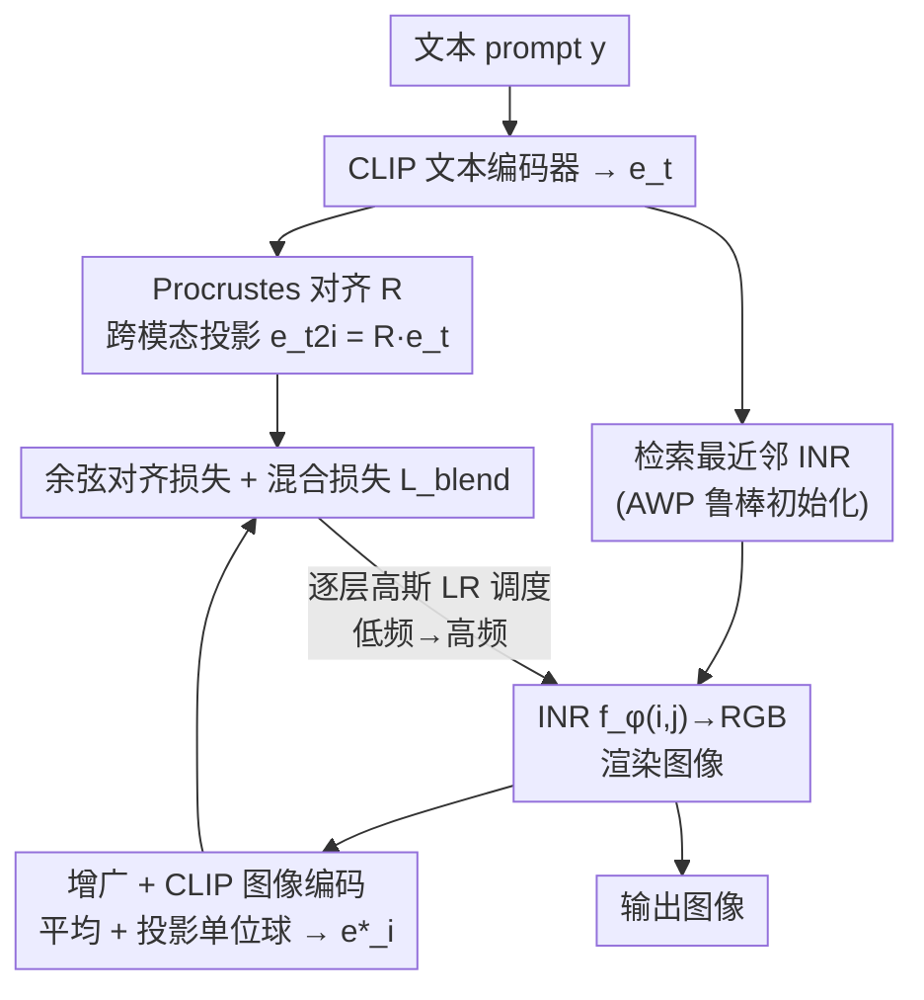

# Implicit Inversion turns CLIP into a Decoder

**会议**: ICLR 2026  
**代码**: [https://github.com/OmnAI-Lab/implicit-inversion](https://github.com/OmnAI-Lab/implicit-inversion)  
**领域**: 图像生成 / Text-to-Image  
**关键词**: CLIP 反演, 隐式神经表示 (INR), 文生图, 模态鸿沟, 频率感知, 判别模型的生成能力  

## 一句话总结
不训练任何生成解码器、也不微调 CLIP，仅靠"反演"一个**冻结的 CLIP 图像编码器**——用频率感知的隐式神经表示（INR）从一个文本嵌入反推出图像，就能实现文生图、风格迁移和图像重建，揭示判别模型里藏着尚未被利用的生成能力。

## 研究背景与动机

**领域现状**：现代文生图（DALL-E 3、GLIDE、Latent Diffusion）几乎都是"编码器 + 解码器"架构。CLIP 常被拿来当**文本编码器**，但真正把潜空间映射回像素的那个**解码器**（通常是扩散模型）才是算力黑洞——要么参数上百亿、要么需要完整训练管线。

**现有痛点**：已经有人尝试"反演 CLIP"来摆脱解码器，但路子都不理想——

- **像素空间直接优化**（CLIP-Inv, Kazemi et al. 2024）：从随机像素出发最小化 CLIP 余弦距离，结果布满结构性伪影、FID 高达 140；
- **微调 CLIP**（CLIPAG / EB-CLIP, Ganz & Elad）：质量上去了，但破坏了"冻结 CLIP"这个前提，需要额外对抗训练；
- **并发工作 DAS**（Fort & Whitaker 2025）：在像素空间多分辨率 coarse-to-fine 优化，无需解码器也无需微调，但仍直接操作像素，质量有限（FID 161.8）。

**核心矛盾**：想要"既不训练解码器、又不动 CLIP、还要画面干净"——直接在像素空间优化会陷入高频伪影和 CLIP 的**模态鸿沟**（文本嵌入和图像嵌入落在略微错开的子流形上，拿原始文本嵌入当目标会导致"文字幻觉"和不真实画面）。

**本文目标**：证明**一个冻结的 CLIP 单独就能生成图像**，不靠预训练解码器、不微调 CLIP。

**核心 idea**：**用隐式神经表示（INR）代替像素作为优化变量**。不优化像素网格，而是优化一个把坐标 $(i,j)$ 映射到 RGB 的 MLP（INR）的权重，借助 INR 天然的"浅层管低频、深层管高频"特性实现 coarse-to-fine 生成；再配上对抗鲁棒初始化、正交 Procrustes 跨模态对齐、自然图像先验混合三个稳定器，把这个病态的反演问题驯服成可用的生成器。

## 方法详解

### 整体框架

CLIP$^{-1}$ 的管线分三段：(i) **离线数据准备**（一次性，用 LAION-Aesthetics 训一批模糊图的 INR、存好它们的 CLIP 图/文嵌入到 FAISS 索引）；(ii) **初始化**（给定 prompt，检索文本嵌入最相近的那个 INR 作为起点，并用 Procrustes 把文本嵌入投影到图像模态）；(iii) **优化**（冻结 CLIP，逐层、按频率地更新 INR 权重，让其渲染图过 CLIP 后的嵌入逼近目标）。整个过程梯度从冻结的 CLIP 一路回传到 INR 参数 $\phi$，CLIP 本身一个权重都不动。

### 关键设计

**1. 频率感知的 INR + 逐层频率调度：用 coarse-to-fine 抑制高频伪影**

这是全文的承重墙，直接解决"像素空间优化布满结构性伪影"的痛点。作者不优化像素，而是把图像表示成一个 FINER 型 INR——它在 SIREN 的固定频率激活 $z_i = \sin(\omega(W_i z_{i-1}+b_i))$ 基础上引入了一个随输入幅值动态调整的局部频率系数 $\alpha_i = |W_i z_{i-1}+b_i| + 1$，激活变为 $z_i = \sin(\omega \alpha_i (W_i z_{i-1}+b_i))$。关键在于 FINER 的偏置初始化会把频率**分层**：浅层负责低频（粗结构），深层负责高频（细节）。

有了这个结构，作者用**高斯学习率调度**驱动 coarse-to-fine：每次迭代只给某一层一个峰值学习率，邻层按高斯曲线衰减，优化焦点随迭代从低频层平移到高频层。这样就强制网络"先把粗布局画稳、再添细节"，避免高频层抢先过拟合。消融最能说明它的分量——去掉频率调度（变体 ii），所有频带被迫同时优化、高频层先过拟合，细纹理在粗布局还没稳时就冒出来，产生条纹状伪影，FID 直接从 107 崩到 185（全表最差）。

**2. 对抗鲁棒初始化（AWP）：把起点锚在一个"扰动不崩"的流形上**

INR 权重就像图像的另一种"像素"，但它极其敏感——权重稍微一动，重建图就面目全非，反演时极不稳定。作者借鉴 Adversarial Weight Perturbation 的思路，但**只扰动权重、不扰动输入**，在离线训练 INR 时解一个 min-max：

$$\min_{\phi}\ \max_{\Delta\phi\in\Omega}\ \mathcal{L}\big(f_{\phi+\Delta\phi},\ \text{blur}(x)\big),\qquad \Omega=\{\Delta:\|\Delta\|\le \gamma\|\phi\|\}$$

即让 INR 在权重被对抗扰动 $\Delta\phi$（相对范数受 $\gamma$ 约束）后仍能重建出**模糊版**目标图 $\text{blur}(x)$。这相当于把损失地形压平、把初始 INR 锚定在一个稳定的低频流形上，使反演早期的更新不会让权重漂离初始化的频率内容。注意目标是模糊图——低频权重才稳，正好给后续 coarse-to-fine 提供鲁棒锚点。消融里去掉 AWP（变体 iii），coarse-to-fine 动态还在但权重不再被约束在鲁棒锚点流形上，冒出神经伪影、FID 从 107 升到 121。

**3. 正交 Procrustes 跨模态对齐：把文本嵌入"翻译"成图像嵌入**

CLIP 虽在全局把图文投到同一单位球，但局部仍有模态鸿沟——文本嵌入偏抽象语义、图像嵌入偏具体视觉特征，直接拿原始文本嵌入当反演目标会让模型过拟合抽象概念、产生"文字幻觉"。作者对**每个 prompt** 现算一个局部对齐：取该文本嵌入在数据集里的 $k$ 个最近邻，凑出文本嵌入矩阵 $E_T$ 和对应图像嵌入矩阵 $E_I$，解正交 Procrustes 问题

$$\min_{R}\ \|R E_T - E_I\|_F\quad \text{s.t.}\quad R^\top R = I$$

得到一个正交矩阵 $R$，再把目标嵌入投到图像模态：$e_{t2i} = R\,\theta_T(y)$。于是反演损失变成 $\phi = \arg\min_\phi \mathcal{L}(\theta_I(f_\phi), e_{t2i})$（$\mathcal{L}$ 为余弦距离）。这一步把"病态的目标"换成"良态、落在图像子流形上的目标"。消融显示去掉 Procrustes（变体 iv）会把优化推向原始文本嵌入、略微出界，CLIP 反而奖励这种更紧的对齐（CLIPSIM 升到 46.4），但画面变得杂乱、轮廓过锐、出现重复元素——是个典型的"指标涨、画质跌"的反例。

**4. 自然图像先验混合 + 增广平均：把输出拽回真实照片的统计分布**

为了让生成更像真实照片，作者额外引入两层"现实约束"。其一是**增广平均**：优化时对 INR 输出做颜色/缩放/剪切增广，把它们各自 CLIP 编码后平均再投影到单位球，$e^\star_i = \frac{1}{n}\sum_{k=1}^{n}\theta_I(\text{augment}(f_{\phi_k}))$，强制输出对扰动鲁棒。其二是**混合损失**：对 prompt 检索 $k$ 张最相似的真实图嵌入，按相似度 softmax 加权混成目标 $e^\star_{img}$，用 $L_{blend}$ 把输出嵌入拽向这个自然图像流形。完整更新式为

$$\phi_n = \phi_{n-1} - \nabla_\phi\Big[\mathcal{L}(e^\star_i, e_{t2i}) + \beta L_{blend}(e^\star_i, e^\star_{img})\Big]$$

消融去掉混合损失（变体 v），优化器不再参考真实照片统计，颜色变刺眼、小物体出现重影，FID 变差而 CLIPSIM 反升——同样是过度迎合 caption 牺牲真实感的表现。

## 实验关键数据

### 主实验（MS-COCO 10k captions 文生图）

| 方法 | 反演式 | 免调优 | 训练参数(M) | FID↓ | CLIPSIM↑ | IS↑ |
|------|:---:|:---:|:---:|------|------|------|
| LDM-KL-8 (Rombach 2022) | ✗ | ✗ | 1450 | **23.3** | – | 20.0 |
| CLIPAG (Ganz 2023, 微调) | ✓ | ✗ | 88 | 42.3 | 34.7 | 18.7 |
| CLIP-Inv (Kazemi 2024) | ✓ | ✓ | 0 | 140.1 | **61.4**¹ | 4.8 |
| DAS-ViT (Fort 2025) | ✓ | ✓ | 0 | 161.8 | 22.7 | 5.7 |
| DAS-Ensemble (3×150M) | ✓ | ✓ | 0 | 121.6 | 36.9 | 8.4 |
| **CLIP$^{-1}$ (本文)** | ✓ | ✓ | **0** | **72.5** | 38.6 | **9.5** |

¹CLIP-Inv 的高 CLIPSIM 来自对目标嵌入的过拟合（FID 极高、IS 极低佐证），并非真实质量。

**核心结论**：在"免预训练解码器 + 免 CLIP 微调"这一公平赛道里，CLIP$^{-1}$ 把 FID 从 DAS-ViT 的 161.8 砍到 72.5（**减半**）、IS 从 5.7 提到 9.5（**近翻倍**），画面更清晰、更忠实。扩散模型 FID 仍更低，但要多几个数量级的参数和完整训练管线，而本文用的是冻结 backbone + 轻量 INR。

### 消融实验（1000 MS-COCO captions）

| 变体 | FID↓ | CLIPSIM↑ | IS↑ | 说明 |
|------|------|------|------|------|
| i. CLIP$^{-1}$ 完整 | **107.1** | 38.8 | 7.7 | 完整模型 |
| ii. w/o 频率调度 | 185.1 | 30.5 | 7.8 | 高频先过拟合，条纹伪影，FID 最差 |
| iii. w/o AWP | 121.0 | 43.0 | 7.3 | 权重漂离锚点，神经伪影 |
| iv. w/o 频调 & Procrustes | 111.3 | 46.4 | 9.1 | 迎合文本嵌入，画面杂乱重复 |
| v. w/o 频调 & 混合损失 | 119.7 | 49.5 | 7.9 | 颜色刺眼、小物体重影 |

OOD 评测（Table 3a）：即使 **Plain CLIP$^{-1}$**（随机初始化、去掉 Procrustes 与混合损失）在 MS-COCO/Flickr30k（相对 LAION 严格 OOD）上仍全面超过 DAS——FID 92.7/119.2 对 DAS 的 121.6/161.1，说明初始化只是"优化加速器"而非性能命脉。

### 关键发现
- **频率调度是第一功臣**：去掉它 FID 几乎翻倍（107→185），印证 coarse-to-fine 是抑制高频伪影的核心；其余三个组件各掉 10~15 点 FID，作用互补。
- **CLIPSIM 与 FID 系统性反向**：去掉 AWP/Procrustes/混合损失都会让 CLIPSIM 升、FID 跌——因为放松"真实感约束"会让优化更贴 caption 嵌入但画质崩，说明**单看 CLIPSIM 会被误导**。
- **迭代步数权衡**：40 步 FID 107、400 步 FID 72.5，但 IS 反而从 10.6 降到 9.5——更多步换更低 FID 但多样性略降。
- **零样本迁移**：同一冻结模型不改任何东西就能做图像重建、prompt 驱动的可控编辑（加雪/暴雨而几何不变）、神经风格迁移（笔触/色调迁移而布局不变），还能当 CLIP 可解释性探针——可视化 CLIP 对否定句"this is not a photo of a dog"和 OOD 概念的反应。

## 亮点与洞察
- **把"优化变量"从像素换成 INR 权重，是四两拨千斤的一招**：INR 天然的频率分层让 coarse-to-fine 几乎免费可得，这是它甩开像素空间方法（DAS、CLIP-Inv）的根本原因——伪影问题在表示层面就被结构性化解了。
- **正交 Procrustes 处理模态鸿沟的思路可直接迁移**：任何"拿 CLIP 文本嵌入当图像侧目标"的任务（CLIP-guided 生成/编辑/检索）都能套这个 per-prompt 局部正交对齐来消减文字幻觉，成本极低（只解一个 $k\times k$ 量级的 SVD）。
- **AWP 只扰权重不扰输入**，给"INR 权重当图像表示"这一新场景提供了稳定化范式，揭示鲁棒模型确实编码更强的生成先验。
- **最大的"啊哈"是 framing**：判别模型 CLIP 里"藏在明处"的生成能力被一个纯优化框架挖出来，论文明确说目标不是和扩散拼保真度，而是量化"冻结 CLIP 潜空间里到底已经编码了多少视觉结构"——兼具生成工具和可解释性探针双重价值。

## 局限与展望
- **保真度天花板明显**：FID 72.5 离扩散（LDM 23.3）差一大截，细粒度空间细节（人脸、建筑）会有扭曲或位移，作者自承不与扩散/AR 解码器竞争保真度。
- **重建仍有歧义**：图像重建任务里高层语义（身份、构图）能保住，但结构化区域细节会失真，反映 CLIP 嵌入空间本身的信息瓶颈。
- **依赖离线检索库**：初始化和自然图像先验都来自 LAION-Aesthetics 索引，跨域时是 OOD（虽证明仍 work，但终究依赖一个外部参考集）。
- **指标错位风险**：CLIPSIM 与真实质量系统性反向，意味着评测这类反演方法需谨慎，单一指标易被过拟合刷高。
- **改进方向**：更强的频率感知 INR、自适应步数/学习率调度以平衡 FID 与多样性、把 Procrustes 对齐推广到更大跨域场景。

## 相关工作与启发
- **生成模型四大家**（GAN/扩散/归一化流/自回归）都依赖某种"潜空间→图像解码器"；本文绕过解码器、直接反演一个冻结判别编码器，是与四家正交的第五条路。
- **CLIP 反演谱系**：CLIP-Inv（像素优化）→ CLIPAG/EB-CLIP（微调 CLIP）→ DAS（并发，像素多分辨率）→ 本文（INR + 频率感知，免微调免解码器）。本文与 DAS 都在揭示判别模型的生成先验，区别是频率感知隐式表示 vs 像素空间。
- **INR 谱系**：positional encoding → SIREN（固定频率）→ FINER（变周期激活），本文采用 FINER 缓解谱偏置。
- **启发**：这条"反演判别模型获取生成能力"的路线对**模型可解释性与压力测试**很有价值——能在 CLIP 的错误/偏见传播进下游大管线前，直接把它对怪异/否定 prompt 的内部反应可视化出来。

## 评分
- **新颖性**: ⭐⭐⭐⭐⭐ —— "冻结 CLIP + INR 反演 = 文生图"这一 framing 既反直觉又自洽，频率感知 INR、AWP 权重扰动、per-prompt Procrustes 三件套都用得巧，是真正打开新视角的工作。
- **实验充分度**: ⭐⭐⭐⭐ —— 主表对比覆盖训练式/微调式/反演式三类基线，四组件消融逐一拆解、OOD 评测严谨，多下游任务零样本验证；但定量主要靠 FID/IS/CLIPSIM，缺人评，且只在 ViT-B/32 量级 CLIP 上验证。
- **写作质量**: ⭐⭐⭐⭐ —— 动机层层递进、消融与现象解释（CLIPSIM↑而 FID↓的反例）讲得透彻，图示清晰；公式记号偶有密集。
- **价值**: ⭐⭐⭐⭐ —— 实用价值在于"零训练参数的生成器"与"CLIP 可解释性探针"，研究价值在于揭示判别模型的隐藏生成潜能，为后续轻量反演式生成与多模态系统调试提供了新工具。

<!-- RELATED:START -->

## 相关论文

- [\[ICLR 2026\] Verification of the Implicit World Model in a Generative Model via Adversarial Sequences](verification_of_the_implicit_world_model_in_a_generative_model_via_adversarial_s.md)
- [\[ICLR 2026\] Free Lunch for Stabilizing Rectified Flow Inversion](free_lunch_for_stabilizing_rectified_flow_inversion.md)
- [\[ICML 2026\] Visual Implicit Autoregressive Modeling](../../ICML2026/image_generation/visual_implicit_autoregressive_modeling.md)
- [\[ICLR 2026\] Directional Textual Inversion for Personalized Text-to-Image Generation](directional_textual_inversion_for_personalized_text-to-image_generation.md)
- [\[ICLR 2026\] UniEdit-Flow: Unleashing Inversion and Editing in the Era of Flow Models](uniedit-flow_unleashing_inversion_and_editing_in_the_era_of_flow_models.md)

<!-- RELATED:END -->
