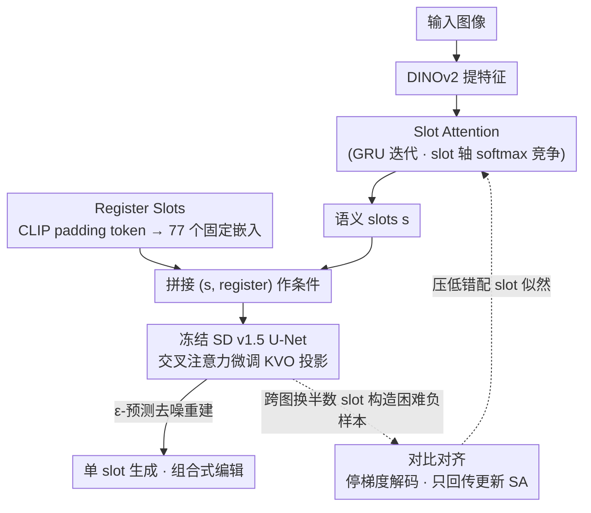

# Improved Object-Centric Diffusion Learning with Registers and Contrastive Alignment (CODA)

**会议**: ICLR 2026  
**arXiv**: [2601.01224](https://arxiv.org/abs/2601.01224)  
**代码**: [GitHub](https://github.com/sony/coda)  
**领域**: 物体中心学习 / 扩散模型  
**关键词**: Object-Centric Learning, Slot Attention, Register Slots, contrastive learning, 组合式生成

## 一句话总结

提出 CODA 框架，通过引入 register slots 吸收残余注意力、微调交叉注意力投影以及对比对齐损失，解决基于扩散模型的物体中心学习中的 slot 纠缠和弱对齐问题，在合成和真实数据集上显著提升物体发现和组合式生成质量。

## 研究背景与动机

物体中心学习（OCL）旨在将复杂场景分解为结构化的、可组合的物体表示，支撑视觉推理、因果推断、世界模型和组合式生成等下游任务。Slot Attention（SA）是一种完全无监督的方法，但在真实场景中表现有限。近期将 SA 与预训练扩散模型（如 Stable Diffusion）结合的方法（Stable-LSD, SlotAdapt）虽取得进展，但仍面临两大核心问题：

**Slot 纠缠（Slot Entanglement）**：一个 slot 编码了多个物体的特征，导致单 slot 生成时图像失真或语义不一致。本质原因是 softmax 归一化迫使注意力权重在所有 slot 上求和为 1，当 U-Net 中的某些 query 不强匹配任何语义 slot 时，注意力分散到多个 slot 上。

**弱对齐（Weak Alignment）**：slot 未能与不同的图像区域一致对应，导致过分割（一个物体被拆成多个 slot）或欠分割（多个物体合并到一个 slot）。

这两个问题严重影响了物体中心表示的准确性和组合式场景生成的实用性。

## 方法详解

### 整体框架

CODA 用 DINOv2 提取图像特征、Slot Attention 抽出一组 slot，再让冻结的 Stable Diffusion v1.5 作为 slot 解码器重建原图。围绕这条主干，它在 slot 与扩散解码器的交界处补了三件事——多塞一批吸收残余注意力的 register slots、只微调 cross-attention 的投影、再加一个对比对齐损失，分别针对 slot 纠缠和弱对齐两个老毛病。注意力主路（实线）走"图像→特征→slot→拼接条件→去噪重建→单 slot 生成/组合编辑"，对比对齐则是一条只回传到 Slot Attention 的旁路（虚线）。

### 关键设计

**1. Register Slots：给残余注意力一个去处，缓解 slot 纠缠**

slot 纠缠的根子在 softmax：cross-attention 要求每个 U-Net query 的注意力在所有 slot 上求和为 1，于是那些不强匹配任何语义 slot 的 query 只能把权重硬摊到几个语义 slot 上，把多个物体的特征搅进同一个 slot。CODA 的做法是另开一组与输入无关的 register slots：把纯 padding token 喂进 SD 冻结的 CLIP ViT-L/14 文本编码器，得到固定的嵌入序列 $\bar{\mathbf{r}}$，与语义 slot 一起参与 cross-attention。这些 register slots 充当"注意力吸收器"，让那部分无处安放的注意力自然流向它们而不再污染语义 slot。SD v1.5 有 77 个 padding token，所以正好产出 77 个 register slots；实验里固定版本比可训练版本更稳。这个设计借鉴了 LLM 里的注意力 sink 现象，几乎零额外计算，却是消融中提升最大的单一组件（mBO 约涨 10 个点）。

**2. 交叉注意力微调：剥掉 SD 的文本条件偏置**

SD 是在图文对上预训练的，直接拿来当 slot 解码器会残留文本条件偏置（text-conditioning bias），让模型偏向语言驱动的语义、而不是真正以 slot 为条件去重建。CODA 不加适配器也不加新层，只微调 cross-attention 里的 key/value/output 三个投影矩阵 $\boldsymbol{\theta}$，用最小的改动把条件信号从"文本风味"扭回"slot 风味"。对应的去噪目标是标准的 $\epsilon$-预测：

$$\mathcal{L}_{\mathrm{dm}}(\phi, \boldsymbol{\theta}) = \mathbb{E}_{(\mathbf{z}, \mathbf{s}), \epsilon, \gamma} \left[\|\epsilon - \epsilon_{\boldsymbol{\theta}}(\mathbf{z}_\gamma, \gamma, \mathbf{s}, \bar{\mathbf{r}})\|_2^2\right]$$

其中 slot $\mathbf{s}$ 和 register $\bar{\mathbf{r}}$ 一同作为条件输入。

**3. 对比对齐目标：逼 slot 真去抓图里存在的概念**

光有去噪损失并不能保证 slot 对应到图像里实际存在的物体——模型完全可以靠平均化的 slot 蒙混过关。CODA 加一个对比项把这条捷径堵死：构造困难负样本 $\tilde{\mathbf{s}}$，方法是跨图像随机替换掉一半 slot（共享初始化保证语义上仍合理），然后要求模型给匹配的 slot 高似然、给被替换过的 slot 低似然，也就是去最大化这个负样本上的去噪误差：

$$\mathcal{L}_{\mathrm{cl}}(\phi) = -\mathbb{E}_{(\mathbf{z}, \tilde{\mathbf{s}}), \epsilon, \gamma} \left[\|\epsilon - \epsilon_{\bar{\boldsymbol{\theta}}}(\mathbf{z}_\gamma, \gamma, \tilde{\mathbf{s}}, \bar{\mathbf{r}})\|_2^2\right]$$

这里 $\bar{\boldsymbol{\theta}}$ 是停了梯度的解码器参数，是整套设计里最关键的一笔：对比损失只回传去更新 Slot Attention、绝不去动扩散解码器，否则解码器会自己学坏（刻意把负样本解码得很差）走捷径，消融里"不停止梯度"的版本 FG-ARI 直接从 32.23 崩到 10.54 就是证据。

### 损失函数 / 训练策略

总损失是去噪项与对比项的加权和：

$$\mathcal{L}(\phi, \boldsymbol{\theta}) = \mathcal{L}_{\mathrm{dm}}(\phi, \boldsymbol{\theta}) + \lambda_{\mathrm{cl}} \mathcal{L}_{\mathrm{cl}}(\phi)$$

论文进一步证明这一目标等价于最大化 slot 与图像之间互信息的一个可操作代理（Theorem 1），其中去噪误差差 $\Delta$ 充当互信息的实用近似——这也把前面两个看似各管一摊的损失统一到了同一个理论框架下。

## 实验关键数据

### 主实验：物体发现

| 数据集 | 指标 | CODA | SlotAdapt (之前SOTA) | 提升 |
|--------|------|------|----------|------|
| MOVi-C | FG-ARI | 59.19 | 51.98 (LSD) | +7.21 |
| MOVi-E | FG-ARI | 59.04 | 56.45 | +2.59 |
| VOC | FG-ARI | 32.23 | 29.6 | +2.63 |
| VOC | mBOi | 55.38 | 51.5 | +3.88 |
| VOC | mIoUc | 56.30 | 49.3 (SlotDiff) | +7.00 |
| COCO | FG-ARI | 47.54 | 41.4 | +6.14 |

### 消融实验

| 配置 | FG-ARI | mBOi | mBOc | mIoUi | mIoUc |
|------|--------|------|------|-------|-------|
| Baseline (Frozen SD) | 12.27 | 47.21 | 54.20 | 48.72 | 55.71 |
| + Register Slots | 19.21 | 55.76 | 64.02 | 49.93 | 57.14 |
| + CA Finetuning | 15.44 | 47.03 | 52.63 | 49.75 | 55.63 |
| + Contrastive | 11.96 | 47.16 | 54.17 | 49.40 | 56.56 |
| Reg + CA | 19.62 | 56.27 | 65.05 | 50.40 | 58.02 |
| Reg + CA + CO (不停止梯度) | 10.54 | 30.64 | 35.86 | 37.74 | 43.61 |
| **Reg + CA + CO (CODA)** | **32.23** | **55.38** | **61.32** | **50.77** | **56.30** |

### 关键发现

- Register Slots 是提升最显著的单一组件（mBO 提升约 10 个点），有效缓解 slot 纠缠
- 对比损失中必须对扩散解码器停止梯度，否则训练不稳定且性能严重下降
- 在组合式生成中，CODA 的 FID 从 SlotAdapt 的 40.57 降至 31.03
- 属性预测中类别分类准确率从 43.92% 提升到 78.06%（MOVi-E）

## 亮点与洞察

- Register Slots 的设计受到 LLM 中"注意力吸收"现象的启发，概念简洁且几乎零计算开销
- 从互信息最大化的理论视角统一了去噪损失和对比损失
- 仅微调 cross-attention 的 KVO 投影即可消除文本条件偏置，无需额外架构改动
- 支持精细的组合式编辑（删除物体、交换物体），实用性强

## 局限与展望

- 3D 包围盒预测表现不佳，DINOv2 特征缺乏精细的几何细节
- 目前仅在 SD v1.5 上验证，扩展到更大模型（SDXL、SD3）的效果未知
- 在极密集遮挡场景中的分割质量仍有提升空间
- Register Slots 数量（77）由 SD 文本编码器决定，换模型需重新设计

## 相关工作与启发

- DINOSAUR、SPOT 等方法从自监督特征出发改进 OCL，而 CODA 从扩散模型解码器侧改进
- ViT 中的 register token 思想可迁移到更多需要注意力竞争的场景
- 对比对齐目标的设计思路可推广到其他 slot-based 生成任务（如视频物体中心学习）

## 评分

- 新颖性: ⭐⭐⭐⭐ Register Slots 和对比对齐的组合设计新颖，但各单一技术并非全新
- 实验充分度: ⭐⭐⭐⭐⭐ 合成+真实数据集，物体发现+属性预测+组合生成+消融，非常全面
- 写作质量: ⭐⭐⭐⭐⭐ 理论推导清晰，实验展示完善，图表信息量大
- 价值: ⭐⭐⭐⭐ 对 OCL 社区有实质贡献，方法简洁高效且易于在现有框架上复现

<!-- RELATED:START -->

## 相关论文

- [\[CVPR 2025\] GLASS: Guided Latent Slot Diffusion for Object-Centric Learning](../../CVPR2025/image_generation/glass_guided_latent_slot_diffusion_for_object-centric_learning.md)
- [\[ICLR 2026\] Hierarchical Entity-centric Reinforcement Learning with Factored Subgoal Diffusion](hierarchical_entity-centric_reinforcement_learning_with_factored_subgoal_diffusi.md)
- [\[CVPR 2025\] CTRL-O: Language-Controllable Object-Centric Visual Representation Learning](../../CVPR2025/image_generation/ctrl-o_language-controllable_object-centric_visual_representation_learning.md)
- [\[ICLR 2026\] Diverse Text-to-Image Generation via Contrastive Noise Optimization](diverse_text-to-image_generation_via_contrastive_noise_optimization.md)
- [\[ICLR 2026\] Contrastive Diffusion Guidance for Spatial Inverse Problems](contrastive_diffusion_guidance_for_spatial_inverse_problems.md)

<!-- RELATED:END -->
