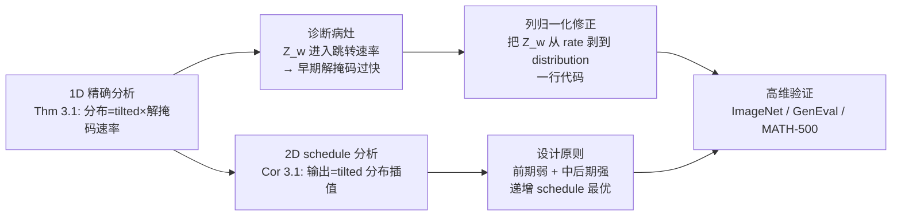

# Improving Classifier-Free Guidance in Masked Diffusion: Low-Dim Theoretical Insights with High-Dim Impact

**会议**: ICLR 2026  
**OpenReview**: [https://openreview.net/forum?id=mMK9pvQJxf](https://openreview.net/forum?id=mMK9pvQJxf)  
**代码**: 待确认  
**领域**: 离散扩散 / 图像生成 / classifier-free guidance  
**关键词**: masked diffusion, classifier-free guidance, guidance schedule, column normalization, discrete diffusion  

## 一句话总结
本文在 1D/2D 掩码扩散这个能解析求解的低维玩具模型上推导出 CFG 的精确效果，发现现有离散 CFG 的配分函数 $Z_w$ 被错误地耦合进了跳转速率、导致早期解掩码过快而损害质量，进而提出一个"列归一化"修正（一行代码），并从理论上论证"前期弱、中后期强"的递增 guidance schedule 才是离散扩散的正解。

## 研究背景与动机
**领域现状**：Classifier-Free Guidance（CFG）是连续扩散里提升条件生成保真度的标准工具，近期才被移植到离散/掩码扩散上（Unlocking Guidance、Simple Guidance 两条主流路线），并取得了经验上的增益。与此同时，连续扩散里"动态 guidance schedule"（如 guidance interval、逐渐增大的权重）被反复证明能显著提质，已成为实践标配。

**现有痛点**：（1）这些 schedule 技巧目前**只在连续状态空间里被验证过**，离散扩散里到底该用什么 schedule、为什么有效，仍是开放问题；（2）现有离散 CFG 的两种实现（Nisonoff 的速率矩阵插值、Schiff 的转移概率插值）都缺乏理论刻画，没人说清 guidance 强度是怎么改变生成分布的。

**核心矛盾**：离散扩散的解掩码是一个连续时间马尔可夫链（CTMC），guidance 不仅会改变"跳到哪个 token"的分布，还可能**意外地改变"多久跳一次"的速率**——但实践者把 CFG 当成纯粹的分布重加权来用，这个速率扰动被长期忽视，成了高 guidance 强度下采样质量崩坏的隐藏元凶。

**本文目标**：回答两个问题——guidance schedule 如何影响生成分布的形状？什么样的 schedule 才算好？为此作者刻意退回到 1 维和 2 维（单 token、双 token）这种能写出闭式解的极简设定来做精确分析。

**核心 idea**：**[理论驱动的低维分析]** 在 $d=1$ 时精确解出 guided 过程的分布，发现配分函数 $Z_w$ 出现在解掩码速率的指数上，造成不该有的加速；**[列归一化修正]** 通过把速率矩阵按列归一化、把"速率"和"跳转分布"解耦，一行代码消除这个病态；**[递增 schedule 原则]** 在 $d=2$ 解出 schedule 诱导的分布是若干 tilted 分布的插值，证明最终输出更像"末段 guidance"，因此前期应弱、中后期应强。三者环环相扣：低维解析既诊断出病灶又导出修法，还顺手回答了"什么 schedule 好"这个开放问题。

## 方法详解

### 整体框架
论文不是提出一个全新模型，而是一条"低维解析 → 诊断病灶 → 一行修正 → 高维验证"的链路。掩码扩散被刻画为连续时间马尔可夫链 $\frac{dp_t}{dt}=R_t p_t$，每个 token 以概率 $e^{-\sigma_t}$ 保持干净、否则被掩码，生成即从全掩码态出发沿反向 CTMC 逐步解掩码。作者先在单 token 设定下解出 guided CTMC 的精确分布，定位到配分函数 $Z_w$ 错误耦合进速率的 bug；再用"速率 × 跳转分布"的分解把 $Z_w$ 从速率项里剥出来（列归一化）；最后在双 token 设定下解出 guidance schedule 的闭式插值结构，导出"递增 schedule 最优"的设计原则。整条链路的精神是：在能写出闭式解的最小维度上把 CFG 看透，再把结论搬到高维去验证。

### 关键设计
**1. 一维精确解，揭露 guidance 把解掩码"踩了油门"**：在单 token（$d=1$）这个最简设定下，从全掩码态出发沿 guided 反向 CTMC 演化，作者解出时刻 $t$ 的分布恰好是 $p_t=\left(1-\left(\frac{1-e^{-\sigma_t}}{1-e^{-\sigma_T}}\right)^{Z_w}\right)\cdot p^{(w)}$，即"tilted 目标分布 $p^{(w)}$"乘上一个由配分函数 $Z_w$ 控制指数的解掩码进度因子。关键在于 $Z_w$ 跑到了指数上：$w$ 的微小变化会让解掩码速率剧烈变化（图 2 显示 $Z_w$ 越大、$p_t(M)$ 掉得越快）。解掩码过快会让数值求解器变"刚性"（stiff），有限步采样下误差骤增——这就从理论上解释了为什么高 guidance 强度的离散 CFG 会突然崩坏。

**2. 把"速率"和"跳转分布"分解，定位 $Z_w$ 的越权**：要修 bug 先得说清它从哪来。作者把速率矩阵拆成"跳转频率 $r_{t,p}(x)$"和"跳到哪 $p_t(y\mid x)$"两部分。代入现有 guided 速率矩阵后得到 $R^{(w)}_t(y,x)=\underbrace{r^w_{t,p}(x)r^{1-w}_{t,p}(x)Z_w}_{\text{rate}}\cdot\underbrace{Z_w^{-1}p^w_t(y\mid x)q^{1-w}(y\mid x)}_{\text{distribution}}$。本该只做归一化常数的 $Z_w$ 同时出现在 rate 项里，把整体跳转频率放大了 $Z_w$ 倍。Lemma 3.1 进一步在掩码扩散里写出掩码态↔非掩码态的转移率，确认 $Z_w$ 是乘性因子；并指出 $w=1$（纯条件）时 $Z_w=1$、病灶消失，这正解释了为何标准条件扩散里看不到这个问题。

**3. 列归一化：一行代码把 $Z_w$ 从速率里剥掉**：既然分析指出 $Z_w$ 不该影响跳转频率，修法就是把 guided 速率矩阵**按列归一化**，强制速率项里不含 $Z_w$：$R^{(w)}_t(y,x)=\underbrace{r^w_{t,p}(x)r^{1-w}_{t,p}(x)}_{\text{rate}}\cdot\underbrace{Z_w^{-1}p^w_t(y\mid x)q^{1-w}(y\mid x)}_{\text{distribution}}$。在掩码扩散里它化简成把 logits 过一个 **Softmax** 而不是直接 `exp`：$R^{(w)}_{\text{nor},t}(\hat x,x)\propto\text{Softmax}\big(w\log p_0(\hat x^i\mid x_{UM})+(1-w)\log q_0(\hat x^i\mid x_{UM})\big)$。直观上，归一化平滑了从掩码分布到数据分布之间的传输，稳定了采样。代码层面这就是把 `logits.exp()` 换成 `logits.softmax(dim=-1)`——名副其实的一行修改。作者还从转移概率的 $w$ 依赖角度对比了三种机制：Unlocking 的 $w$ 依赖在指数上（$w$ 增大时转移指数级变激进），Simple 的是线性，而本文归一化后能维持转移平滑、近似原过程的收敛速率。

**4. 二维 schedule 分析：输出是 tilted 分布的插值，故"末段 guidance"说了算**：换到双 token（$d=2$）并按时间分三段、各段用不同 guidance 强度 $w_0,w_1,w_2$，Corollary 3.1 解出最终分布是六个 tilted 分布的加权和，权重只由时间分段比例（如 $(\frac{t_3-t_2}{t_3})^2$ 等平方与交叉项）决定。两条结论：（a）合成分布更像"生成末段（$t\to 0$）施加的 guidance"，所以**早期强 guidance 几乎是浪费、甚至有害**；（b）用满"早/中/晚"三段、且取中等的分界点（如 $t_2=0.75$），多数 $t_1$ 取值都能得到各分布均衡的输出，使 schedule 更好调。由此得到设计原则：**前期弱、中后期强的递增 schedule**（Ramp-Up / Right Interval）最优，递减 schedule 则有害——与连续扩散的经验观察对上了，也给了理论解释。

## 实验关键数据

### 主实验：归一化在 ImageNet-256 上的效果（MaskGIT, 50 步, FID↓）

| Guidance 强度 $w$ | Our Method（列归一化） | Unlocking Guidance | Simple Guidance |
|---|---|---|---|
| $w=1$ | 8.45 | 11.21 | 3.72*（基本无 guidance） |
| $w=2$ | **2.90** | 17.77 | 19.31 |
| $w=3$ | **3.61** | 18.74 | 23.54 |
| $w\geq 4$ | 仍稳定 | 25.31 / 25.06（崩坏） | 17.04 等 |

> 现有两种机制在 $w\geq 2$ 时 FID 迅速恶化（数值刚性导致采样崩坏），本文方法在中等 guidance 下把 FID 压到 ~2.9，验证了"$Z_w$ 越权 → 过快解掩码 → 质量下降"的理论预测。（注：表中 Simple Guidance 在 $w=1$ 的 3.72 接近无 guidance 基线，随 $w$ 增大同样恶化。）

### 消融/分析实验

| 实验 | 设置 | 关键结果 |
|---|---|---|
| 保真-多样性权衡（图 7） | ImageNet，Precision/Recall vs $w$ | 仅本文方法能在保持 recall 的同时提升 precision；Unlocking/Simple 随 $w$ 增大 precision 下降（牺牲多样性换保真） |
| Schedule 对比（图 6b/6c） | ImageNet-256, 10K 样本 | 递增（Ramp-Up / Right Interval）显著降 FID（最低 ~5.89）；递减（Left Interval / Ramp-Down）一致地损害生成（FID 高达 ~22.97） |
| 文生图 GenEval | Show-O / Meissonic, 多个 $w$ | 加归一化在 Overall / Counting / Color Attribution / Position 等几乎全面提升（多处 +10~+48 分），高 $w$ 下提升更明显 |
| 文本生成 MATH-500 | LLaDA-8B-Instruct, 256 token | 加归一化在所有 guidance 强度上都优于不加 |

### 关键发现
- **低维洞察能迁移到高维**：1D/2D 玩具模型预测的"归一化有益、递增 schedule 最优"在 ImageNet、文生图、数学文本生成上全部成立，呼应标题"low-dim insights, high-dim impact"。
- **病灶只在 $w\neq 1$ 时出现**：$w=1$ 时 $Z_w=1$，所以标准条件扩散从未暴露这个问题，掩盖了它的存在。
- **递增 schedule 中又以平滑递增（Ramp-Up）优于突变（Right Interval）**：Right Interval 对右端点呈凸趋势，Ramp-Up 单调且能达到更低 FID。
- **三种机制的 $w$ 依赖性质不同**：Unlocking 的转移概率对 $w$ 呈指数依赖（$w$ 增大时转移过度激进），Simple 呈线性，本文列归一化后维持平滑、近似原过程收敛率——这从转移概率层面解释了为何前两者在大 $w$ 下崩坏。
- **schedule 用满三段更好调**：理论显示用满"早/中/晚"三段、取中等分界点（如 $t_2=0.75$）时，多数 $t_1$ 都能得到各 tilted 分布均衡混合的输出，把"调 schedule"从精细搜索变成宽容区间。

## 亮点与洞察
- **"退回低维找真相"的方法论很漂亮**：CFG 在高维里是个黑箱经验技巧，作者用 1D/2D 能闭式求解的设定把"guidance 到底做了什么"写成显式公式，直接揪出 $Z_w$ 这个被忽视了多年的速率耦合 bug。
- **保真与多样性可以兼得**：常规认知是 CFG 用多样性换保真，但本文方法在中等 $w$ 下同时提升 precision 与 recall（图 7），说明此前的"权衡"部分是实现 bug（过快解掩码）造成的假象，而非 guidance 的本质代价。
- **诊断 → 修复闭环干净**：从"速率 × 分布"的分解出发，问题（$Z_w$ 进了 rate）和修法（列归一化把它剥回 distribution）是同一个公式的两面，理论自洽且修复代价极低（`exp` → `softmax` 一行）。
- **给"递增 schedule 为什么有效"提供了离散侧的第一个理论解释**：之前连续扩散里这是纯经验观察，本文用 tilted 分布插值结构证明了"末段 guidance 主导输出"，把经验上升为原则。
- **落地门槛极低**：不需要重训模型、不需要改采样器结构，仅替换一行 logits 处理即可嵌入 MaskGIT / Show-O / Meissonic / LLaDA 等现成离散扩散模型。
- **诊断 → 修复闭环干净**：从"速率 × 分布"的分解出发，问题（$Z_w$ 进了 rate）和修法（列归一化把它剥回 distribution）是同一个公式的两面，理论自洽且修复代价极低（`exp` → `softmax` 一行）。
- **给"递增 schedule 为什么有效"提供了离散侧的第一个理论解释**：之前连续扩散里这是纯经验观察，本文用 tilted 分布插值结构证明了"末段 guidance 主导输出"，把经验上升为原则。

## 局限与展望
- **理论仅覆盖低维掩码扩散**：精确分析限于 1D/2D 的 masked diffusion，虽然方法本身能用于真实高维场景，但理论没覆盖高维与其他离散扩散形式（如 uniform diffusion）。
- **未建模 score 估计误差**：分析假设 concrete score 已知，真实模型里的网络估计误差如何与 guidance 动力学交互，留作未来工作。
- **schedule 仍需调参**：虽给出"递增最优"的方向，但具体端点/斜率仍需按任务调；理论给的是定性原则而非自动最优 schedule。
- **大 $w$ 极限下所有方法仍会退化**：图 7 显示 guidance 过强时本文方法也会掉点，归一化缓解了过快解掩码，但没有根除高 guidance 下保真-多样性最终的塌缩。
- 展望：把框架扩到 uniform 离散扩散、推到高维、并纳入 score 估计误差的影响。

## 相关工作与启发
- **离散 CFG 两条前序路线**：Unlocking Guidance（Nisonoff et al., 2024，速率矩阵插值）与 Simple Guidance（Schiff et al., 2024，转移概率插值），本文统一在"速率 × 分布"框架下解释它们的差异，并指出二者都没处理 $Z_w$ 耦合问题。
- **连续扩散的 guidance 理论与 schedule**：Chidambaram、Bradley & Nakkiran 等对 CFG 的理论分析，Kynkäänniemi 的 guidance interval、Xi 的递增 schedule——本文把这些只在连续侧验证过的洞察，第一次在离散侧给出理论支撑。
- **guidance 的广义视角**：Karras et al. 的"用差版自身做引导分布 $q$"把 CFG 推广成"目标 $p$ 与引导 $q$ 的平衡"，本文沿用这个广义设定，使列归一化对不同 $q$ 的选择都成立。
- **掩码扩散的规模化背景**：LLaDA、Show-O、Meissonic、MaskGIT 等把掩码扩散推向大规模文本/图像生成，使"如何在离散侧正确做 CFG"成为有现实收益的问题，本文的一行修正可直接嵌入这些模型。
- **与高阶求解器/τ-leaping 的关系**：现有机制的过快解掩码会让 CTMC 变刚性，从而拖累 τ-leaping、Euler、高阶求解器的精度；本文从源头平滑了转移，相当于给所有数值采样器降低了刚性负担。
- **启发**：当一个高维经验技巧反复出现莫名其妙的失败，退回到能解析求解的最小设定常能暴露被实现细节掩盖的结构性 bug；而"把一个常数放对位置"有时就是整个修复。

## 评分
- **新颖性**: ⭐⭐⭐⭐ — 用低维闭式解揪出 $Z_w$ 速率耦合 bug、并给离散 schedule 提供首个理论解释，角度独到；修法虽简单但来自原理推导而非试错。
- **实验充分度**: ⭐⭐⭐⭐ — 覆盖 ImageNet（FID + Precision/Recall）、文生图（GenEval，两个模型）、文本数学（MATH-500），跨模态验证理论预测，较扎实；理论仅低维是其短板。
- **写作质量**: ⭐⭐⭐⭐ — "低维分析 → 诊断 → 一行修复 → 高维验证"主线清晰，公式与图表配合到位；个别公式排版（缓存里）略有瑕疵但不影响理解。
- **价值**: ⭐⭐⭐⭐ — 一行代码即可落地、对掩码扩散文生图/文本生成有直接收益，且把"递增 schedule"从经验变成原则，实用与启发兼具。

> 备注：本文最大的可借鉴之处不在某个具体算法，而在"用最小可解模型把黑箱技巧拆穿"的研究范式——对任何在高维里靠经验调参的生成技巧都值得一试。

<!-- RELATED:START -->

## 相关论文

- [\[ICLR 2026\] Overshoot and Shrinkage in Classifier-Free Guidance: From Theory to Practice](overshoot_and_shrinkage_in_classifier-free_guidance_from_theory_to_practice.md)
- [\[ICLR 2026\] Stage-wise Dynamics of Classifier-Free Guidance in Diffusion Models](stage-wise_dynamics_of_classifier-free_guidance_in_diffusion_models.md)
- [\[CVPR 2026\] C$^2$FG: Control Classifier-Free Guidance via Score Discrepancy Analysis](../../CVPR2026/image_generation/c2fg_control_classifier-free_guidance_via_score_discrepancy_analysis.md)
- [\[CVPR 2026\] CFG-Ctrl: Control-Based Classifier-Free Diffusion Guidance](../../CVPR2026/image_generation/cfg-ctrl_control-based_classifier-free_diffusion_guidance.md)
- [\[ICLR 2026\] What Exactly Does Guidance Do in Masked Discrete Diffusion Models](what_exactly_does_guidance_do_in_masked_discrete_diffusion_models.md)

<!-- RELATED:END -->
