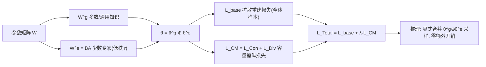

# Improving Diffusion Models for Class-imbalanced Training Data via Capacity Manipulation

**会议**: ICLR 2026  
**代码**: [https://github.com/Feng-Hong/ImbDiff-CM](https://github.com/Feng-Hong/ImbDiff-CM)  
**领域**: 图像生成 / 扩散模型 / 长尾不均衡学习  
**关键词**: 扩散模型, 类别不均衡, 模型容量分配, 低秩分解, 少数类  

## 一句话总结
本文指出扩散模型在长尾数据上少数类崩坏的根因是「模型容量被多数类垄断」，提出 Capacity Manipulation (CM)：用类 LoRA 的低秩分解把参数显式拆成"通用/多数"和"少数专家"两块，再用一致性+多样性损失把少数类知识强行塞进预留容量，无额外推理开销且与现有方法正交可叠加。

## 研究背景与动机
- **领域现状**：扩散模型生成能力强，但真实世界数据普遍长尾。判别模型的不均衡学习方法（重采样、focal loss 等）因架构/训练/推理范式差异无法直接迁移。生成式扩散上的已有工作 CBDM、OC 都聚焦于**改损失函数**，让多数类向少数类做知识迁移。
- **现有痛点**：这些方法只在"目标函数"层面缝补，没有触及一个更底层的问题——参数容量到底分给了谁。在 100:1 的 Imb. CelebA-HQ 上，DDPM 对多数类（女性）FID 7.1、少数类（男性）FID 却高达 16.4，视觉质量断崖式下跌。
- **核心矛盾**：作者发现一个反直觉现象——少数类的**训练 loss 和多数类相近**，但对 L1 范数最小参数做剪枝后，少数类的相对 loss 变化明显更大。这说明少数类的知识被挤进了"不重要"（低 L1 范数）的脆弱参数里，**容量被多数类占走了**。配套的梯度理论分析（Theorem 2.1）进一步证明：多数类驱动了网络中绝大比例参数矩阵的更新方向，且不均衡越极端、容量垄断越严重。
- **本文目标**：从「模型容量分配」这一与现有研究**正交**的全新视角出发，为少数类**预留**专属容量，防止被多数类侵占。
- **核心 idea**：**容量预留 + 容量分配**——先用低秩分解把参数显式切成两份（θg 装多数/通用知识、θe 装少数专家），再设计 capacity manipulation loss 引导训练时把对应知识"分配"到各自参数块。注意 CM 不增大模型，只是**重新分配现有容量**，推理零额外开销。

## 方法详解

### 整体框架
CM 分两步：**(1) 容量预留**——借鉴 LoRA 的低秩分解思想，把每个参数矩阵 $W$ 拆成保留给多数/通用知识的 $W^g$ 和预留给少数专家的低秩 $W^e=BA$，从而把整个模型参数 $\theta$ 分成 $\theta^g\oplus\theta^e$（逐元素相加）；**(2) 容量分配**——在标准扩散 base loss 之上加一个容量操纵损失 $L_{CM}$，按类别样本量自适应地"逼" $\theta^g$ 学多数/通用知识、$\theta^e$ 学少数专家知识。推理时把两块显式合并回 $\theta$ 采样，故无额外延迟。

### 关键设计

**1. 容量预留：低秩分解显式切分参数，把"分给谁"变成可控旋钮。** 对网络中每个参数矩阵 $W\in\mathbb{R}^{d\times k}$，做分解 $W = W^g + BA = W^g + W^e$，其中 $B\in\mathbb{R}^{d\times r}$、$A\in\mathbb{R}^{r\times k}$、秩 $r<\min(d,k)$。$W^g$ 承载多数与通用知识，低秩的 $W^e$ 被预先"圈"出来留给少数专家。这一步看似只是 LoRA 的形式，但目标完全不同——LoRA 是为了高效微调、不增加容量；CM 是**训练前就预留容量**。Theorem 3.1 给出理论支撑：在此分解下多数类主导比例被约束为 $\Pi_{maj}<\Phi\big(\frac{(1-\alpha_r)\mu\sqrt{2N(1-\cos\angle(\mu_1,\mu_2))}}{2\sigma}\big)$，其中 $\alpha_r$ 是关于秩 $r$ 单调递增的函数（$r=0$ 时 $\alpha_r=0$、$W^e$ 满秩时 $\alpha_r=1$）。也就是说，**调节 $W^e$ 的秩就能直接调节多数/少数的容量分配比例**，从而缓解标准训练里的"容量塌缩"。

**2. 容量操纵损失：用一致性 + 多样性双损失把知识"赶"到正确的参数块。** 光切分参数还不够，得让 $\theta^g$ 真的只学多数、$\theta^e$ 真的去学少数。作者设计 $L_{CM}=L_{Con}+L_{Div}$，二者都建立在"完整模型 $\theta^g\oplus\theta^e$ 与只用 $\theta^g$ 的输出差异"上：

$$L_{Con}=\omega^y_{Con}\,\mathbb{E}_t\|\epsilon_{\theta^g\oplus\theta^e}(x_t,t,y)-\epsilon_{\theta^g}(x_t,t,y)\|^2_2,\quad L_{Div}=-\omega^y_{Div}\,\mathbb{E}_t\|\epsilon_{\theta^g\oplus\theta^e}(x_t,t,y)-\epsilon_{\theta^g}(x_t,t,y)\|^2_2$$

直觉是：对**多数类**，希望 $\theta^g$ 单独就能干好活，所以让它和完整模型输出**一致**（$L_{Con}$ 拉近）；对**少数类**，希望 $\theta^g$ 故意做不好、把少数知识逼进 $\theta^e$，所以让两者输出**发散**（$L_{Div}$ 推远，注意负号）。

**3. 按样本量自适应的类别权重，无需手动划分多数/少数。** 权重设计是点睛之笔：$\omega^y_{Con}=\frac{C N_y}{\sum_c N_c}$ 随类别样本数**线性增大**（多数类一致性权重高），$\omega^y_{Div}=\frac{C}{N_y\sum_c 1/N_c}$ 随样本数**反比增大**（少数类多样性权重高）。这套权重在平衡数据集上恰好 $\omega_{Con}=\omega_{Div}=1$、$L_{CM}=0$，自动退化为普通训练，免去人工设定"多数/少数"阈值。作者强调它**形似但本质不同于重加权**——重加权是给单样本 loss 加权，CM 是通过调制"绑定到不同参数块的输出距离"来分配**模型容量**。

**4. 联合优化与正交可叠加性。** 总损失 $L_{Total}=L_{base}(D,\theta)+\lambda\sum_{(x,y)}\frac{1}{N}L_{CM}$，其中 $L_{base}$ 可以是普通扩散 loss，也可直接换成 CBDM/OC 等不均衡专用损失——这正是 CM "正交"的来源：它只管容量分配这个维度，谁的目标函数好就插谁。还能扩展到 LoRA 微调场景，把式 (1) 改成 $W=W^f+B^gA^g+B^eA^e$（冻结预训练 $W^f$，再分别给多数/少数留两块可训练低秩参数）。

## 实验关键数据

### 主实验表格
Imb. CIFAR-10 / CIFAR-100（FID↓，IR=100/50）：

| 方法 | CIFAR-10 IR=100 | CIFAR-10 IR=50 | CIFAR-100 IR=100 | CIFAR-100 IR=50 |
|---|---|---|---|---|
| DDPM | 10.697 | 10.216 | 10.163 | 9.363 |
| CBDM | 8.233 | 7.933 | 10.051 | 8.946 |
| OC | 8.390 | 8.034 | 8.309 | 7.188 |
| **CM** | **7.727** | **7.372** | **7.519** | **6.732** |

CM 在 4 个设置上的 16 个指标里取得最佳（仅 2 个 IS 略低），FID 较 DDPM 提升 2.5~2.8，较最强 baseline 再提 0.46~0.79。

Imb. CelebA-HQ（IR=100，按类 FID↓）：DDPM 少数类 Male FID 16.425 → **CM 12.788**（提升 3.637），Overall 8.727 → **7.538**。在 ImageNet-LT、iNaturalist（数千类、IR 高达 256/500）上 CM 同样全面领先，而 CBDM 在数千类规模反而劣于 DDPM。ArtBench-10 上用 LoRA 微调 Stable Diffusion，CM 在 8 个指标全胜（IR=100 FID 27.083→22.776）。

### 消融实验表格
Imb. CIFAR-100（IR=100，Per-split FID↓）与损失消融：

| 方法 | Many | Medium | Few | Overall |
|---|---|---|---|---|
| DDPM | 14.068 | 15.660 | 22.188 | 10.163 |
| CM (仅 θg) | 11.923 | 14.872 | 29.357 | 13.712 |
| **CM (θg⊕θe)** | 11.713 | 13.043 | **18.729** | **7.519** |

| 消融 | FID↓ | KID↓ |
|---|---|---|
| CM 完整 | **7.519** | **0.0017** |
| CM w/o $L_{Con}$ | 8.412 | 0.0029 |
| CM w/o $L_{Div}$ | 8.073 | 0.0025 |

与低秩变体对比：CBDM($\theta^g\oplus\theta^e$) 10.231、CBDM(LoRA) 11.424、MoE 式 Group-Expert LoRA 10.06，均无改善，唯独 **CM 7.519**——证明增益来自显式容量操纵，而非加参数或动态路由。

### 关键发现
- **只用 θg 会让 Few 类崩坏**（FID 18.7→29.4），证明少数专家知识确实被成功分配进了 θe。
- $L_{Con}$ 与 $L_{Div}$ 各管多数/少数知识分配，去掉任一都显著掉点，缺一不可。
- 超参 $\lambda$ 约在 1.0、秩比 $r/\min(d,k)$ 约在 0.1 时性能最佳，且在很宽范围内稳定优于 OC。
- 主要提升集中在 Medium 和 Few 类，多数类性能几乎不受损。

## 亮点与洞察
- **诊断角度新颖**：用"剪枝 L1 范数最小参数后少数类相对 loss 变化更大"这一巧妙实验，把抽象的"容量被垄断"变成了可观测、可证明的现象，视角与改损失函数的主流完全正交。
- **零推理开销**：LoRA 式分解在推理时可显式合并回原尺寸网络，不增加任何延迟——这对部署很关键。
- **理论与方法咬合**：Theorem 2.1/3.1 不只是装饰，直接推出"秩 r 控制容量分配比例"这一可操作结论，并指导了秩的消融。
- **即插即用**：作为正交框架可叠加在 DDPM/CBDM/OC 之上一致涨点，未来更好的目标函数能继续受益。

## 局限与展望
- **额外训练开销**：训练时需要前向计算 $\epsilon_{\theta^g}$ 与 $\epsilon_{\theta^g\oplus\theta^e}$ 两路输出，训练成本上升（论文未量化）。
- **超参敏感性**：依赖 $\lambda$ 与秩 $r$ 两个超参，虽稳定但仍需调；不同数据规模的最优值可能漂移。
- **难度不均未建模**：作者自己观察到 CIFAR-10 上 Medium 类反而比 Few 类更难，说明"数量不均衡"之外还有"内在难度不均衡"，CM 只处理了前者，结合两者是明确的未来方向。
- **理论简化**：Theorem 假设少数类同时贡献 $W^g,W^e$、多数类只贡献 $W^g$，是理想化设定，实际训练中的容量流动更复杂。

## 相关工作与启发
- **不均衡扩散生成**：CBDM（平衡先验正则）、OC（定向校准做知识迁移）、Overlap Optimization——均聚焦目标函数，CM 与之正交并可叠加。
- **判别模型不均衡学习**：重采样、focal loss、ADA 等，因架构差异迁移到扩散上效果有限。
- **参数高效微调 / MoE**：CM 借用了 LoRA 的低秩形式但目标相反（预留容量 vs 节省参数），并通过实验把自己和 LoRA、MoE 式适配器明确区分开。
- **启发**：把"模型容量是一种可被争夺、可被预留分配的稀缺资源"这一视角，或可推广到长尾分类、多任务、持续学习等其他容量竞争场景——凡是"强势分布挤占弱势分布表示"的问题，都值得用类似的容量预留思路重审。

## 评分
- **新颖性**: ⭐⭐⭐⭐⭐ 把不均衡扩散问题重新归因到"容量分配"，配剪枝实验+梯度理论，是真正正交于现有研究的新角度。
- **实验充分度**: ⭐⭐⭐⭐⭐ 6 个数据集（含数千类的 ImageNet-LT/iNaturalist 与 256 分辨率 ArtBench）、多架构、多 IR、与 LoRA/MoE 变体对比、完整消融，非常扎实。
- **写作质量**: ⭐⭐⭐⭐ 动机—方法—理论—实验逻辑闭环，图示清晰；理论部分对非专业读者略重。
- **价值**: ⭐⭐⭐⭐ 即插即用、零推理开销、可叠加现有方法，对长尾场景的生成部署有直接实用价值。

<!-- RELATED:START -->

## 相关论文

- [\[ICLR 2026\] OmniText: A Training-Free Generalist for Controllable Text-Image Manipulation](omnitext_a_training-free_generalist_for_controllable_text-image_manipulation.md)
- [\[ICLR 2026\] Quantization-Aware Diffusion Models for Maximum Likelihood Training](quantization-aware_diffusion_models_for_maximum_likelihood_training.md)
- [\[ICML 2026\] GUDA: Counterfactual Group-wise Training Data Attribution for Diffusion Models via Unlearning](../../ICML2026/image_generation/guda_counterfactual_group-wise_training_data_attribution_for_diffusion_models_vi.md)
- [\[ICLR 2026\] Steer Away From Mode Collisions: Improving Composition In Diffusion Models](steer_away_from_mode_collisions_improving_composition_in_diffusion_models.md)
- [\[ICLR 2026\] AEGIS: Adversarial Target-Guided Retention-Data-Free Robust Concept Erasure from Diffusion Models](aegis_adversarial_target-guided_retention-data-free_robust_concept_erasure_from_.md)

<!-- RELATED:END -->
