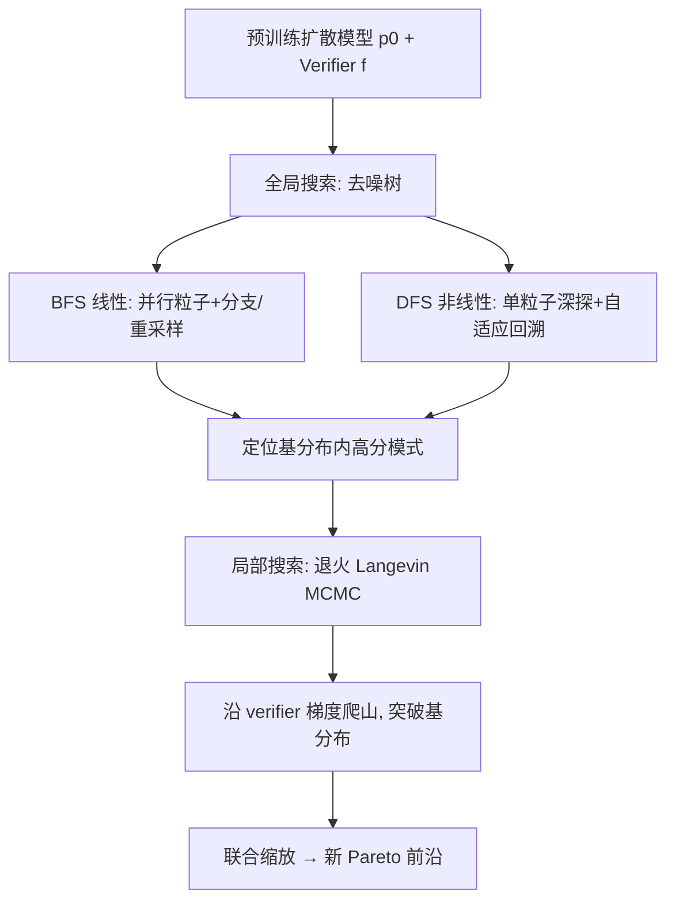

# Inference-Time Scaling of Diffusion Models Through Classical Search

**会议**: ICLR 2026  
**OpenReview**: [https://openreview.net/forum?id=b7Ftp6U78i](https://openreview.net/forum?id=b7Ftp6U78i)  
**代码**: 待确认  
**领域**: 图像生成 / 扩散模型推理时缩放 / 决策规划  
**关键词**: inference-time scaling, diffusion models, tree search (BFS/DFS), Langevin MCMC, verifier guidance  

## 一句话总结
把经典 AI 搜索（BFS/DFS 全局树搜索 + 退火 Langevin MCMC 局部搜索）系统性地搬到扩散模型推理阶段，首次将"局部搜索"与"全局搜索"两个维度联合缩放，在图像生成、长程规划、离线 RL 上同时刷新效率—性能的 Pareto 前沿。

## 研究背景与动机
**领域现状**：扩散模型在图像、视频、机器人动作生成上表现强劲，但生成样本未必满足测试时的具体目标（物理约束、人类偏好、高价值动作），庞大的生成空间往往要反复采样才能得到满意结果。近期推理时缩放工作分两条路：基于粒子的 SMC 滤波（FK-steering、DAS、SVDD）和基于树搜索的方法（TreeG、DSearch），它们都沿固定调度去搜索去噪过程。

**现有痛点**：①这些 BFS 风格方法各自的设计选择（重采样、打分、温度）零散且缺乏统一刻画，谁优谁劣说不清；②都用**固定的探索调度**，无法根据样本难度自适应分配算力，简单实例浪费算力、困难实例算力不足；③全局搜索只能在基模型已有的"模式"里挑选，无法生成超越基模型能力的更高质量样本；④训练自由引导（training-free guidance）易过优化 verifier 产生 OOD/对抗样本（reward hacking），且其理论基础不清。

**核心矛盾**：全局搜索能高效发现好模式但被困在基分布内；局部搜索能突破基分布但单独用容易陷入局部最优——两者此前总是**孤立地**缩放，没人把它们当成一个统一搜索框架联合放大。

**本文目标**：用经典搜索的语言统一推理时缩放，既给出更强的全局树搜索基线，又提供有理论保证的局部搜索，并首次**联合缩放**二者。

**核心 idea**：**【搜索即采样】** 把去噪过程看作一棵固定深度的搜索树，全局上用 BFS/DFS 做 best-first 式的分支与回溯，局部上用退火 Langevin MCMC 沿 verifier 梯度爬山，二者组合既不困在基分布、也不困在局部最优。

## 方法详解

### 整体框架
给定预训练扩散模型 $\epsilon_\theta(x_t,t)$ 与 verifier $f(x_0)$，目标是从组合分布 $\tilde p_0(x_0)\propto p_0(x_0)f(x_0)^\lambda$ 采样（$\lambda$ 控制 verifier 权重）。方法把这一目标拆成两层搜索：**全局搜索**用树搜索在基分布内高效定位高分模式，**局部搜索**用 Langevin MCMC 在样本邻域内突破基分布、逼近组合分布，最后把两层联合缩放。

### 关键设计

**1. 统一的 BFS 线性搜索：把零散基线收进一个设计空间。** 作者把并行粒子去噪抽象成逐层展开的 BFS，每层用去噪估计 $f(x^k_{0|t})$ 给中间粒子打分并按分数分配子节点数。三个正交维度被显式参数化：**温度**（Constant/Increase/Inf，缓解早期打分偏差）、**打分**（Current/Difference/Max，用路径上奖励轨迹而非仅当前奖励）、**重采样**（Multinomial vs 方差更小的 SSP）。重采样按 $w^k_t=\mathrm{softmax}\,\hat f(x^k_t)$ 给出子节点数 $(n^1_t,\dots,n^N_t)=\mathrm{Resample}(N;w^1_t,\dots,w^N_t)$。这套设计空间一举把 SVDD = BFS(Inf, Current, Multinomial)、DAS = BFS(Increase, Difference, SSP)、FK-steering = BFS(Constant, Max, Multinomial) 全部纳入，消融发现 SSP 重采样是关键，由此得到更强的 **BFS(Increase, Max, SSP)** 基线。

**2. DFS 非线性搜索：用 verifier 分数驱动自适应回溯。** BFS 仍是固定调度，DFS 则沿单条分支尽可能深地去噪，一旦 $f(x_{0|t})\le\delta_t$（用户设的质量阈值）就回溯，通过前向扩散 $q(x_{t_{\text{next}}}|x_t)$ 注入噪声跳到更高噪声级 $t_{\text{next}}=t+\Delta T$，从流形另一区域重启。与 SoP 的固定噪声注入不同，DFS 的回溯噪声级由粒子分数决定：困难提示与低质轨迹自然触发更多回溯与探索，简单实例则被快速解决——**无需事先知道难度**即可自适应分配算力，阈值还成了用户在质量与算力间权衡的旋钮。实验里 DFS 比 BFS 在等算力下再省最多 30%。

**3. 退火 Langevin MCMC 的局部搜索：理论统一引导与 recurrence。** 为突破基分布，作者把采样看作测度空间里的组合优化，沿 KL 散度梯度流走 Langevin 步：$x^{i+1}_t=x^i_t+\eta\nabla_x\log\tilde q_t(x^i_t)+\sqrt{2\eta}\,\epsilon^i$，而组合分布的分数可直接相加 $\nabla_x\log\tilde q_t=\nabla_x\log q_t+\nabla_x\log\hat q_t$，**无需额外训练**。关键理论贡献（命题 1）：在去噪步数 $T\to\infty$ 的连续极限下，"训练自由引导 + recurrence"恰好等价于在退火分布序列上跑 Langevin MCMC，其中 recurrence 步对应基分布的 Langevin 采样、引导项 $\Delta_t$ 则定义了把采样路径偏向高奖励区的退火路径。这首次把两条互不相干的工作线（引导 vs MCMC）统一，解释了 recurrence 为何能避免对抗样本，也让"缩放局部搜索步数"有了原理支撑。

**4. 双 verifier 抑制 reward hacking。** 梯度引导易过优化 verifier 造成 OOD 对抗样本。受 double-Q learning 启发，作者给局部搜索与全局搜索分配**不同的 verifier**，用一个评估另一个的优化结果，从而抑制过估计、缓解奖励攻击。

四个设计点的协同关系可概括为：BFS/DFS 负责"找对模式"，Langevin 局部搜索负责"把模式炼得更好"，双 verifier 负责"别被 verifier 骗"。其中 DFS 与局部搜索都体现"按需分配算力"的核心理念——前者按提示难度、后者按样本到组合分布的距离自适应缩放。

## 实验关键数据

### 主实验表格（文本到图像，ImageReward 越高越好）

| 模型 | N | BoN | FK | DAS(w/o grad) | TreeG | SVDD | SoP | DSearch | **BFS(ours)** |
|---|---|---|---|---|---|---|---|---|---|
| SD v1.5 | 4 | 0.702 | 0.743 | 0.878 | 0.860 | 0.667 | 0.688 | 0.836 | **0.882** |
| SD v1.5 | 8 | 0.891 | 0.926 | 1.052 | 1.023 | 0.775 | 0.884 | 1.011 | **1.087** |
| SD XL | 8 | 1.198 | 1.251 | 1.265 | 1.261 | 1.225 | 1.185 | 1.252 | **1.291** |
| FLUX.1 | 4 | 1.113 | 1.145 | 1.194 | 1.178 | 1.069 | 1.104 | 1.169 | **1.203** |

改进版 BFS 在所有模型与算力预算下都稳超此前方法；DAS(w/o grad) 因同样用 SSP 重采样而差距最小，SoP 因均匀分配算力而效率偏低。

### 消融实验表格（BFS 设计选择，SD v1.5）

| N | Resampling: BoN / Multinomial / **SSP** | Scoring: Current / Diff / **Max** | Tempering: **Increase** / Inf / Constant |
|---|---|---|---|
| 4 | 0.702 / 0.743 / **0.834** | 0.812 / 0.823 / **0.834** | **0.882** / 0.667 / 0.834 |
| 8 | 0.896 / 0.926 / **1.032** | 0.996 / 1.013 / **1.032** | **1.087** / 0.775 / 1.032 |

SSP 重采样带来最大增益，Max 打分与 Increase 温度再有适度提升。

### 关键发现
- **DFS 自适应**：CompBench 上 DFS 在不同算力预算下都超 BoN 与改进 BFS，最多省 30% 算力；难提示自动消耗更多算力，无需先验难度。
- **离线 RL（D4RL locomotion）**：TTS（本文）平均 86.1，与需联合训练的 SOTA（D-QL 86.3、QGPO 86.6）相当，远超同样用梯度但无 recurrent 局部搜索的 DAS(80.2) 与 TFG(82.1)，且**完全免训练**。
- **推理缩放自蒸馏**：用 TTS 生成的动作做离线蒸馏，单步采样性能反超在线 RL 的 DPPO（Hopper 98.8 vs 92.8），是首个"用预训练 verifier 经推理缩放实现自我提升"的扩散模型工作。
- **联合缩放**：PointMaze 长程规划中，单独缩放局部搜索（TFG）低预算高效但无法随算力扩展、易陷局部最优；联合 BFS/DFS + 局部搜索建立新 Pareto 前沿。

## 亮点与洞察
- **统一视角的解释力**：用经典搜索语言把一堆零散的 SMC/树搜索方法收成 BFS 设计空间的特例，既"解释"了前人为何这么设计，又顺手给出更强基线——这种"先统一再超越"的叙事很有说服力。
- **自适应才是推理缩放的关键**：DFS 用 verifier 分数而非固定调度决定回溯深度，把算力花在刀刃上，呼应了"测试时算力应按难度分配"的趋势但无需难度先验。
- **理论与实践的缝合**：命题 1 把训练自由引导 + recurrence 证成 Langevin MCMC 的特例，解决了 recurrence "好用但说不清为什么"的长期困惑。
- **联合缩放 = 新维度**：局部搜索步数此前几乎没被当成可缩放维度，本文首次系统放大它并与全局搜索组合，跨图像/规划/RL 三域验证通用性。

## 局限与展望
- verifier 质量是天花板：局部搜索沿 verifier 梯度爬山，若 verifier 本身有偏，双 verifier 也只是缓解而非根治 reward hacking。
- 局部搜索的 Langevin 步引入额外 NFE 开销，虽以"质量换算力"但在算力极紧场景下性价比需权衡。
- 离线 RL 的 Q-function、图像的 ImageReward 等都假设有现成可微 verifier；对于难以定义可微 verifier 的目标（如复杂语义约束）适用性待验证。
- DFS 阈值 $\delta_t$、温度/打分等超参较多，跨任务迁移的鲁棒性虽有展示但仍需人工调。

## 相关工作与启发
- **粒子型缩放**（FK-steering、DAS、SVDD）与**树搜索型**（TreeG、DSearch）被统一为 BFS 特例；SoP 的固定噪声注入被 DFS 的自适应回溯超越。并发工作中 MCTS value backup（Jain et al.）、全去噪回溯（Lee et al.）走的也是自适应路线，本文以"分数决定回溯级"区别于它们。
- **训练自由引导**（TFG、classifier guidance）依赖 $f(x_{0|t})$ 的一阶近似而有偏，本文改用退火 Langevin MCMC 做渐近精确采样。
- 启发：把成熟的"经典搜索 + 测度空间优化"理论迁到生成模型推理阶段，是一条低成本撬动大收益的路径；"推理缩放 → 蒸馏回基模型"可能是免在线 RL 的自改进新范式。

## 评分
- **新颖性**: ⭐⭐⭐⭐ — 用经典搜索统一刻画并联合缩放局部/全局搜索，命题 1 的理论统一与"推理缩放自蒸馏"都属首次提出。
- **实验充分度**: ⭐⭐⭐⭐ — 覆盖图像（SD1.5/SDXL/FLUX）、长程规划、离线 RL 三大域，含完整设计空间消融与多基线对比。
- **写作质量**: ⭐⭐⭐⭐ — 从经典搜索动机到统一框架再到理论命题，逻辑层层递进，图示清晰。
- **价值**: ⭐⭐⭐⭐ — 既给出可直接复用的更强 BFS 基线，又开辟"局部搜索缩放 + 自蒸馏"新维度，对扩散模型推理时控制有较强实用与方法论价值。

<!-- RELATED:START -->

## 相关论文

- [\[ICLR 2026\] Compositional Visual Planning via Inference-Time Diffusion Scaling](compositional_visual_planning_via_inference-time_diffusion_scaling.md)
- [\[ICLR 2026\] RNE: plug-and-play diffusion inference-time control and energy-based training](rne_plug-and-play_diffusion_inference-time_control_and_energy-based_training.md)
- [\[ICML 2025\] Performance Plateaus in Inference-Time Scaling for Text-to-Image Diffusion Without External Models](../../ICML2025/image_generation/performance_plateaus_in_inference-time_scaling_for_text-to-image_diffusion_witho.md)
- [\[ICLR 2026\] Diffusion Blend: Inference-Time Multi-Preference Alignment for Diffusion Models](diffusion_blend_inference-time_multi-preference_alignment_for_diffusion_models.md)
- [\[CVPR 2026\] Rethinking Prompt Design for Inference-time Scaling in Text-to-Visual Generation](../../CVPR2026/image_generation/rethinking_prompt_design_for_inference-time_scaling_in_text-to-visual_generation.md)

<!-- RELATED:END -->
