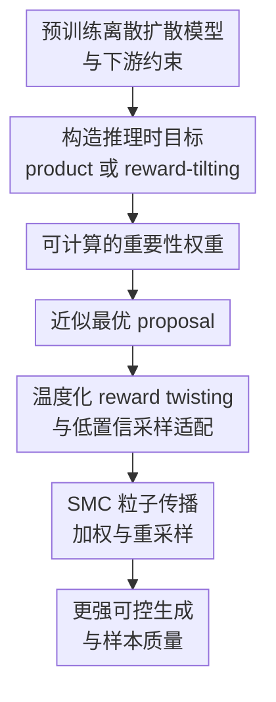

# Inference-Time Scaling of Discrete Diffusion Models via Importance Weighting and Optimal Proposal Design

**会议**: ICLR 2026  
**OpenReview**: [https://openreview.net/forum?id=7wbrFQvfdH](https://openreview.net/forum?id=7wbrFQvfdH)  
**代码**: 未公开  
**领域**: 扩散模型 / 推理时扩展 / 可控生成  
**关键词**: 离散扩散模型、Sequential Monte Carlo、重要性加权、最优 proposal、推理时对齐  

## 一句话总结
这篇论文把 Sequential Monte Carlo 引入离散扩散模型的推理阶段，通过可计算的重要性权重和接近最优的 proposal 设计，在不重新训练基模型的前提下提升 reward 对齐、CFG 采样和跨语言/生物/图像任务的可控生成效果。

## 研究背景与动机
**领域现状**：离散扩散模型正在从早期的离散状态空间建模，扩展到 masked diffusion language model、MaskGit/Meissonic 这类离散图像生成器，以及 DNA/蛋白等科学设计任务。它们的共同点是生成过程在离散 token、mask token 或类别状态上逐步去噪，基模型本身通常先学一个较宽泛的数据分布 $p_\theta$，再在推理时按下游约束挑选或引导样本。

**现有痛点**：真实应用很少只需要“像训练数据”的样本，还希望输出满足偏好、属性、毒性、功能活性、文本-图像对齐等约束。fine-tuning 或 RL 类方法可以强推 reward，但容易 reward over-optimization，生成质量和多样性被牺牲；纯 guidance 或 sampling 方法部署更轻，却常常 reward under-optimization，尤其在复杂约束下无法把样本真正推到目标分布附近。

**核心矛盾**：可控生成真正想采样的是一个被约束后的目标分布，而不是简单最大化 reward。若只把 reward 当作局部打分器，采样过程会出现两个问题：一方面粒子可能过早塌缩到少数高 reward 但低质量的模式；另一方面 proposal 仍沿用预训练反向扩散核，和目标分布错位，导致重要性权重方差大、有效样本数低，SMC 的理论优势发挥不出来。

**本文目标**：作者要解决三个子问题：第一，如何为离散扩散模型构造推理时目标分布，包括 CFG 对应的 product target 和 reward alignment 对应的 reward-tilting target；第二，如何在目标分布不可直接归一化时写出可计算的重要性权重；第三，如何设计更好的 proposal，让 SMC 不只是“多采几个候选”，而是在每一步都更稳定地靠近约束后的目标分布。

**切入角度**：论文从 Sequential Monte Carlo 出发，把扩散模型的反向去噪看作一条从噪声到样本的路径，用粒子、权重和重采样来近似中间目标分布。这个角度有希望，是因为 SMC 本来就适合“目标分布难采样、proposal 易采样、权重可计算”的场景；离散扩散模型虽然目标边缘分布难求，但预训练反向核和前向噪声核提供了足够结构，可以把一部分不可解的比值抵消或近似掉。

**核心 idea**：用 SMC 把离散扩散的推理时控制改写成一条带重要性加权的粒子采样路径，再用一阶近似 proposal 和 amortized proposal 降低权重方差，从而把更多推理时计算转化为更强的对齐和更好的样本质量。

## 方法详解
### 整体框架
本文的整体流程可以理解为：给定一个已经训练好的离散扩散模型 $p_\theta$，先根据任务定义推理时目标分布 $\pi(x_t)$，再沿着反向去噪时间轴维护 $N$ 个粒子。每一步先用 proposal $q(x_{t-1}\mid x_t)$ 产生候选粒子，再根据目标分布比值、前向核和 proposal 计算重要性权重，最后按归一化权重重采样，让粒子群逐步逼近被 CFG 或 reward 扭曲后的目标分布。

论文真正的设计重点不在“多采样”本身，而在两个位置：一是让重要性权重在离散扩散里可计算，避免 SMC 只停留在形式上；二是让 proposal 更接近局部最优分布，避免粒子退化。对于 reward-tilting，作者还引入随时间变化的 reward twisting，让 reward 的影响从弱到强逐渐进入采样过程。

### 关键设计
**1. 可计算的重要性权重：把不可求的目标比值转成扩散核比值**

SMC 每一步都需要增量权重，核心形式是 $w_{t-1}=\frac{\pi(x_{t-1})}{\pi(x_t)}\frac{\gamma(x_t\mid x_{t-1})}{q(x_{t-1}\mid x_t)}w_t$。麻烦在于，扩散模型的中间边缘分布 $\pi(x_t)$ 往往不能直接算，尤其当目标被 reward 或另一个模型扭曲后，$\pi(x_{t-1})/\pi(x_t)$ 看起来不可用。作者的处理是利用训练好的反向扩散模型近似详细平衡关系，把基模型分布比值改写为反向去噪核和前向噪声核的比值。

对于 product target，也就是类似 CFG 的 $\pi(x_t)\propto p_{\theta_1}(x_t)^\alpha p_{\theta_2}(x_t)^\beta$，权重可以写成多个反向核与前向核的组合，虽然仍有模型近似误差，但形式是可计算的。对于 reward-tilting，也就是 $\pi(x_t)\propto p_\theta(x_t)\exp(r(x_t))$，如果选择前向核 $\gamma(x_t\mid x_{t-1})=p(x_t\mid x_{t-1})$，前向噪声项可以抵消，权重简化为 $\frac{\exp(r(x_{t-1}))}{\exp(r(x_t))}\frac{p_\theta(x_{t-1}\mid x_t)}{q(x_{t-1}\mid x_t)}$。这一步很关键，因为它把 reward 控制从“启发式地改 logits”变成了一个有目标分布解释的粒子加权过程。

**2. 近似最优 proposal：用低方差 proposal 替代盲目沿用预训练反向核**

SMC 的效果高度依赖 proposal。如果 proposal 和目标分布差得很远，大多数粒子会拿到接近零的权重，重采样后只剩少数路径，推理时扩展就变成昂贵但低效的筛选。论文先给出局部最优 proposal 的形式：在给定 $x_t$ 时，使增量权重方差最小的 proposal 满足 $q^*(x_{t-1}\mid x_t)\propto \pi(x_{t-1})\gamma(x_t\mid x_{t-1})$。对 reward-tilting 而言，它进一步变成 $q^*(x_{t-1}\mid x_t)\propto \exp(r(x_{t-1}))p_\theta(x_{t-1}\mid x_t)$。

这个最优形式直接说明了为什么只用预训练反向核不够：它只知道“像数据”，不知道“更符合 reward”。但真正计算这个 $q^*$ 需要对所有离散状态求归一化常数，代价通常不可承受。因此作者提出两种近似。第一种是 SMCgrad，用 reward 的一阶 Taylor 展开近似 $r(x_{t-1})$，得到 $q(x_{t-1}\mid x_t)\propto p_\theta(x_{t-1}\mid x_t)\exp(x_{t-1}^\top\nabla_x r(x_t))$，只需在当前状态做一次 reward 梯度。第二种是 SMCamot，额外训练一个 amortized proposal $q_\phi$，目标是最小化重要性权重的 log-variance，并用辅助网络 $F_\psi(t)$ 估计 log-weight 均值来降低训练方差。前者偏轻量、适合可微 reward；后者训练成本更高，但一旦训练好，每步只需一次网络评估，实验中通常更稳。

**3. 温度化 reward twisting 与低置信采样适配：让 reward 逐步进入离散去噪路径**

直接在早期噪声很大的 $x_t$ 上强行施加 reward，容易让权重估计方差暴涨，因为此时 token 或像素类别还很不确定，reward 对部分补全样本的估计非常噪。论文用一个随时间变化的中间目标 $\pi(x_t)\propto p_\theta(x_t)\exp(\lambda_t r(x_t)/\alpha)$ 来缓解这个问题，其中 $\lambda_t$ 从接近 0 逐渐升到 1，$\alpha$ 是 KL 正则系数。直观上，早期先让粒子保持在基模型可解释的区域，后期再逐渐强调 reward，对齐和样本质量之间的冲突会小一些。

许多任务的 reward 只定义在干净样本 $x_0$ 上，而不是中间噪声状态 $x_t$ 上。作者因此用 $\hat r(x_t)=\frac{1}{M}\sum_m r(x_0^{(m)})$ 或更稳定的 log-sum-exp 版本估计中间 reward，其中 $x_0^{(m)}\sim p_\theta(x_0\mid x_t)$。为了让一阶 proposal 能在离散采样中求梯度，论文用 Gumbel-Softmax relaxation 近似离散 categorical sample；对于低置信采样，作者还让 $p_\theta$ 和 $q_\phi$ 使用同一个位置选择规则来计算 log-ratio，避免两个 denoiser 选择不同 remask/unmask 位置时权重退化为无意义的零。这些实现细节不如理论命题醒目，但它们决定了方法能否落到 MaskGit、MDLM、Meissonic 这类真实模型上。

### 一个完整示例
以文本到图像生成为例，假设基模型是 Meissonic，prompt 是“一只戴头盔的猴子在滑冰”，reward 是 HPSv2 或 ImageReward。普通采样会从全 mask 或高噪声离散 token 开始，逐步填充图像 token；如果只用基模型，它可能生成一张语义大致相关但偏好分不高的图像。

在本文的 SMC 版本中，系统同时维护 $N$ 个图像 token 粒子。早期 $\lambda_t$ 较小，粒子主要沿着 Meissonic 的反向核走，保持构图和视觉质量；中期开始，每个粒子会根据当前补全结果估计 reward，proposal 倾向于提出更可能提高文本-图像对齐的 token；随后重要性权重把“更接近 prompt 且仍像真实图像”的粒子放大，把偏题或低质量粒子压低；重采样后，高权重路径被复制，低权重路径被替换。这样经过多轮传播、加权和重采样，最终样本不是简单的 BoN 事后挑选，而是在生成过程中持续把计算预算投向更有希望的路径。

同一个逻辑也能放到语言建模和 DNA 设计中。语言任务里 reward 是毒性分类器，作者用它作为受控生成压力测试；DNA 任务里 reward 是序列活性模型。虽然应用对象不同，框架都保持一致：定义被 reward 扭曲的目标分布，构造权重，用更好的 proposal 让粒子群稳定靠近目标。

### 损失函数 / 训练策略
基模型本身仍按离散扩散或 masked diffusion 的常规目标训练，例如用交叉熵形式预测干净 token $x_0$。本文额外训练的是 amortized proposal $q_\phi$ 和辅助均值网络 $F_\psi(t)$，目标不是最大化 reward，而是最小化路径 log-weight 的方差上界：

$$
L(\phi,\psi)=\mathbb{E}_{t,q_{ref}(x_{t-1},x_t)}\left[\log\frac{\exp(r(x_{t-1}))p_\theta(x_{t-1}\mid x_t)}{\exp(r(x_t))q_\phi(x_{t-1}\mid x_t)}-F_\psi(t)\right]^2.
$$

这个目标的含义是：如果 $q_\phi$ 足够接近局部最优 proposal，那么不同粒子得到的权重会更接近常数，SMC 的有效样本数更高，重采样不至于频繁塌缩。训练时作者从参考分布 $q_{ref}$ rollout 轨迹，在每个时间步计算上述损失并更新 $\phi,\psi$。具体实验中，语言模型和合成实验采用 full-parameter finetuning，文生图的 Meissonic 用 LoRA 训练 amortized proposal；reward scale、KL 系数、Monte Carlo 样本数 $M$、去噪步数 $T$ 则按任务单独设置。

## 实验关键数据

### 主实验
论文的实验范围很宽：先用离散 MoG 和 binary MNIST 验证机制，再到 toxic text generation、DNA sequence design、MaskGit 图像生成和 Meissonic 文生图。下面两个表保留最能说明问题的数值：第一张展示语言任务中 SMC 和 proposal 设计的影响，第二张展示 ImageNet256 上 SMC 如何增强 CFG。

| 任务 / 设置 | 方法 | 粒子数 | 主要对齐指标 | 质量 / 多样性指标 | 结论 |
|--------|------|------|------|------|------|
| Toxic text generation | Pretrained MDLM | $N=1$ | Toxic 0.8%, Holdout 5.2% | PPL 121.1, Dist 56/92/96 | 基模型几乎不产生目标 toxic 属性 |
| Toxic text generation | Propgrad | $N=1$ | Toxic 58.0%, Holdout 58.3% | PPL 216.7, Dist 58/93/96 | 一阶 proposal 能推 reward，但语言质量变差 |
| Toxic text generation | Propamot | $N=1$ | Toxic 63.7%, Holdout 75.7% | PPL 131.9, Dist 53/89/94 | log-variance 训练让单粒子 proposal 更稳 |
| Toxic text generation | SMCbase | $N=8$ | Toxic 26.7%, Holdout 40.0% | PPL 132.3, Dist 57/92/96 | 只加 SMC 有帮助但对齐不够强 |
| Toxic text generation | SMCgrad | $N=8$ | Toxic 95.0%, Holdout 86.3% | PPL 132.1, Dist 57/92/96 | 粒子 SMC + 一阶 proposal 大幅增强 reward |
| Toxic text generation | SMCamot | $N=8$ | Toxic 100.0%, Holdout 99.7%/100.0% | PPL 147.6 或扩展表 127.0, Dist 约 43-44/81/91 | 最强对齐，但多样性略降 |

| ImageNet256 / MaskGit + ReMDM | CFG | 步数 | $N=1$ FID / IS | $N=8$ FID / IS | $N=16$ FID / IS |
|--------|------|------|------|------|------|
| 图像生成 | 1.25 | 8 | 24.64 / 62.8 | 16.26 / 96.4 | 14.56 / 107.4 |
| 图像生成 | 1.25 | 16 | 14.94 / 90.7 | 9.93 / 139.4 | 9.59 / 149.4 |
| 图像生成 | 1.25 | 32 | 12.02 / 107.5 | 8.98 / 159.8 | 8.76 / 170.7 |
| 图像生成 | 1.50 | 8 | 15.67 / 97.6 | 9.98 / 152.7 | 9.74 / 166.3 |
| 图像生成 | 1.75 | 16 | 7.94 / 178.2 | 9.66 / 243.0 | 10.30 / 254.1 |

### 消融实验
| 配置 | 关键指标 | 说明 |
|------|---------|------|
| SMCbase vs SMCgrad vs SMCamot | 在 toxic text 的 $N=8$ 设置中，Toxic 从 26.7% 提到 95.0% 再到 100.0% | proposal 越接近最优，reward 对齐越强；说明核心收益不只是粒子数，而是低方差 proposal |
| $N$ 从 1 增加到 16 | toxic text 中 SMCbase 的 Toxic 从 0.8%/近似基线级别提升到 52.3%，SMCgrad 提到 98.7%，SMCamot 保持 100.0% | 推理时计算扩展有效，更多粒子能更好近似目标分布 |
| MNIST 的 $\lambda_t$ schedule | MDM 下 $k=3$ 的 validation accuracy 最稳定；过快或过慢都会变差 | reward 不能太早过强，也不能太晚介入；ReMDM 因可 remask，对 schedule 更鲁棒 |
| Monte Carlo reward 样本数 $M$ | toxic text 中 $M$ 从 1 到 2 带来明显提升，继续增大后收益趋于饱和 | 中间 reward 估计方差是关键瓶颈，但无限增加 $M$ 不划算 |
| DNA design 的 SMCamot | $N=1$ Pred-Activity 5.40、ATAC 82.1%；$N=16$ 提到 6.68、97.6% | 增加粒子数能提升活性和分类准确率，同时相关性指标保持在可接受范围 |
| 文生图推理成本 | 单 prompt 下 $N=16$ 时 BoN 约 48.47s，SMCbase/amot 约 80.61s，SMCgrad 约 181.26s | SMC 的收益伴随明显推理成本，梯度 proposal 最贵 |

### 关键发现
- SMC 的价值主要体现在“边生成边重分配计算预算”，而不是最后从多个完整样本里挑一个；这也是它能在 CFG、reward alignment 和 DNA 设计中都生效的原因。
- proposal 是整篇论文最关键的旋钮。SMCbase 已能从粒子数受益，但 SMCgrad 和 SMCamot 的提升更明显，说明权重方差和粒子退化是离散扩散推理时控制的主要瓶颈。
- SMCamot 在多数 reward 指标上最强，但它也更容易变得 mode-seeking，例如 toxic text 的 Dist-1/2/3 下降，DNA 设计中部分 motif/correlation 指标略弱于保守方法；这说明“对齐更强”并不自动等于“分布更健康”。
- 在 ImageNet256 的 CFG 实验中，少步数时增加粒子同时改善 FID 和 IS；当步数已经很多且 CFG 很强时，IS 继续提升但 FID 可能变差，反映强 guidance 下多样性降低会影响感知分布匹配。
- 文生图部分显示 SMCamot 在 HPSv2、Aesthetic Score、ImageReward 上随粒子数增加持续改善，并且可视化样例中 prompt adherence 更强；但训练 amortized proposal 的成本约 300 GPU hours，部署前要权衡收益和预算。

## 亮点与洞察
- 论文把离散扩散的推理时控制从“调 logits / 加 guidance”的经验范式，提升到“目标分布 + proposal + importance weight”的采样范式。这个视角清楚地区分了目标是什么、怎么提案、怎么纠偏，后续方法可以替换其中任一部件。
- 最有启发的地方是把 proposal 方差作为核心优化对象。很多推理时扩展工作只讨论粒子数、搜索宽度或 reward 强度，而本文指出：如果 proposal 不接近目标，增加粒子只是更贵的低效采样。
- product target 对应 CFG，reward-tilting 对应偏好/属性控制，二者被放进同一个 SMC 框架里。这让图像 CFG、语言毒性控制、DNA 活性优化看起来不再是彼此孤立的技巧，而是同一种“扭曲目标分布”的不同实例。
- amortized proposal 的思路可以迁移到其他离散生成任务，比如代码生成、分子图生成、组合优化和 diffusion LLM reasoning。只要能定义 reward，并能从基模型 rollout 轨迹，就可以考虑训练一个低方差 proposal 来替代纯粹的 reward reranking。
- 论文对实现细节很诚实：Gumbel-Softmax、low-confidence sampling 的 log-ratio、$\lambda_t$ schedule、reward rescaling 都会影响成败。这让方法不像只停在漂亮公式上，而是给出了落到真实模型的路线。

## 局限与展望
- 计算成本是最直接的限制。SMC 需要多个粒子、逐步 reward 评估和重采样，SMCgrad 还要 reward 梯度；在文生图中，$N=16$ 的 SMCgrad 单 prompt 推理时间远高于 BoN，训练 SMCamot 也需要大量 GPU 小时。
- reward 质量决定上限。如果 reward 模型有偏，SMC 会更有效地优化这个偏差；语言实验故意使用 toxic generation 作为压力测试，说明方法能推 reward，但实际安全或偏好对齐中必须谨慎设计 reward 和约束。
- SMCamot 可能带来 mode-seeking。实验中它经常 reward 最强，但文本多样性、DNA 相关性或图像多样性可能下降；未来需要把 diversity、coverage 或 entropy 约束更系统地纳入 proposal 训练。
- 理论权重对 product target 仍依赖预训练扩散模型的近似详细平衡，模型误差会进入采样过程。论文展示了经验有效性，但不同架构、不同噪声调度、低质量基模型下的误差放大还需要更细的分析。
- 目前方法主要围绕单一 reward 或少数 reward 设置。复杂应用往往有多目标约束，例如真实性、偏好、安全、版权、物理可行性同时存在；如何设计多 reward 的中间目标和低方差 proposal，是自然的下一步。

## 相关工作与启发
- **vs classifier-free guidance**: CFG 可以看作 product target 的特例，直接把条件/无条件模型组合起来；本文在 CFG 外层加 SMC 和重要性加权，使少步数 MaskGit/ReMDM 采样在 FID 和 IS 上进一步受益。
- **vs RL / fine-tuning diffusion alignment**: RL 或直接 reward optimization 能强行提高 reward，但容易过优化且需要改动基模型；本文主要在推理时通过粒子采样和 proposal 控制目标分布，理论上更接近采样而非单点 reward 最大化。
- **vs BoN / reranking**: BoN 是先生成多个完整样本再用 reward 选，无法纠正生成中途的坏路径；SMC 在每个去噪时间步都加权和重采样，把预算提前投入到更有希望的轨迹。
- **vs SVDD / value-based sampling**: 这类方法也利用重要性或 value 信息，但往往 proposal 仍较固定或粒子保持策略更激进；本文系统分析了 proposal 的局部最优形式，并用 log-variance minimisation 训练 proposal。
- **vs continuous diffusion 的 SMC / reward-guided sampling**: 连续扩散中 SMC 和 Feynman-Kac corrector 已有不少工作；本文的贡献是把类似思想细化到离散扩散，处理 categorical 状态、masked diffusion、low-confidence sampling 等离散特有问题。

## 评分
- 新颖性: ⭐⭐⭐⭐⭐ 不是第一个把 SMC 用到生成模型，但把离散扩散的可计算权重、最优 proposal 和 amortized proposal 系统连起来，贡献很集中。
- 实验充分度: ⭐⭐⭐⭐⭐ 覆盖合成、语言、DNA、ImageNet 和文生图，多张主表与附录消融能支撑核心主张。
- 写作质量: ⭐⭐⭐⭐ 理论线索清晰，但符号较密，product target、reward-tilting 和连续时间扩展对非采样背景读者有一定门槛。
- 价值: ⭐⭐⭐⭐⭐ 对离散扩散模型的推理时扩展很有参考价值，尤其适合后续研究可控生成、diffusion LLM 和科学序列设计中的 test-time compute scaling。

<!-- RELATED:START -->

## 相关论文

- [\[ICLR 2026\] Inference-Time Scaling of Diffusion Models Through Classical Search](inference-time_scaling_of_diffusion_models_through_classical_search.md)
- [\[ICLR 2026\] Entering the Era of Discrete Diffusion Models: A Benchmark for Schrödinger Bridges and Entropic Optimal Transport](entering_the_era_of_discrete_diffusion_models_a_benchmark_for_schrödinger_bridge.md)
- [\[ICLR 2026\] Compositional Visual Planning via Inference-Time Diffusion Scaling](compositional_visual_planning_via_inference-time_diffusion_scaling.md)
- [\[CVPR 2026\] Rethinking Prompt Design for Inference-time Scaling in Text-to-Visual Generation](../../CVPR2026/image_generation/rethinking_prompt_design_for_inference-time_scaling_in_text-to-visual_generation.md)
- [\[ICLR 2026\] Diffusion Blend: Inference-Time Multi-Preference Alignment for Diffusion Models](diffusion_blend_inference-time_multi-preference_alignment_for_diffusion_models.md)

<!-- RELATED:END -->
