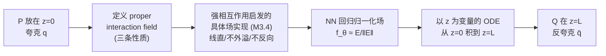

# Interaction Field Matching: Overcoming Limitations of Electrostatic Models

**会议**: ICLR 2026  
**OpenReview**: [https://openreview.net/forum?id=GEsTLuJy1q](https://openreview.net/forum?id=GEsTLuJy1q)  
**代码**: [https://github.com/justkolesov/InteractionFieldMatching](https://github.com/justkolesov/InteractionFieldMatching)  
**领域**: 生成模型 / 分布迁移  
**关键词**: 静电场匹配, 强相互作用, 物理启发生成模型, 分布迁移, 最优传输  

## 一句话总结
把静电场匹配（EFM）推广成"任意成对相互作用场"框架（IFM），再借鉴夸克间强相互作用设计一个具体的场，让场线变直、不外溢、不反向，从根上治好 EFM 的反向场线、场线越界和训练体积不可控三大顽疾。

## 研究背景与动机
- **领域现状**：扩散模型和流匹配是当下生成建模的主流，但近年冒出一条"库仑静电学"分支——先有 PFGM 把噪声当负电荷、数据当正电荷做噪声到数据生成，再有 EFM（Kolesov et al., 2025）把它推广成电容器模型，能直接做数据到数据迁移（image-to-image translation）。
- **现有痛点**：EFM 把两个分布当作电容器两极板上的正负电荷，沿电场线运动完成迁移，看着优雅但实操坑很多——**(1) 反向场线**：每个极板会发出朝向对面和朝向背面两组场线，背向那组对覆盖目标分布必不可少却高度弯曲、延伸到整个空间难以建模；**(2) 场线越界终止**：连一些前向场线都会穿过 z=L 边界跑到 z>L 区域，要额外设计停止准则把它拉回来；**(3) 训练体积不可控**：前两个问题导致神经网络必须在极板之间和极板之外的巨大区域采样学场，而这个区域多大事先根本不知道。
- **核心矛盾**：静电场的物理性质（库仑定律下场线必然向各方向发散）和"想要一束又直又有界的场线把分布平滑搬过去"的工程诉求天生冲突——你没法在保留电场的同时让它别外溢、别反向。
- **本文目标**：跳出"必须用静电场"的束缚，找出"能做分布迁移的场"到底需要满足哪些最小性质，再在这个更大的设计空间里挑一个没有上述缺陷的场。
- **核心 idea**：**[抽象层]** 先证明只要场满足三条物理性质（线起止于夸克对、通量守恒、对传输计划的广义叠加），沿场线运动就能可证地把 P 迁移到 Q——静电场只是其中一个特例；**[实例层]** 再仿照夸克-反夸克强相互作用（远距离场线会"拉直成弦"）设计一个具体场，天然满足"不外溢 z>L、无反向线"。

## 方法详解

### 整体框架
IFM 把 EFM 中"两分布是电容器正负极板"的设定保留下来：两个 D 维分布 P、Q 分别放在 $\mathbb{R}^{D+1}$ 的 $z=0$ 和 $z=L$ 两个超平面上，当作夸克 $q$ 与反夸克 $\bar q$。核心思路分两层：先把"什么场能做迁移"抽象成三条性质（任意满足者皆可，静电场是特例），再用强相互作用启发的具体场把 EFM 的毛病一次性消掉；训练上仍是回归归一化场方向的神经网络，推理时用以 $z$ 为积分变量的 ODE 从 $z=0$ 走到 $z=L$。

### 关键设计

**1. Proper interaction field：把"能迁移的场"抽象成三条性质，解放设计空间。** 这是全文的理论地基。作者不再要求场是静电场，而是问：一个相互作用场 $E(\tilde x)=E(\tilde x)\cdot n(\tilde x)$ 要满足什么才能保证分布迁移？答案是三条——**(性质 1) 线的起止**：等电荷夸克对的场线必须从夸克出发、终止于反夸克，$\frac{d\tilde x(\tau)}{d\tau}=n(\tilde x(\tau))$ 且 $\tilde x(\tau_s)=\tilde x_q,\ \tilde x(\tau_f)=\tilde x_{\bar q}$；**(性质 2) 通量守恒**：沿流管 $E(\tilde x)\cdot dS=\text{const}$，即穿过流面的场线数恒定，且总通量正比于夸克电荷、与夸克对相对位置无关；**(性质 3) 对传输计划的广义叠加**：给定 P、Q 间的传输计划 $\pi(x_q,x_{\bar q})$，整体场是所有成对场的加权平均
$$E_\pi(\tilde x)=\iint \pi(x_q,x_{\bar q})\,E_{x_q,x_{\bar q}}(\tilde x)\,dx_q\,dx_{\bar q}.$$
作者证明（Lemma 3.1）只要逐对满足性质 1-2，连续/离散系统的总场就仍起于 supp(P)、止于 supp(Q) 并守恒通量；而且静电场恰好是满足这三条的一个特例（Example 3.2，性质 3 对静电场退化为与 $\pi$ 无关）。这一抽象的价值在于：它把"必须用库仑场"松绑成"任挑一个满足三条的场"，后面才有空间去设计一个更乖的场。

**2. 强相互作用启发的具体场：线变直、场不外溢、无反向线。** 有了设计空间，作者从物理里挑灵感——夸克对在近距离像电荷一样相互作用，但拉远后场线会"straighten into a string"收紧成一根弦。据此构造的场（M3.4）在 $z\in[0,d]$ 和 $z\in[L-d,L]$ 两端向夸克弯曲、在中段 $z\in[d,L-d]$ 完全笔直，弦有有效宽度 $\sigma_0$、超出后场强指数衰减。Theorem 3.4 证明这个场不仅满足三条基本性质，还额外保证 **场线永不越界到 $z>L$**、**不存在反向场线**——正好对应消掉 M2.3 的三个毛病。直观对比见原文 Fig.2：EFM 的前向线会跑出 $z>L$ 且覆盖不全目标分布，而 IFM 的线在极板间几乎笔直、不外溢、足以覆盖整个 Q。

**3. 以传输计划为旋钮 + 极板间噪声插值的训练方案。** 性质 3 把传输计划 $\pi$ 显式写进场里，于是 $\pi$ 成了一个可调旋钮：取独立计划 $\pi=P\times Q$ 是默认，取 minibatch 最优传输计划（IFM-MB）则能在迁移时更好保形。训练体积的采样不再需要覆盖极板外的茫茫空间，而是直接在两端点的线性插值上加噪声：
$$\tilde x=\left(1-\tfrac{z}{L}\right)\tilde x_q+\tfrac{z}{L}\tilde x_{\bar q}+\tilde\epsilon(z),$$
其中 $z\sim r(z)$ 是 $[0,L]$ 上的调度分布，$\tilde\epsilon(z)$ 在两端为 0、中点 $z=L/2$ 处方差最大（$\sigma^2(z)=\frac{L}{2}-|\frac{L}{2}-z|$）。真值场用 (7) 的蒙特卡洛估计，网络回归归一化方向 $E_{\tilde x}\|f_\theta(\tilde x)-\frac{E(\tilde x)}{\|E(\tilde x)\|_2}\|_2^2\to\min_\theta$。

**4. 以 z 为物理变量的确定性 ODE 推理。** EFM 推理要为不同场线猜何时停止积分，麻烦又不可靠。IFM 把时间变量 $t$ 换成有物理意义的 $z$，显式设定起点 $z=0$、终点 $z=L$：
$$d\tilde x=\left(\frac{E_x(\tilde x)}{E_z(\tilde x)},\,1\right)dz\approx\left(\frac{f_\theta(\tilde x)_x}{f_\theta(\tilde x)_z},\,1\right)dz.$$
因为 IFM 的场保证线不越界、不反向，从 $z=0$ 用 Euler 解到 $z=L$ 就可证地把 P 输运到 Q（Theorem 3.3），彻底免去 EFM 的停止准则设计。

## 实验关键数据

### 主实验表格（图像生成，FID↓）

| Dataset / Method | IFM (ours) | EFM | PFGM++ | PFGM | FM | DDPM | StyleGAN |
|---|---|---|---|---|---|---|---|
| CIFAR-10 (32×32) | 2.28 | 2.62 | **2.15** | 2.76 | 2.99 | 3.12 | 2.48 |
| CelebA (64×64) | 3.07 | >100 | **2.89** | 3.95 | 14.45 | 12.26 | 3.68 |

> IFM 在 CIFAR-10 上优于直接前身 EFM 和同门 PFGM，仅略逊于 PFGM++；在 64×64 CelebA 上 **EFM 直接崩溃（FID>100）而 IFM 拿到 3.07**，与最优方法处于同一梯队。

### 消融 / 对比实验

**图像到图像翻译（CMMD↓）**

| Dataset / Method | IFM-MB (ours) | IFM (ours) | EFM | FM | CycleGAN | DDIB |
|---|---|---|---|---|---|---|
| '2'→'3' (32×32) | **0.87** | 0.95 | 0.93 | 1.06 | 0.90 | 0.96 |
| W→S (64×64) | **1.13** | 1.25 | ≫1 | ≫1 | 1.33 | 1.39 |

**推理时间（秒，IFM 生成，与 EFM/FM/DDPM 同架构同 100 步）**

| Dataset / Batch | 256 | 128 | 64 | 16 | 1 |
|---|---|---|---|---|---|
| CIFAR-10 (32×32) | 10.93 | 5.74 | 1.63 | 0.82 | 0.7 |
| CelebA (64×64) | 36.81 | 18.45 | 8.5 | 2.93 | 0.97 |

### 关键发现
- **对极板距离 L 鲁棒**：在 Gaussian→Swiss Roll 上 $L=6$ 与 $L=40$ 结果几乎无差、场线全程笔直；而 EFM 在大 $L$ 时场线严重弯曲、映射失败。
- **minibatch OT 计划更保形**：IFM-MB 在两个翻译任务上都优于独立计划版的 IFM，验证了"传输计划作为旋钮"的实用价值。
- **同架构公平对比下零额外开销**：IFM 与 EFM/PFGM/DDPM/FM 共用网络结构、Euler ODE 求解器和 100 步评估，推理速度与显存（32/64/128 分辨率下峰值约 8/10/16 GB）完全一致，性能提升不靠堆算力。
- **效率**：单张 A100（30 GB）训练 32×32 与 64×64 数据集 <10 小时，128×128 <30 小时。

## 亮点与洞察
- **"抽象出最小充分条件再挑特例"是漂亮的方法论**：不去硬修静电场，而是退一步问"做迁移到底需要场满足什么"，把库仑场降格为三条性质下的一个特例，立刻获得整片设计空间——这是把工程难题转化为理论自由度的典型范式。
- **物理直觉用得恰到好处**：夸克强相互作用"远距离拉成弦"的图像，正好对应工程上想要的"中段笔直、两端收口、有界宽度"的场，把抽象需求落成了一个可算的具体场。
- **传输计划显式进场**：性质 3 把 $\pi$ 写进叠加原理，使得 minibatch OT 等结构约束能自然嵌入，给保形迁移留了接口。

## 局限与展望
- **实验仍是 proof-of-concept 规模**：最高只到 128×128 CelebA，缺乏 ImageNet / 高分辨率大规模验证，难以判断是否能与现代扩散/流匹配在 SOTA 战场正面竞争。
- **未追平 PFGM++**：CIFAR-10 与 64×64 CelebA 上 FID 都略逊 PFGM++，说明"治好 EFM 顽疾"并不自动等于"全面超越静电系最强者"。
- **具体场设计含可调结构**：端部弯曲区宽度 $d$、弦有效宽度 $\sigma_0$ 等是人工设定，论文把超参敏感性放在附录，主文缺乏对这些设计取舍的充分讨论。
- **强相互作用只是"启发"**：真实强场强需复杂量子计算，本文用的是修改过的物理相互作用，与夸克物理的对应是隐喻而非严格推导。

## 相关工作与启发
- **直接前身 EFM**（Kolesov et al., 2025）：把静电学从噪声到数据扩展到数据到数据迁移，IFM 是其严格推广，并显式列出并修复它的三大缺陷。
- **PFGM / PFGM++**（Xu et al., 2022; 2023）：电场启发生成的开山，专注噪声到数据；IFM 把它们也纳入"满足三条性质的特例"统一视角下。
- **流匹配 / 桥匹配 / 扩散**（Lipman, Liu, Albergo; Shi; Ho 等）：作者强调 IFM 的极板间插值训练与这些方法没有直接对应，是另一条独立的"物理场"路线。
- **最优传输**（Tong et al., 2023; Pooladian et al., 2023）：minibatch OT 计划作为性质 3 的实例，被用来增强迁移映射的保形性。
- **启发**：当一个优雅范式被某条物理定律的"副作用"卡住时，与其修补，不如抽象出该范式真正依赖的最小条件、再换一个没有副作用的实例——这套"松绑—重选"思路可迁移到其他物理启发的生成框架。

## 评分
- **新颖性**: ⭐⭐⭐⭐ 把静电场匹配抽象成"任意 proper interaction field"是有理论高度的推广，再借夸克强相互作用落地一个无缺陷的具体场，视角新颖、动机清晰。
- **实验充分度**: ⭐⭐⭐ 覆盖 toy、生成、翻译三类任务且对比方法齐全，但规模停在 128×128、未做大规模 SOTA 比拼，且未追平 PFGM++。
- **写作质量**: ⭐⭐⭐⭐ 痛点-性质-实现-证明的逻辑链条干净，物理类比讲得通俗，图示（Fig.1/2/6/7）有效支撑直觉。
- **价值**: ⭐⭐⭐⭐ 为电场启发生成这条小众但活跃的路线扫清了关键工程障碍，提供了可复用的"性质化设计场"框架与开源代码，对后续研究有承上启下的意义。

<!-- RELATED:START -->

## 相关论文

- [\[ICLR 2026\] PixNerd: Pixel Neural Field Diffusion](pixnerd_pixel_neural_field_diffusion.md)
- [\[ICLR 2026\] Any-step Generation via N-th Order Recursive Consistent Velocity Field Estimation](any-step_generation_via_n-th_order_recursive_consistent_velocity_field_estimatio.md)
- [\[ICLR 2026\] Arbitrary-Shaped Image Generation via Spherical Neural Field Diffusion](arbitrary-shaped_image_generation_via_spherical_neural_field_diffusion.md)
- [\[ICLR 2026\] Branched Schrödinger Bridge Matching](branched_schrödinger_bridge_matching.md)
- [\[ICLR 2026\] Discrete Adjoint Matching](discrete_adjoint_matching.md)

<!-- RELATED:END -->
