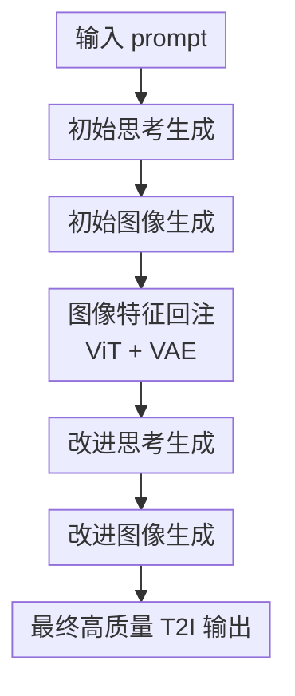

# Interleaving Reasoning for Better Text-to-Image Generation

**会议**: ICLR2026  
**OpenReview**: [https://openreview.net/forum?id=lLNNzBQPas](https://openreview.net/forum?id=lLNNzBQPas)  
**代码**: https://github.com/Osilly/Interleaving-Reasoning-Generation  
**领域**: 图像生成 / 推理增强文本到图像生成  
**关键词**: 交错推理、文本到图像生成、统一多模态模型、反思式生成、细粒度保真  

## 一句话总结
本文提出 Interleaving Reasoning Generation，让统一多模态生成模型按“文本思考 $\rightarrow$ 初始图像 $\rightarrow$ 文本反思 $\rightarrow$ 改进图像”的轨迹生成图片，并用 IRGL-300K 的六类分解学习任务训练这一流程，在多项 T2I benchmark 上比 BAGEL self-CoT 和其他统一模型更强，尤其改善指令遵循、世界知识和细节质量。

## 研究背景与动机
**领域现状**：文本到图像生成正在从单纯的 diffusion / autoregressive 生成器，走向“理解与生成一体化”的多模态基础模型。BAGEL、Show-o、Janus、Emu3 这类模型不只接收文本 prompt，也能处理图像输入、生成文本和图像交错输出，因此天然具备把理解能力迁移到生成过程中的潜力。与此同时，GPT-4o 这类强系统展示了更好的指令遵循和细节保持能力，让社区开始重新思考：生成图片是不是也应该像解复杂题一样先推理、再行动。

**现有痛点**：已有一些 T2I 工作尝试在生成前加入 self-CoT 或文本 reasoning，把 prompt 改写成更细的生成计划，再让模型出图。这确实能缓解“直接从短 prompt 到图像”的难度，但大多只产生一次文本辅助信号，然后一次性生成最终图片。问题在于，高质量图像并不只取决于语义是否对齐；纹理、阴影、手指结构、局部边缘、审美风格这些细节，经常要看见初始图像之后才知道哪里需要改。

**核心矛盾**：单轮推理可以帮助模型理解 prompt，却缺少“观察自己生成结果并继续修正”的闭环。反过来，已有 reflection-based T2I 方法常把反思用于修补明显语义错误，或者依赖外部 LLM / reward model / 非端到端流程；它们不一定能把反思稳定融进统一生成模型内部，也不一定把目标放在细粒度质量提升上。本文关心的是更具体的问题：当初始图像主体已经大致正确时，能否通过第二轮文本反思把视觉质量和细节保真继续推高。

**本文目标**：作者把目标拆成两个层次。第一，让模型在第一次出图前能生成有用的文本 thinking，用它建立核心内容和基础画质。第二，让模型能编码自己生成的初始图像，写出针对该图像的 improving thinking，再忠实执行这些改进，生成更好的第二轮图片。整个过程要尽量端到端地发生在统一多模态生成模型里，而不是把评估、反思和生成拆给多个外部模块。

**切入角度**：本文选择 BAGEL 这类统一多模态理解与生成模型作为基座，因为它本来就能处理 interleaved text-image 输入输出。作者的观察是：如果模型可以在同一 transformer 内交换文本表征、图像 ViT/VAE 特征和生成状态，那么“推理过程”不必停留在文本侧，而可以变成跨轮次、跨模态的信息融合。

**核心 idea**：把 T2I 从一次性 `prompt -> image` 改成两轮交错推理生成：先 `prompt -> thinking -> image` 得到语义正确的初始图，再把初始图编码回模型，生成反思文本并输出 refined image；训练时用六种分解任务分别补强初始思考、初始出图、反思思考和改进出图。

## 方法详解

### 整体框架
IRG 的推理轨迹可以概括为 `text-image-text-image`。给定输入 prompt $T_{in}$，模型先生成初始思考 $T_{out}^{(1)}$，再基于它生成初始图像 $I_{out}^{(1)}$；随后把这张初始图像编码成 ViT/VAE 特征 $I_f^{(1)}$，连同原始 prompt 和第一轮思考一起输入模型，生成改进思考 $T_{out}^{(2)}$，最后输出改进图像 $I_{out}^{(2)}$。论文理论上写成多轮形式，但实验主要验证两轮，也就是把 $n$ 设为 2。

训练框架叫 Interleaving Reasoning Generation Learning (IRGL)。它不直接假设完整两轮轨迹很容易大规模获得，而是把 $T_{out}^{(1)}$、$I_{out}^{(1)}$、$T_{out}^{(2)}$、$I_{out}^{(2)}$ 四个中间目标拆开学习。IRGL-300K 数据集包含六类 learning modes：四类偏文本 reasoning 学习，两类偏完整 thinking-image 轨迹学习。训练分两阶段：Stage 1 用六类任务快速建立初始思考和反思思考能力，同时保留图像生成能力；Stage 2 只用 Initial Full Learning 和 Improving Full Learning 这类完整轨迹，继续优化真正的两轮生成 pipeline。

### 关键设计
**1. 交错推理生成：把反思放进统一模型的生成轨迹**

普通 self-CoT T2I 可以写成 $T_{in} \rightarrow T_{out}^{(1)} \rightarrow I_{out}^{(1)}$，文本推理只在第一张图之前出现。IRG 的核心变化是让第一张图也参与后续推理：$T_{in} \rightarrow T_{out}^{(1)} \rightarrow I_{out}^{(1)} \xrightarrow{enc} I_f^{(1)} \rightarrow T_{out}^{(2)} \rightarrow I_{out}^{(2)}$。这里 $enc$ 不是简单把图片转成 caption，而是把生成图片编码成模型可用的 ViT 与 VAE 特征，使后续生成能同时看到文本状态和视觉状态。

这个设计解决的是“一次性生成看不到自己错误”的问题。第一轮 thinking 负责把 prompt 中的对象、关系、风格和世界知识展开，第一轮 image 建立主体和布局；第二轮 improving thinking 则专门面对已经生成出的局部缺陷，例如纹理不自然、阴影不真实、手指结构粗糙、文字/样式没有完全跟上。它和传统 reflection 的差别在于，IRG 不只是纠正大错，而是把反思定位为细节增强和视觉质量提升。

**2. 六种分解学习模式：用中间目标缓解完整 IRG 轨迹稀缺**

完整 IRG 数据很难直接构造，因为它需要成对的初始图像和改进图像，还要有能解释“为什么从前者改到后者”的文本反思。论文没有只依赖少量完整轨迹，而是把两轮过程拆成六种监督形式。初始阶段有 Initial Thinking Understanding Learning、Initial Thinking Generation Learning、Initial Full Learning；改进阶段有 Improving Thinking Understanding Learning、Improving Thinking Generation Learning、Improving Full Learning。

这种拆法的关键不是简单扩数据量，而是让模型在不同信息条件下学同一个能力。Understanding Learning 给模型视觉参考，比如 prompt 加图像特征再生成 thinking，让模型知道“什么样的图像对应什么样的思考”；Generation Learning 则更贴近推理时的真实条件，比如只有 prompt 时生成初始 thinking，或拿 prompt、初始 thinking、初始图像特征生成 improving thinking。Full Learning 再把文本思考和图像生成连成完整轨迹，保证模型不仅会说反思，还能把反思落实到像素生成中。

**3. IRGL-300K 数据构建：用强模型蒸馏高质量图像与反思文本**

IRGL-300K 的数据来源按任务分层。初始 thinking 的理解和生成学习主要来自开源 T2I prompt-image 数据，作者用 Qwen2.5-VL 根据 prompt 与对应图片生成与图像一致的初始 reasoning。Initial Full Learning 为了保证图片质量，用 GPT-4o 根据 prompt 生成高质量图像，再让 MLLM 生成对应 thinking，因此初始出图阶段学习到的是更干净的目标。

改进阶段的数据更微妙。作者用 base model BAGEL 先根据同一 prompt 生成第一轮 thinking 和初始图，再把高质量图片作为改进目标。对于 Improving Thinking Understanding Learning，MLLM 需要比较初始图和改进图，并按模板写出“前图问题分析、需要改进的细节、逐步修改指导、最终改进 prompt”。对于 Improving Full Learning，GPT-4o 生成的高质量图像作为 $I_{out}^{(2)}$，MLLM 负责生成从初始图走向改进图的 stage-level improving thinking。这样构造出的数据不是单纯“好图 + prompt”，而是有方向的“从较弱生成到更强生成”的轨迹。

**4. 改进阶段 CFG 条件设计：分别控制初始图像信息和反思文本信息**

第二轮生成时，条件源比普通 diffusion CFG 复杂得多。传统 CFG 通常比较“有 prompt”和“无 prompt”；IRG 第二轮至少有原始 prompt、初始 thinking、初始图像特征、improving thinking 四类条件。如果直接沿用第一轮的 prompt-only CFG，模型容易在改图时失去稳定性，或者不能充分利用反思文本和初始图像。

因此作者设计了两个互补的 CFG 条件：一个比较“有无初始图像信息”，另一个比较“有无反思文本信息”。实验中两者 guidance scale 都设为 2.0。直观地说，image condition 帮助第二轮保留并修正第一轮图像，而不是凭空重画；text condition 则确保模型执行 improving thinking 中的具体修改。Fig. 5 的可视化表明，缺少任一条件都会让改进图的质量或稳定性下降。

### 一个完整示例
假设 prompt 是“一个玻璃茶壶放在木桌上，旁边有一束黄色花，午后阳光从窗户照进来”。普通 T2I 模型可能一次生成大体正确的场景，但玻璃材质像塑料、桌面阴影方向混乱、花瓣数量和形状粗糙。

在 IRG 中，第一轮初始思考会先拆解 prompt：主体是透明玻璃茶壶，环境是木桌和窗边自然光，关键细节包括透明折射、高光、柔和投影和黄色花束。模型据此生成 $I_{out}^{(1)}$，得到一张语义基本正确的初始图。然后模型把这张图编码为 $I_f^{(1)}$，第二轮 improving thinking 会围绕具体缺陷写出修改计划：增强玻璃边缘高光和内部折射，让阳光方向与桌面阴影一致，提升花瓣边缘层次，同时不要改变茶壶位置和整体构图。最终 $I_{out}^{(2)}$ 不是重新理解 prompt，而是在保留第一轮布局的基础上提高材质、光照和局部细节。

这个例子说明 IRG 的“推理”不是为了写更长的 prompt 而写更长的 prompt，而是让模型拥有一个观察-诊断-执行的闭环。第一轮负责把语义落地，第二轮负责在图像条件下做质量改进。

### 损失函数 / 训练策略
训练使用 BAGEL 作为基座模型。Stage 1 在六种分解学习模式上训练 2K steps，同时使用 cross-entropy loss 学文本 token / reasoning 输出，并用 mean squared error loss 学图像生成相关目标。这个阶段的主要目标是快速获得初始 thinking 和 improving thinking 能力，但加入 Initial Full Learning 与 Improving Full Learning 是必要的，否则纯文本 reasoning 训练可能损伤原本的生成能力。

Stage 2 继续在 Initial Full Learning 和 Improving Full Learning 上训练 30K steps，把 Stage 1 学到的 reasoning 能力真正接到图像生成轨迹上。作者特别指出，涉及图像生成的完整轨迹收敛更慢，因为模型要学习从初始图到改进图的细粒度 fidelity 变化，而不是只学会输出一段反思文本。

## 实验关键数据

### 主实验
论文在 GenEval、WISE、TIIF、GenAI-Bench、OneIG-EN 上比较 IRG 与 generation-only 模型、统一多模态模型和 self-CoT 变体。最核心的结论是：IRG 在开放统一模型中整体达到 SOTA，并在若干 benchmark 上接近或超过 GPT-4o 的部分维度。

| 数据集 | 指标 | IRG | 强基线 | 提升 |
|--------|------|-----|--------|------|
| GenEval | Overall | 0.85 | BAGEL w/ self-CoT 0.79 / GPT-4o 0.84 | 比 self-CoT +0.06，略高于 GPT-4o |
| WISE | Overall | 0.77 | BAGEL w/ self-CoT 0.70 / Show-o2 0.61 | 比 self-CoT +0.07 |
| TIIF testmini | Overall short / long | 76.00 / 73.77 | BAGEL w/ self-CoT 68.06 / 68.78 | short +7.94，long +4.99 |
| GenAI-Bench | Overall | 0.84 | BAGEL w/ self-CoT 0.81 / T2I-R1 0.81 | +0.03 |
| OneIG-EN | Overall | 0.415 | BAGEL 0.361 / FLUX.1-dev 0.434 / GPT-4o 0.533 | 开源统一模型中领先，但仍低于 GPT-4o 和 FLUX overall |

GenEval 上，IRG 的 counting 为 0.83、position 为 0.74、color attribute 为 0.73，说明它不是只提升审美分，而是在组合属性和空间关系上也有收益。WISE 上，IRG 在 Biology 0.81、Physics 0.82、Chemistry 0.78 这些需要世界知识的维度上明显超过 BAGEL self-CoT，支持“推理增强生成”对知识对齐有帮助。

### 消融实验
消融表直接比较了高质量图像训练、完整 IRG 轨迹、六种分解学习模式三者的贡献。基线是 BAGEL w/ self-CoT。

| 配置 | WISE | TIIF | GenAI-Bench | 说明 |
|------|------|------|-------------|------|
| BAGEL w/ self-CoT | 0.70 | 68.06 / 68.78 | 0.81 | 单轮文本 reasoning 基线 |
| + High-quality Images Training | 0.73 | 70.69 / 69.85 | 0.80 | 只加高质量图像有帮助，但不稳定 |
| + Interleaving Reasoning Generation | 0.76 | 73.90 / 71.37 | 0.83 | 完整 text-image-text-image 轨迹带来明显提升 |
| + Decomposed Learning Modes | 0.77 | 76.00 / 73.77 | 0.84 | 六种分解任务 + 两阶段训练效果最好 |

论文还比较了第一轮图像和第二轮 IRG 图像。benchmark 分数上，IRG reasoning step 1 的 WISE 甚至是 0.79，高于最终 IRG 的 0.77；但多模型 judge 和人工评估显示第二轮图像质量更好。Qwen、GPT-4o、UnifiedReward 三个评估器的平均 rank score 从 step 1 的 36.7% 提升到 step 2 的 63.3%，人类评估偏好也从 17% 提升到 74%。这说明标准 benchmark 对细粒度视觉质量并不完全敏感，第二轮主要价值在“看起来更好、细节更可信”。

### 关键发现
- 六种分解学习模式不是可有可无的工程细节。只做高质量图像训练能提升 WISE，但 GenAI-Bench 反而从 0.81 到 0.80；加入 IRG 完整轨迹后才在多个指标上稳定上升，进一步加入分解任务达到最好。
- 第二轮反思更像是视觉质量优化，而不是纯 benchmark 得分优化。Tab. 4 中 step 1 和 step 2 的标准分数很接近，但 MLLM judge 与人类更偏好 step 2，说明 IRG 的收益部分落在现有自动指标难捕捉的局部材质、边缘和审美上。
- CFG 条件设计影响第二轮稳定性。Fig. 5 显示 naive CFG、去掉 text cache、去掉 image cache 都会损伤改进图质量；第二轮必须同时利用“初始图像条件”和“反思文本条件”。
- 推理步数不是越多越好。扩展到 step 3、step 4 后，WISE 从 0.77 降到 0.76/0.75，TIIF 和 GenAI-Bench 也略降，主要因为训练只覆盖两轮，额外轮次会带来收益递减和误差累积。

## 亮点与洞察
- 最有意思的点是把 reasoning 从“生成前的文本计划”推进到“生成中的跨模态循环”。这让模型不只是把 prompt 改写得更详细，而是真的把初始图像作为下一轮推理对象。
- IRGL 的六类任务设计很务实。完整两轮轨迹昂贵且稀缺，作者用 understanding / generation / full learning 三种视角切开任务，让文本 reasoning 学习成为 full trajectory 的数据高效代理。
- 论文诚实地区分了 benchmark 分数和视觉质量。Step 2 的 WISE 分数不一定高于 step 1，但多评估器和人工偏好支持它在细节上更好，这比只报一个 overall 分数更有说服力。
- 这个范式可以迁移到图像编辑、视频生成和 3D 生成。只要基础模型能把中间产物编码回推理上下文，就可以构造“初稿-反思-修订”的生成轨迹，而不局限于静态 T2I。

## 局限与展望
- 完整 IRG 数据构造依赖强模型蒸馏，尤其 GPT-4o 生成高质量图和改进目标。论文在附录中用 Hunyuan-Image-3.0 展示了开源替代的可行性，但大规模复现的质量、成本和授权问题仍需要进一步验证。
- 当前训练主要覆盖两轮推理。扩展到更多轮时 benchmark 分数下降，说明模型并没有真正学会任意长度的稳定 refinement loop；未来需要多轮训练数据、动态停止策略或更强的反思约束。
- 推理代价明显增加。论文报告 step 1 延迟约 29.79s，step 2 达到 60.58s；峰值显存从 28.23GB 到 29.35GB 变化不大，但延迟几乎翻倍，实际应用需要在质量和响应时间之间取舍。
- 反思本身可能引入新 artifact。失败案例显示局部区域可能改善，另一些区域却被过度平滑、文字渲染漂移，或拥挤场景里局部编辑破坏全局布局。第二轮修改越激进，这类风险越大。

## 相关工作与启发
- **vs BAGEL w/ self-CoT**: BAGEL self-CoT 只在生成前加入文本推理，IRG 在第一张图之后继续让模型反思并生成第二张图。优势是能利用初始图像中的真实缺陷做细节修正，代价是推理延迟更高。
- **vs T2I-R1 / CoT-based image generation**: 这些方法强调用 step-by-step reasoning 或强化学习增强图像生成的语义对齐，IRG 的区别是把图像本身插入推理链，形成 text-image-text-image 的跨模态轨迹。
- **vs reflection-based T2I 方法**: 传统 reflection 常由外部 LLM、reward model 或多模块系统完成，重点多是纠正语义和结构错误。IRG 更强调统一模型内的端到端交错推理，并把第二轮目标放在视觉质量、细粒度 fidelity 和审美改善上。
- **对后续工作的启发**: 生成模型可以借鉴写作和代码迭代的思想，不必一次性把最终答案生成完。更自然的方向是让模型产生中间版本、显式诊断问题、带条件地修订，并学会什么时候停止。

## 评分
- 新颖性: ⭐⭐⭐⭐⭐ 把 interleaving reasoning 系统引入 T2I，并落成统一模型内的 text-image-text-image 轨迹，方向感很强。
- 实验充分度: ⭐⭐⭐⭐☆ 覆盖多个主流 benchmark、消融和人工偏好评估，但对更多基座模型和真实部署场景的验证还可以更广。
- 写作质量: ⭐⭐⭐⭐☆ 论文方法拆解清楚，表格充分；不足是数据构造细节较多，读者需要在主文和附录之间来回拼完整训练图景。
- 价值: ⭐⭐⭐⭐⭐ 对推理增强生成、多轮 refinement 和统一多模态模型训练都有启发，尤其适合作为后续 test-time scaling for generation 的起点。

<!-- RELATED:START -->

## 相关论文

- [\[CVPR 2026\] Thinking-while-Generating: Interleaving Textual Reasoning throughout Visual Generation](../../CVPR2026/image_generation/thinking-while-generating_interleaving_textual_reasoning_throughout_visual_gener.md)
- [\[ICLR 2026\] ImageDoctor: Diagnosing Text-to-Image Generation via Grounded Image Reasoning](imagedoctor_diagnosing_text-to-image_generation_via_grounded_image_reasoning.md)
- [\[ICLR 2026\] RePrompt: Reasoning-Augmented Reprompting for Text-to-Image Generation via Reinforcement Learning](reprompt_reasoning-augmented_reprompting_for_text-to-image_generation_via_reinfo.md)
- [\[ECCV 2024\] Textual-Visual Logic Challenge: Understanding and Reasoning in Text-to-Image Generation](../../ECCV2024/image_generation/textual-visual_logic_challenge_understanding_and_reasoning_in_text-to-image_gene.md)
- [\[ICLR 2026\] MILR: Improving Multimodal Image Generation via Test-Time Latent Reasoning](milr_improving_multimodal_image_generation_via_test-time_latent_reasoning.md)

<!-- RELATED:END -->
