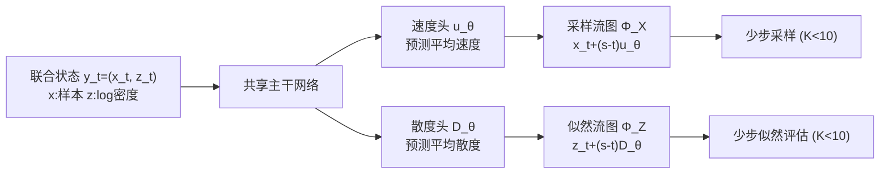

# Joint Distillation for Fast Likelihood Evaluation and Sampling in Flow-based Models

**会议**: ICLR 2026  
**OpenReview**: [https://openreview.net/forum?id=8uZ5UdIul2](https://openreview.net/forum?id=8uZ5UdIul2)  
**代码**: 待确认  
**领域**: 图像生成 / 流模型加速  
**关键词**: 流匹配, 似然评估, 蒸馏, 流图, MeanFlow, 少步采样  

## 一句话总结
通过把"采样轨迹"和"对数似然(累积散度)"耦合进同一个流图(flow map)联合蒸馏，F2D2 让流匹配模型同时把采样和似然评估的 NFE 从上千步压到几步，首次实现了 CNF/扩散类模型的**少步精确似然评估**。

## 研究背景与动机

**领域现状**：扩散和流匹配是当下图像/视频生成的主力，而对数似然(log-likelihood)是模型比较、RL/偏好优化(PPO、DPO、GRPO)、避免模式坍塌等下游能力的基础。连续归一化流(CNF)的好处之一就是能通过概率流 ODE 精确计算似然。

**现有痛点**：精确似然需要沿 ODE 轨迹积分散度项 $\int_0^1 \mathrm{div}(v_\theta(\hat x_t,t))\,dt$，通常要 100–1000 次 NFE，比采样还贵得多。少步采样领域(一致性模型、Shortcut、MeanFlow 等)已经很成功，但它们要么**彻底放弃似然计算**，要么(如 CTM)虽保留似然却仍需对整条轨迹做上百次积分——快采样有了，**快似然评估仍是空白**。

**核心矛盾**：采样可以被蒸馏成几步，而似然评估却被"必须沿全轨迹积分散度"这一硬约束锁死，二者看似不可兼得。

**本文目标**：让一个模型同时具备少步($K<10$)采样和少步($K<10$)似然评估两种能力。

**核心 idea**：作者观察到 CNF 中采样轨迹 $\frac{d}{dt}x_t=v_\theta$ 和对数密度演化 $\frac{d}{dt}\log p_t=-\mathrm{div}(v_\theta)$ 是一组**共享同一速度场的耦合 ODE**——散度只是从同一速度模型派生的另一个输出。因此可以用**单个流图把采样轨迹和累积散度一起蒸馏**，让二者都学会"跳步"。

## 方法详解

### 整体框架

F2D2(fast flow joint distillation)把似然计算视为速度场的"副产品"：既然采样和似然都源自同一速度 $v_\theta$，那就用一个共享主干、双预测头的网络去同时学习**联合流图** $\Phi_Y$，它一次性预测状态位移和对数密度增量。框架是模块化的——只要在已有的少步流图模型(Shortcut、MeanFlow、LSD)上加一个"散度预测头"，再补上对应的两条似然损失即可即插即用。

### 关键设计

**1. 联合流图参数化：把似然塞进流图的 Z 分量**。流图 $\Phi(\hat x_t,t,s)=\hat x_t+(s-t)u_\theta(\hat x_t,t,s)$ 直接预测从 $t$ 跳到 $s$ 的积分结果，$u_\theta$ 近似区间平均速度 $\frac{1}{s-t}\int_t^s v\,d\tau$，省去显式数值积分。作者把对数似然 $z_t=\log p_t$ 也写成同样形式：$\Phi_Z(\hat x_t,\hat z_t,t,s)=\hat z_t+(s-t)D_\theta(\hat x_t,t,s)$，其中 $D_\theta\approx-\frac{1}{s-t}\int_t^s\mathrm{div}(v)\,d\tau$ 是**平均散度**。关键观察是平均散度只依赖 $x_t$ 而不依赖 $z_t$(由耦合 ODE 决定)，所以联合状态 $y_t=(x_t,z_t)^\top$ 的流图可以写成 $\Phi_Y=\hat y_t+(s-t)f_\theta$，$f_\theta=(u_\theta,D_\theta)^\top$ 共享主干、分头输出。命题 3.3 证明了在切向条件 $f(x,s,s)=(v,-\mathrm{div}(v))^\top$ 下，只要满足 Lagrangian / Eulerian / 半群三者之一，$\Phi_Y$ 就是合法的联合流图。

**2. 四项联合蒸馏损失**。通用目标 $L_{\text{F2D2}}=L_{\text{VM}}+L_u+L_{\text{div}}+L_D$ 拆成两对：前两项管采样子系统($L_{\text{VM}}$ 用流匹配损失强制瞬时速度匹配即切向条件，$L_u$ 强制采样流图满足某条件)，后两项管似然子系统($L_{\text{div}}$ 匹配瞬时散度，$L_D$ 让 $\Phi_Z$ 满足联合流图所需的跳步一致性)。在 Shortcut 实例里 $L_D$ 就是对 Z 分量施加半群自一致性 $D_\theta(x_t,t,s)\approx\frac12\mathrm{sg}(D_\theta(x_t,t,r)+D_\theta(\Phi_X(x_t,t,r),r,s))$；在 MeanFlow 实例里则把散度损失改成 MeanFlow 恒等式形式，用 JVP 计算 $\frac{d}{dt}D_\theta$，从而吸收掉显式的 $L_{\text{div}}$。瞬时散度的监督信号 $\mathrm{div}(u_\theta(x_t,t,t))$ 用 **Hutchinson 迹估计** $\mathrm{div}(v)\approx\mathbb{E}_{\epsilon}[\epsilon^\top\nabla_x v\,\epsilon]$ 做到 $O(1)$ 开销而非 $O(d)$。

**3. 分阶段训练 + Shortcut-Distill 教师**。散度监督依赖准确的速度预测，所以采用 warm-start 分阶段：先用现成流图蒸馏技术单独预训练速度分量 $u_\theta$，再加散度头联合训练；可选地预训练一个流匹配教师 $v_\phi$，用更干净的 $\mathrm{div}(v_\phi)$ 替换噪声较大的 $\mathrm{div}(u_\theta)$。作者还提出 **Shortcut-Distill** 三阶段流水线(教师预训练 → 用教师速度监督替换 $L_{\text{div-SC}}$ → 加散度头联合蒸馏)以提升稳定性。由于 Shortcut/MeanFlow 的预训练 checkpoint 都是**前向单向**($t\le s$)的，反向似然积分用一阶近似 $\Delta x(x_t,t,t-\Delta t)\approx-\Delta x(x_t,t,t+\Delta t)$ 复用前向模型，保持即插即用兼容性。

**4. 最大似然自引导(应用)**。有了一步散度预测，就能把 $-\log p_0(x_0)-D_\theta(x_0,0,1)$ 当作伪似然目标，在采样前用一步 Adam 优化初始噪声 $x_0$。这是一种**无需外部奖励模型的自引导**——引导信号来自模型自己的似然头，只多花一次前向+反向 NFE 就能显著提升样本质量。

## 实验关键数据

数据集：CIFAR-10、ImageNet 64×64、CelebA-64；指标：FID(50K 图，越低越好)、NLL(BPD，越接近教师值越好)；采样/似然用 1/2/4/8 步 Euler。

### 主实验表格(CIFAR-10，教师流匹配 1024 步 BPD=3.12 / FID=2.60)

| 方法 | 8步 NLL | 8步 FID | 2步 NLL | 2步 FID | 1步 NLL | 1步 FID |
|---|---|---|---|---|---|---|
| Flow Matching | -9.93(无效) | 20.63 | -52.85(无效) | 146.24 | -111.19(无效) | 313.54 |
| Shortcut Model | -12.07(无效) | 7.10 | -60.01(无效) | 16.04 | -124.15(无效) | 27.28 |
| MeanFlow | -9.00(无效) | 4.34 | -46.63(无效) | 2.84 | -97.59(无效) | 2.80 |
| Shortcut-F2D2(ours) | **3.07** | 8.78 | **2.73** | 15.58 | 0.20 | 27.35 |
| Shortcut-Distill-F2D2(ours) | **3.12** | 5.68 | 2.38 | 7.35 | 1.62 | 13.76 |
| MeanFlow-F2D2(ours) | 2.38 | **3.78** | 1.63 | **2.59** | 3.51 | **3.02** |

关键点：所有 baseline 的 NLL 都是**无效负值**(灰色)，而 F2D2 系列把 NLL 拉回到接近教师 3.12 BPD 的合理区间，且 FID 几乎不损失；MeanFlow-F2D2 甚至在产出有效 NLL 的同时把 FID 还**降低**了。

### 消融实验表格(ImageNet 64×64，教师 1024 步 BPD=3.34)

| 方法 | 8步 NLL | 8步 FID | 1步 NLL | 1步 FID |
|---|---|---|---|---|
| Flow Matching | -6.41(无效) | 31.60 | -74.54(无效) | 363.39 |
| Shortcut-Distill(ours) | -9.03(无效) | 19.47 | -102.07(无效) | 42.72 |
| Shortcut-Distill-F2D2(ours) | 3.51 | 21.91 | 1.54 | 44.02 |

CelebA-64 上 LSD-F2D2 同样在少步下取得有效校准似然且画质更优；可见 F2D2 的有效性跨数据集、跨流图实例(Shortcut/MeanFlow/LSD)都成立。

### 关键发现
- **似然有效性是质变而非量变**：baseline 在少步下 NLL 直接发散成大负数(无意义)，F2D2 让它首次变成可用的校准值。
- **采样质量基本无损**，MeanFlow-F2D2 反而靠似然信号当作互补监督把 FID 提升了——联合训练对两个子任务都有益。
- **自引导效果显著**：2 步 MeanFlow + F2D2 + 自引导，只多一次反向 NFE，FID 就低于同尺寸 1024 步流匹配模型。

## 亮点与洞察
- **观念上的统一**：把"似然评估"重新理解为"速度场的另一个派生输出"，从而能用蒸馏采样的同一套流图机制去蒸馏似然，是个干净且可推广的视角。
- **真正的即插即用**：只加一个散度头 + 两条损失，就能给 Shortcut/MeanFlow/LSD 这些已有少步模型补上快似然能力，复用预训练 checkpoint。
- **首次实现**：据作者所述这是第一个能在扩散/CNF 框架下做少步**精确**似然评估的方法，补上了少步生成领域长期缺失的一块。
- **自引导无需外部奖励**：用模型自身似然头做 test-time 优化，展示了"快似然"打开的新算法空间。

## 局限与展望
- **前向单向近似**：为兼容现有 checkpoint，反向似然积分用一阶近似 $-\Delta x$，仅在小到中等步长精确；$t=1$ 附近存在 OOD 输入，靠网络泛化兜底，理论上不够干净。
- **依赖教师与分阶段训练**：最佳结果(Shortcut-Distill-F2D2)需要预训练教师 + warm-start 多阶段流程，训练管线偏复杂。
- **似然仍非完全精确**：NLL 只是"接近"教师 BPD 而非严格相等，Hutchinson 估计也引入方差。
- **规模有限**：实验止于 CIFAR/ImageNet64/CelebA64 这类低分辨率无条件生成，未验证文本到图像、高分辨率或条件生成的可扩展性。

## 相关工作与启发
- **似然计算**：连续形式靠概率流 ODE(Song 2020)可得精确似然但需 100–1000 NFE；归一化流(Rezende 2015)靠特殊架构换变量得到精确似然——F2D2 走的是"蒸馏积分"这条新路。
- **少步采样**：一致性模型(Song 2023)、CTM(Kim 2023)、Shortcut(Frans 2024)、MeanFlow(Geng 2025)是其直接构建基座，F2D2 把它们从"只快采样"升级为"采样+似然双快"。
- **流图框架**(Boffi 2025)是核心理论工具——把 ODE 解算子直接建模为可跳步的映射，F2D2 的贡献是把这套框架从单一 $x$-ODE 推广到 $(x,\log p)$ 联合 ODE。
- **启发**：当某个昂贵量(似然)与已被加速的量(采样)共享底层动力学时，"联合蒸馏成一个跳步算子"是一条通用范式，可能迁移到其他需要沿轨迹积分的物理量(如熵、传输代价)。

## 评分
- **新颖性**: ⭐⭐⭐⭐⭐ 把似然评估重构成流图的派生分量并联合蒸馏，首次解决少步精确似然这一长期空白，视角统一且可推广。
- **实验充分度**: ⭐⭐⭐⭐ 覆盖三个数据集、三种流图实例、1–8 步全谱，主实验+消融+自引导应用齐全；但限于低分辨率无条件生成，缺大规模/条件场景验证。
- **写作质量**: ⭐⭐⭐⭐ 动机—洞察—方法—应用层层递进，理论(命题/引理)与实践设计(Hutchinson/分阶段/前向近似)交代清楚。
- **价值**: ⭐⭐⭐⭐⭐ 补上了少步生成模型缺失的似然能力，直接惠及 RL/偏好优化/模型比较等下游，且自引导展示了新算法空间，实用价值高。

<!-- RELATED:START -->

## 相关论文

- [\[ICLR 2026\] Decoupled MeanFlow: Turning Flow Models into Flow Maps for Accelerated Sampling](decoupled_meanflow_turning_flow_models_into_flow_maps_for_accelerated_sampling.md)
- [\[ICLR 2026\] Flow Straight and Fast in Hilbert Space: Functional Rectified Flow](flow_straight_and_fast_in_hilbert_space_functional_rectified_flow.md)
- [\[ICLR 2026\] Motion Prior Distillation in Time Reversal Sampling for Generative Inbetweening](motion_prior_distillation_in_time_reversal_sampling_for_generative_inbetweening.md)
- [\[ICLR 2026\] Quantization-Aware Diffusion Models for Maximum Likelihood Training](quantization-aware_diffusion_models_for_maximum_likelihood_training.md)
- [\[ICLR 2026\] UniEdit-Flow: Unleashing Inversion and Editing in the Era of Flow Models](uniedit-flow_unleashing_inversion_and_editing_in_the_era_of_flow_models.md)

<!-- RELATED:END -->
