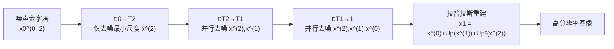

# LapFlow: Laplacian Multi-scale Flow Matching for Generative Modeling

**会议**: ICLR 2026  
**OpenReview**: [https://openreview.net/forum?id=kdrc4o6okz](https://openreview.net/forum?id=kdrc4o6okz)  
**代码**: [https://github.com/sjtuytc/gen](https://github.com/sjtuytc/gen)  
**领域**: 图像生成 / Flow Matching  
**关键词**: flow matching, Laplacian pyramid, multi-scale generation, mixture-of-transformers, causal attention  

## 一句话总结
LapFlow 把图像拆成拉普拉斯金字塔残差，用一个带因果注意力的混合 Transformer（MoT）并行生成所有尺度，免去了级联方法尺度间的重加噪桥接，在 CelebA-HQ / ImageNet 上以更少的 GFLOPs 和更快的推理拿到更优的 FID。

## 研究背景与动机
**领域现状**：扩散模型与 Flow Matching 已成为图像生成主流，但它们通常在全分辨率下一次性生成整张图，随着分辨率和内容复杂度上升，训练和推理的算力开销迅速膨胀，可扩展性成为现实瓶颈。

**现有痛点**：多尺度生成（从低分辨率到高分辨率逐级生成）本是缓解可扩展性的有力方向，但已有方案各有硬伤——级联扩散（Cascaded Diffusion）要为每个分辨率单独训练并维护一套网络，实现复杂；EdifyImage 在像素空间建模导致推理显著变慢；Pyramidal Flow 在视频微调上效果好，但需要在尺度之间做显式的"重加噪（renoising）"桥接来衔接相邻分辨率，且从头训练做图像生成的有效性缺乏充分验证。

**核心矛盾**：多尺度本应更省算力，但"尺度间需要单独模型或复杂桥接机制"这件事既增加了系统复杂度、又忽视了尺度之间天然的因果依赖（粗尺度结构应当指导细尺度细节），反而拖累了它相对单尺度 DiT 的竞争力。

**本文目标**：用**单一统一模型**并行建模所有尺度，去掉尺度间的桥接过程，同时把"粗到细"的因果关系显式编码进网络，既提质量又降算力。

**核心 idea**：**【拉普拉斯并行多尺度】** 把图像做拉普拉斯金字塔分解成多个残差，让一个 MoT 模型在不同时间区段内并行去噪所有尺度；**【因果注意力桥接】** 用块因果掩码强制信息只能从低分辨率流向高分辨率，用注意力本身替代显式重加噪桥接。

## 方法详解

### 整体框架
LapFlow 遵循"粗到细"的金字塔生成策略：先把干净图像 $x_1$ 经平均池化下采样和最近邻上采样分解成多个拉普拉斯残差（如三尺度 $x_1^{(2)}=\text{Down}(\text{Down}(x_1))$、$x_1^{(1)}=\text{Down}(x_1)-\text{Up}(x_1^{(2)})$、$x_1^{(0)}=x_1-\text{Up}(\text{Down}(x_1))$），训练时让一个统一的多尺度 DiT-MoT 模型在各自的时间区段内学习每个尺度的速度场，采样时按时间分段依次（但同段内并行）求解 ODE，最后通过 $x_1=x_1^{(0)}+\text{Up}(x_1^{(1)})+\text{Up}(\text{Up}(x_1^{(2)}))$ 重建全分辨率图。

### 关键设计
**1. 多尺度异速加噪：让不同尺度在不同时间区段内"各自成熟"。** 方法的出发点是粗尺度信息少、细尺度信息多，因此不该让所有尺度在整个 $[0,1]$ 上同速去噪。作者设两个临界时间点 $T_1,T_2$（$0=T_3<T_2<T_1<1$），约定第 $k$ 个尺度只在 $t\in[T_{k+1},1]$ 上被训练——越大的尺度（越高分辨率，$k$ 越小）训练时间区段越短。每个尺度的含噪样本是数据与噪声的加权和 $x_t^{(k)}=\alpha_t^{(k)}x_1^{(k)}+\sigma_t^{(k)}x_0^{(k)}$，线性路径取 $\alpha_t^{(k)}=\frac{t-T_{k+1}}{1-T_{k+1}},\ \sigma_t^{(k)}=1-t$。这样设计保证两条性质：在起点 $t=T_{k+1}$ 时 $\alpha=0$，该尺度只含纯噪声分量；在 $t=1$ 时收敛到干净的拉普拉斯残差。对应的速度目标 $u_t^{(k)}=\dot\alpha_t^{(k)}x_1^{(k)}+\dot\sigma_t^{(k)}x_0^{(k)}$ 就是各尺度回归学习的标的。

**2. 渐进式多阶段训练：按尺度贡献分配算力。** 训练时每步采样一个 stage $s\sim U\{0,1,2\}$，在该 stage 训练所有满足 $k\ge s$ 的尺度（即只训练当前及更小的尺度），随后从 $[T_{s+1},1]$ 采样时间 $t$。结果是最小尺度 $k=2$ 在整段 $[0,1]$ 都被训练，中尺度在 $[T_2,1]$，最大尺度只在 $[T_1,1]$。损失是各尺度速度回归的加权和 $L_{mv}=\sum_{k=s}^{2}w_k\,\mathbb{E}\,\lVert v_t^{(k)}-u_t^{(k)}\rVert^2$（实践中 $w_k=1$）。这种"低分辨率多训、高分辨率少训"的分配，正好把更多优化预算给了承载全局结构的粗尺度。

**3. 因果掩码的全局 MoT 注意力：用一个模型替代级联+桥接。** 网络是带 Mixture-of-Transformers 的多尺度 DiT：每个尺度先各自 Patchify 成 token、加正余弦位置编码，时间 $t$ 与标签 $y$ 作为额外 token 做 in-context 条件。在每个 MoT block 内，不同尺度走各自的 PreAttnMod（scale-shift）和**尺度专属的 QKV 投影** $Q^{(k)}=z^{(k)}W_Q^{(k)}$ 等，但注意力是把所有尺度的 QKV 拼起来做**全局**计算：$\text{Attn}=\text{Softmax}\!\big(\frac{QK^\top}{\sqrt d}+M_c\big)V$。关键在掩码 $M_c$ 是**块因果掩码**——尺度 $k$ 只能 attend 到不高于自己分辨率的尺度（$k'\ge k$），从而强制信息单向地由低分辨率流向高分辨率。正是这个因果注意力让"粗尺度指导细尺度"无需任何显式重加噪桥接，多个尺度可以在同一前向里并行生成。

**4. 多尺度并行采样：分段 ODE 接力。** 采样从一份最大尺度噪声得到的噪声金字塔出发，分三段调 `ODEINT`：先在 $[0,T_2]$ 只解最小尺度得到 $\hat x_{T_2}^{(2)}$；再在 $[T_2,T_1]$ 同时解中尺度和最小尺度（利用 $t=T_2$ 时中尺度恰为纯噪声 $\sigma_{T_2}^{(1)}x_0^{(1)}$ 这一性质做初值衔接）；最后在 $[T_1,1]$ 三尺度并行求解。各段内尺度并行、段间接力，既避免了级联模型的串行 renoise，又比单尺度全分辨率求解省算力。

## 实验关键数据

### 主实验表格（CelebA-HQ，DiT-L/2）

| 方法 | 分辨率 | 空间 | FID↓ | NFE | Time(s) | GFLOPs |
|------|--------|------|------|-----|---------|--------|
| LDM | 256 | Latent | 5.11 | 50 | 2.90 | 10.2 |
| LFM | 256 | Latent | 5.26 | 89 | 1.70 | 22.1 |
| Pyramidal Flow | 256 | Latent | 11.20 | 90 | 1.85 | 14.2 |
| EdifyImage | 256 | Image | 7.62 | 95 | 2.10 | 28.9 |
| **Ours** | 256 | Latent | **3.53** | 80 | 1.51 | 16.5 |
| LFM | 1024 | Latent | 8.12 | 100 | 4.20 | 154.8 |
| **Ours** | 1024 | Latent | **5.51** | 94 | 3.30 | 148.2 |

ImageNet 256（类条件）：DiT-XL/2 600K 步下 Ours FID 14.38（vs DiT 19.50 / LFM 28.37 / Pyramidal 17.10），且 GFLOPs 20.5 < 29.1；DiT-B/2 训到 7M 步 + CFG=1.5 时 Ours 4.12（vs LFM 4.46），推理 1.25s 更快。

### 消融实验表格（CelebA-HQ 256，FID-50K）

| 维度 | 设置与结果 |
|------|-----------|
| VAE (a) | LFM(EQVAE)=7.77 反而变差；Ours(SDVAE)=4.37 → **Ours(EQVAE)=3.53** |
| MoT (b) | Separate=3.60/38.9 GFLOPs → **MoT=3.53/16.5 GFLOPs**（算力减半） |
| 掩码 (c) | None=3.91 / Self=5.19 / **Causal=3.53** |
| 临界点 T (d) | 0.1=5.12 / 0.2=4.37 / **0.5=3.53** / 0.9=4.92 |
| 噪声调度 (f) | Ours(GVP)=4.10 / **Ours(Linear)=3.53** |
| 尺度数 (g) | 1(LFM)=5.26 / **2=3.53** / 3=3.59 / 4=5.12 |
| 建模空间 (h) | Ours(Image)=8.63 / **Ours(Latent)=3.53** |

### 关键发现
- **MoT 是"质量不降、算力砍半"的设计**：相比每尺度独立模型，MoT 把 GFLOPs 从 38.9 降到 16.5，FID 还略好（3.60→3.53）。
- **因果掩码不可替代**：去掉掩码（全局互看）或只看自己（Self）都明显劣于因果，验证"低→高分辨率单向信息流"是核心。
- **尺度数与分辨率强相关**：256 分辨率下两尺度最优（latent 仅 32×32，再加尺度会出现 8×8 的过小阶段无法提供可靠语义引导）；而 512/1024 的更大 latent 网格会从更多尺度层级中获益。
- **EQVAE 的等变正则只对多尺度方法有益**：它给跨尺度提供了等价表示，使 Ours 受益，但对单尺度 LFM 反而有害。

## 亮点与洞察
- **用注意力的因果掩码替代显式桥接**，是本文最优雅之处：把级联方法里笨重的"尺度间重加噪"工程问题，转化为一个网络内部的归纳偏置，既统一了模型又省了流程。
- **拉普拉斯残差 + 异速加噪**让"算力按尺度贡献分配"变得自然——粗尺度训练区段长、细尺度短，恰好对应各自承载的信息量。
- 论文还给出时间加权的复杂度分析，论证渐进式多尺度的有效注意力开销理论上低于全程全分辨率的 DiT，把效率优势从经验观察拔到理论层面。

## 局限与展望
- **尺度数需随分辨率手调**：最优尺度数和临界时间点 $T$ 都与 latent 网格大小强相关，缺乏自适应选择机制，换数据/分辨率需重新搜参。
- **高分辨率退回 SDVAE**：EQVAE 只在 256 训练，512/1024 只能用 SDVAE，意味着其跨尺度等变带来的增益在高分辨率上未必充分兑现。
- **评测域偏窄**：主要在 CelebA-HQ（人脸）和 ImageNet 上验证，文生图等更复杂条件生成、视频生成的有效性还需进一步检验。
- 与像素空间方法（如 Relay Diffusion FID 3.15）相比 FID 略逊，但作者强调那是 1221 vs 16.5 GFLOPs 的不同算力区间，属于不同 trade-off。

## 相关工作与启发
- **多尺度生成谱系**：从 LapGAN 的金字塔思想，到级联扩散、Relay Diffusion、Pyramidal Flow 的 renoise 桥接，再到 EdifyImage 的频率衰减——LapFlow 的贡献是用单模型 + 因果注意力一举消解"分模型/桥接"两条历史包袱。
- **与自回归生成的区别**：VAR/LlamaGen 等用因果建模做序列生成，受限于串行；LapFlow 借了因果掩码的思想，却用 ODE 并行采样，避开了自回归的并行化瓶颈。
- **对从业者的启发**：当一个系统因为"模块间需要显式衔接"而臃肿时，不妨想想能否把衔接关系编码成网络内部的注意力/掩码偏置，让单一模型隐式完成桥接——这在多模态、多分辨率任务里都可能适用。

## 评分
- **新颖性**: ⭐⭐⭐⭐ 拉普拉斯并行多尺度 + 因果掩码 MoT 的组合切中级联方法的真实痛点，把"显式桥接"转成"网络内归纳偏置"的视角很有启发，但各组件（金字塔、MoT、因果注意力、Flow Matching）多为既有技术的巧妙拼装。
- **实验充分度**: ⭐⭐⭐⭐ 两数据集、三分辨率、八组消融覆盖了 VAE/MoT/掩码/调度/尺度数/建模空间等关键设计，效率指标（NFE/Time/GFLOPs）齐全；但评测局限于人脸和类条件 ImageNet，缺文生图等更广验证。
- **写作质量**: ⭐⭐⭐⭐ 公式与算法（训练/采样伪代码）清晰，图 1/2 把生成流程和 MoT block 讲得明白，动机—方法—消融逻辑连贯。
- **价值**: ⭐⭐⭐⭐ 在保持/提升质量的同时实质降低推理算力并扩展到 1024×1024，对追求高分辨率高效生成的实践有直接参考价值。

<!-- RELATED:START -->

## 相关论文

- [\[ICLR 2026\] Mirror Flow Matching with Heavy-Tailed Priors for Generative Modeling on Convex Domains](mirror_flow_matching_with_heavy-tailed_priors_for_generative_modeling_on_convex_.md)
- [\[ICLR 2026\] Flow Along the $K$-Amplitude for Generative Modeling](flow_along_the_k-amplitude_for_generative_modeling.md)
- [\[ICLR 2026\] Gauge Flow Matching: Efficient Constrained Generative Modeling over General Convex Set and Beyond](gauge_flow_matching_efficient_constrained_generative_modeling_over_general_conve.md)
- [\[ICLR 2026\] Delay Flow Matching](delay_flow_matching.md)
- [\[ICLR 2026\] Partition Generative Modeling: Masked Modeling Without Masks](partition_generative_modeling_masked_modeling_without_masks.md)

<!-- RELATED:END -->
