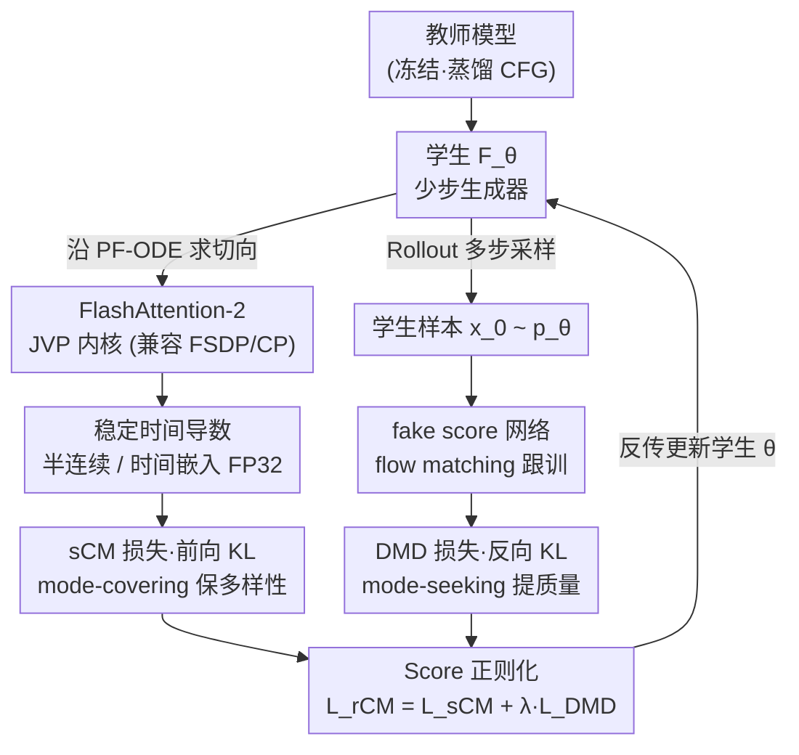

# Large Scale Diffusion Distillation via Score-Regularized Continuous-Time Consistency

**会议**: ICLR 2026  
**arXiv**: [2510.08431](https://arxiv.org/abs/2510.08431)  
**代码**: [项目页](https://research.nvidia.com/labs/dir/rcm)  
**领域**: 图像生成  
**关键词**: 连续时间一致性模型, Score蒸馏, 大规模蒸馏, JVP, 少步生成

## 一句话总结
提出 rCM（score-regularized continuous-time consistency model），首次将连续时间一致性蒸馏扩展到 14B 参数的文生图/视频模型，通过结合前向散度（一致性）和反向散度（score蒸馏），在保持多样性的同时匹配 DMD2 的质量，实现 15-50× 加速。

## 研究背景与动机
- sCM（连续时间一致性模型）理论优雅，但在大规模文生图/视频模型上的适用性不明——JVP 计算与 FlashAttention、并行训练不兼容
- sCM 在细节生成上存在质量问题（误差累积 + 前向散度的 mode-covering 特性导致质量扩散）
- Score/对抗蒸馏方法（如 DMD2）在质量上领先，但存在模态坍塌和多样性不足
- 前向散度（一致性模型）与反向散度（score蒸馏）具有互补性

## 方法详解

### 整体框架
rCM 要解决的问题是：让理论优雅的连续时间一致性蒸馏（sCM）真正在 14B 级文生图/视频模型上跑起来，并补上它在精细画质上的短板。整体怎么转——以冻结的教师模型为监督源，学生网络同时吃两路互补的监督信号：一路是 sCM 的前向 KL（mode-covering，负责覆盖全部模态、保住多样性），另一路是 DMD 的反向 KL（mode-seeking，负责把分布往高密度区收、锐化细节保质量），二者加权成统一的 rCM 目标。这两路都各有工程前提：sCM 路依赖一个能在大模型上算梯度的 JVP 内核加一套数值稳定化，DMD 路依赖把学生当前生成的样本喂给一个 fake score 网络来估反向 score。训练时两套网络交替更新——学生用组合后的 rCM 目标更新，fake score 网络则用 flow matching loss 在学生最新生成的数据上跟训。

### 关键设计

**1. FlashAttention-2 的 JVP 内核：让连续时间一致性能在大模型上算梯度**

sCM 的训练依赖雅可比向量积（JVP）来估计 teacher 沿概率流 ODE 的切向，但现成的 FlashAttention 只暴露前向输出、不返回 JVP，导致 sCM 在 10B 级模型上根本无法接入主流注意力实现与并行训练。作者用 Triton 写了一个把 JVP 计算直接嵌进 FlashAttention-2 前向传播的内核，自注意力和交叉注意力都覆盖，并且与 FSDP、Context Parallelism 兼容，从而把 JVP-based 的 sCM 训练首次撑到了 14B 参数规模——这是整套方法能落地的工程前提。

**2. Score 正则化：用反向 KL 的 DMD 项给前向 KL 的 sCM 补质量**

纯 sCM 的前向散度天然 mode-covering，叠加少步生成的误差累积后，在文字渲染等精细场景会出现明显质量缺陷。作者把 DMD loss 当作一个「长跳」正则器加到 sCM 上，得到组合目标 $\mathcal{L}_{\text{rCM}}(\theta) = \mathcal{L}_{\text{sCM}}(\theta) + \lambda \mathcal{L}_{\text{DMD}}(\theta)$。其中 sCM 提供 mode-covering 的多样性，DMD 的反向 KL 则 mode-seeking 地把分布往高密度区收以提升质量，两者方向互补。权重 $\lambda=0.01$ 在所有模型和任务上通用，无需逐任务调参，也省去了 GAN 式蒸馏的对抗调优。

**3. 稳定的时间导数计算：压住大模型 JVP 的数值不稳定**

大模型上直接算 JVP 的时间分量容易数值发散，作者给出两条可叠加的稳定化方案。一是半连续时间：空间部分仍走精确 JVP，时间方向改用步长 $\Delta t = 10^{-4}$ 的有限差分近似，避开最不稳定的那一项；二是高精度时间：对时间嵌入层强制 FP32 精度，防止低精度下时间导数被舍入误差吞掉。两招让 14B 规模下的 sCM 训练得以收敛。

**4. Rollout 多步采样：让学生既能一步也能多步，并稳定反传 DMD**

学生被训练成支持任意步采样，训练时随机抽步数 $N \in [1, N_{\max}]$ 做 rollout，只对最后一步反传 DMD loss，并用随机时间步保证整个 $[0,1]$ 时间范围都被覆盖到。这样单步与多步推理共享同一组参数，推理时可按质量/速度权衡自由选 NFE，而只回传末步梯度也避免了多步展开带来的显存和不稳定。

### 损失函数 / 训练策略
sCM 项采用切线归一化形式 $\mathcal{L}_{\text{sCM}} = \mathbb{E}\left[\left\|\mathbf{F}_\theta - \mathbf{F}_{\theta^-} - \frac{\mathbf{g}}{\|\mathbf{g}\|_2^2 + c}\right\|_2^2\right]$，其中 $\mathbf{F}_{\theta^-}$ 是 EMA 目标网络、$\mathbf{g}$ 为切向、$c$ 为数值稳定常数。DMD 项依据 fake score 网络与 teacher score 之间的差异把学生分布往真实分布拉，而 fake score 网络本身用 flow matching loss 在学生当前生成的数据上交替训练，二者互为依赖、轮流更新。

## 实验关键数据

### 主实验（GenEval T2I）

| 模型 | 参数 | NFE | Overall | Counting | Position |
|------|------|-----|---------|----------|----------|
| FLUX.1-dev | 12B | 50 | 0.66 | 0.74 | 0.22 |
| Cosmos-Predict2 14B (teacher) | 14B | 70 | 0.84 | 0.79 | 0.64 |
| Cosmos-Predict2 + DMD2 | 2B | 4 | 0.80 | 0.70 | 0.57 |
| **Cosmos-Predict2 + rCM** | **2B** | **4** | **0.81** | **0.73** | **0.58** |
| **Cosmos-Predict2 + rCM** | **14B** | **4** | **0.83** | **0.80** | **0.59** |
| **Cosmos-Predict2 + rCM** | **14B** | **1** | **0.82** | **0.84** | **0.49** |

### VBench 视频实验

| 模型 | 参数 | NFE | Total Score | Throughput(FPS) |
|------|------|-----|-------------|-----------------|
| Wan2.1 14B (teacher) | 14B | 100 | 83.58 | 0.18 |
| Wan2.1 + DMD2 | 1.3B | 4 | 84.56 | 14.6 |
| **Wan2.1 + rCM** | **1.3B** | **4** | **84.43** | **14.6** |
| **Wan2.1 + rCM** | **14B** | **2** | **85.05** | **8.3** |

### 关键发现
- rCM 在质量上匹配或超过 DMD2，同时在多样性上明显优于 DMD2（Figure 1 显示 DMD2 生成物体位置/姿态趋同）
- 14B rCM 4步 GenEval 0.83，接近 teacher 70步的 0.84
- 视频任务中 rCM 2步即可达到接近 teacher 的 VBench 分数
- $\lambda=0.01$ 在质量和多样性之间取得最佳平衡
- 纯 sCM 在文字渲染等精细场景存在明显质量缺陷，rCM 成功修复

## 亮点与洞察
- 首次将 JVP-based 连续时间一致性扩展到 14B 参数和 5 秒视频
- 从前向/反向散度互补性的角度理解蒸馏方法的统一框架
- 无需 GAN 调优或大量超参搜索，$\lambda=0.01$ 跨任务通用
- rCM 的多样性优势对交互式 world model 等需要多样响应的场景尤为重要

## 局限与展望
- 需要额外的 fake score 网络（内存开销）
- JVP 计算仍比标准前向传播慢，训练成本高
- 1步视频生成质量仍有明显下降（VBench 从 85.05 降至 83.02）
- 对 autoregressive video diffusion 的扩展仅有展望

## 相关工作与启发
- sCM 和 MeanFlow 提供了理论基础
- DMD/DMD2 提供了反向散度蒸馏的实践方案
- DDO 和 DDRL 的前向+反向散度联合思想是 rCM 的哲学基础
- 为大规模视觉生成模型的部署提供了实用加速方案

## 技术细节补充
- TrigFlow 噪声调度：$\alpha_t = \cos(t), \sigma_t = \sin(t)$，与 rectified flow 通过 SNR 匹配互转
- Fake score 网络用 flow matching loss 在学生生成数据上训练，交替优化
- Selective Activation Checkpointing (SAC) 用于减少内存消耗
- Teacher 使用 CFG，CFG 同时蒸馏到学生中
- 全参数微调（不用 LoRA），强调 rCM 的稳定性
- 实验涵盖 Cosmos-Predict2（0.6B/2B/14B T2I）和 Wan2.1（1.3B/14B T2V）
- Wan2.1 14B 2步加速达 8.3 FPS vs teacher 的 0.18 FPS（约 46× 加速）

## 评分
- 新颖性: ⭐⭐⭐⭐ 前向+反向散度结合的理论洞察有价值，但各组件已知
- 实验充分度: ⭐⭐⭐⭐⭐ 验证规模前所未有（14B参数、T2I+T2V、多步消融）
- 写作质量: ⭐⭐⭐⭐⭐ 理论分析清晰，工程细节详尽
- 价值: ⭐⭐⭐⭐⭐ 解决了大规模扩散模型加速的核心问题，实用性极强

<!-- RELATED:START -->

## 相关论文

- [\[ICCV 2025\] SANA-Sprint: One-Step Diffusion with Continuous-Time Consistency Distillation](../../ICCV2025/image_generation/sana-sprint_one-step_diffusion_with_continuous-time_consistency_distillation.md)
- [\[ICLR 2026\] Scale-wise Distillation of Diffusion Models](scale-wise_distillation_of_diffusion_models.md)
- [\[ICLR 2026\] FACM: Flow-Anchored Consistency Models](facm_flow-anchored_consistency_models.md)
- [\[ICLR 2026\] NextStep-1: Toward Autoregressive Image Generation with Continuous Tokens at Scale](nextstep-1_toward_autoregressive_image_generation_with_continuous_tokens_at_scal.md)
- [\[ICLR 2026\] Motion Prior Distillation in Time Reversal Sampling for Generative Inbetweening](motion_prior_distillation_in_time_reversal_sampling_for_generative_inbetweening.md)

<!-- RELATED:END -->
