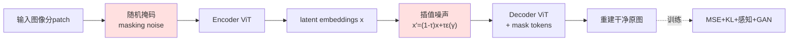

# Latent Denoising Makes Good Tokenizers

**会议**: ICLR 2026  
**OpenReview**: [https://openreview.net/forum?id=1jBsi98fVe](https://openreview.net/forum?id=1jBsi98fVe)  
**代码**: [https://github.com/Jiawei-Yang/DeTok](https://github.com/Jiawei-Yang/DeTok)  
**领域**: 图像生成 / 视觉 Tokenizer  
**关键词**: visual tokenizer, latent denoising, generative modeling, diffusion, autoregressive  

## 一句话总结
本文指出现代生成模型本质上都在做"从破坏中重建"（denoising），据此提出 l-DeTok：在 tokenizer 训练时给 latent 注入插值噪声和随机掩码、再让 decoder 从重度破坏的 latent 重建原图，使 tokenizer 产出的 latent 天然对齐下游去噪目标，在六种生成模型上一致提升生成质量且无需任何语义蒸馏。

## 研究背景与动机
- **领域现状**：现代视觉生成模型（扩散、流匹配、自回归）普遍不在像素空间建模，而是先用 tokenizer（通常是 VAE）把图像压成紧凑 latent，再在 latent 上生成。但 tokenizer 的设计长期落后于生成模型架构的快速演进。
- **现有痛点**：主流 tokenizer 只优化"像素重建 + KL 正则"，没人说清楚"到底什么性质的 latent 才对生成更友好"。近期有工作靠从 DINOv2/CLIP 等大规模预训练视觉编码器**蒸馏语义**来改善 latent，但这在很多模态（视频、音频、3D/4D）里根本没有现成的强编码器可蒸馏，依赖性太强。
- **核心矛盾**：tokenizer 的训练目标（像素重建）与下游生成模型的训练目标（从噪声/掩码中恢复信号）是**割裂**的——tokenizer 只管把图压好压满，并不在乎产出的 latent 在被噪声严重破坏后还能不能恢复，而后者恰恰是生成模型每一步都要做的事。
- **本文目标**：找到一个对生成普适、且不依赖外部预训练编码器的 tokenizer 设计原则。
- **核心 idea**：**统一去噪视角** —— 作者观察到扩散模型在去高斯噪声、自回归模型在补"掩码噪声"，二者都是"从被破坏的信号里重建原信号"。既然下游全在去噪，那就**让 tokenizer 训练时也去噪**：直接在 latent 上注入强破坏并要求重建，逼出"即使被重度破坏也能还原"的鲁棒 latent，从而与下游去噪目标天然对齐。

## 方法详解

### 整体框架
l-DeTok 沿用 ViT 的 encoder-decoder 自编码器结构，但在训练时对 latent 施加两路互补的"破坏"——插值高斯噪声与随机掩码——再让 decoder 从被破坏的 latent 重建出干净的原图（像素空间）。推理（即真正当作 tokenizer 用）时两路破坏全部关闭。换句话说，它把 tokenizer 从"标准自编码器"改造成"latent 去噪自编码器"，让重建任务本身变难，逼出鲁棒、易去噪的 latent。

### 关键设计

**1. 插值噪声破坏（Interpolative latent noise）：用插值而非加法保证"真破坏"。** 这是全文最核心的设计。给定 encoder 产出的 latent $x$，不是按标准 VAE 那样做加法 $x' = x + \tau\varepsilon$，而是把 latent 与高斯噪声做**插值**：$x' = (1-\tau)x + \tau\varepsilon(\gamma)$，其中 $\varepsilon(\gamma)\sim\gamma\cdot\mathcal{N}(0,I)$，噪声水平 $\tau\sim\mathcal{U}(0,1)$，$\gamma$ 控制噪声标准差。两者的关键区别在于：加法噪声在 $\tau$ 较大时原始信号仍可能占主导，给模型留下"绕过噪声直接读原信号"的捷径，破坏不彻底；而插值噪声在 $\tau\to1$ 时原始信号被完全压没、彻底变成纯噪声，确保 latent 能被**重度**破坏。再加上 $\tau$ 随机采样，让 latent 对各种破坏强度都保持鲁棒。实验证实插值噪声在 SiT 和 MAR 上都明显优于加法噪声，且整体而言**噪声越强、下游生成越好**（$\gamma$ 在 3.0 附近最佳），印证了"越难的去噪任务越能逼出对齐下游的好 latent"这一核心假设。

**2. 掩码破坏（Masking as deconstruction）：把 MAE 式掩码当成另一种 latent 破坏。** 作者把"统一去噪视角"进一步推广——掩码也是一种破坏。借鉴 MAE 随机掩掉一部分图像 patch，但与 MAE 固定掩码率不同，这里掩码率 $m$ 用一个略偏向 0 的均匀分布采样：$m = \max(0, \mathcal{U}(-0.1, M))$。把下界设到 $-0.1$ 再截断到 0，是为了让"训练时偶尔不掩码"，缩小训练（有掩码）与推理（无掩码）之间的分布差距。encoder 只看可见 patch，被掩位置在 decoder 端用共享可学习的 `[MASK]` token 补上。消融显示掩码率在 70%–90% 的重掩码区间最好，且随机掩码率一致优于固定掩码率——再次呼应"破坏越难越好、且要覆盖多种破坏强度"的规律。不过掩码是**可选**项：latent 噪声是必需的主力，掩码只是锦上添花。

**3. 联合去噪与标准重建损失（Joint denoising + 重建目标）：两路破坏叠加、损失不变。** 把插值噪声（$\gamma=3.0$）和掩码（$M=0.7$）同时开启即"联合去噪"。训练目标完全沿用业界成熟配方，未引入任何额外损失：$L_{\text{total}} = L_{\text{MSE}} + \lambda_{\text{KL}}L_{\text{KL}} + \lambda_{\text{percep}}L_{\text{percep}} + \lambda_{\text{GAN}}L_{\text{GAN}}$（默认 $\lambda_{\text{KL}}=10^{-6}$、$\lambda_{\text{percep}}=1.0$、$\lambda_{\text{GAN}}=0.1$，GAN 在训练中途才开启）。也就是说 l-DeTok 的全部"魔法"都在输入端的两路破坏上，损失函数和架构都不动——这正是它"simple yet effective"、且可无缝套到现有 tokenizer 训练流程的原因。实验上联合去噪对 MAR 提升更明显，对 SiT 在已有 latent 噪声时增益有限，佐证了"latent 去噪必需、掩码可选"。

## 实验关键数据

### 主实验：跨 tokenizer 的泛化对比（ImageNet 256×256，base 模型 100 epoch，最优 CFG）

| Tokenizer | rFID↓ | MAR FID↓ | RandomAR FID↓ | RasterAR FID↓ | SiT FID↓ | DiT FID↓ | Light.DiT FID↓ |
|---|---|---|---|---|---|---|---|
| **无语义蒸馏** | | | | | | | |
| SD-VAE | 0.61 | 4.64 | 13.11 | 8.26 | 7.66 | 8.33 | 4.24 |
| MAR-VAE（最强 baseline） | 0.53 | 3.71 | 11.78 | 7.99 | 6.26 | 8.20 | 3.98 |
| **Our l-DeTok** | 0.68 | **2.43** | **5.22** | **4.46** | **5.13** | 6.58 | 3.63 |
| **有语义蒸馏** | | | | | | | |
| VA-VAE | 0.28 | 16.66 | 38.13 | 15.88 | 4.33 | 4.91 | 2.86 |
| MAETok | 0.48 | 6.99 | 24.83 | 15.92 | 4.77 | 5.24 | 3.92 |
| **Our l-DeTok + Distill** | 0.85 | **2.52** | **5.57** | **11.99** | **3.40** | **3.91** | **2.18** |

关键观察：现有语义蒸馏 tokenizer（VA-VAE/MAETok）在非自回归模型上很强，但在自回归模型上**严重崩溃**（MAR FID 16.66/6.99，远差于 l-DeTok 的 2.43）——揭示了"一个范式上的 tokenizer 增益未必迁移到另一范式"这一此前被忽视的鸿沟。

### 消融：破坏策略的拆解（FID@50k，含 CFG）

| Setup | MAR-B FID↓ | MAR-B IS↑ | SiT-B FID↓ | SiT-B IS↑ |
|---|---|---|---|---|
| Baseline（无噪声） | 3.31 | 247.6 | 6.97 | 181.6 |
| Masking only | 2.90 | 243.0 | 6.43 | 189.2 |
| Latent noise only | 2.77 | 249.0 | 5.56 | 193.5 |
| Joint noise | 2.65 | 263.0 | 5.50 | 195.1 |
| +Extended（大 encoder/200ep/GAN） | **2.43** | 266.5 | **5.13** | 207.4 |

噪声水平采样消融（$\gamma=3.0$）：$\tau=0$ 基线 MAR-B 3.31；$\tau\sim\mathcal{U}(0,1)$ 默认 2.77；把概率质量偏向高噪声 $\text{logit}(\tau)\sim\mathcal{N}(0.8,1)$ 最佳 2.58。

### 系统级对比（ImageNet 256×256，MAR 训 800 epoch）
- MAR-B：仅换 l-DeTok，FID 从 2.31 → **1.55**（追平原版 huge 尺寸 MAR）。
- MAR-L：FID 从 1.78 → **1.35**，且**无需任何语义蒸馏**即跻身领先系统。
- 可扩展性（100 epoch）：SiT-B/L/XL 与 MAR-B/L 在所有尺寸上一致提升（如 SiT-XL 4.47→3.14，MAR-L 2.44→2.08）。

### 关键发现
- **更强的破坏 → 更好的生成**：无论是噪声标准差 $\gamma$ 还是掩码率，都偏好"重度破坏"，证实"难的去噪任务逼出好 latent"。
- **latent 噪声是主力、掩码可选**；插值噪声显著优于加法噪声。
- l-DeTok 与架构无关：在 CNN-based tokenizer 上同样有效（MAR-B 3.32→2.82，SiT-B 7.11→5.62）。

## 亮点与洞察
- **概念统一漂亮**：把扩散的"去高斯噪声"和自回归的"补掩码"统一成 denoising，再据此让 tokenizer 训练对齐下游，是一个简洁且解释力强的视角。
- **极简、即插即用**：不改架构、不加新损失，只在输入端加两路破坏，就能套进任意现有 tokenizer 训练流程。
- **戳破一个隐含假设**：首次系统揭示"tokenizer 在非自回归模型上的增益未必迁移到自回归模型"，并提供跨六种生成模型的统一评测，对社区评测惯例（只在 DiT/SiT 上测）是有力提醒。
- **摆脱外部依赖**：不靠 DINOv2/CLIP 蒸馏即达到领先，对视频/音频/3D 等缺乏强预训练编码器的模态尤其有价值。

## 局限与展望
- **仅在图像上验证**：作者反复强调对视频/音频/3D 的潜力，但论文本身只在 ImageNet/MS-COCO 图像上做了实验，跨模态迁移尚待证明。
- **掩码增益有限**：联合去噪对 SiT 几乎无额外收益，掩码路在已有 latent 噪声时价值不大，两路破坏的协同还不够充分。
- **噪声配置仍需调参**：$\gamma$、$M$、$\tau$ 分布都需按下游模型微调，缺乏自适应或理论指导的最优破坏强度。
- **与语义蒸馏的关系微妙**：加蒸馏后非自回归模型最佳，但自回归模型反而可能略降，说明"去噪对齐"与"语义对齐"两条路如何融合还没理清。

## 相关工作与启发
- **生成范式**：统一了扩散/流匹配（非自回归，去高斯噪声 $X_t=a(t)X_0+b(t)\varepsilon_t$）与自回归（从部分可见/掩码上下文重建序列）两大框架的训练目标。
- **表示学习**：思路上承接 MAE（掩码重建）、对比/自蒸馏等"用 pretext 任务对齐下游"的传统，把这一原则首次系统地用到 tokenizer 设计。
- **同期 tokenizer 工作**：与靠语义蒸馏的 VA-VAE/MAETok 形成对照；与 ε-VAE（用扩散 decoder 替代确定性 decoder）和残差向量量化 token 互补。
- **启发**：当下游任务的本质（去噪）能被显式注入上游表示学习时，表示与任务的对齐能带来"免费"的大幅提升——这一"下游对齐"原则可能推广到更多"上游编码器 + 下游生成"的两段式系统。

## 评分
- **新颖性**: ⭐⭐⭐⭐ — "统一去噪视角"和"插值噪声破坏 latent"都很有洞见，虽单个组件（MAE 掩码、去噪自编码器）不新，但组合与定位（对齐下游、不依赖蒸馏）是新的。
- **实验充分度**: ⭐⭐⭐⭐⭐ — 六种生成模型 × 多尺寸 × CNN/ViT × 多数据集 × 细致消融（噪声类型/强度/分布/掩码率），泛化性论证扎实。
- **写作质量**: ⭐⭐⭐⭐ — 动机递进清晰、图表完整、核心假设反复印证，可读性高。
- **价值**: ⭐⭐⭐⭐ — 提供了一条简单、普适、不依赖外部预训练的 tokenizer 改进路径，对生成建模社区实用价值高，且揭示了跨范式不迁移这一重要现象。

<!-- RELATED:START -->

## 相关论文

- [\[CVPR 2026\] VFM-VAE: Vision Foundation Models Can Be Good Tokenizers for Latent Diffusion Models](../../CVPR2026/image_generation/vfm-vae_vision_foundation_models_can_be_good_tokenizers_for_latent_diffusion_mod.md)
- [\[ICLR 2026\] DeRaDiff: Denoising Time Realignment of Diffusion Models](deradiff_denoising_time_realignment_of_diffusion_models.md)
- [\[ICLR 2026\] Mitigating Noise Shift in Denoising Generative Models with Noise Awareness Guidance](mitigating_noise_shift_in_denoising_generative_models_with_noise_awareness_guida.md)
- [\[ICLR 2026\] LVTINO: LAtent Video consisTency INverse sOlver for High Definition Video Restoration](lvtino_latent_video_consistency_inverse_solver_for_high_definition_video_restora.md)
- [\[ICLR 2026\] Asynchronous Denoising Diffusion Models for Aligning Text-to-Image Generation](asynchronous_denoising_diffusion_models_for_aligning_text-to-image_generation.md)

<!-- RELATED:END -->
