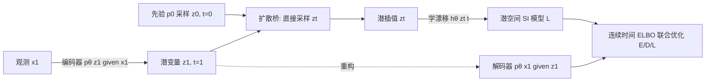

# Latent Stochastic Interpolants

**会议**: ICLR 2026  
**OpenReview**: [https://openreview.net/forum?id=txiGUfI4yF](https://openreview.net/forum?id=txiGUfI4yF)  
**代码**: 待确认  
**领域**: 图像生成 / 生成模型  
**关键词**: Stochastic Interpolants, 潜空间生成, 连续时间 ELBO, 扩散桥, 联合训练  

## 一句话总结
本文提出 **Latent Stochastic Interpolants (LSI)**，用连续时间推导的单一 ELBO 目标，把 Stochastic Interpolants 框架第一次搬进端到端联合训练的潜空间，让编码器、解码器和潜空间 SI 生成模型一起优化，在 ImageNet 上以更省 FLOPs 的采样达到与像素空间 SI 相当的 FID。

## 研究背景与动机
- **领域现状**：Stochastic Interpolants（SI）是扩散类生成的统一框架，能在任意两个分布之间灵活搭桥（不局限于高斯先验），通过构造插值 $x_t=(1-t)x_0+tx_1+\sqrt{t(1-t)}\,\epsilon$ 学习速度场与 score，再用无仿真（simulation-free）目标高效训练。
- **现有痛点**：SI 要求先验 $p_0$ 和目标 $p_1$ 都是**固定且样本可直接观测**的。这把它锁死在观测空间——一旦想在低维潜空间里学生成模型，目标分布是编码器定义的聚合后验 $p_1(z_1)=\int p_\theta(z_1|x_1)\,dx_1$，它随编码器/解码器同步演化、不可观测，无法直接构造满足 SI 边际约束的潜空间插值。
- **核心矛盾**：直接在高维观测空间跑 SI 计算昂贵；而想省算力搬到潜空间，又因为后验分布是"动态、不可观测"的而失去了 SI 的可用性。已有潜变量扩散往往退回简单高斯先验或依赖 ad-hoc 的多阶段训练（先训 autoencoder 再训生成器），潜表示与生成过程未必对齐。
- **本文目标**：在一个**连续时间潜空间**里端到端联合学编码器、解码器和 SI 生成模型，既保留 SI 任意先验的灵活性与无仿真训练，又拿到低维潜空间的效率红利。
- **核心 idea**：**【从 ELBO 反推插值，而非从插值正推】** 不再像 SI 那样先定义插值再求速度场，而是把潜变量看作服从 SDE 的连续时间动态变量，写出连续时间 ELBO；用**扩散桥 (Doob h-transform)** 构造可无仿真直接采样的变分后验，由此自然导出潜空间的随机插值 $z_t$，最终得到一个统一目标。

## 方法详解

### 整体框架
LSI 把生成建模为：先验 $z_0\sim p_0$ → 潜空间 SDE 漂移 $h_\theta$ 演化到 $z_1$ → 解码器 $p_\theta(x_1|z_1)$ 出图。训练侧需要后验 $p_\theta(z_t|x_1)$ 的采样，作者用"编码器给 $z_1$ + 扩散桥连接 $z_0$ 与 $z_1$"构造变分后验，并在线性 SDE 假设下让 $z_t$ 可无仿真直接采样，三个组件（E/D/L）由单一 ELBO 联合优化。

### 关键设计

**1. 连续时间 ELBO：把潜空间生成变成路径测度的 KL 控制**　方法的根基是为"连续时间动态潜变量"模型写出的证据下界。给定模型路径测度 $P_\theta$（漂移 $h_\theta$）和变分后验路径测度 $Q$（漂移 $h_\phi$、共享扩散系数 $\sigma$），ELBO 写成 $\ln p_\theta(x_1)\ge \mathbb{E}_Q[\ln p_\theta(x_1|z_1)] - \mathrm{KL}(Q\|P_\theta)$，其中 KL 项化为路径积分 $\tfrac12\int_0^T\|u(z_t,t)\|^2dt$，而 $u$ 满足 $\sigma u = h_\phi - h_\theta$。这一项把"变分动态"和"模型动态"的失配惩罚成一个可微目标，第一项则是 VAE 式的重构。正是这个连续时间形式让任意先验、likelihood 控制和无仿真训练得以共存。

**2. 扩散桥构造无仿真变分后验：绕开 SDE 数值模拟**　难点在于 ELBO 需要对 $z_t\sim p_\theta(z_t|x_1)$ 采样，若用任意 $h_\phi$ 模拟 SDE，每步训练都要数值积分、代价巨大。作者改为显式构造漂移：编码器先给出 $z_1\sim p_\theta(z_1|x_1)$，再用 Doob h-transform 的扩散桥 $dz_t=[h_\phi+\sigma\sigma^\top\nabla_{z_t}\ln p(z_1|z_t)]dt+\sigma dw_t$ 把先验 $p_0(z_0)$ 与聚合后验在 $t=1$ 端点对接。进一步**假设线性 SDE** $dz_t=h_t z_t dt+\sigma_t dw_t$，其转移密度是高斯，于是 $\nabla_{z_t}\ln p(z_1|z_t)$ 有闭式，桥的条件密度 $p(z_t|z_1,z_0)$ 也是高斯——$z_t$ 可在给定 $z_0,z_1$ 时**一步直接采样**，恢复观测空间扩散那样的无仿真效率。

**3. 潜空间随机插值：从高斯桥重参数化出 $z_t$**　利用上面的高斯桥，$z_t$ 被重参数化为 $z_t=\eta_t\epsilon+\kappa_t z_1+\nu_t z_0,\ \epsilon\sim\mathcal{N}(0,I)$，其中系数满足端点约束 $\kappa_0=\nu_1=0,\ \kappa_1=\nu_0=1,\ \eta_0=\eta_1=0$。这正是 SI 插值的潜空间版本——但作者是**反过来选 $\kappa_t,\nu_t$ 再反推 $h_t,\sigma_t$**。取 $\kappa_t=t,\nu_t=1-t$ 得到常数扩散 $\sigma_t=\sigma$，插值化简为 $z_t=\sigma\sqrt{t(1-t)}\,\epsilon+t z_1+(1-t)z_0$；若先验取标准高斯还能进一步简化。当编码器/解码器取恒等映射时，LSI 精确退化为观测空间 SI——把 $z$ 换成 $x$、去掉重构项即可，体现了框架的统一性。

**4. InterpFlow 参数化稳住训练方差**　把 $u(z_t,t)$ 代回 ELBO 得到的朴素损失里含有 $\sqrt{1-t}$ 在分母，导致梯度方差爆炸、训练不稳。作者改用 **InterpFlow** 参数化 $\tfrac{\beta_t}{2}\big\|-\sigma\sqrt{t}\,\epsilon+\sqrt{1-t}(z_1-z_0)+\sqrt{t}\,z_t-\hat h_\theta(z_t,t)\big\|^2$，并用变量替换 $t(s)=1-(1-s)^c$ 把时间权重 $\beta_t=\beta/(1-t)$ 折成常数 $\beta$（经验上 $c=1$ 即均匀采样最好）。权重 $\beta$ 扮演 $\beta$-VAE 式的折中：$\beta\to0$ 等价于固定预训练 autoencoder（只管重构），$\beta$ 越大编码器越为生成目标调整表示——这是"联合训练是否有益"的可调旋钮。采样侧则借 Singh & Fischer (2024) 的等价 SDE 族 $dz_t=[h_\theta-\tfrac{(1-\gamma_t^2)\sigma^2}{2}\nabla\ln p_t]dt+\gamma_t\sigma dw_t$，可在不重训的情况下用 $\gamma_t$ 自由调随机性（$\gamma_t=0$ 即概率流 ODE 确定性采样），并支持 CFG 引导。

## 实验关键数据

### 主实验表格
ImageNet 类条件生成，FID @ 2000 epochs，对比潜空间 LSI 与观测空间 SI（参数量 M / 单次前向 FLOPs G，E/D/L 分别为编码器/解码器/潜模型）：

| 分辨率 | FID 潜空间 | FID 观测空间 | 参数 潜空间(E/D/L) | 参数 观测 | FLOPs 潜(E/D/L) | FLOPs 观测 |
|---|---|---|---|---|---|---|
| 64×64 | 2.62 | 2.57 | 392 (5/5/382) | 398 | 15/15/161 | 201 |
| 128×128 | **3.12** | 3.46 | 392 (5/5/382) | 400 | 59/59/327 | 466 |
| 256×256 | 3.91 | 3.87 | 393 (5/5/383) | 405 | 240/240/450 | 1288 |

LSI 在各分辨率上 FID 与观测空间 SI 持平（128×128 反超）。关键在采样省算力：编码器采样时不用、解码器只跑一次、潜模型每步都跑，因此**多步采样下 FLOP 节省累积**——100 步采样在 128×128 省 **73.6%** FLOPs，256×256 省 **48.6%**。

### 消融实验表格
**容量迁移（128×128）**：把潜模型 L 的前/后 $k$ 个卷积块挪给编码器/解码器，总参数基本不变但采样 FLOPs 显著下降，对比联合训练 ($\beta>0$) 与独立训练 ($\beta\to0$)：

| k | FID ($\beta>0$) | FID ($\beta\to0$) | 参数(E/D/L) | FLOPs(E/D/L) |
|---|---|---|---|---|
| 0 | **3.76** | 4.31 | 392 (5/5/382) | 59/59/327 |
| 3 | 3.91 | 4.55 | 389 (9/8/372) | 68/66/313 |
| 6 | 3.96 | 4.87 | 387 (13/12/362) | 75/73/299 |
| 9 | 4.61 | 4.98 | 383 (16/16/351) | 82/80/284 |

从 $k=0$ 到 $k=6$ 采样 FLOPs 降 8.5%，联合训练始终更优且 FID 退化更慢。

### 关键发现
- **联合训练确有增益**：$\beta\to0$ 时 FID 4.53 → $\beta=0.0001$ 时 3.75（约 **17%** 提升），编码器为生成目标调整潜表示是有效的；$\beta$ 过大则重构 PSNR 崩坏反拖累 FID，存在最优折中。
- **编码器噪声尺度 $c$ 重要**：确定性编码器 ($c=0$) 最差，FID 随 $c$ 先升后降；固定 $c$ 反而优于学习 $c$。
- **统一性**：恒等编解码器下 LSI 精确退化为观测空间 SI，验证框架是 SI 的严格推广。

## 亮点与洞察
- **视角反转**：SI 是"先定插值、再解速度场"，LSI 是"先写 ELBO、用扩散桥反推插值"——这一换序正是把 SI 搬进不可观测动态潜空间的关键，也顺带给出 likelihood 控制。
- **单目标统一**：编码器、解码器、潜生成模型由一个连续时间 ELBO 端到端联合优化，替代了"先训 autoencoder 再训扩散"的多阶段拼接，潜表示与生成过程天然对齐。
- **采样效率来自结构而非压缩技巧**：把重复跑的算力集中到轻量潜模型 L、编码器采样时完全不用，使节省随采样步数线性累积，对多步采样器特别友好。
- **$\beta$ 作为可解释旋钮**：把"用预训练 autoencoder vs 联合适配表示"放在一条连续谱上，给实践者明确的调参直觉。

## 局限与展望
- **线性 SDE 假设**：无仿真采样依赖 $h_\phi(z_t,t)=h_t z_t$ 的线性+加性噪声假设，虽作者称不限制经验表现，但理论上限制了变分后验的表达能力。
- **仅单观测时刻**：ELBO 支持任意多观测 $x_{t_i}$，但实验只用 $t=1$ 单观测，时序/序列数据上的潜力未验证。
- **评测面较窄**：只在 ImageNet 类条件生成上做，未覆盖文生图、超分、视频等更广任务；与最新潜扩散 SOTA 的横向比较放在附录、正文以"on par"为主。
- **方差/参数化敏感**：朴素 ELBO 损失方差大，需 InterpFlow 参数化 + 时间变量替换才稳，超参（$\beta,c$）需细调。
- **展望**：把 LSI 推广到多观测时序、可学习/更复杂先验，以及与 VP 插值（文中推导但未实验）结合是自然方向。

## 相关工作与启发
- **Stochastic Interpolants (Albergo et al., 2023)**：直接前身，LSI 是其潜空间联合训练版的推广。
- **连续时间 ELBO / latent SDE (Li et al., 2020; Theodorou, 2015)**：提供动态潜变量的下界形式。
- **扩散桥 / Doob h-transform**：构造无仿真后验采样的核心工具。
- **潜扩散 (Latent Diffusion)**：同样在潜空间生成，但通常两阶段训练且先验简单；LSI 用单 ELBO 端到端、支持任意先验。
- **Singh & Fischer (2024)**：提供等价 SDE 族与 score 计算，支撑可调随机性采样器与 CFG。
- **启发**：当目标分布不可观测/随训练演化时，"从变分下界反推插值/前向过程"是一条比"硬造固定插值"更通用的路径，可迁移到其他需要联合学习表示与生成过程的场景。

## 评分
- **新颖性**: ⭐⭐⭐⭐⭐ — 首次把 SI 框架在连续时间 ELBO 下推进可联合训练的潜空间，视角反转（从 ELBO 反推插值）有理论深度且统一了观测空间 SI。
- **实验充分度**: ⭐⭐⭐⭐ — ImageNet 多分辨率主实验 + 容量迁移/β/噪声尺度等消融扎实，量化了 FLOPs 节省与联合训练增益；但任务面偏窄、SOTA 横比偏附录。
- **写作质量**: ⭐⭐⭐⭐ — 推导严谨、动机清晰，从 SI 局限到 ELBO 到插值的逻辑链完整；公式密集，对读者门槛较高。
- **价值**: ⭐⭐⭐⭐ — 给"潜空间 + 任意先验 + 端到端"生成提供了原则性框架，采样省 FLOPs 对部署有实际意义，是 SI/潜扩散方向的有用基座。

<!-- RELATED:START -->

## 相关论文

- [\[NeurIPS 2025\] BoltzNCE: Learning Likelihoods for Boltzmann Generation with Stochastic Interpolants](../../NeurIPS2025/image_generation/boltznce_learning_likelihoods_for_boltzmann_generation_with_stochastic_interpola.md)
- [\[ICLR 2026\] SESaMo: Symmetry-Enforcing Stochastic Modulation for Normalizing Flows](sesamo_symmetry-enforcing_stochastic_modulation_for_normalizing_flows.md)
- [\[ICLR 2026\] Latent Denoising Makes Good Tokenizers](latent_denoising_makes_good_tokenizers.md)
- [\[ICLR 2026\] Latent Diffusion Model without Variational Autoencoder](latent_diffusion_model_without_variational_autoencoder.md)
- [\[ICLR 2026\] Stochastic Self-Guidance for Training-Free Enhancement of Diffusion Models](stochastic_self-guidance_for_training-free_enhancement_of_diffusion_models.md)

<!-- RELATED:END -->
