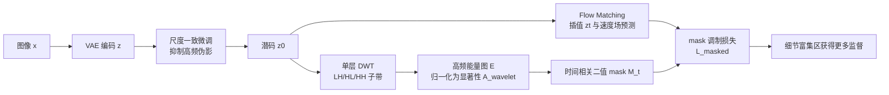

# Latent Wavelet Diffusion for Ultra-High-Resolution Image Synthesis

**会议**: ICLR 2026  
**OpenReview**: [https://openreview.net/forum?id=5og80LMVxG](https://openreview.net/forum?id=5og80LMVxG)  
**代码**: [https://github.com/LuigiSigillo/LatentWaveletDiffusion](https://github.com/LuigiSigillo/LatentWaveletDiffusion)  
**领域**: 图像生成 / 超高分辨率扩散模型  
**关键词**: 超高分辨率合成, 潜空间扩散, 小波能量图, 频率感知监督, Flow Matching, VAE 微调  

## 一句话总结
LWD 用小波能量图从潜空间信号中提取"细节富集区"的空间显著性，再用时间相关的二值 mask 把训练损失集中到高频区域，配合一个尺度一致的 VAE 微调，实现了 2K–4K 超高清生成质量提升——不改架构、推理零额外开销。

## 研究背景与动机
**领域现状**：潜空间扩散模型（LDM）和 Diffusion Transformer（DiT）/ Flow Matching 把生成搬到压缩潜空间，已经是图像合成的主流范式。但要把在低分辨率上训练的模型直接放大到 2K–4K（UHR），普遍会出现结构重复、纹理模糊、空间不一致等问题。

**现有痛点**：把分辨率拉高的几条路都不理想——直接做 UHR 训练/微调要海量算力和私有高清数据集；级联生成与后处理超分往往把输出"磨平"，丢掉精细纹理；改架构增强长程依赖又会引入性能折衷。

**核心矛盾**：几乎所有方法都**对所有空间位置一视同仁**地施加同样的细化过程，无视局部频率差异。后果是双输：平滑区域浪费算力，而真正富含纹理/边缘/语义结构的高频区域监督不足，导致伪影或细节丢失。问题根源既在架构（潜表征缺乏 UHR 所需的结构粒度），也在算法（去噪目标没把空间自适应性纳入进来）。

**本文目标**：在不改底层架构、不增加推理成本的前提下，把"学习信号"更多地分配给视觉复杂度高的区域，少分配给低细节区域。

**核心 idea**：**信号驱动的空间自适应监督**——用小波变换从潜空间直接读出局部高频能量作为显著性图，再据此调制训练损失的时空分配；它不学习、可解释、零推理开销，且对扩散/Flow Matching 模型族通用。

## 方法详解

### 整体框架
LWD 分两个串行阶段。**阶段一**先用尺度一致损失微调 VAE，把潜空间"塑形"成频谱稳定、压缩伪影被抑制的形态，为下游小波分析打好底子。**阶段二**在这个干净潜空间上微调扩散模型（如 Flux/SD3/Sana），用三件紧耦合的组件改造 Flow Matching 目标：先对潜码做小波变换抽取空间显著性图，再据此构造时间相关 mask，最后用 mask 调制损失，把学习资源动态导向细节富集区。所有组件都是模型无关、纯目标层面的改动。

### 关键设计

**1. 尺度一致的 VAE 微调：先把潜空间"洗干净"再做频率分析。** UHR 生成对潜空间有特殊要求——既要保语义结构，又要跨尺度保持频谱一致。作者用多分辨率重建目标微调 VAE，损失由四项组成：重建项 $\|D(z)-x\|_2^2$、尺度一致项 $\alpha\|D(E(z_{down}))-x_{down}\|_2^2$、KL 正则项 $\beta D_{KL}(q(z|x)\|p(z))$ 和感知损失 $\lambda L_{LPIPS}(D(z),x)$。其中尺度一致项是关键：标准 VAE 会在潜空间里产生虚假高频噪声，这些噪声会干扰后续的小波 masking——如果不先抑制，mask 就会去关注"噪声"而不是"细节"。这一步把信号正则化与生成解耦：先雕刻潜空间的频率属性，再用这个结构去指导扩散训练，从而保留架构模块化。频域分析（图 3）显示微调后（+SE）潜谱与真实 RGB 谱对齐，高频伪影被压制。

**2. 小波派生的频率显著性图：从信号里直接读出"哪里有细节"。** 给定潜张量 $z\in\mathbb{R}^{C\times H\times W}$，做单层离散小波变换 $\text{DWT}(z)\to\{z_{LL},z_{LH},z_{HL},z_{HH}\}$，其中 $z_{LL}$ 是低频近似，其余三个子带编码方向性高频细节。逐位置聚合三个高频子带的能量：

$$E(i,j)=\frac{1}{C}\sum_c\left[(z^{c,i,j}_{LH})^2+(z^{c,i,j}_{HL})^2+(z^{c,i,j}_{HH})^2\right]$$

得到的能量图经双线性上采样和逐样本 min-max 归一化，得到最终显著性图 $A_{wavelet}\in[0,1]^{H\times W}$。它是纹理、轮廓、过渡这类局部结构丰富度的代理。和基于语义相似度的学习型注意力（如 DINO）不同，这个图是确定性的、直接由信号性质导出、无需额外训练——作者称之为"attention map"只是为了可解释，本质是频率感知的显著性度量。

**3. 频率引导 mask 调制的自适应 Flow Matching：把监督的时空预算花在刀刃上。** 采用连续时间 Flow Matching：给定目标潜码 $z_0$ 和噪声 $\epsilon\sim\mathcal{N}(0,I)$，插值样本 $z_t=(1-t)z_0+t\epsilon$，监督预测速度场 $v_\Theta(z_t,t,y)$，原始损失为 $L_{fm}=\|(\epsilon-z_0)-v_\Theta(z_t,t,y)\|_2^2$。LWD 的核心是给每个位置定义一个**时间相关二值 mask**：

$$M_t(i,j)=\begin{cases}1 & \text{if } T\cdot(A_{wavelet}(i,j)+\ell)\ge t\\0 & \text{otherwise}\end{cases}$$

其中 $T$ 是总时间步数，$\ell\in(0,1)$（实验取 0.3）给所有区域设了一个监督下界。直观理解：高频区域（$A_{wavelet}$ 大）在更多时间步上被监督，平滑区域则只在少数步上更新，但任何区域都至少获得 $\ell T$ 步监督，避免低频区被完全忽略。最终掩码损失为：

$$L_{masked}=\|M_t\odot[(\epsilon-z_0)-v_\Theta(z_t,t,y)]\|_2^2$$

这套机制纯粹在目标层面工作，对任何用 flow-based 或 score-based 轨迹的潜扩散模型都兼容，推理时 mask 完全不参与，因此零额外开销。

## 实验关键数据

### 主实验表格（2K，HPD prompts，2048×2048）

| Model | FID ↓ | LPIPS ↓ | MAN-IQA ↑ | QualiCLIP ↑ |
|---|---|---|---|---|
| Diffusion-4K | 37.10 | 0.6920 | 0.3550 | 0.4815 |
| Sana-1.6B | 35.75 | 0.7169 | 0.3666 | 0.5796 |
| URAE | 35.25 | 0.6717 | 0.4076 | 0.5423 |
| **LWD + URAE** | **32.88** | **0.6336** | 0.4099 | 0.5356 |

LWD 在 URAE 上把 FID 降低约 7%、LPIPS 降低约 6%，同时保持可比的语义对齐与感知质量。

### 消融实验表格（Diffusion4k backbone，Aesthetic 2048×2048）

| Configuration | FID ↓ | CLIPScore ↑ | Aesthetics ↑ | GLCM ↑ |
|---|---|---|---|---|
| Baseline (SD3-Diff4k-F16) | 40.18 | 34.04 | 5.96 | 0.79 |
| + VAE Scale-Consistency | 39.50 | 34.10 | 6.05 | 0.78 |
| + Wavelet Masking | 39.20 | 34.50 | 6.10 | 0.75 |
| **Full LWD** | **38.74** | **34.94** | **6.17** | 0.74 |

VAE 尺度一致损失的单独效果（Aesthetic-4K 重建）：Flux-VAE-SC 把 rFID 从 0.73 降到 0.50，PSNR/SSIM 同步提升；SD3-VAE-F16-SC 的 LPIPS 从 0.30 大幅改善到 0.18。

### 关键发现
- **模型无关、广泛适用**：在 SD3、PixArt-Sigma、Sana、URAE、Flux 等多个 backbone 上 FID/CLIPScore/Aesthetics 一致提升，验证了 plug-and-play 特性。
- **加速收敛**：模型只需原论文建议训练迭代的 10–50% 即可收敛，是个意外的实用红利。
- **细节增益集中在高频区**：头发、树叶、建筑等精细结构的提升最明显，避免了过度锐化与纹理崩塌。
- **GLCM 的悖论**：Full LWD 的 GLCM（纹理统计复杂度）略降，作者解释这是用"原始统计复杂度"换"更真实细节"的有意取舍——经典纹理指标不总与感知一致性正相关，FID/Aesthetics 的提升才是正向证据。

## 亮点与洞察
- **把信号处理重新请回深度生成的训练环**：在人人都堆"学习型注意力"的当下，LWD 用确定性的小波能量做空间显著性，既可解释又零成本，是一种返璞归真的设计哲学。
- **"先洗潜空间再分析"的两阶段解耦很关键**：作者明确指出，不先做尺度一致 VAE 微调，小波 mask 会被潜空间的虚假高频噪声误导——这个因果链是整套方法成立的前提。
- **时间相关 mask 的下界 $\ell$ 设计巧妙**：用一个标量同时实现"高频多监督、低频少监督、但谁都不饿死"的预算分配，简洁且鲁棒。
- **零推理开销 + 模型无关**：纯目标层面的改动让它能无缝塞进现有 pipeline，落地友好度极高。

## 局限与展望
- **依赖二阶段训练**：需要先微调 VAE 再微调扩散模型，比纯训练-free 方法多一步，且 VAE 微调质量直接决定上限。
- **显著性来自单层 Haar DWT**：频率分解较粗，是否用多层/可学习小波或其他变换能进一步提升，论文未充分探索。
- **GLCM 下降暴露评测张力**：纹理统计指标与感知质量之间的不一致仍待更可靠的 UHR 评测体系来仲裁。
- **下界 $\ell$ 为固定超参**：0.3 由消融选定，是否应随分辨率/内容自适应、能否端到端学习，是自然的延伸方向。
- **聚焦细节而非语义**：作者明言 LWD 优先恢复高频细节，语义对齐基本持平——它是"补细节"的增强件，不替代 backbone 的语义能力。

## 相关工作与启发
- **Diffusion-4K**（Zhang et al., 2025）也在潜空间用小波损失平衡频带，但**对所有空间位置一视同仁**；LWD 的差异正是把频率从"被动的损失信号"变成"主动调制时空监督的空间条件"。
- **频率感知 VAE 正则**（Skorokhodov / Kouzelis 等）提供了尺度一致损失的思路，LWD 把它识别为 UHR 小波引导的关键前置步骤。
- **FouriScale / DiffuseHigh** 等频域方法证明频率滤波/低频 DWT 引导能改善 UHR 全局结构，LWD 则补上了"高频细节往哪儿重点监督"的一环。
- **启发**：当训练资源/监督预算有限时，与其均匀施加，不如用一个廉价、可解释的信号代理（这里是小波能量）来做空间/时间上的非均匀分配——这个"信号驱动的预算分配"思路可迁移到超分、修复、视频生成等任务。

## 评分
- **新颖性**: ⭐⭐⭐⭐ 把确定性小波能量做成时间相关 mask 来调制 Flow Matching 损失，相比 Diffusion-4K 的均匀小波损失是清晰且有意义的一步；思路简洁但角度新。
- **实验充分度**: ⭐⭐⭐⭐ 覆盖 2K/4K、多 backbone、多指标、组件消融与 VAE 重建消融，证据链完整；GLCM 等评测张力作者也坦诚讨论。
- **写作质量**: ⭐⭐⭐⭐ 动机—方法—实验逻辑顺畅，公式与组件对应清晰，因果（先洗潜空间再 mask）讲得到位。
- **价值**: ⭐⭐⭐⭐ 零推理开销、模型无关、还顺带加速收敛，对想把现有 LDM 拉到 UHR 的工程落地非常实用。

<!-- RELATED:START -->

## 相关论文

- [\[CVPR 2025\] Diffusion-4K: Ultra-High-Resolution Image Synthesis with Latent Diffusion Models](../../CVPR2025/image_generation/diffusion-4k_ultra-high-resolution_image_synthesis_with_latent_diffusion_models.md)
- [\[ICLR 2026\] PQGAN: Product-Quantised Image Representation for High-Quality Image Synthesis](pqgan_product-quantised_image_representation_for_high-quality_image_synthesis.md)
- [\[ICLR 2026\] W-Edit: A Wavelet-based Frequency-aware Framework for Text-driven Image Editing](w-edit_a_wavelet-based_frequency-aware_framework_for_text-driven_image_editing.md)
- [\[ICLR 2026\] Eliminating VAE for Fast and High-Resolution Generative Detail Restoration](eliminating_vae_for_fast_and_high-resolution_generative_detail_restoration.md)
- [\[CVPR 2026\] VINS-120K: Ultra High-Resolution Image Editing with A Large-Scale Dataset](../../CVPR2026/image_generation/vins-120k_ultra_high-resolution_image_editing_with_a_large-scale_dataset.md)

<!-- RELATED:END -->
