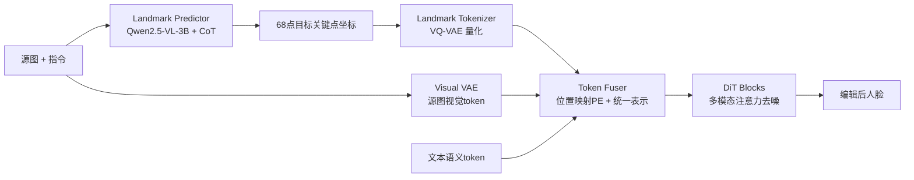

# LaTo: Landmark-tokenized Diffusion Transformer for Fine-grained Human Face Editing

**会议**: ICLR 2026  
**OpenReview**: [https://openreview.net/forum?id=7bv3jLhlYZ](https://openreview.net/forum?id=7bv3jLhlYZ)  
**代码**: [https://github.com/alibaba/landmark-tokenized-dit](https://github.com/alibaba/landmark-tokenized-dit)  
**领域**: 图像生成 / 人脸编辑  
**关键词**: 人脸编辑, 关键点 token 化, Diffusion Transformer, 身份保持, 指令编辑  

## 一句话总结
LaTo 把人脸关键点坐标直接 VQ-VAE 量化成离散 token 喂进 DiT（而非渲染成图再过 VAE），配合位置映射的位置编码和关键点感知 CFG，实现指令驱动、细粒度可控且强身份保持的人脸编辑。

## 研究背景与动机
- **领域现状**：基于指令的多模态人脸编辑（SeedEdit3、Step1X-Edit、FLUX.1-Kontext）依靠大规模视觉-语言建模做语义操控，表情/姿态等结构化先验中关键点（landmark）是最常用的中间监督信号。
- **现有痛点**：主流 landmark 方法把关键点当作**刚性几何约束**——要么建在 GAN/UNet 上难迁移到现代 DiT，要么像 OminiControl/OmniGen 那样把关键点**渲染成 2D 图像再用 VAE 编码**成稠密视觉 token。后者会诱导模型做"像素级抄模板"而非几何推理。
- **核心矛盾**：当条件关键点与源人脸偏差较大时（大幅表情/姿态变化、关键点估计不准、跨身份驱动），像素级对齐会**死板照搬渲染图**，导致身份漂移；同时稠密 token 序列的二次自注意力带来显存和算力开销。
- **本文目标**：让几何条件与像素外观**解耦**，在大幅几何变化下仍保持身份一致，且不增加计算成本。
- **核心 idea**：**【坐标即 token】** 不渲染关键点图，而是把原始关键点坐标直接量化为离散面部 token（68 个，远短于 1024 个图像 token），用位置映射 RoPE 把每个 token 锚定到隐空间网格的物理位置，再用 VLM 从指令+源图自动推断目标关键点，使整条链路既精确又对用户友好。

## 方法详解

### 整体框架
LaTo 建立在 Step1X-Edit 之上，由三个核心模块串成一条从"指令→几何→外观"的链路：**landmark predictor**（VLM 从源图与指令推断 68 点目标关键点）→ **landmark tokenizer**（VQ-VAE 把坐标量化成离散面部 token）→ **multi-modal token fuser**（把关键点 token、源图视觉 token、文本语义 token、噪声 token 统一拼接喂进 DiT 块做多模态注意力去噪）。关键点 token 与图像 token 维度对齐，作为 context 注入 DiT，实现几何/外观/指令三者灵活而解耦的交互。

### 关键设计

**1. Landmark Tokenizer：把坐标量化成离散面部 token，绕开稠密像素对应。** 给定原始关键点序列 $F=\{(X_i,Y_i)\}_{i=1}^n$，编码器（带卷积的残差块）将其映射到连续隐空间 $E\in\mathbb{R}^{n\times d}$，量化器再用可学习码本 $C\in\mathbb{R}^{m\times d}$（$m=8192$，码维 $d=3072$ 与 Step1X-Edit 隐维对齐）做最近邻查找，得到紧凑而富表达力的面部 token。训练目标为重建损失加 commitment 损失：$L=\lVert F-\hat F\rVert_1+\beta\lVert E-\mathrm{sg}[C]\rVert_2^2$，其中 $\mathrm{sg}[\cdot]$ 是停梯度。每 50 步重置未用码字防止码本饱和。这一步把"几何"从"像素"中剥离出来，让后续 DiT 直接对坐标-属性关系建模，而不是抄渲染图。

**2. 位置映射 RoPE：给空间离散的关键点 token 锚回物理位置。** Step1X-Edit 用 3D RoPE 编码图像/文本 token，对位置 $i$ 的图像 token 计算 $P_i=\mathrm{Concat}(R_T(0),R_H(\lfloor i/h\rfloor),R_W(i\%h))$。但关键点 token 在序列上是**空间不连续**的，若沿用图像式索引会让模型学不到关键点与图像区域的对应。LaTo 改为按关键点的下采样坐标 $(x_i,y_i)$ 直接编码：$P_i=\mathrm{Concat}(R_T(0),R_H(y_i),R_W(x_i))$，把每个压缩表示精确锚定到隐空间网格中它该指导的那块区域。消融显示：去掉位置编码时 landmark error 飙到 58.9、画面模糊；原始 RoPE 仍有 25.4，而位置映射 RoPE 降到 2.34，是几何保真的关键。

**3. 统一表示 + 关键点感知 CFG：让几何条件与外观解耦且可调强度。** 一个可训练的面部 landmark adapter 先把面部 token 投到与噪声 token 同一隐空间 $z_f\in\mathbb{R}^{l_f\times d}$，再把文本、源图、面部、噪声四类 token 拼成统一序列 $Z=\mathrm{Concat}(z_t,z_s,z_f,z_n)$ 过 DiT 多模态注意力，任意 token 对都能直接交互、不受刚性空间约束；由于 $l_f=68\ll l_n=1024$，效率与基线相当。CFG 上，标准做法在无条件分支用零图，但**把关键点坐标也置零并不代表"无几何约束"**，反而会与面部运动动力学冲突、在高 CFG 权重下诱发参考脸抄袭、压制随关键点变化的外观。LaTo 借鉴 MTVCrafter，用**可学习的无条件关键点 token** 替换位置感知关键点 token，给出更有意义的无条件分布，从而在画质与几何保真间取得平衡。

**4. Landmark Predictor：用结构化 CoT 让 VLM 把指令翻译成坐标。** 推理时让用户提供精确关键点不现实，于是 LaTo 微调 Qwen2.5-VL-3B：给定源图+指令，通过四步结构化思维链——(1) 分析姿态/表情/关键点对齐，(2) 把指令分解为解剖学运动，(3) 对刚性运动与非刚性形变做运动学推理，(4) 在归一化 512×512 画布上估计坐标，输出可机器解析的 $(X,Y)$ 列表。用规则引导的流水线为 23,145 个 HFL-150K 三元组构造 CoT 监督，保留 19,398 个人工核验样本微调；紧凑坐标 token 化 + 固定输出语法提升数值保真，推理时平滑与几何 sanity check 保住身份一致的刚性距离。

## 实验关键数据

### 主实验表格（HFL-150K 与 GEdit/ICE-Bench 子集；SC 语义一致性 / VQ 画质 / NA 自然度 / IP 身份保持，† 为在 HFL-150K 上微调）

| 方法 | HFL SC↑ | HFL VQ↑ | HFL NA↑ | HFL IP↑ | GEdit&ICE SC↑ | IP↑ |
|------|------|------|------|------|------|------|
| Instruct-Pix2Pix | 0.518 | 0.582 | 0.675 | 0.381 | 0.573 | 0.405 |
| OmniGen | 0.737 | 0.688 | 0.731 | 0.503 | 0.755 | 0.536 |
| Bagel | 0.786 | 0.709 | 0.759 | 0.539 | 0.797 | 0.579 |
| Step1X-Edit† | 0.804 | 0.725 | 0.801 | 0.571 | 0.803 | 0.594 |
| FLUX.1-Kontext† | 0.786 | 0.737 | 0.816 | 0.593 | 0.801 | 0.609 |
| **LaTo (ours)** | **0.832** | **0.749** | 0.805 | **0.634** | **0.829** | **0.651** |

LaTo 在 HFL-150K 上语义一致性超 Bagel 4.6%、身份保持超 FLUX.1-Kontext 7.8%；与同训练数据/同基座的 Step1X-Edit† 相比平均仍涨 2.9%。

### 消融实验表格（关键点条件形式 + 位置编码；LE 为编辑图与给定关键点的 L1 距离）

| 条件形式 | SC↑ | NA↑ | IP↑ | 延迟(s)↓ | LE↓ |
|------|------|------|------|------|------|
| 微调基线（无关键点） | 0.804 | 0.801 | 0.571 | 49.6 | - |
| 渲染图 + visual VAE | 0.821 | 0.744 | 0.584 | 83.6 | 1.76 |
| 压缩渲染 + 位移 | 0.816 | 0.709 | 0.569 | 61.3 | 3.07 |
| 坐标 token + w/o PE | 0.654 | 0.630 | 0.512 | 50.7 | 58.9 |
| 坐标 token + RoPE | 0.778 | 0.786 | 0.621 | 52.1 | 25.4 |
| 坐标 token + learnable RoPE | 0.803 | 0.791 | 0.617 | 52.9 | 9.63 |
| **坐标 token + 位置映射 RoPE (ours)** | **0.832** | **0.805** | **0.634** | 52.1 | **2.34** |

### 关键发现
- **坐标 token 化优于渲染图**：相比渲染图条件，NA 高 6.1%、SC 高 1.1%、IP 高 5.0%，且提速 37%（延迟 52.1s vs 83.6s），效率追平无关键点基线。
- **位置编码是几何保真的命门**：去 PE 时 LE=58.9 画面崩坏；位置映射 RoPE 把 LE 压到 2.34，远优于原始 RoPE(25.4) 与 learnable RoPE(9.63)。
- **Landmark Predictor 精度领先**：人工评测准确率 0.730，显著高于 Gemini 2.5 Pro(0.613)、Qwen2.5-VL-72B(0.597)、未微调的 Qwen2.5-VL-3B(0.477)。
- **HFL-150K 数据红利**：在其上微调让基线 SC 涨 5.3%~7.4%，说明数据本身更贴近真实多样性。

## 亮点与洞察
- **"渲染→编码"到"坐标→token"的范式切换**很优雅：把关键点当离散语言 token 而非像素图，从根上消除了"抄模板"倾向，几何与外观天然解耦，token 数从 1024 降到 68。
- **零置≠无条件的洞察**很有价值：作者指出把关键点坐标置零反而引入与面部运动动力学冲突的伪条件，改用可学习无条件 token，揭示了几何条件 CFG 的一个隐蔽陷阱。
- **rectified IP 指标**设计巧妙：用 $s_{rip}=\max(0,s_{arc}-((\phi_{ins}-\phi_{real})/(\phi_{ins}+\epsilon))^2)$ 惩罚"靠不改源图刷高 ArcFace"的取巧，比裸 ArcFace 更公允。
- **HFL-150K** 30 万真实人脸对 + 细粒度指令是当前最大规模，合成（34K，经表情验证器/姿态判别器过滤）+ 真实视频（116K，多级质量/多样性/身份过滤）混合管线值得复用。

## 局限与展望
- 评测的 SC/VQ/NA 与 landmark predictor 准确率都依赖 Qwen2.5-VL-72B 或人工打分，VLM-as-judge 存在偏置，缺乏更客观的几何/感知指标交叉验证。
- 任务范围聚焦在**表情 + 头部姿态**两类编辑，七类表情 + 30° 为单位的姿态，对发型、配饰、光照、年龄等属性未覆盖，泛化到任意人脸属性编辑待验证。
- landmark predictor 的 CoT 监督靠规则流水线 + 人工核验（19,398 例）构建，跨数据集/极端姿态下的坐标外推鲁棒性未充分讨论；推理仍需多步 CoT，端到端延迟 52s 量级偏高。
- 跨身份驱动、关键点遮挡（mask 10%~50%）等挑战性场景给了定性图但缺定量分析。

## 相关工作与启发
- **指令编辑**：InstructPix2Pix 的合成监督、MGIE/Emu Edit/SmartEdit/OmniGen/BAGEL 等 VLM+diffusion 路线，是 LaTo 的语义底座；LaTo 补上了它们缺失的显式几何。
- **DiT 编辑器**：OminiControl、OmniGen 把关键点光栅化成图的做法正是 LaTo 要替代的对象，对照鲜明。
- **离散 token 化**：VQ-VAE/VQGAN 的码本量化思路被迁移到关键点坐标，启发是"任何结构化几何先验都可以离散 token 化后塞进 DiT 上下文"。
- **可学习无条件 token**：借鉴自视频生成 MTVCrafter，提示在做条件 CFG 时应为每种条件设计语义合理的"空状态"，而非简单置零。

## 评分
- **新颖性**: ⭐⭐⭐⭐ 坐标 token 化 + 位置映射 RoPE + 关键点感知 CFG 三件套构成了人脸编辑里一个清晰且有解释力的新范式，"坐标即 token、解耦几何与像素"的视角有原创性。
- **实验充分度**: ⭐⭐⭐⭐ 主实验跨两套 benchmark、多强基线，消融对条件形式/位置编码/predictor 精度逐项拆解，且自建 30 万规模数据集；扣分在评测高度依赖 VLM 打分。
- **写作质量**: ⭐⭐⭐⭐ 动机递进清晰、图表（范式对比图/数据管线图/pipeline 图）信息密度高，方法各组件衔接顺畅。
- **价值**: ⭐⭐⭐⭐ HFL-150K + 开源代码 + 显著的身份保持提升，对数字人/虚拟形象/可控人脸编辑落地有直接价值。

<!-- RELATED:START -->

## 相关论文

- [\[ICLR 2026\] OmniPortrait: Fine-Grained Personalized Portrait Synthesis via Pivotal Optimization](omniportrait_fine-grained_personalized_portrait_synthesis_via_pivotal_optimizati.md)
- [\[CVPR 2026\] SliderEdit: Continuous Image Editing with Fine-Grained Instruction Control](../../CVPR2026/image_generation/slideredit_continuous_image_editing_with_fine-grained_instruction_control.md)
- [\[CVPR 2026\] CogniEdit: Dense Gradient Flow Optimization for Fine-Grained Image Editing](../../CVPR2026/image_generation/cogniedit_dense_gradient_flow_optimization_for_fine-grained_image_editing.md)
- [\[ICLR 2026\] CoCoDiff: Correspondence-Consistent Diffusion Model for Fine-grained Style Transfer](cocodiff_correspondence-consistent_diffusion_model_for_fine-grained_style_transf.md)
- [\[CVPR 2026\] BeautyGRPO: Aesthetic Alignment for Face Retouching via Dynamic Path Guidance and Fine-Grained Preference Modeling](../../CVPR2026/image_generation/beautygrpo_aesthetic_alignment_for_face_retouching_via_dynamic_path_guidance_and.md)

<!-- RELATED:END -->
