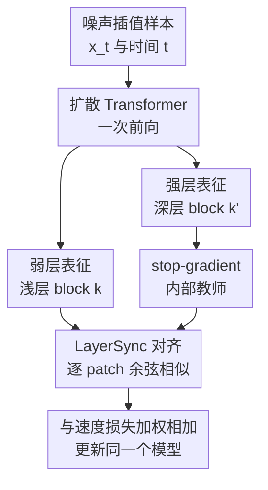

# LayerSync: Self-aligning Intermediate Layers

**会议**: ICLR 2026  
**OpenReview**: [https://openreview.net/forum?id=4itprlvbRQ](https://openreview.net/forum?id=4itprlvbRQ)  
**代码**: https://github.com/vita-epfl/LayerSync.git  
**领域**: 图像生成 / 扩散模型训练加速 / 中间层表征对齐  
**关键词**: 扩散模型, 中间层对齐, 自监督正则化, 训练加速, 表征学习  

## 一句话总结
LayerSync 发现扩散 Transformer 的深层中间表征本身就能当作语义教师，通过无参数的层间余弦对齐让浅层向强表征层靠拢，从而在不依赖外部模型和额外数据的情况下提升生成质量、加速训练，并可迁移到图像、音频、视频和人体动作生成。

## 研究背景与动机

**领域现状**：扩散模型和 flow matching 模型已经成为图像、音频、视频等生成任务的主力框架，但高质量结果通常需要长训练、巨大模型和昂贵采样。近两年的一个重要趋势是：不只优化去噪损失本身，还直接改善模型中间层学到的表征，因为扩散模型的生成质量和内部表征质量存在明显相关性。

**现有痛点**：REPA、REED 这类方法说明，用 DINOv2 或 VLM 的强语义特征去约束扩散模型中间层，可以显著加速训练。但这条路线有一个隐含成本：每次训练都要依赖外部大模型，外部模型本身昂贵、领域覆盖有限，并且会给训练管线引入额外前向计算。对于音频、人体动作、视频这类没有成熟通用语义教师的领域，这种外部指导更难直接复用。

**核心矛盾**：扩散模型内部其实已经包含有用表征，只是不同层的表征质量不均匀。早期层更偏局部和低级特征，中后层更接近语义层，最后一段又逐渐承担解码回 latent 的任务。已有方法通常把“强语义信号”视为外部资源，而本文的问题是：能不能让模型自己的强层去指导弱层，从内部完成语义传递？

**本文目标**：作者希望构造一个不需要额外模型、不需要额外数据、不增加参数、训练开销极低的正则项，用它提升扩散/flow 模型的训练效率和生成质量。同时，这个正则项应该不绑定图像语义教师，因此可以自然迁移到音频、人体动作和视频生成。

**切入角度**：论文从两个观察出发。第一，预训练 SiT 的中间层表征存在层级结构，越靠近中后段的层通常越适合分类、分割，并且与 DINOv2 的表征更接近。第二，扩散 Transformer 收敛后会形成若干相关性很高的 block 组：前段偏局部，中段偏全局，末段偏解码。由此可以把中段语义较强的 block 当成内部教师，把较早的弱 block 当成学生。

**核心 idea**：LayerSync 用模型自己的深层中间表征作为 stop-gradient 目标，对齐浅层 patch 表征，让扩散模型在学习生成速度场的同时自发整理内部表征层级。

## 方法详解

### 整体框架

LayerSync 本质上不是一个新生成架构，而是插在扩散 Transformer 训练目标上的一项内部表征正则。训练时，模型仍然接收噪声插值样本 $x_t$ 和时间 $t$，用主干网络预测速度场或去噪方向；额外部分只读取两个指定 block 的中间表征，把较早 block 的输出与较深 block 的输出按 patch 对齐，并最大化二者相似度。

这条流程的关键点是“自给自足”：深层目标来自同一个模型、同一次前向传播，并且通过 stop-gradient 固定为教师信号，因此不会引入额外教师网络，也不需要第二次 EMA 前向。浅层被拉向更富语义的深层，中间层之间的结构一致性提前形成，最终体现为更快的生成训练和更好的中间表征。

### 关键设计

**1. 深层作教师：把外部语义指导改成模型内部自指导**

LayerSync 最核心的判断是：扩散模型里并不是所有中间层都同样“弱”。作者用线性 probe、语义分割 probe 和 CKA 分析发现，中后段 block 往往包含更稳定、更语义化的特征；这些层不一定是最终输出层，而是在模型从局部噪声特征过渡到全局结构之后、还没有完全进入解码阶段的位置。

因此，LayerSync 不再调用 DINOv2、Qwen2-VL 这类外部教师，而是选择模型自己的较深层 $k'$ 作为参考。这样做的好处很直接：图像任务上能减少外部模型开销，非视觉任务上也不会因为缺少通用教师而失效。更重要的是，教师信号和学生信号来自同一数据、同一时间步、同一网络状态，正则项约束的是网络内部层级是否协调，而不是强行把生成模型拟合到另一个模型的表征空间。

**2. stop-gradient 对齐：让浅层靠近强层，而不是让两层相互拖拽**

如果直接最大化两层表征相似度，浅层和深层都会被同时更新，深层参考本身可能被浅层噪声拉坏。LayerSync 在深层分支上使用 stop-gradient，把 $f_\theta^{k'}(x)$ 当成固定目标，只让浅层 $f_\theta^k(x)$ 通过对齐损失接收梯度。这个细节让“强层指导弱层”的方向性变得清楚：深层是教师，浅层是学生。

论文按 patch 计算表征相似度，而不是只比较整张图的 pooled token。对于扩散 Transformer 来说，latent 被切成 patch token，局部 patch 的对齐能让浅层在空间位置上学习更一致的语义组织。作者最终采用余弦相似度：它不强迫特征范数完全一致，更关注方向一致性，适合把层间语义结构拉近。

**3. 层选择启发式：避开太浅和太末端，保留足够语义间隔**

LayerSync 并不要求精细搜索所有层对，但层选择也不是随便选。作者根据扩散 Transformer 收敛后的 block 结构提出三条规则：不把最后约 20% 的 block 当参考层，因为它们更像解码器；不选择最前面的局部特征层作为被对齐层，因为这些层的局部归纳偏置仍然有用；同时要求 $k$ 和 $k'$ 之间有足够距离，保证二者存在真实语义差距。

这套启发式的意义是避免两种无效对齐。若两层太近，表征本来就相似，正则信号很弱；若参考层太靠后，模型可能学到的是回 latent 的低级解码信息，而不是可迁移的语义结构。消融显示不同层对普遍有收益，但遵守这三条规则时加速效果最好，例如 SiT-XL/2 主实验使用 $8 \leftarrow 16$，SiT-L/2 使用 $8 \leftarrow 18$。

**4. 无参数零额外前向：把训练加速做成便宜正则项**

LayerSync 的计算只复用一次前向里已经产生的两个中间表征，不增加可训练参数，也不需要额外教师网络前向。相比 Dispersive Loss 的成对距离计算，LayerSync 的复杂度随 batch size 近似线性；相比 EMA teacher/student 对齐，它也不需要再跑一遍 EMA 模型。

这种设计解释了为什么论文强调“training efficiency”而不只是“更好 FID”。如果一个方法把迭代数降下来了，但每步都调用一个 9B VLM，真实训练成本未必降低。LayerSync 的收益来自内部结构正则本身，额外代价主要是两层表征的归一化和相似度计算，因此更接近即插即用的训练技巧。

### 损失函数 / 训练策略

论文采用 stochastic interpolants 的统一视角描述扩散和 flow matching。给定数据样本 $x_0$、噪声 $\epsilon$ 与时间 $t$，插值路径写作 $x_t = \alpha_t x_0 + \sigma_t \epsilon$。模型 $v_\theta(x_t,t)$ 预测从噪声回到数据的速度场，主损失为速度预测误差：

$$
L_{velocity}(\theta)=\mathbb{E}_{x_0,\epsilon,t}\left[\lVert v_\theta(x_t,t)-(\dot{\alpha}_t x_0+\dot{\sigma}_t\epsilon)\rVert^2\right].
$$

LayerSync 对齐第 $k$ 层和第 $k'$ 层，其中 $k<k'$。设 $f_\theta^k(x)[n]$ 表示第 $k$ 层第 $n$ 个 patch 的表征，$N$ 是 patch 数，则正则项是深层 stop-gradient 目标和浅层表征之间的负相似度：

$$
L_{LayerSync}^{(k,k')}(\theta)=-\mathbb{E}_{x_t,t}\left[\frac{1}{N}\sum_{n=1}^{N}\mathrm{sim}\left(f_\theta^k(x)[n],\mathrm{stopgrad}(f_\theta^{k'}(x)[n])\right)\right].
$$

最终训练目标为 $L=L_{velocity}+\lambda L_{LayerSync}$。主实验中相似度函数使用 cosine similarity；SiT-B/2、L/2、XL/2 的 $\lambda$ 分别在 $0.2$ 到 $0.3$ 附近。作者还验证了 $\lambda$ 并不敏感，SiT-B/2 上从 $0.1$ 到 $0.7$ 都能明显优于 baseline。

## 实验关键数据

### 主实验

| 任务 / 数据集 | 模型与训练设置 | 本文结果 | 对比基线 | 提升 |
|--------|------|------|----------|------|
| ImageNet 256×256，无 CFG | SiT-XL/2，800 epochs，ODE Heun | FID 6.87 | SiT-XL/2 FID 8.99 | FID 降低 23.6% |
| ImageNet 256×256，无 CFG | SiT-XL/2，160 epochs，SDE Euler | FID 8.29 | SiT-XL/2 1400 epochs FID 8.30 | 约 8.75× 训练轮数加速 |
| ImageNet 256×256，有 CFG | SiT-XL/2，800 epochs | FID 1.89 | SiT-XL/2 1400 epochs FID 2.06 | 纯自监督生成设定更优 |
| 音频生成 MTG-Jamendo | SiT-XL，650 epochs | FAD 0.199 | baseline FAD 0.251 | FAD 降低 20.7% |
| 文本条件人体动作 HumanML3D | MDM，600K iter | FID 0.4801，R-Precision 0.7454 | FID 0.5206，R-Precision 0.7202 | FID 降低 7.7%，检索相关性提升 3.4% |
| 视频生成 CLEVRER | SiT-XL 从零训练 24K steps | FVD 120.13 | vanilla FVD 265.50 | FVD 大幅降低 |

在图像主实验里，LayerSync 对不同模型规模都有效。SiT-B/2 在 80 epochs 下 FID 从 36.19 降到 30.00；SiT-L/2 从 21.41 降到 14.83；SiT-XL/2 从 17.97 降到 11.24。随着训练延长，LayerSync 的优势仍然保留，而不是只在早期训练阶段短暂有效。

与系统级方法相比，LayerSync 的 FID 1.89 不一定压过所有使用外部指导或复杂 CFG schedule 的最强模型，但它的定位不同：它不使用外部表征模型、不增加参数、不额外引入 teacher 前向。加上 CFG scheduling 后，LayerSync* 达到 FID 1.49，接近或优于多种强基线。

### 消融实验

| 消融项 | 设置 | 关键指标 | 说明 |
|------|---------|------|------|
| 随机层对鲁棒性 | SiT-XL 随机 LayerSync 层对 | 平均 FID 12.24，STD 0.8 | 层对不是极端敏感超参，但遵守层选择规则更好 |
| $\lambda$ 敏感性 | SiT-B/2，$\lambda=0.1$ 到 $0.7$ | FID 约 31.02 到 31.63 | 全部明显优于 baseline FID 36.19 |
| 对齐时间步 | 只在 25%/50%/75%/100% timestep 应用 | 100% timestep FID 16.03 最好 | 所有噪声阶段都能从弱层对齐受益 |
| 学习率替代解释 | 全局 lr 或早期层 lr 提高 | 仍差于 LayerSync | 效果不是简单等价于增大梯度或提高学习率 |
| 与 REPA 组合 | REPA layer 10 + LayerSync 8-16 | FID 29.68，优于单独 REPA / LayerSync 50K 设置 | 内部对齐和外部语义注入可以互补 |
| SRA 对比 | SiT-XL/2 + SRA vs LayerSync | LayerSync FID 1.49，0.367 sec/step | 比 SRA 更快、FLOPs 更低 |

### 关键发现

- LayerSync 的收益并不只体现在生成指标上。作者用 Tiny ImageNet 分类、PASCAL VOC 分割和 DINOv2 CKA 分析中间表征，发现 LayerSync 让更多层获得高质量特征，平均分类准确率提升 32.4%，平均 mIoU 提升 63.3%，平均 DINOv2 对齐度提升 88.2%。
- 深层参考层会把语义峰值向更早层“拉动”。不同对齐目标的实验表明，使用更深、更语义化的目标层时，早期层不仅变好，整个表征层级也更早成熟，这支持作者提出的 virtuous cycle 假设。
- 论文测试了剪掉 block 的情况：LayerSync 模型确实比 baseline 更能承受中间 block 移除，但性能仍会明显下降。这说明层间更相似不等于层冗余，每层仍保留独特功能。
- 跨领域实验很关键。音频、人体动作和视频任务没有直接借助图像外部教师，LayerSync 仍然有效，说明它更像一种通用生成模型内部结构正则，而不是只适用于 ImageNet 的视觉 trick。

## 亮点与洞察

- LayerSync 的最大亮点是把“语义教师”从外部模型改成内部层。它没有否认 REPA 类方法的有效性，而是指出扩散模型自己已经有可用的语义层，只需要把强弱层之间的学习信号组织起来。
- 设计非常轻：无参数、无额外数据、无额外 teacher 前向，使它比很多训练加速方法更容易落地。对大规模生成模型训练来说，每步多一个巨大外部模型前向常常比少训练几轮还贵，LayerSync 避开了这个问题。
- 论文把生成质量和表征质量连在一起看，这一点很有启发。LayerSync 不只是让 FID 下降，还改变了内部表征层级的形状，说明训练正则可以影响模型“如何组织计算”，而不是只影响最终输出分布。
- 与 REPA 组合有效也很有价值。它暗示内部层间协调和外部语义注入是两条不同轴线：前者整理网络内部结构，后者提供外部语义坐标，未来可以一起调度。

## 局限与展望

- LayerSync 依赖“存在较强内部层”这一假设。对于很小、很浅、训练极早期或结构不是 Transformer block 的生成模型，哪一层适合作参考可能没有这么清楚。
- 论文虽然展示了跨模态有效性，但文本、时间序列、3D 等更复杂结构的相似度函数可能不能直接沿用 cosine similarity。作者也提到，针对层级文本或时序模式设计专门 alignment loss 是未来方向。
- 长期正则策略还可以更细。主实验没有观察到外部指导方法里可能出现的长期退化，但 LayerSync 是否需要随训练阶段 schedule，例如早期强一点、后期弱一点，仍值得系统研究。
- 对“训练效率”的衡量仍主要围绕 epoch、step、FID 和局部 wall-clock 对比。若用于超大视频/音频模型，最好进一步报告端到端 GPU 小时、显存峰值、吞吐下降和不同实现下的真实成本。
- 层选择启发式虽然鲁棒，但仍需要人工设定 $k,k'$ 和 $\lambda$。未来可以做自动层选择，或者根据训练中 CKA/相似度动态调整同步范围。

## 相关工作与启发

- **vs REPA / REED**: REPA 和 REED 用 DINOv2 或 VLM 等外部表征指导扩散模型，信号强但依赖外部模型。LayerSync 只用模型自己的深层表征，牺牲了一部分外部语义上限，却换来零额外教师、跨领域可用和更低训练开销。
- **vs Dispersive Loss**: Dispersive Loss 也是 self-contained、零额外前向的方法，但它更像让表征在特征空间中分散开，信号方向较弱。LayerSync 则把弱层明确拉向强语义层，目标更有方向性，因此在 ImageNet 多个规模上都比 Dispersive 更强。
- **vs EMA / SRA 类自表示对齐**: EMA teacher 可以避免目标漂移，但需要额外模型副本或额外前向，训练成本更高。LayerSync 用 stop-gradient 的同模型深层输出充当目标，保留了自指导方向性，同时省掉 EMA 计算。
- **对其他任务的启发**: 许多大模型都存在层间语义分工和中间层质量不均的问题。LayerSync 的思路可以迁移到多模态生成、视频生成、语音生成甚至 LLM 中间层训练：不一定总要找外部教师，先问模型内部有没有可复用的强层。

## 评分

- 新颖性: ⭐⭐⭐⭐☆ 把中间层自对齐做成无参数生成模型正则，想法简洁但抓住了外部表征指导的关键痛点。
- 实验充分度: ⭐⭐⭐⭐⭐ 图像主实验、跨模态迁移、表征分析、层选择、$\lambda$、学习率替代解释和外部指导组合都覆盖到了。
- 写作质量: ⭐⭐⭐⭐☆ 论文主线清楚，公式和实验组织扎实；少数附录表格很多，读者需要自己把层选择逻辑和主结论串起来。
- 价值: ⭐⭐⭐⭐⭐ 对训练大规模生成模型很实用，尤其适合没有强外部教师或不想承担额外 teacher 成本的场景。

<!-- RELATED:START -->

## 相关论文

- [\[ICLR 2026\] PCPO: Proportionate Credit Policy Optimization for Aligning Image Generation Models](pcpo_proportionate_credit_policy_optimization_for_aligning_image_generation_mode.md)
- [\[ICLR 2026\] Asynchronous Denoising Diffusion Models for Aligning Text-to-Image Generation](asynchronous_denoising_diffusion_models_for_aligning_text-to-image_generation.md)
- [\[CVPR 2026\] ShapeAR: Generating Editable Shape Layers via Autoregressive Diffusion](../../CVPR2026/image_generation/shapear_generating_editable_shape_layers_via_autoregressive_diffusion.md)
- [\[ICLR 2026\] Self-Improving Loops for Visual Robotic Planning](self-improving_loops_for_visual_robotic_planning.md)
- [\[ICLR 2026\] Aligning Visual Foundation Encoders to Tokenizers for Diffusion Models](aligning_visual_foundation_encoders_to_tokenizers_for_diffusion_models.md)

<!-- RELATED:END -->
