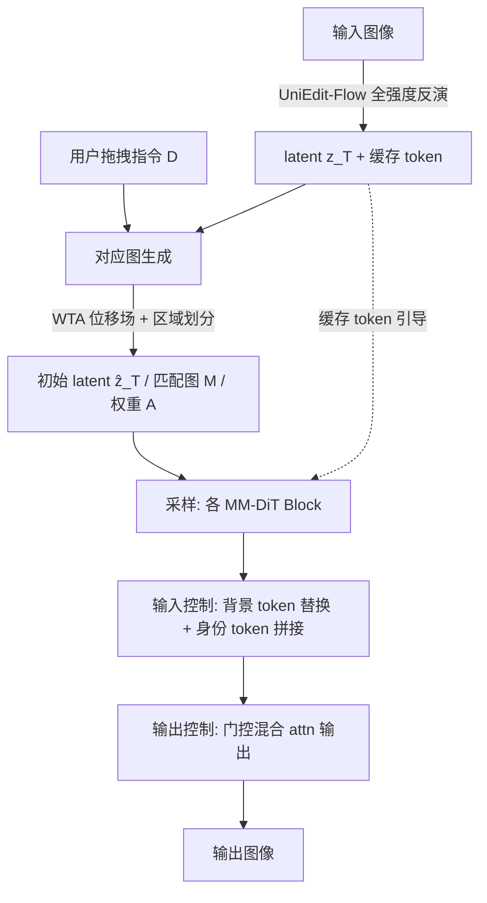

# LazyDrag: Enabling Stable Drag-Based Editing on Multi-Modal Diffusion Transformers via Explicit Correspondence

**会议**: ICLR 2026  
**OpenReview**: [https://openreview.net/forum?id=PHipCRoSyh](https://openreview.net/forum?id=PHipCRoSyh)  
**代码**: 见项目主页（论文中给出 project website）  
**领域**: 图像生成 / 拖拽式编辑（Drag-based Editing）  
**关键词**: drag-based editing, MM-DiT, explicit correspondence, attention control, full-strength inversion, training-free  

## 一句话总结
LazyDrag 用从拖拽指令直接构造的「显式对应图」替换掉以往拖拽编辑里靠注意力隐式匹配点的脆弱机制，让 MM-DiT 第一次能在**全强度反演**下稳定编辑、彻底摆脱逐图微调（TTO），同时解锁了高保真补全和文本引导生成。

## 研究背景与动机
**领域现状**：拖拽式编辑（DragGAN 之后的一众扩散方法）让用户用「手柄点→目标点」直接指定空间变换。要在编辑时保住物体身份，主流做法沿用 MasaCtrl 的思路——在自注意力里共享 key/value token，靠注意力相似度做**隐式点匹配**。

**现有痛点**：隐式匹配有个根本毛病——注意力权重会偏向**空间相邻**而非**语义相关**的区域，导致编辑不稳、逐步退化。为了掩盖这个不稳定，方法们要么上**测试时优化（TTO）**（逐图 LoRA 微调 + 逐指令多步 latent 优化，又慢又贵），要么**削弱反演强度**（低 strength 反演）。代价是：补全不可靠、文本引导被压制、编辑被扭曲，复杂操作（如张开狗嘴并补全口腔内部、凭空生成"网球"）根本做不到。

**核心矛盾**：隐式匹配在全强度反演下哪怕一点点错位都会被放大成明显瑕疵，所以以往方法只能在「编辑精度」和「视觉自然度」之间二选一——强行精确对位会产生 warp 伪影，强调自然又损失定位精度。

**本文目标**：直面这个根因，做出第一个建在 MM-DiT 上、且第一个在**所有采样步**都用全强度反演的拖拽编辑方法，统一几何精度与文本引导，且训练自由、无需 TTO。

**核心 idea**：**用显式对应图替换隐式匹配**——拖拽指令本身就天然定义了一个把手柄点映射到目标点的确定性场，把这个场转成显式对应图，再用它直接驱动注意力控制。有了这个可靠参照，全强度反演下的编辑就稳了，TTO 不再必要，模型的生成能力（补全、文本生成）也随之释放。

## 方法详解

### 整体框架
LazyDrag 建在 MM-DiT（FLUX.1 Krea-dev）上，是个训练自由的两阶段流程：先把用户拖拽指令转成一张**显式对应图**（含匹配点函数 M、权重函数 A）并据此构造初始 latent $\hat{z}_T$；再用这张图驱动一套**输入端 + 输出端**的注意力控制，在单流注意力（SS-Attn）层里保住背景与身份。整条管线在全强度反演下运行，无需任何逐图微调。

### 关键设计

**1. 显式对应图生成（Winner-Takes-All 位移场 + 区域划分）：把拖拽指令变成确定性参照。** 设可编辑区采样点集 $P=\{p_j\}$，拖拽指令 $D=\{(s_i,e_i)\}$。以往把多条指令的位移**平均**会在对抗性拖拽下相互抵消（例如上唇上移、下唇下移去张嘴，平均后接缝处运动归零、嘴张不开）。LazyDrag 改用**胜者通吃（WTA）**：每个点 $p_j$ 按距离权重 $\alpha_j^i=\|p_j-s_i\|_2^{-1}$ 唯一归属到最近的手柄，形成 Voronoi 划分，最终位移和权重只由获胜指令决定（$i^\star=\arg\max_i \alpha_j^i$）。这样保住了对抗位移的完整幅度，让"张嘴"这类编辑成为可能。随后用位移场把 latent 网格切成四类区域——背景 $R_{bg}$（保持不变）、目标 $R_{dst}$（搬运内容、保身份）、补全 $R_{inp}$（用噪声初始化）、过渡 $R_{trans}$（平滑边界），并据此构造初始 latent：

$$\hat{z}_T(x)=\begin{cases} z_T(M(x)), & x\in R_{dst}\\ \epsilon(x), & x\in R_{inp}\\ z_T(x), & x\in R_{bg}\cup R_{trans}\end{cases}$$

这里一个关键点是：补全区用**高斯噪声** $\epsilon\sim\mathcal{N}(0,I)$ 而非 FastDrag 的 BNNI 插值——噪声符合扩散先验，既避免插值复制邻近纹理产生的重复伪影，又解锁了高保真、文本引导的补全能力。

**2. 输入端注意力控制（背景替换 + 身份拼接）：用对应图分区域施加不同保护。** 在每个单流注意力层、每一步，对背景区 $R_{bg}$ 做**硬替换**——直接把当前 token 换成反演时缓存的原始 token（$Q,K$ 重新加 RoPE 位置编码，$V$ 原样），实现背景"绝对不动"。对目标 + 过渡区 $R_{dst}\cup R_{trans}$ 则做**token 拼接**：定义统一源点图 $\tilde{M}(x)$（目标区取 $M(x)$、过渡区取自身 $x$），把对应源处缓存的 key/value 重新编码后拼到当前 token 上：

$$K'_x=\text{concat}\big(K_x,\ \text{RoPE}_x(\bar{K}_{\tilde{M}(x)})\big),\quad V'_x=\text{concat}\big(V_x,\ \bar{V}_{\tilde{M}(x)}\big)$$

这给注意力计算一个强烈的、由对应图驱动的身份信号，既稳稳保住身份，又能在边界处平滑过渡。注意整套控制只作用在 SS-Attn 层，无需像 U-Net 那样手动挑层号。

**3. 输出端门控混合（Attn Refine）：让控制精度集中在手柄点上。** 拼接之后再细化注意力**输出**，强调手柄点的重要性。对目标区 $x\in R_{dst}$，把当前输出 $y_x$ 与缓存输出 $\bar{y}_{M(x)}$ 按门控因子混合：

$$y_x\leftarrow(1-\gamma_{x,t})\,y_x+\gamma_{x,t}\,\bar{y}_{M(x)},\qquad \gamma_{x,t}=h_t\cdot A(x)$$

其中 $A(x)$ 是预算好的匹配权重、$h_t$ 是随时间衰减的因子。因为权重在手柄点处最大（$A(x)$ 最大），控制力就最强地落在"最该精确"的地方，周边区域则自然放松。这一步还顺手干掉了 CharaConsist 需要的额外去噪步骤，从根上避开了注意力相似度匹配在全强度反演下的不稳定，也省去了以往方法的多步 latent 优化。

## 实验关键数据

### 主实验表格（DragBench，205 图 / 349 点对）

| 方法 | TTO-Req | MD ↓ | SC ↑ | PQ ↑ | O ↑ |
|---|---|---|---|---|---|
| GoodDrag | ✓ | 22.17 | 7.834 | 8.318 | 7.795 |
| DragText (+GoodDrag) | ✓ | 21.51 | 7.992 | 8.227 | 7.886 |
| FastDrag | ✗ | 31.84 | 7.935 | 8.278 | 7.904 |
| Inpaint4Drag | ✗ | 23.68 | 7.802 | 7.961 | 7.615 |
| **LazyDrag (Ours)** | ✗ | **21.49** | **8.205** | **8.395** | **8.210** |

MD 为平均距离（越低越准），SC/PQ/O 为 VIEScore（GPT-4o 评，0–10）。LazyDrag 在**不需要 TTO** 的前提下全指标最优，MD 甚至略低于需逐图优化的 DragText。

### 消融实验表格（累积消融，DragBench）

| 配置 | MD ↓ | SC ↑ | PQ ↑ | O ↑ |
|---|---|---|---|---|
| 完整方法 | 21.49 | 8.205 | 8.395 | 8.210 |
| − WTA − Latent Init | 23.69 | 8.129 | 8.060 | 7.938 |
| − BG Pres. | 24.73 | 7.998 | 8.043 | 7.863 |
| − ID Pres. − Attn Refine | 56.49 | 5.307 | 7.944 | 5.953 |

去掉 WTA/Latent Init 后 MD 上升、PQ/O 下降；再去背景保护，SC/O 因背景色偏和伪影继续掉；把对应图驱动的保护换回 CharaConsist 的注意力相似度匹配，MD 暴涨到 56.49、O 崩到 5.953——印证了**全强度反演对错配极度敏感**，显式对应图是稳定性的关键。

### 关键发现
- **用户研究**：32 名专家在 32 个随机样本上，LazyDrag 被偏好 **63.67%**，远超所有基线（次高 < 7%）。
- **激活时间步**：用 40 步做 ID Pres./Attn Refine 是精度与自然度的平衡点；增到 50 更准但 warp 伪影变多，降到 20 更自然但身份/运动会漂移。
- **拖拽 vs 移动模式**：move 模式更保身份，drag 模式更能做 3D 旋转/拉伸，两者都能出合理结果，体现显式对应图的灵活性。
- **反演强度**：只有全强度反演（strength 1）才能配合文本引导生成"嘴里的网球/苹果"，低强度做不到。

## 亮点与洞察
- **诊断到位**：把拖拽编辑长期不稳的根因精准定位为"隐式注意力匹配的不可靠"，并解释了为什么前人只能用 TTO 或弱反演来"打补丁"——这是一种从根上解决而非掩盖的思路。
- **把约束当资源**：拖拽指令本身就是确定性的对应场，作者敏锐地用它替代了昂贵又脆弱的注意力相似度匹配，这是全文最优雅的一击。
- **全强度反演 + 训练自由**：第一个在所有采样步全强度反演的拖拽方法，反而因此解锁了补全和文本生成两项"副产品"能力，把几何控制和文本引导统一进同一框架。
- **WTA 取代平均**：用 Voronoi 胜者通吃解决对抗性拖拽相互抵消的老问题，简单但直击痛点。

## 局限与展望
- **依赖 MM-DiT 的优势**：方法成立的前提之一是 MM-DiT 更紧的视觉-文本融合带来的反演鲁棒性，迁回 U-Net 不一定有同等收益（论文附录有 U-Net 消融）。
- **匹配策略有限**：目前只支持平移、缩放、drag-mode 弹性形变；2D 旋转等更丰富的匹配尚未覆盖，作者把它列为 future work。
- **模式权衡**：drag 模式做大几何变换时细节纹理保持会略降，move 模式又难做旋转/拉伸，需用户按场景选模式。
- **评测依赖 MLLM**：VIEScore 由 GPT-4o 打分，虽跑三次取均值，但仍带 MLLM 评测者的固有偏差与不确定性。

## 相关工作与启发
- **隐式匹配谱系**：MasaCtrl（U-Net 共享 K/V）→ DiTCtrl（MM-DiT 简单共享，失效）→ CharaConsist（再编码注入对齐 token，但靠注意力相似度匹配、全强度反演下脆弱）。LazyDrag 正是接在 CharaConsist 的失败点上，用显式图把这条线"扶正"。
- **TTO-free 拖拽**：FastDrag（位移场 + MasaCtrl 式替换，但插值产生重复伪影、平均融合在对抗拖拽下失效）、Inpaint4Drag（建在补全模型上，warp 伪影 + 对 mask 敏感）。LazyDrag 选择带反演的生成式路线，规避了补全式的边界伪影。
- **启发**：当任务输入本身蕴含可利用的结构（这里是拖拽定义的确定性场），与其去学/估一个隐式对应，不如直接把它显式化注入——往往更稳、更省、还能顺带解锁额外能力。

## 评分
- **新颖性**: ⭐⭐⭐⭐⭐ 第一个 MM-DiT 拖拽编辑、第一个全强度反演拖拽方法，用显式对应图替换隐式匹配的思路从根上解决长期痛点，思想干净。
- **实验充分度**: ⭐⭐⭐⭐ DragBench 全指标 SOTA + 累积消融 + 用户研究 + 激活步/模式/反演强度多角度分析，证据链完整；唯一遗憾是只在 DragBench 单一基准、且评测重度依赖 GPT-4o。
- **写作质量**: ⭐⭐⭐⭐ 问题诊断—动机—方法逻辑层层递进，图 3 管线清晰；个别贡献点表述有重复。
- **价值**: ⭐⭐⭐⭐⭐ 把几何控制、文本引导、高保真补全统一进一个训练自由框架，且摆脱 TTO，对拖拽编辑的实用化是范式级推进。

<!-- RELATED:START -->

## 相关论文

- [\[ICLR 2026\] Routing Matters in MoE: Scaling Diffusion Transformers with Explicit Routing Guidance](routing_matters_in_moe_scaling_diffusion_transformers_with_explicit_routing_guid.md)
- [\[ICLR 2026\] DragFlow: Unleashing DiT Priors with Region Based Supervision for Drag Editing](dragflow_unleashing_dit_priors_with_region_based_supervision_for_drag_editing.md)
- [\[ICLR 2026\] MOSAIC: Multi-Subject Personalized Generation via Correspondence-Aware Alignment and Disentanglement](mosaic_multi-subject_personalized_generation_via_correspondence-aware_alignment_.md)
- [\[ICLR 2026\] Multi-Subspace Multi-Modal Modeling for Diffusion Models: Estimation, Convergence and Mixture of Experts](multi-subspace_multi-modal_modeling_for_diffusion_models_estimation_convergence_.md)
- [\[ICCV 2025\] Rethinking Cross-Modal Interaction in Multimodal Diffusion Transformers](../../ICCV2025/image_generation/rethinking_cross-modal_interaction_in_multimodal_diffusion_transformers.md)

<!-- RELATED:END -->
