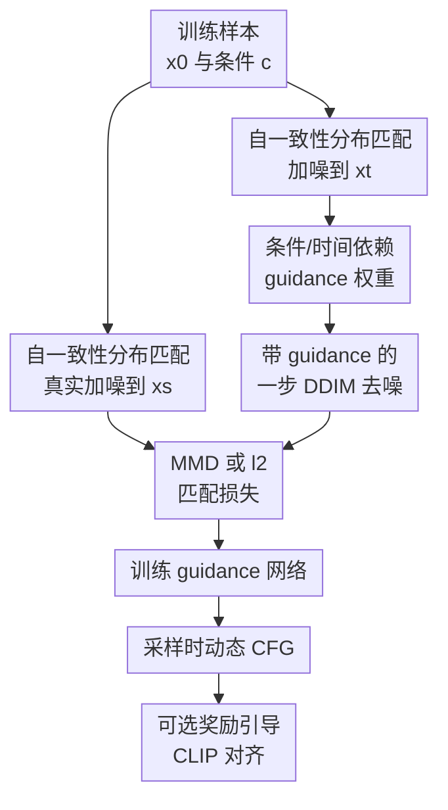

# Learn to Guide Your Diffusion Model

**会议**: ICLR2026  
**OpenReview**: [https://openreview.net/forum?id=l8XOk4ylBH](https://openreview.net/forum?id=l8XOk4ylBH)  
**代码**: 未公开  
**领域**: 扩散模型 / 图像生成  
**关键词**: classifier-free guidance, 自适应 guidance, 自一致性, MMD, 文本到图像生成  

## 一句话总结
本文把 Classifier-Free Guidance 中手工设定的固定 guidance scale 学成一个依赖条件和去噪时间区间的函数，用自一致性分布匹配训练该函数，在 ImageNet、CelebA 和文本到图像生成中比固定 CFG 或有限区间 guidance 更好地权衡样本质量、分布匹配和提示词对齐。

## 研究背景与动机

**领域现状**：扩散模型在图像、视频和蛋白质等生成任务中已经成为主流框架，而条件生成通常依赖一个条件去噪器来从噪声逐步还原目标样本。在实际大模型里，Classifier-Free Guidance（CFG）几乎是默认工具：它把条件去噪器和无条件去噪器的差值乘上一个权重 $\omega$，再加回条件预测，从而让生成结果更贴近条件。

**现有痛点**：CFG 的问题不在于它不好用，而在于它太像一个经验旋钮。较大的固定 $\omega$ 往往能显著提升视觉质量和条件可辨识度，但也会把样本推向分布边缘，造成过饱和、模式偏移或和真实条件分布不一致。已有工作可以用 SMC、MCMC 等推断时校正方法更严格地修正 CFG 的分布偏差，但这些方法对大规模图像生成太重，难以作为常规采样组件。

**核心矛盾**：原始 CFG 的理论解释常把它看成在采样某个被条件似然强化后的目标分布，但后续分析表明标准 CFG 采样并不真正等价于这个目标分布。另一方面，很多实验又反复说明适度 guidance 能降低 FID，说明 CFG 在实践中可能是在补偿预训练去噪器的近似误差，而不是在严格采样一个手写的 tilted distribution。也就是说，真正需要的可能不是一个固定强度的“加强条件”，而是一个在不同条件、不同时间段上都能纠正模型误差的 guidance 策略。

**本文目标**：作者希望在不重训主扩散模型的前提下，学习一个 guidance 权重函数 $\omega_{c,(s,t)}$。它不只依赖条件 $c$，还依赖从时间 $t$ 去噪到时间 $s$ 的区间，因此可以在采样轨迹的不同位置使用不同强度，并且对不同类别或文本 prompt 给出不同策略。

**切入角度**：本文的观察是，一个合理的反向扩散过程必须满足一致性：如果从真实干净样本 $x_0$ 加噪到 $x_t$，再用反向过程去噪到 $x_s$，得到的 $x_s$ 分布应该和直接从 $x_0$ 加噪到 $x_s$ 的分布一致。这个条件可以提供训练 guidance 权重的监督信号，而且只需要已有训练数据、冻结的条件/无条件去噪器和可采样的噪声过程。

**核心 idea**：用“真实加噪分布”和“带可学习 CFG 的一步反向去噪分布”之间的自一致性匹配，替代手工调 guidance scale，让扩散模型自己学会在何时、对哪个条件、用多强的 guidance。

## 方法详解

### 整体框架

本文假设已经有一个预训练好的条件去噪器 $\hat{x}_\theta(x_t,c)$ 和无条件去噪器 $\hat{x}_\theta(x_t,\emptyset)$，主模型参数保持冻结。唯一要训练的是一个小型 guidance 网络，它输入条件表示和时间对 $(s,t)$，输出非负标量 $\omega_{c,(s,t)}$。采样时，原来的 CFG 公式从固定 $\omega$ 变为动态权重：$\hat{x}_\theta(x_t,c;\omega)=\hat{x}_\theta(x_t,c)+\omega_{c,(s,t)}(\hat{x}_\theta(x_t,c)-\hat{x}_\theta(x_t,\emptyset))$。

训练时并不需要跑完整反向轨迹。对每个训练样本 $(x_0,c)$，先直接加噪得到真实目标样本 $x_s\sim p_{s|0}(\cdot|x_0)$；再把同一个 $x_0$ 加噪到更高噪声时间 $t$，用带可学习权重的 CFG 从 $t$ 一步去噪到 $s$，得到 proposal 样本 $\tilde{x}_s(\omega)$。如果 guidance 学得合适，这两组 $x_s$ 应该在分布上接近。

### 关键设计

**1. 自一致性分布匹配：把 guidance 学成纠偏器**

作者先从较弱的边缘一致性出发：真实扩散过程在时间 $s$ 的边缘分布 $p_s$，应该能由“先加噪到 $t$、再正确反向去噪到 $s$”得到。如果直接让 guided process 的边缘分布 $p^{t,(\theta,\omega)}_s$ 去匹配 $p_s$，目标是合理的，但需要对不同样本和条件做大范围边缘化，梯度方差很高，实际训练效果不好。

因此论文改用更强也更低方差的自一致性条件。固定一个训练样本和条件 $(x_0,c)$ 后，比较两条路线：第一条路线是从 $x_0$ 直接加噪到 $x_s$；第二条路线是从 $x_0$ 加噪到 $x_t$，再用 guided denoiser 从 $t$ 退到 $s$。目标是让

$$
p^{t,(\theta,\omega)}_{s|0,c}(\cdot|x_0,c) \approx p_{s|0}(\cdot|x_0).
$$

这个条件比边缘一致性更苛刻，因为它要求每个具体样本附近的一步反向转移都和真实加噪分布吻合；但它也正好给 guidance 网络提供了清晰、局部、低方差的训练信号。直观上，模型不是学习“把图像变好看”的模糊偏好，而是在学习：当条件去噪器和无条件去噪器给出某个差分方向时，沿这个方向推多少，能让一步反向分布更像真实扩散链应有的结果。

**2. 条件/时间依赖 guidance 权重：替代手工固定 scale**

标准 CFG 只有一个全局 $\omega$，最多靠人工 scheduler 改成随时间变化的曲线。本文把权重写成 $\omega_{c,(s,t)}$，它同时看条件 $c$、目标时间 $s$ 和当前时间 $t$。这样做的关键好处是把“同一张采样表上的所有条件都用同一强度”改成了“不同类别或 prompt 可以有不同轨迹”。这和实验里的现象一致：ImageNet 中 prairie chicken 一类几乎学到零 guidance，而 paintbrush 一类在更长时间区间里需要更强 guidance；COCO prompt 的 guidance 曲线差异也很大。

实现上，$\omega_{c,(s,t)}$ 由一个轻量 MLP 输出，并在最后接 ReLU 保证非负。ImageNet/CelebA 中，时间先转成 log SNR，再经小 MLP 编码；文本到图像中，网络接收时间嵌入、CLIP 文本嵌入和 T5 文本嵌入。主扩散模型完全冻结，因此训练只是在已有模型外面学一个标量策略网络，推理时每一步只多一次很便宜的 MLP 前向。

**3. MMD 目标与简化 l2 目标：在分布匹配和训练成本之间取舍**

为了比较真实加噪样本 $x_s$ 和 guided proposal $\tilde{x}_s(\omega)$ 的分布，本文主要使用 energy-kernel MMD。经验损失可以写成两部分：一部分拉近 proposal 粒子和真实粒子，另一部分用 proposal 粒子之间的相互距离避免简单塌缩。省略与 $\omega$ 无关的项后，核心形式是

$$
\hat{L}_{\beta,\lambda}(\phi)=\frac{1}{n}\sum_i\left[\frac{1}{m^2}\sum_{j,k}\|\tilde{x}^{j}_{s_i}(\omega_\phi)-x^{k}_{s_i}\|_2^{\beta}-\frac{\lambda}{2m(m-1)}\sum_{j\ne k}\|\tilde{x}^{j}_{s_i}(\omega_\phi)-\tilde{x}^{k}_{s_i}(\omega_\phi)\|_2^{\beta}\right].
$$

论文还研究了一个更便宜的特例：令 $\beta=2,\lambda=0$，就得到简单的 $\ell_2$ 匹配 $L_{\ell_2}=\mathbb{E}\|\tilde{x}_s(\omega)-x_s\|_2^2$。这个目标避免了 MMD 粒子交互的二次复杂度，但实验中对超参数更敏感。主结果显示，完整自一致性 MMD 目标通常最稳，简化 $\ell_2$ 也能工作，说明本文的核心收益主要来自“用真实扩散一致性训练 guidance”，而不是某个特别脆弱的损失技巧。

**4. 奖励引导扩展：把 CLIP 对齐作为可控偏置**

除了逼近原始条件分布，作者还考虑一种更实用的场景：用户给定奖励函数 $R(x_0,c)$，希望生成样本偏向高奖励区域。在文本到图像中，奖励可以是 CLIP score，用来衡量图像和 prompt 的语义对齐。直接最大化奖励容易 reward hacking，所以论文没有只训练一个追分数的 guidance 网络，而是在自一致性损失上加奖励项：$L_{tot}(\phi)=\hat{L}_{\beta,\lambda}(\phi)+\gamma_R L_R(\phi)$。

这个扩展的意义在于，它把 CFG 从一个固定的 prompt 强化旋钮，变成了可学习的推断时控制器。自一致性项约束生成轨迹不要离真实扩散过程太远，奖励项则把一部分概率质量推向更符合外部偏好的区域。COCO 实验中，加入 CLIP reward 后 CLIP score 回到与强 CFG baseline 接近的水平，同时保留了比部分手工 scheduler 更低的 FID，说明这种正则化奖励优化比直接拉大固定 CFG 更温和。

### 损失函数 / 训练策略

训练流程可以概括为四步。第一，采样 batch 中的干净样本和条件 $(x_0,c)$。第二，采样目标时间 $s\sim U[S_{min},1-\zeta-\delta]$，再采样间隔 $\Delta t\sim U[\delta,1-\zeta-s]$，令 $t=s+\Delta t$。第三，为每个样本采 $m$ 个真实粒子 $x_s\sim p_{s|0}(\cdot|x_0)$，同时采 $m$ 个 $x_t\sim p_{t|0}(\cdot|x_0)$ 并用 guided DDIM 一步退到 $\tilde{x}_s(\omega)$。第四，用 MMD 或 $\ell_2$ 损失更新 guidance 网络参数 $\phi$。

一个反直觉但重要的训练细节是，训练时的时间间隔 $\delta$ 不宜太小。虽然推理中 100 或 128 步采样意味着相邻步长大约只有 $0.01$，但 ImageNet 消融显示训练时用更大的间隔，如 $\delta\approx0.1$，效果反而更好。作者推测较大的 $|t-s|$ 能提供更稳定、更有信息量的梯度，而平滑的 guidance 网络可以把这种学习结果泛化到推理时的小步长。

## 实验关键数据

### 主实验

| 数据集 / 任务 | 方法 | Guidance 设置 | FID ↓ | 其他指标 |
|--------|------|------|------|------|
| ImageNet 64×64 | Unguided | $\omega=0$ | 4.46 | IS 43.52 |
| ImageNet 64×64 | Constant guidance | $\omega=0.25$ | 2.40 | IS 66.72 |
| ImageNet 64×64 | Limited interval guidance | $\omega(t)=0.95, t\in[0.2,0.8]$ | 2.11 | IS 71.60 |
| ImageNet 64×64 | Self-consistency | $\omega^\phi_{c,(s,t)}$ | **1.99** | IS 73.62 |
| CelebA 64×64 | Unguided | $\omega=0$ | 2.44 | IS 2.94 |
| CelebA 64×64 | Limited interval guidance | $\omega(t)=0.7, t\in[0.0,0.8]$ | 2.37 | IS 2.96 |
| CelebA 64×64 | Self-consistency | $\omega^\phi_{c,(s,t)}$ | **2.10** | IS **2.98** |
| MS COCO 512×512 | Unguided | $\omega=0$ | 24.74 | CLIP 0.278 |
| MS COCO 512×512 | Constant guidance | $\omega=7.5$ | 31.20 | CLIP 0.306 |
| MS COCO 512×512 | Self-consistency | $\omega^\phi_{cCLIP,cT5,(s,t)}$ | **18.01** | CLIP 0.295 |
| MS COCO 512×512 | Self-consistency + CLIP reward | 同上 + reward | 28.37 | CLIP **0.306** |

### 消融实验

| 消融项 | 配置 | 结果 | 说明 |
|------|------|------|------|
| ImageNet 的 $\beta$ | $\beta=0.1/0.5/1.0/1.5/1.75$ | FID 约 1.98–2.07 | $\beta\in[1,1.75]$ 较稳，最佳 FID 出现在 $\beta=1.0$ 的 1.98，主设置 $1.75$ 也接近最优 |
| ImageNet 的粒子数 $m$ | $m=2/4/8/16$ | FID 约 1.99–2.00 | $m\ge4$ 后 FID 基本不敏感，说明不需要很多粒子就能训练 guidance |
| T2I 条件输入 | CLIP+T5 / CLIP-only / T5-only | CLIP reward 下 FID 28.28–28.63，CLIP 0.305–0.306 | 三种条件差距很小，CLIP 有时带来更好的文本对齐 |
| T2I MLP 宽度 | 6M small / 12M wide / 12M residual wide | FID 28.37 / 28.41 / 28.68 | 增大 guidance 网络没有明显收益，瓶颈不是 MLP 容量 |
| ImageNet 时间间隔 | $\delta=0.01/0.1/0.2/0.3$ | 小 $\delta$ 更差 | 训练时较大去噪跨度提供更稳定信号 |
| Stable Diffusion-v1.5 | constant vs learned | learned + CLIP reward FID 19.36，constant $\omega=7.5$ FID 23.479 | 在现成 SD-v1.5 上也能降低 FID，但 CLIP score 仍略低于强固定 CFG |

### 关键发现

- 学到的 guidance 不只是复刻 Limited Interval Guidance。ImageNet 上它确实常在中间时间段为正，但不同类别的曲线强度和形状差异很大，说明条件依赖性不是装饰。
- 自一致性目标在 ImageNet 和 CelebA 上同时超过 unguided、constant guidance 和 LIG 的 FID，说明学习 $\omega_{c,(s,t)}$ 可以改善分布质量，而不只是提高条件可辨识度。
- COCO 上纯自一致性得到最低 FID 18.01，但 CLIP score 低于强 CFG；加入 CLIP reward 后 CLIP score 提到 0.306，与强 CFG 接近，但 FID 升到 28.37。这揭示了质量与 prompt alignment 的真实 trade-off。
- $m$ 和 MLP 容量的消融显示方法不依赖很大的额外网络；相比训练主扩散模型，guidance 网络的训练成本和推理开销都很小。
- MoG 实验解释了 CFG 的一部分作用：当基础模型已经很好时，学到的 guidance 接近 0；当基础模型欠训练时，学到的 guidance 会变大，用来纠正生成分布和数据分布的 mismatch。

## 亮点与洞察

- 把 CFG 从经验超参改成可学习函数，是这篇论文最直接的贡献。它没有否定 CFG 的实用性，而是承认“固定 scale 很有效但太粗”，然后用扩散过程自身的一致性给这个 scale 找监督信号。
- 自一致性目标很巧妙，因为它避免了直接匹配完整生成分布。完整轨迹分布或边缘分布匹配会非常重，而本文只做一步 $t\rightarrow s$ 的局部分布匹配，就能训练一个推理时可复用的 guidance 网络。
- 条件依赖 guidance 的实验现象很有启发。不同 ImageNet 类别和不同 COCO prompt 需要的 guidance 差异巨大，这说明手工 scheduler 的上限天然受限，因为它默认所有条件共享同一条曲线。
- 奖励扩展把方法连接到 RLHF / reward-guided generation 的思路，但保持了扩散分布匹配的正则约束。这比直接把 CLIP score 当唯一目标更稳，也解释了为什么它能在 prompt alignment 和 FID 之间形成可控折中。
- 这套方法可以迁移到其他 guidance 形式。论文指出只要替换 guided denoiser 的定义，它原则上可以和 CFG++、negative guidance、flow matching guidance 或其他动态 guidance 技术组合。

## 局限与展望

- 自一致性条件比真正需要的边缘一致性更强。它在实验中有效，但理论上可能排除一些只在边缘分布层面正确、局部条件不完全匹配的合理反向过程。
- 训练仍需要访问训练数据和冻结扩散模型的条件/无条件分支。对于只有黑盒 API 的生成模型，这个方法不能直接套用。
- 文本到图像结果显示，最低 FID 和最高 CLIP score 并不同时出现。加入 CLIP reward 后 prompt alignment 改善，但 FID 变差，说明奖励项的选择和权重 $\gamma_R$ 仍然需要谨慎调节。
- 超参数 $p(s,t)$ 对结果有影响，尤其是 $\delta$。虽然作者给出了经验结论，但不同采样器、不同噪声参数化、不同分辨率下可能还需要重新搜索。
- 论文主要用 FID、IS、CLIP score 和定性样例评估。对过饱和、局部伪影、复杂组合 prompt、长文本一致性等现代 T2I 质量维度，仍需要更细的人工或自动评测。
- 未来可以把 learned guidance 和推理时搜索、MCMC/SMC 校正、偏好模型奖励结合起来，让 guidance 网络既保持轻量，又能处理更丰富的用户目标。

## 相关工作与启发

- **vs 原始 CFG**: 原始 CFG 用固定 $\omega$ 线性组合条件和无条件去噪器，本文保留这个方向但把强度变成 $\omega_{c,(s,t)}$。区别在于，原始 CFG 是手工调参，本文用自一致性训练得到随条件和时间变化的策略。
- **vs Limited Interval Guidance**: LIG 认为 guidance 只应在某个时间区间内施加，能改善质量；本文的学习结果有时会自然呈现类似中间区间激活，但它不是人工指定区间，而是由条件和数据决定，因而能对不同类别给出不同曲线。
- **vs clamp-linear guidance schedule**: clamp-linear 用预设函数随时间调整 guidance，优势是简单无训练；本文需要额外训练小 MLP，但在 ImageNet 和 COCO 的 FID 上更强，并能捕获 prompt-specific 行为。
- **vs SMC/MCMC CFG correction**: SMC/MCMC 方法更接近严格推断校正，但推理成本高；本文选择训练一个便宜的 guidance 网络，把一部分校正能力提前蒸馏到标量策略里，更适合大规模生成。
- **vs score matching 直接学 guidance**: 论文分析了直接把 guided denoiser 放进普通去噪回归目标的失败原因：如果条件 denoiser 已经近似 $\mathbb{E}[x_0|x_t,c]$，最优 guidance 会退化到 0。自一致性绕开了这个问题，因为它关注的是 guided 反向转移产生的分布是否和真实加噪链一致。
- **启发**: 对很多生成控制问题，与其只在最终样本上打分，不如寻找生成过程内部必须满足的局部一致性约束。这样的约束通常更便宜、梯度更稳定，也更容易和外部 reward 组合。

## 评分

- 新颖性: ⭐⭐⭐⭐☆ 把 CFG scale 学成条件和时间依赖函数并用自一致性训练，想法清晰且比手工 scheduler 更进一步，但仍建立在 CFG 线性差分框架上。
- 实验充分度: ⭐⭐⭐⭐☆ 覆盖 ImageNet、CelebA、COCO、SD-v1.5 和 MoG，并有多组消融；不过现代 T2I 的人评和复杂 prompt 评测还可以更充分。
- 写作质量: ⭐⭐⭐⭐☆ 理论动机、算法和实验连接紧密，附录细节充足；部分符号和目标之间的关系需要读者具备扩散模型背景。
- 价值: ⭐⭐⭐⭐⭐ 对 diffusion guidance 的工程实践很有价值，提供了一条低额外推理成本、可和 reward 结合的 adaptive guidance 路线。

<!-- RELATED:START -->

## 相关论文

- [\[ICLR 2026\] Evolutionary Caching to Accelerate Your Off-the-Shelf Diffusion Model](evolutionary_caching_to_accelerate_your_off-the-shelf_diffusion_model.md)
- [\[ICLR 2026\] One Step Further with Monte-Carlo Sampler to Guide Diffusion Better](one_step_further_with_monte-carlo_sampler_to_guide_diffusion_better.md)
- [\[ICML 2026\] Let EEG Models Learn EEG](../../ICML2026/image_generation/let_eeg_models_learn_eeg.md)
- [\[ICLR 2026\] Deconstructing Guidance: A Semantic Hierarchy for Precise Diffusion Model Editing](deconstructing_guidance_a_semantic_hierarchy_for_precise_diffusion_model_editing.md)
- [\[ICLR 2026\] When Scores Learn Geometry: Rate Separations under the Manifold Hypothesis](when_scores_learn_geometry_rate_separations_under_the_manifold_hypothesis.md)

<!-- RELATED:END -->
